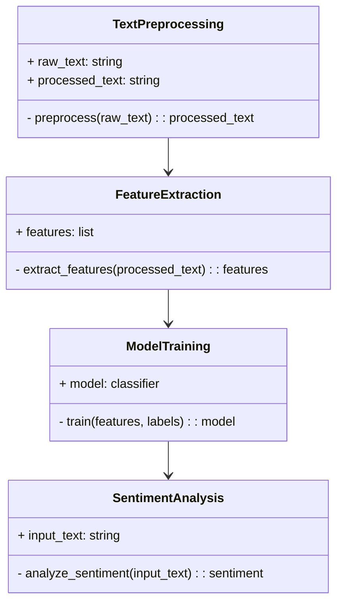
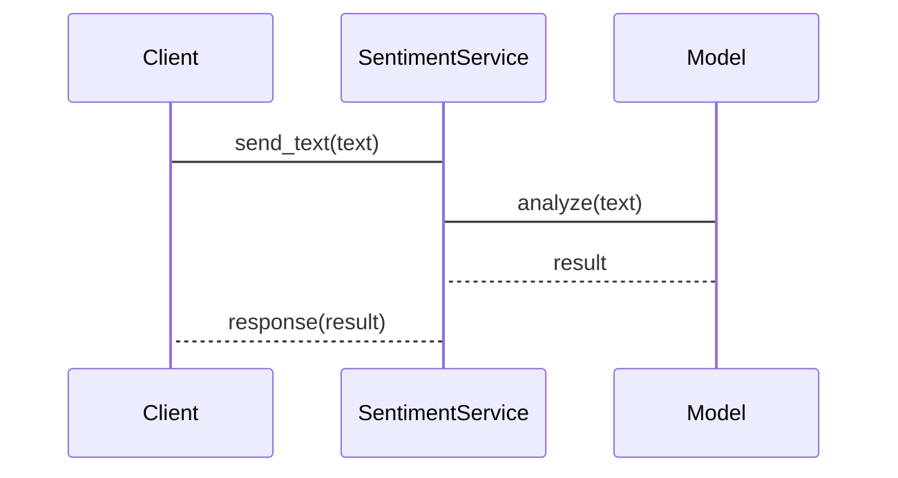

                 


# 构建基于NLP的金融社交媒体情绪分析模型

> 关键词：NLP，情绪分析，金融社交媒体，文本挖掘，机器学习

> 摘要：本文将详细介绍如何构建一个基于自然语言处理（NLP）的金融社交媒体情绪分析模型。文章从背景介绍、核心概念、算法原理到系统架构和项目实战，全面解析了该模型的构建过程。通过分析金融社交媒体数据，提取用户情感倾向，本文展示了如何利用NLP技术为金融投资决策提供支持。

---

## 第一部分: 背景介绍与核心概念

### 第1章: 金融社交媒体情绪分析的背景与问题

#### 1.1 情绪分析的背景与意义
##### 1.1.1 情绪分析的定义与核心概念
情绪分析是自然语言处理（NLP）中的一个重要任务，旨在通过分析文本内容，判断作者的情感倾向。其核心概念包括情感极性（positive, negative, neutral）、情感强度（如非常积极、稍微消极）以及情感类别（如喜悦、愤怒、悲伤等）。

##### 1.1.2 金融社交媒体的定义与特点
金融社交媒体是指用户在社交媒体平台上分享与金融相关的内容，如股票评论、市场分析、投资建议等。其特点包括数据的实时性、多样性、海量性和情感表达的隐含性。

##### 1.1.3 情绪分析在金融领域的应用价值
情绪分析可以帮助投资者快速捕捉市场情绪，预测股价波动，辅助投资决策。例如，通过分析社交媒体上的 sentiment，投资者可以提前了解市场情绪变化，从而做出更明智的投资选择。

#### 1.2 问题背景与问题描述
##### 1.2.1 金融市场的信息不对称问题
金融市场中的信息不对称可能导致投资者决策失误。情绪分析通过挖掘社交媒体上的非结构化数据，帮助投资者获取更多有用的信息。

##### 1.2.2 社交媒体数据的特性与挑战
社交媒体数据具有非结构化、噪声多、实时性强等特点。这些特性为情绪分析带来了挑战，如数据清洗、特征提取和模型训练的复杂性。

##### 1.2.3 情绪分析在金融投资中的应用场景
情绪分析可以应用于股票预测、市场情绪监控、投资组合优化等领域。例如，通过分析社交媒体上的 sentiment，投资者可以预测某只股票的短期价格波动。

#### 1.3 问题解决与边界定义
##### 1.3.1 情绪分析如何解决金融投资问题
情绪分析可以帮助投资者快速捕捉市场情绪，提供数据支持，辅助投资决策。

##### 1.3.2 情绪分析的边界与适用范围
情绪分析无法完全替代专业的金融分析，其结果需结合其他数据进行综合判断。

##### 1.3.3 情绪分析模型的构建目标与核心要素
构建目标：开发一个能够准确识别金融社交媒体文本情感倾向的模型。核心要素：数据采集、文本预处理、特征提取、模型训练与优化。

### 第2章: NLP技术与情绪分析的核心概念

#### 2.1 NLP基础与文本处理
##### 2.1.1 NLP的基本概念与技术框架
NLP技术包括文本分词、词干提取、停用词处理、词向量表示等。这些技术为情绪分析提供了基础支持。

##### 2.1.2 文本预处理的关键步骤与方法
文本预处理包括分词、去停用词、词干提取、文本标准化等步骤。这些步骤有助于提高模型的准确性和效率。

##### 2.1.3 常见的NLP任务与情绪分析的关系
NLP任务如情感分类、文本摘要、命名实体识别等都与情绪分析密切相关。情感分类是其中的核心任务之一。

#### 2.2 情绪分析的核心概念与原理
##### 2.2.1 情感分析的分类与实现方式
情感分析可以分为二分类（如积极/消极）或多分类（如积极、消极、中性）。实现方式包括基于规则的方法和基于机器学习的方法。

##### 2.2.2 基于规则与基于模型的对比分析
基于规则的方法依赖于预定义的规则，适用于特定场景。基于模型的方法利用机器学习算法，具有更强的泛化能力。

##### 2.2.3 情感极性分析的数学模型与实现原理
情感极性分析通常使用分类模型，如SVM、随机森林、神经网络等。模型通过学习特征向量，预测文本的情感极性。

#### 2.3 金融社交媒体数据的特点与挑战
##### 2.3.1 金融社交媒体数据的多样性与复杂性
金融社交媒体数据包含大量的文本、图片、链接等，数据结构复杂，处理难度大。

##### 2.3.2 数据清洗与特征提取的关键问题
数据清洗需要去除噪声，特征提取需要选择有效的特征，以提高模型的准确性和效率。

##### 2.3.3 情感分析在金融领域的特殊性与难点
金融领域的文本通常具有专业术语，情感表达较为隐含，增加了情绪分析的难度。

---

## 第二部分: 情绪分析算法原理与实现

### 第3章: 情绪分析的算法原理

#### 3.1 文本预处理与特征工程
##### 3.1.1 文本清洗与分词技术
文本清洗包括去除特殊字符、停用词处理等。分词技术将文本分解为词语，便于后续处理。

##### 3.1.2 停用词处理与词干提取
停用词（如“and”、“the”）通常不携带情感信息，去除停用词可以减少特征维度。词干提取将词语转换为基本形式，如“running”变为“run”。

##### 3.1.3 词袋模型与词嵌入的实现原理
词袋模型将文本表示为词的集合，不考虑词序。词嵌入（如Word2Vec）将词语映射为向量，捕捉词语之间的语义关系。

#### 3.2 情感分类算法的选择与对比
##### 3.2.1 常见的情感分类算法概述
常用的情感分类算法包括SVM、随机森林、朴素贝叶斯、深度学习模型（如LSTM、BERT）等。

##### 3.2.2 支持向量机（SVM）的实现与优缺点
SVM适用于小规模数据，分类效果较好，但训练时间较长。

##### 3.2.3 随机森林与深度学习模型的对比分析
随机森林适用于特征工程较为复杂的情况，而深度学习模型在处理大规模数据时表现更优。

#### 3.3 基于深度学习的情绪分类模型
##### 3.3.1 RNN与LSTM的原理与实现
RNN适用于处理序列数据，LSTM通过引入门控机制，更好地捕捉长距离依赖关系。

##### 3.3.2 Transformer模型的原理与优势
Transformer模型通过自注意力机制，捕获文本中的全局关系，适用于长文本处理。

##### 3.3.3 BERT模型在情感分类中的应用
BERT模型通过预训练和微调，可以直接用于情感分类任务，效果显著。

### 第4章: 情感分类的数学模型与公式

#### 4.1 传统机器学习
##### 4.1.1 朴素贝叶斯模型
朴素贝叶斯模型基于概率论，假设特征之间相互独立。其分类公式为：
$$ P(y|X) = \frac{P(X|y)P(y)}{P(X)} $$
其中，$P(X|y)$是给定类别$y$下特征$X$的概率，$P(y)$是类别的先验概率。

##### 4.1.2 支持向量机（SVM）
SVM通过寻找最优超平面，将数据分为两类。其目标函数为：
$$ \min \frac{1}{2}||w||^2 + C \sum_{i=1}^n \xi_i $$
其中，$w$是权重向量，$C$是惩罚系数，$\xi_i$是松弛变量。

#### 4.2 深度学习模型
##### 4.2.1 RNN模型
RNN通过循环结构处理序列数据，其输出公式为：
$$ h_t = \tanh(W_{hh}h_{t-1} + W_{xh}x_t + b_h) $$

##### 4.2.2 LSTM模型
LSTM通过门控机制控制信息流动，其输入门（Input Gate）、遗忘门（Forget Gate）和输出门（Output Gate）公式如下：
$$ i_t = \sigma(W_{xi}x_t + W_{hi}h_{t-1} + b_i) $$
$$ f_t = \sigma(W_{xf}x_t + W_{hf}h_{t-1} + b_f) $$
$$ o_t = \sigma(W_{xo}x_t + W_{ho}h_{t-1} + b_o) $$
$$ h_t = i_t \cdot \cosh(W_{hc}x_t + W_{hc}h_{t-1} + b_c) + f_t \cdot h_{t-1} $$

##### 4.2.3 Transformer模型
Transformer通过自注意力机制捕捉全局关系，其注意力机制公式为：
$$ \text{Attention}(Q, K, V) = \text{softmax}\left(\frac{QK^T}{\sqrt{d_k}}\right)V $$

---

## 第三部分: 系统分析与架构设计

### 第5章: 系统分析与架构设计方案

#### 5.1 问题场景介绍
金融社交媒体情绪分析系统的目标是实时监控社交媒体上的金融文本，提取情感倾向，辅助投资决策。

#### 5.2 项目介绍
本项目旨在开发一个基于NLP的情绪分析系统，支持金融文本的实时分析和情感分类。

#### 5.3 系统功能设计
##### 5.3.1 领域模型
使用mermaid绘制类图，展示系统中的核心实体及其关系。



##### 5.3.2 系统架构设计
使用mermaid绘制架构图，展示系统的整体架构。


#### 5.4 系统接口设计
##### 5.4.1 接口描述
系统提供API接口，支持文本输入和情感分析结果输出。

##### 5.4.2 接口交互设计
使用mermaid绘制序列图，展示接口交互流程。



#### 5.5 交互设计
系统提供用户友好的界面，支持文本输入、结果展示和数据可视化。

---

## 第四部分: 项目实战

### 第6章: 项目实战与实现

#### 6.1 环境安装
安装必要的Python库，如numpy、pandas、scikit-learn、transformers等。

#### 6.2 系统核心实现
##### 6.2.1 数据采集与预处理
```python
import pandas as pd
from transformers import pipeline

# 数据采集
data = pd.read_csv('financial_tweets.csv')
tweets = data['text'].tolist()

# 文本预处理
nlp = pipeline("text-classification", model="cardiffnlp/twitter-roberta-base-sentiment")
```

##### 6.2.2 特征工程与模型训练
```python
from sklearn.feature_extraction.text import TfidfVectorizer
from sklearn.svm import SVC
from sklearn.pipeline import Pipeline

# 特征提取
vectorizer = TfidfVectorizer()
X = vectorizer.fit_transform(tweets)

# 模型训练
model = SVC()
model.fit(X, data['label'])
```

##### 6.2.3 模型评估与优化
使用交叉验证评估模型性能，调整参数以优化结果。

#### 6.3 代码应用与解读
##### 6.3.1 数据采集与预处理代码
```python
import requests

def fetch_financial_tweets(api_key, api_secret):
    # 获取API访问令牌
    auth = tweepy.OAuthHandler(api_key, api_secret)
    api = tweepy.API(auth)
    # 获取推文
    tweets = api.search(q="#finance", count=100)
    return [tweet.text for tweet in tweets]
```

##### 6.3.2 特征提取与模型训练代码
```python
from sklearn.model_selection import train_test_split
from sklearn.metrics import accuracy_score

# 数据分割
X_train, X_test, y_train, y_test = train_test_split(X, data['label'], test_size=0.2)

# 模型训练
model.fit(X_train, y_train)

# 模型评估
y_pred = model.predict(X_test)
print("准确率:", accuracy_score(y_test, y_pred))
```

#### 6.4 案例分析与结果解读
通过具体案例分析，展示模型的实际应用效果和结果解读。

#### 6.5 项目小结
总结项目实现的关键步骤、遇到的问题及解决方法。

---

## 第五部分: 最佳实践与总结

### 第7章: 最佳实践与总结

#### 7.1 最佳实践
##### 7.1.1 数据处理与特征提取
选择合适的特征提取方法，如TF-IDF、Word2Vec等。

##### 7.1.2 模型选择与调优
根据数据规模和任务需求，选择合适的模型，并进行参数调优。

##### 7.1.3 系统设计与实现
注重系统的可扩展性和可维护性，合理设计架构。

#### 7.2 小结
总结全文，强调情绪分析在金融领域的应用价值。

#### 7.3 注意事项
##### 7.3.1 数据隐私与合规性
注意数据隐私保护，确保符合相关法律法规。

##### 7.3.2 模型的局限性
情绪分析模型可能受到数据偏差、情感表达多样性的限制。

##### 7.3.3 技术更新与优化
关注NLP技术的发展，及时更新模型和算法。

#### 7.4 拓展阅读
推荐相关领域的书籍和论文，供读者深入学习。

#### 7.5 参考文献
列出文章中引用的主要文献和资料。

---

## 作者信息

作者：AI天才研究院/AI Genius Institute & 禅与计算机程序设计艺术/Zen And The Art of Computer Programming

---

以上是《构建基于NLP的金融社交媒体情绪分析模型》的技术博客文章的完整内容。希望这篇文章能够为读者提供清晰的思路和详细的实现步骤，帮助他们在NLP和金融领域有所启发。

