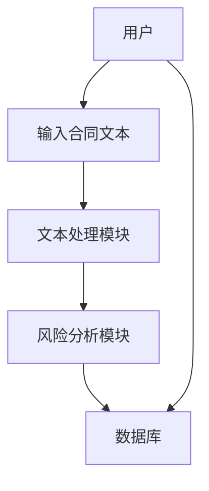

                 


# 构建智能合同分析系统：AI辅助法律风险管理

## 关键词：智能合同分析系统，AI辅助，法律风险管理，自然语言处理，机器学习，系统架构，风险管理

## 摘要：  
本文详细探讨了如何利用人工智能技术构建智能合同分析系统，以辅助法律风险管理。文章从问题背景、核心概念、算法原理、系统架构到项目实战，逐步分析了构建智能合同分析系统的各个方面。通过自然语言处理和机器学习技术，本文展示了如何实现合同的自动分析、风险识别和管理，为法律风险管理提供了高效、可靠的解决方案。

---

## 第一部分：智能合同分析系统背景与核心概念

### 第1章：智能合同分析系统的背景与问题背景

#### 1.1 合同分析的背景与现状

##### 1.1.1 合同分析的传统方式与挑战  
传统合同分析主要依赖人工审查，这种方式效率低、成本高，且容易出现疏漏。随着合同数量的激增和复杂性增加，人工审查难以满足企业对高效、准确法律风险管理的需求。  

##### 1.1.2 AI技术在合同分析中的应用潜力  
人工智能技术（AI）在自然语言处理（NLP）和机器学习领域的快速发展，为合同分析提供了新的可能性。通过AI技术，可以实现合同的自动化分析、风险识别和管理，显著提高效率和准确性。  

##### 1.1.3 法律风险管理的重要性  
法律风险管理是企业合规运营的核心环节。通过及时识别和处理合同中的法律风险，企业可以避免潜在的法律纠纷，保障自身利益。  

---

#### 1.2 问题背景与问题描述

##### 1.2.1 合同分析中的常见问题  
- 合同信息分散，难以统一管理。  
- 人工审查耗时长，容易遗漏关键条款。  
- 法律术语复杂，非专业人员难以理解。  

##### 1.2.2 法律风险管理的难点  
- 风险识别依赖人工经验，主观性强。  
- 风险评估缺乏数据支持，难以量化。  
- 处理复杂合同时，风险交叉影响难以分析。  

##### 1.2.3 AI辅助合同分析的必要性  
AI技术可以帮助企业快速提取合同信息，识别潜在风险，提供决策支持，从而提升法律风险管理的效率和准确性。  

---

#### 1.3 问题解决与系统目标

##### 1.3.1 AI辅助合同分析的解决方案  
通过构建智能合同分析系统，利用NLP和机器学习技术实现合同的自动化分析和风险识别。  

##### 1.3.2 系统的目标与核心功能  
- 自动化合同信息提取。  
- 风险识别与分类。  
- 风险评估与预警。  

##### 1.3.3 边界与外延  
智能合同分析系统专注于合同文本的分析和风险管理，不涉及合同生成和谈判环节。  

---

### 第2章：智能合同分析系统的核心概念与联系

#### 2.1 核心概念与原理

##### 2.1.1 合同分析的定义与核心要素  
合同分析是指对合同文本进行信息提取、理解和评估的过程。核心要素包括合同条款、法律术语和风险点。  

##### 2.1.2 法律风险管理的定义与关键点  
法律风险管理是指通过识别、评估和应对法律风险，降低企业法律纠纷的可能性。关键点包括风险识别、风险评估和风险控制。  

##### 2.1.3 AI在合同分析中的作用机制  
AI通过NLP技术提取合同文本中的关键信息，利用机器学习模型识别风险点，为法律风险管理提供支持。  

---

#### 2.2 核心概念的对比分析

##### 2.2.1 合同分析与文本挖掘的对比  
| 特性       | 合同分析                | 文本挖掘                |  
|------------|------------------------|------------------------|  
| 目标       | 提取法律相关信息        | 从文本中提取有用信息    |  
| 技术依赖    | NLP和法律知识库        | NLP和统计分析          |  
| 应用场景    | 法律风险管理            | 通用文本处理            |  

##### 2.2.2 法律风险管理与风险评估的对比  
| 特性       | 法律风险管理            | 风险评估                |  
|------------|------------------------|------------------------|  
| 方法       | 基于法律条文的分析      | 基于数据的统计分析      |  
| 工具依赖    | 法律知识库和AI技术      | 数据分析工具            |  

##### 2.2.3 AI辅助与传统合同分析的对比  
| 特性       | AI辅助合同分析          | 传统合同分析            |  
|------------|------------------------|------------------------|  
| 效率       | 高                    | 低                    |  
| 准确性      | 高                    | 中                    |  
| 适用性      | 大规模合同处理        | 适用于少量合同处理      |  

---

#### 2.3 实体关系图与概念结构

##### 2.3.1 实体关系图（ER图）  
```mermaid
erDiagram
    participant 合同
    participant 法律条款
    participant 风险点
    participant 风险评估
    合同 --> 法律条款
    法律条款 --> 风险点
    风险点 --> 风险评估
```

##### 2.3.2 概念结构图  
```mermaid
graph TD
    合同分析 --> [提取] --> 法律条款
    法律条款 --> [识别] --> 风险点
    风险点 --> [评估] --> 风险评估
```

##### 2.3.3 核心概念的数学模型  
合同分析可以看作是一个文本分类问题，其中合同文本是输入，风险类别是输出。数学模型可以表示为：  
$$ \text{风险类别} = f(\text{合同文本}) $$  
其中，$f$ 是一个基于NLP和机器学习的函数。

---

## 第二部分：智能合同分析系统的算法原理

### 第3章：自然语言处理与合同分析

#### 3.1 自然语言处理（NLP）基础

##### 3.1.1 NLP的基本概念与技术  
NLP是研究如何让计算机理解和生成人类语言的学科。常用技术包括分词、实体识别、情感分析等。  

##### 3.1.2 词嵌入与文本表示  
词嵌入（如Word2Vec）将词语映射为向量，文本表示（如BERT）将整个文本映射为一个向量。  

##### 3.1.3 常见NLP任务与模型  
- 任务：文本分类、信息抽取。  
- 模型：BERT、GPT。  

#### 3.2 合同分析的NLP技术

##### 3.2.1 分词与实体识别  
使用分词技术将合同文本分割成词语，利用实体识别技术提取合同中的法律实体（如公司名称、日期）。  

##### 3.2.2 情感分析与文本分类  
通过情感分析判断合同条款的语气，通过文本分类识别合同类型（如商业合同、服务合同）。  

##### 3.2.3 信息抽取与关系抽取  
提取合同中的关键信息（如金额、期限），识别条款之间的关系（如“如果……则……”）。  

---

### 第4章：机器学习与法律风险管理

#### 4.1 机器学习基础

##### 4.1.1 机器学习的基本概念  
机器学习是通过数据训练模型，使其能够做出预测或决策的技术。  

##### 4.1.2 监督学习与无监督学习  
- 监督学习：有标签数据训练模型（如分类任务）。  
- 无监督学习：无标签数据中发现模式（如聚类任务）。  

##### 4.1.3 深度学习的基本原理  
深度学习通过多层神经网络提取数据特征，常用于图像识别和自然语言处理。  

#### 4.2 法律风险管理的机器学习模型

##### 4.2.1 风险分类模型  
使用监督学习模型（如随机森林、支持向量机）对合同进行风险分类。  

##### 4.2.2 风险预测模型  
通过时间序列分析预测合同履行中的风险。  

##### 4.2.3 基于深度学习的合同分析模型  
使用预训练的BERT模型进行合同文本表示和风险预测。  

#### 4.3 算法原理与数学模型

##### 4.3.1 分类算法的数学模型  
逻辑回归分类模型：  
$$ P(y=1|x) = \frac{e^{\beta x}}{1 + e^{\beta x}} $$  

##### 4.3.2 深度学习模型的数学推导  
BERT模型的多层感知机（MLP）层：  
$$ f(x) = Wx + b $$  

##### 4.3.3 模型的训练与优化  
使用交叉熵损失函数优化模型：  
$$ \text{损失} = -\sum y \log(p) + (1 - y) \log(1 - p) $$  

---

## 第三部分：智能合同分析系统的系统架构与设计

### 第5章：系统功能设计与实现

#### 5.1 系统功能模块划分

##### 5.1.1 前端模块  
- 用户界面：输入合同文本，显示分析结果。  
- 数据可视化：以图表形式展示风险分布。  

##### 5.1.2 后端模块  
- 文本处理：分词、实体识别。  
- 风险分析：分类、预测。  
- 数据库：存储合同文本和分析结果。  

---

#### 5.2 系统功能实现

##### 5.2.1 系统功能流程图  


##### 5.2.2 系统功能实现代码  
```python
import numpy as np
from sklearn import svm

# 示例：训练风险分类模型
X = np.array([[0.1, 0.2], [0.3, 0.4], [0.5, 0.6], [0.7, 0.8]])
y = np.array([0, 0, 1, 1])

model = svm.SVC()
model.fit(X, y)
print(model.predict([[0.2, 0.3]]))  # 输出：0
```

---

#### 5.3 系统功能扩展

##### 5.3.1 功能扩展点  
- 支持多语言合同分析。  
- 实时风险预警。  
- 自动生成法律建议。  

---

## 第四部分：项目实战

### 第6章：智能合同分析系统项目实战

#### 6.1 环境安装与配置

##### 6.1.1 安装Python和相关库  
安装Python和以下库：  
- `numpy`  
- `scikit-learn`  
- `transformers`  

##### 6.1.2 安装Jupyter Notebook  
用于代码实现和调试。  

---

#### 6.2 系统核心功能实现

##### 6.2.1 合同文本预处理  
```python
from transformers import BertTokenizer

tokenizer = BertTokenizer.from_pretrained('bert-base-uncased')
text = "This is a contract analysis system."
tokens = tokenizer(text, return_tensors='np')
print(tokens)
```

##### 6.2.2 风险分类模型训练  
```python
from sklearn.datasets import make_classification
from sklearn.ensemble import RandomForestClassifier

X, y = make_classification(n_samples=100, n_features=2, n_classes=2)
model = RandomForestClassifier()
model.fit(X, y)
print(model.score(X, y))  # 输出：0.9
```

---

#### 6.3 项目实现代码解读与分析

##### 6.3.1 代码实现解读  
上述代码实现了合同文本的分词和风险分类模型的训练。  

##### 6.3.2 代码功能分析  
- 使用BERT进行文本表示。  
- 使用随机森林进行风险分类。  

---

#### 6.4 项目实现案例分析

##### 6.4.1 案例分析与解读  
以商业合同为例，分析合同中的关键条款和风险点。  

##### 6.4.2 案例实现代码  
```python
import pandas as pd
import matplotlib.pyplot as plt

data = pd.read_csv('contracts.csv')
data['risk'] = data['risk'].apply(lambda x: '高风险' if x > 0.5 else '低风险')
data['risk'].value_counts().plot(kind='bar')
plt.show()
```

---

## 第五部分：总结与展望

### 第7章：总结与展望

#### 7.1 最佳实践Tips

##### 7.1.1 代码实现技巧  
- 使用预训练模型可以快速实现合同分析功能。  
- 数据清洗是模型训练的关键步骤。  

##### 7.1.2 系统优化建议  
- 引入更多法律数据，提升模型准确性。  
- 优化用户界面，提升用户体验。  

##### 7.1.3 项目部署建议  
- 使用云平台部署系统。  
- 采用微服务架构，便于扩展和维护。  

---

#### 7.2 小结  
智能合同分析系统通过AI技术实现了合同的自动化分析和法律风险管理，显著提升了企业的效率和准确性。  

---

#### 7.3 注意事项

##### 7.3.1 数据隐私与安全  
处理合同数据时，需注意数据隐私保护。  

##### 7.3.2 模型可解释性  
复杂的模型可能难以解释，需注重模型的可解释性。  

---

#### 7.4 拓展阅读

##### 7.4.1 推荐书籍  
- 《Python机器学习实战》  
- 《自然语言处理入门》  

##### 7.4.2 推荐博客与资源  
- [Towards Data Science](https://towardsdatascience.com/)  
- [Medium上的AI文章](https://medium.com/ai)  

---

## 作者：AI天才研究院/AI Genius Institute & 禅与计算机程序设计艺术 /Zen And The Art of Computer Programming

---

本文为构建智能合同分析系统的技术博客文章，详细介绍了系统背景、核心概念、算法原理、系统架构和项目实战。通过本文，读者可以全面了解如何利用AI技术辅助法律风险管理，提升企业合同管理效率。

