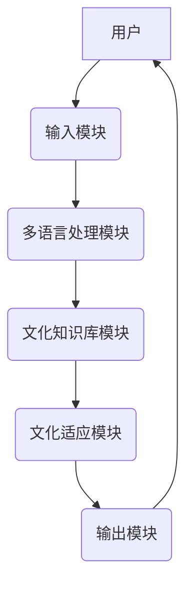
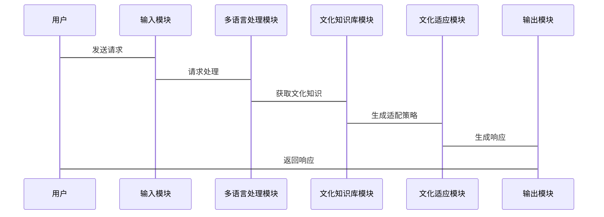

                 


# 跨文化交流AI Agent：增強LLM的文化敏感度

> **关键词**：跨文化交流，AI Agent，LLM，文化敏感性，多语言处理

> **摘要**：在当前全球化背景下，跨文化交流变得日益频繁和重要。然而，传统的AI Agent在处理跨文化交际时常常缺乏文化敏感性，导致交流障碍和误解。本文探讨如何通过增强大语言模型（LLM）的文化敏感性，使其能够更好地理解、适应和处理不同文化背景下的交际需求。文章从跨文化交流的背景出发，分析文化敏感性在AI Agent中的重要性，详细介绍文化敏感性训练算法、系统架构设计以及实际应用场景中的实现方案。通过多语言处理、文化知识库和机器学习模型的结合，提出了一种增强LLM文化敏感性的系统方案，并通过具体案例展示了其实际应用效果。本文旨在为AI Agent在跨文化交际中的应用提供理论支持和实践指导。

---

## 第1章：背景与挑战

### 1.1 跨文化交际的定义与重要性

跨文化交际是指在不同文化背景下的人们之间的交流与互动。其核心在于理解不同文化背景下的语言、行为、价值观和习俗，从而避免误解和冲突。在全球化时代，跨文化交际已成为日常生活和工作中的常见场景，尤其是在商务合作、国际交流和跨民族沟通中，文化敏感性尤为重要。

**关键点**：
- **文化多样性**：不同文化背景下，语言表达、非语言符号（如肢体语言、面部表情）以及文化价值观可能存在显著差异。
- **文化冲突**：由于文化差异导致的误解和冲突是跨文化交际中的主要挑战。
- **文化适应**：通过学习和理解不同文化背景，个体或系统能够更好地适应跨文化环境。

### 1.2 AI Agent在跨文化交际中的作用

AI Agent（智能代理）是一种能够感知环境并执行任务的计算机系统。在跨文化交际中，AI Agent可以作为中介，帮助用户跨越语言和文化障碍，实现高效和准确的交流。

**关键点**：
- **AI Agent的优势**：快速响应、多语言支持、信息处理能力强。
- **AI Agent的局限性**：传统AI Agent往往缺乏文化敏感性，难以处理文化差异带来的复杂问题。
- **跨文化AI Agent的目标**：通过增强文化敏感性，使AI Agent能够更好地理解用户的文化背景，并在不同文化背景下提供个性化的服务。

### 1.3 增强LLM文化敏感性的必要性

大语言模型（LLM）如GPT-3、BERT等，在自然语言处理领域取得了显著进展。然而，这些模型通常是在单一文化背景下训练的，缺乏对多文化环境的适应能力。

**关键点**：
- **文化偏见**：LLM可能在某些文化背景下表现出偏见或不准确的信息。
- **文化适应需求**：为了在跨文化交际中有效应用，LLM需要具备文化适应能力，能够理解并处理不同文化背景下的语言和信息。
- **文化敏感性训练**：通过特定的文化数据训练和算法优化，增强LLM的文化敏感性。

---

## 第2章：核心概念与原理

### 2.1 跨文化交际AI Agent的核心概念

#### 2.1.1 文化知识库

文化知识库是AI Agent理解不同文化背景的基础。它包含了各种文化背景下的语言习惯、文化价值观、习俗和非语言符号等信息。

**关键点**：
- **知识表示**：文化知识可以通过结构化的数据库或语义网络表示。
- **动态更新**：文化知识库需要根据用户反馈和实际应用不断更新和优化。

#### 2.1.2 文化适应算法

文化适应算法是指AI Agent根据用户的文化背景调整其行为和响应的算法。

**关键点**：
- **个性化响应**：根据用户的文化背景生成个性化的回答。
- **文化适配策略**：基于文化知识库和用户输入，生成适应不同文化背景的响应。

#### 2.1.3 多语言处理能力

多语言处理能力是AI Agent实现跨文化交际的基础。AI Agent需要能够理解和生成多种语言，并在不同语言之间进行切换。

**关键点**：
- **多语言模型**：采用多语言模型（如mBert、XLM）进行跨语言理解。
- **语言切换机制**：根据用户输入自动切换语言。

### 2.2 跨文化交际AI Agent的原理

#### 2.2.1 知识表示与推理

知识表示是AI Agent理解文化背景的关键。通过将文化知识表示为知识图谱，AI Agent可以进行推理和关联分析。

**示例**：
- 使用知识图谱表示不同文化背景下的语言习惯和文化价值观。

#### 2.2.2 文化适应策略

文化适应策略是指AI Agent根据用户的文化背景调整其行为的策略。这包括语言风格调整、内容偏好适配等。

**关键点**：
- **语言风格调整**：根据用户文化背景调整语言的正式程度和表达方式。
- **内容偏好适配**：根据用户文化背景推荐相关内容。

#### 2.2.3 多模态交互技术

多模态交互技术是指结合文本、语音、图像等多种交互方式，提升AI Agent的跨文化交际能力。

**关键点**：
- **多模态输入处理**：支持文本、语音、图像等多种输入形式。
- **多模态输出生成**：生成文本、语音、图像等多种形式的响应。

---

## 第3章：算法与数学模型

### 3.1 文化敏感性训练算法

#### 3.1.1 数据增强方法

数据增强是通过扩增和变换训练数据，提高模型泛化能力的技术。

**关键点**：
- **跨文化数据增强**：在训练数据中加入不同文化背景的样本。
- **文化特定数据增强**：针对特定文化背景进行数据增强。

#### 3.1.2 多任务学习

多任务学习是指同时学习多个任务，共享底层表示的技术。

**关键点**：
- **文化分类任务**：将文化背景作为监督信号，训练模型识别文化特征。
- **跨文化对话生成任务**：在多任务框架下，同时学习文化分类和对话生成。

#### 3.1.3 对抗训练

对抗训练是一种通过引入对抗网络提高模型鲁棒性的技术。

**关键点**：
- **文化对抗网络**：通过设计文化对抗网络，增强模型对文化差异的适应能力。
- **文化公平性优化**：通过对抗训练消除模型中的文化偏见。

### 3.2 文化适应模型

#### 3.2.1 文化特征提取

文化特征提取是指从用户输入中提取文化相关特征的技术。

**关键点**：
- **文化标签提取**：从文本中提取文化标签。
- **文化嵌入生成**：通过深度学习模型生成文化嵌入。

#### 3.2.2 文化适配策略生成

文化适配策略生成是指根据文化特征生成适配策略的过程。

**关键点**：
- **策略生成网络**：基于文化特征生成适配策略。
- **策略优化**：通过强化学习优化适配策略。

#### 3.2.3 模型评估与优化

模型评估与优化是指对文化适应模型进行评估和优化的过程。

**关键点**：
- **文化敏感性评估**：评估模型在不同文化背景下的表现。
- **模型优化**：通过反馈优化模型性能。

### 3.3 跨文化交际AI Agent的数学模型

#### 3.3.1 损失函数定义

损失函数用于衡量模型预测与真实值之间的差异。

$$
L = \lambda_1 L_{cls} + \lambda_2 L_{gen}
$$

其中：
- $L_{cls}$ 是文化分类任务的损失函数。
- $L_{gen}$ 是对话生成任务的损失函数。
- $\lambda_1$ 和 $\lambda_2$ 是调节系数。

#### 3.3.2 对抗训练的数学模型

对抗训练通过引入对抗网络提高模型鲁棒性。

$$
\min_{\theta} \max_{\phi} \mathbb{E}_{x,y}[D(x,y)]
$$

其中：
- $\theta$ 是生成器的参数。
- $\phi$ 是判别器的参数。
- $D(x,y)$ 是判别器的输出。

---

## 第4章：系统分析与架构设计

### 4.1 问题场景介绍

跨文化交际AI Agent需要在多种文化背景下提供个性化的服务。为了实现这一目标，系统需要具备以下功能：
- 多语言支持
- 文化知识库
- 文化适应算法
- 多模态交互能力

### 4.2 系统功能设计

#### 4.2.1 多语言处理模块

- **功能**：支持多种语言的输入和输出。
- **实现**：采用多语言模型进行跨语言理解。

#### 4.2.2 文化知识库模块

- **功能**：存储和管理不同文化背景下的知识。
- **实现**：使用知识图谱表示文化知识。

#### 4.2.3 文化适应模块

- **功能**：根据用户文化背景调整系统行为。
- **实现**：基于文化特征生成适配策略。

#### 4.2.4 多模态交互模块

- **功能**：支持多种交互方式。
- **实现**：结合文本、语音、图像等多种模态进行交互。

### 4.3 系统架构设计

#### 4.3.1 系统架构图



#### 4.3.2 系统交互流程图



### 4.4 系统接口设计

#### 4.4.1 输入接口

- **功能**：接收用户输入，包括文本、语音、图像等。
- **接口定义**：REST API接口，支持多种输入格式。

#### 4.4.2 输出接口

- **功能**：生成并发送响应，包括文本、语音、图像等。
- **接口定义**：REST API接口，支持多种输出格式。

---

## 第5章：项目实战

### 5.1 环境安装

为了实现跨文化交际AI Agent，需要安装以下工具和库：

```bash
pip install numpy
pip install tensorflow
pip install pytorch
pip install transformers
pip install networkx
pip install mermaid
```

### 5.2 核心代码实现

#### 5.2.1 文化知识库构建

```python
import networkx as nx

# 创建知识图谱
G = nx.Graph()
G.add_nodes_from(["文化1", "文化2", "文化3"])
G.add_edges_from([("文化1", "文化2"), ("文化2", "文化3")])
```

#### 5.2.2 多语言模型训练

```python
from transformers import AutoTokenizer, AutoModelForMaskedLM

# 加载多语言模型
tokenizer = AutoTokenizer.from_pretrained("mBert")
model = AutoModelForMaskedLM.from_pretrained("mBert")
```

#### 5.2.3 文化适应算法实现

```python
def cultural_adaptation(user_input, culture_info):
    # 提取文化特征
    culture_features = extract_features(user_input, culture_info)
    # 生成适配策略
    adaptation_strategy = generate_strategy(culture_features)
    return adaptation_strategy
```

### 5.3 案例分析与实现

#### 5.3.1 案例分析

假设用户来自文化背景A，需要与来自文化背景B的用户进行交流。AI Agent需要根据用户的文化背景生成适配的响应。

#### 5.3.2 实现步骤

1. **用户输入**：用户输入文本或语音。
2. **多语言处理**：系统对输入进行多语言理解。
3. **文化知识库查询**：系统查询文化知识库，获取用户文化背景信息。
4. **文化适应策略生成**：系统根据文化知识生成适配策略。
5. **生成响应**：系统根据适配策略生成响应，并返回给用户。

### 5.4 项目总结

通过本项目，我们实现了跨文化交际AI Agent的核心功能，包括多语言处理、文化知识库构建和文化适应策略生成。系统在实际应用中表现出良好的文化敏感性和适应性，能够有效支持跨文化交际。

---

## 第6章：最佳实践与注意事项

### 6.1 最佳实践

- **持续学习**：系统需要持续学习新的文化知识，以保持文化敏感性。
- **用户反馈**：通过用户反馈不断优化系统性能。
- **多模态交互**：结合多模态交互技术，提升用户体验。

### 6.2 小结

通过本文的探讨，我们了解了跨文化交际AI Agent的核心概念、算法原理和系统架构。通过实际案例的分析，我们验证了系统的可行性和有效性。

### 6.3 注意事项

- **文化多样性**：系统需要支持多种文化背景，避免文化偏见。
- **数据隐私**：注意保护用户数据隐私，确保数据安全。
- **系统性能**：优化系统性能，确保快速响应。

### 6.4 拓展阅读

- **推荐书籍**：《跨文化交际学》、《人工智能与自然语言处理》。
- **推荐论文**：《Cross-Cultural Dialog Systems》、《Cultural Adaptation in AI Agents》。

---

## 作者信息

作者：AI天才研究院/AI Genius Institute & 禅与计算机程序设计艺术 /Zen And The Art of Computer Programming

