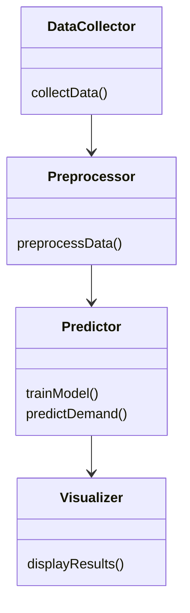
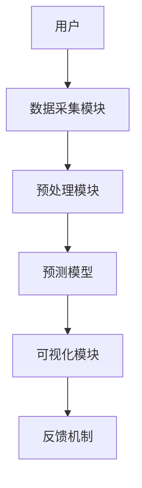
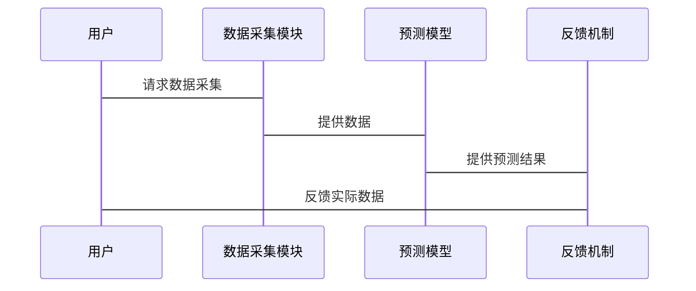

                 


# AI Agent在智能电力需求预测中的应用

## 关键词：AI Agent, 电力需求预测, 智能系统, 机器学习, 多智能体协作, 能源管理

## 摘要：本文深入探讨了AI Agent在电力需求预测中的应用，分析了AI Agent的核心原理，详细阐述了基于AI Agent的电力需求预测算法，结合实际案例展示了系统架构设计与实现，最后总结了AI Agent在电力需求预测中的优势与未来发展方向。

---

# 第一部分: AI Agent与电力需求预测的背景与概念

## 第1章: AI Agent与电力需求预测概述

### 1.1 AI Agent的基本概念

#### 1.1.1 AI Agent的定义
AI Agent（人工智能代理）是一种能够感知环境、自主决策并执行任务的智能实体。它能够通过传感器获取数据，利用算法进行分析，并通过执行器实现目标。AI Agent的核心在于其智能性，能够根据环境变化动态调整行为。

#### 1.1.2 AI Agent的核心特征
| 特性 | 描述 |
|------|------|
| 感知性 | 能够通过传感器或数据接口获取外部环境信息。 |
| 决策性 | 具备分析信息、制定策略并做出决策的能力。 |
| 自主性 | 能够在没有外部干预的情况下独立运行。 |
| 学习性 | 能够通过经验或数据优化自身的算法与行为。 |

#### 1.1.3 AI Agent的分类与应用场景
AI Agent可以分为**反应式智能体**和**认知式智能体**。反应式智能体基于当前感知做出实时反应，适用于需要快速响应的任务；认知式智能体具备目标设定、规划和推理能力，适用于复杂任务。电力需求预测主要采用反应式智能体。

---

### 1.2 电力需求预测的背景与挑战

#### 1.2.1 电力需求预测的重要性
电力需求预测是电力系统规划、调度和管理的基础，直接影响电网的稳定性、经济性和安全性。准确的预测可以优化电力资源的分配，减少能源浪费和成本。

#### 1.2.2 传统电力需求预测方法的局限性
传统方法主要包括时间序列分析、统计回归等，存在以下问题：
- 对异常数据的鲁棒性不足。
- 难以处理多变量的复杂关系。
- 无法实时更新模型。

#### 1.2.3 智能化电力需求预测的需求与趋势
随着智能电网和可再生能源的普及，电力需求呈现波动性大、不确定性高的特点。传统的预测方法难以满足需求，因此智能化、动态化的预测方法成为趋势。

---

### 1.3 AI Agent在电力需求预测中的应用价值

#### 1.3.1 提高预测精度
AI Agent可以通过集成多种算法和实时数据反馈，显著提高预测的准确性。

#### 1.3.2 实现动态调整与实时反馈
AI Agent能够实时感知环境变化，动态调整预测模型，确保预测结果的实时性和准确性。

#### 1.3.3 优化电力资源分配
通过AI Agent的协同预测和优化决策，可以实现电力资源的高效分配，降低浪费。

---

## 1.4 本章小结
本章介绍了AI Agent的基本概念、分类及其在电力需求预测中的应用价值，为后续内容奠定了基础。

---

# 第二部分: AI Agent的核心概念与原理

## 第2章: AI Agent的核心原理

### 2.1 AI Agent的感知与决策机制

#### 2.1.1 感知层：数据采集与特征提取
AI Agent通过传感器、数据库等渠道获取电力需求相关数据，如历史用电数据、天气信息、用户行为数据等。特征提取是将原始数据转化为对预测有帮助的特征向量，常用方法包括主成分分析（PCA）和小波变换。

#### 2.1.2 决策层：基于机器学习的预测模型
AI Agent的核心决策层基于机器学习算法，如支持向量机（SVM）、随机森林（RF）和神经网络（NN）。这些算法能够从数据中学习特征，并生成预测结果。

#### 2.1.3 执行层：预测结果的输出与反馈
AI Agent将预测结果输出，并根据实际用电情况调整模型参数，形成闭环反馈机制。

---

### 2.2 AI Agent的通信与协作机制

#### 2.2.1 多智能体系统的基本概念
多智能体系统（MAS）是由多个智能体组成的协作系统，每个智能体负责特定的任务，共同完成复杂目标。

#### 2.2.2 Agent之间的通信协议
智能体之间的通信需要遵循特定协议，如基于消息队列的通信（MQTT、HTTP）。

#### 2.2.3 协作式预测的优势与实现方法
协作式预测通过多个智能体的协同工作，能够覆盖更全面的数据源，提高预测的准确性。

---

### 2.3 AI Agent的自适应与学习能力

#### 2.3.1 增量学习的基本原理
增量学习是一种在线学习方法，AI Agent能够通过不断接收新数据更新模型。

#### 2.3.2 迁移学习的应用场景
迁移学习适用于数据分布变化较大的场景，能够减少模型的过拟合。

#### 2.3.3 强化学习在预测优化中的应用
强化学习通过奖励机制优化预测策略，适用于动态变化的环境。

---

## 2.4 本章小结
本章详细阐述了AI Agent的核心原理，包括感知与决策机制、通信与协作机制以及自适应与学习能力。

---

# 第三部分: AI Agent在电力需求预测中的算法原理

## 第3章: 电力需求预测的算法原理

### 3.1 基于机器学习的预测模型

#### 3.1.1 线性回归模型
线性回归是最简单的预测模型，适用于线性关系的场景。其数学公式为：
$$ y = \beta_0 + \beta_1x + \epsilon $$
其中，$\beta_0$和$\beta_1$是回归系数，$\epsilon$是误差项。

#### 3.1.2 支持向量回归模型
支持向量回归（SVR）是一种基于支持向量机的回归方法，适用于非线性关系。其核心思想是将数据映射到高维空间，然后寻找最优回归超平面。

#### 3.1.3 神经网络模型
神经网络模型（如多层感知机）能够处理复杂的非线性关系，适用于电力需求的复杂预测场景。

---

### 3.2 基于时间序列的预测方法

#### 3.2.1 ARIMA模型
ARIMA（自回归积分滑动平均模型）是一种常用的时间序列预测方法，其数学公式为：
$$ y_t = c + \phi_1y_{t-1} + \dots + \phi_p y_{t-p} + \theta_1\epsilon_{t-1} + \dots + \theta_q\epsilon_{t-q} + \epsilon_t $$

#### 3.2.2 LSTM网络
长短期记忆网络（LSTM）是一种特殊的RNN，能够有效处理时间序列数据中的长依赖关系。

#### 3.2.3 Prophet模型
Prophet是由Facebook开源的时间序列预测模型，适用于具有周期性变化的数据。

---

### 3.3 基于多智能体的协同预测算法

#### 3.3.1 多智能体预测的基本原理
多个AI Agent分别负责不同的预测任务，最终通过融合得到整体预测结果。

#### 3.3.2 基于分布式计算的预测优化
通过分布式计算框架（如Spark、Flink）提高预测效率。

#### 3.3.3 基于博弈论的预测策略调整
利用博弈论优化多个智能体的预测策略，减少冲突，提高整体预测精度。

---

## 3.4 算法实现的数学模型与公式

### 3.4.1 线性回归模型的公式推导
线性回归的目标是最小化预测值与实际值之间的平方误差之和：
$$ \text{最小化} \sum_{i=1}^n (y_i - (\beta_0 + \beta_1x_i))^2 $$

### 3.4.2 LSTM网络的结构与公式
LSTM的基本单元包括输入门、遗忘门和输出门：
$$
i_t = \sigma(w_i x_t + u_i h_{t-1} + b_i) \\
f_t = \sigma(w_f x_t + u_f h_{t-1} + b_f) \\
o_t = \sigma(w_o x_t + u_o h_{t-1} + b_o) \\
h_t = i_t \cdot \tanh(w_c x_t + u_c h_{t-1} + b_c)
$$

---

## 3.5 本章小结
本章详细介绍了基于机器学习和时间序列的预测算法，以及多智能体协同预测的方法。

---

# 第四部分: 电力需求预测系统的架构与设计

## 第4章: 电力需求预测系统的架构设计

### 4.1 系统功能需求分析

#### 4.1.1 数据采集与预处理
数据来源包括历史用电数据、天气数据、用户行为数据等。预处理步骤包括数据清洗、特征工程和数据标准化。

#### 4.1.2 预测模型的训练与部署
基于训练数据训练预测模型，并将其部署到生产环境。

#### 4.1.3 预测结果的可视化与反馈
通过可视化工具展示预测结果，并将实际数据反馈到系统中，优化模型。

---

### 4.2 系统功能设计

#### 4.2.1 领域模型类图


---

#### 4.2.2 系统架构图


---

### 4.3 系统接口设计

#### 4.3.1 API接口
系统提供RESTful API接口，供其他系统调用预测结果。

#### 4.3.2 消息队列
系统使用消息队列（如Kafka）实现异步通信，提高系统的扩展性。

---

### 4.4 系统交互流程

#### 4.4.1 交互流程图


---

## 4.5 本章小结
本章详细设计了电力需求预测系统的架构，包括功能模块、接口设计和交互流程。

---

# 第五部分: 项目实战与案例分析

## 第5章: 电力需求预测项目实战

### 5.1 环境安装与配置

#### 5.1.1 安装Python环境
使用Anaconda安装Python 3.8及以上版本。

#### 5.1.2 安装依赖库
安装numpy、pandas、scikit-learn、keras、tensorflow等库。

### 5.2 系统核心实现源代码

#### 5.2.1 数据采集模块
```python
import pandas as pd
import requests

def collect_data():
    # 示例：从数据库中读取数据
    url = "http://example.com/api/data"
    response = requests.get(url)
    data = pd.DataFrame(response.json())
    return data
```

#### 5.2.2 预测模型实现
```python
from sklearn.linear_model import LinearRegression

def train_model(X, y):
    model = LinearRegression()
    model.fit(X, y)
    return model

def predict_demand(model, X_test):
    return model.predict(X_test)
```

#### 5.2.3 可视化模块
```python
import matplotlib.pyplot as plt

def visualize_results(actual, predicted):
    plt.plot(actual, label='Actual Demand')
    plt.plot(predicted, label='Predicted Demand')
    plt.xlabel('Time')
    plt.ylabel('Demand')
    plt.legend()
    plt.show()
```

---

### 5.3 实际案例分析与结果展示

#### 5.3.1 数据预处理
```python
data = collect_data()
data['date'] = pd.to_datetime(data['date'])
data.set_index('date', inplace=True)
data = data.resample('D').mean()
```

#### 5.3.2 模型训练与预测
```python
X = data.iloc[:-7].drop('demand', axis=1)
y = data.iloc[:-7]['demand']
model = train_model(X, y)
X_test = data.iloc[-7:]['demand']
predicted = predict_demand(model, X_test)
```

#### 5.3.3 可视化结果
```python
visualize_results(data['demand'].iloc[-7:], predicted)
```

---

## 5.4 项目小结
本章通过实际案例展示了AI Agent在电力需求预测中的应用，详细讲解了系统实现的每个步骤。

---

# 第六部分: 最佳实践与总结

## 第6章: 最佳实践与总结

### 6.1 小结
AI Agent通过感知、决策和自适应能力，显著提高了电力需求预测的准确性和实时性。

### 6.2 注意事项
- 数据质量是预测精度的关键，需确保数据的完整性和准确性。
- 模型的选择应根据实际场景和数据特点进行调整。
- 系统的实时性和扩展性需通过分布式计算和高效通信机制来保证。

### 6.3 拓展阅读
- 《Deep Learning for Time Series Forecasting》
- 《Multi-Agent Systems: Complexity, Decentralized Knowledge, and Coordination》

---

# 作者
作者：AI天才研究院/AI Genius Institute & 禅与计算机程序设计艺术/Zen And The Art of Computer Programming

