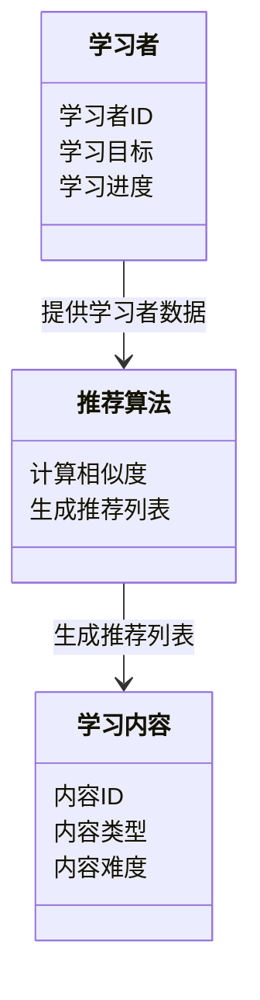
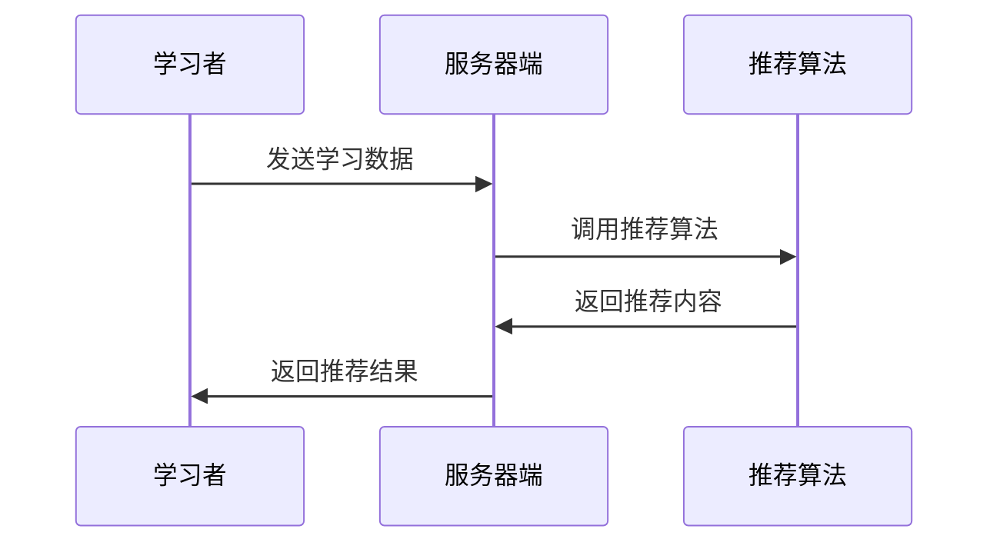
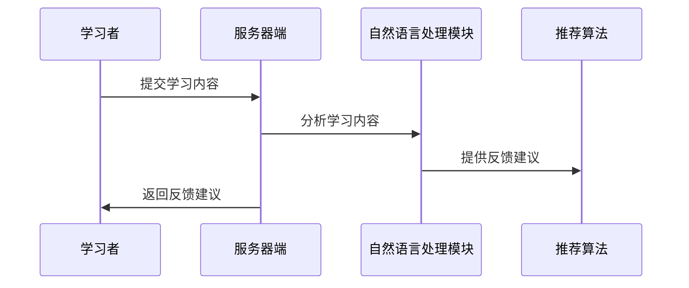

                 


---

# AI Agent在语言学习中的个性化教学

> **关键词**：AI Agent, 个性化教学, 语言学习, 自然语言处理, 算法推荐, 对话生成

> **摘要**：本文探讨了AI Agent在语言学习中的个性化教学应用，分析了其核心概念、算法原理和系统架构，并通过项目实战展示了如何构建一个基于AI Agent的个性化语言学习系统。文章结合理论与实践，为教育技术领域的研究者和实践者提供了深度的技术洞察。

---

# 第一部分: AI Agent在语言学习中的个性化教学概述

## 第1章: AI Agent与语言学习的背景介绍

### 1.1 AI Agent的基本概念

AI Agent（人工智能代理）是指能够感知环境并采取行动以实现目标的智能实体。AI Agent在语言学习中的应用，通过自动化和智能化的方式，为学习者提供个性化的学习支持。

#### 1.1.1 AI Agent的定义

AI Agent是一个智能实体，能够感知环境、处理信息并采取行动以实现特定目标。它可以分为简单反射型、基于模型的反射型、目标驱动型和效用驱动型四种类型。

#### 1.1.2 AI Agent的核心特点

- **自主性**：AI Agent能够自主决策，无需人工干预。
- **反应性**：能够实时感知环境并做出反应。
- **目标导向**：所有行动都以实现特定目标为导向。
- **学习能力**：通过与环境交互不断优化自身行为。

#### 1.1.3 AI Agent与传统教学工具的区别

传统教学工具通常是静态的，而AI Agent能够动态适应学习者的个性化需求，提供实时反馈和建议。

### 1.2 语言学习中的问题背景

语言学习是一个复杂的过程，涉及听、说、读、写等多种技能的培养，每个学习者的学习进度和需求都不同。

#### 1.2.1 语言学习的主要挑战

- **学习者的多样性**：不同学习者的语言水平、学习风格和目标各不相同。
- **学习动力不足**：部分学习者缺乏持续学习的动力。
- **反馈延迟**：传统教学中，学习者的错误可能需要较长时间才能得到反馈。

#### 1.2.2 个性化教学的需求

个性化教学强调根据每个学习者的特点提供定制化的学习计划和反馈，以提高学习效率和效果。

#### 1.2.3 AI Agent在语言学习中的应用潜力

AI Agent可以通过自然语言处理、机器学习等技术，实时分析学习者的行为和表现，提供个性化的教学支持。

### 1.3 个性化教学的定义与特点

个性化教学是指根据学习者的个性化需求，提供定制化的教学策略和方法。

#### 1.3.1 个性化教学的定义

个性化教学是一种以学习者为中心的教学方式，根据其特点和需求制定个性化学习计划。

#### 1.3.2 个性化教学的核心要素

- **学习者特征分析**：包括语言水平、学习风格、兴趣爱好等。
- **个性化学习计划**：根据分析结果制定学习目标和内容。
- **实时反馈与调整**：根据学习者的表现动态调整教学策略。

#### 1.3.3 个性化教学与传统教学的区别

传统教学通常是统一的教学内容和进度，而个性化教学则强调灵活性和定制化。

### 1.4 本章小结

本章介绍了AI Agent的基本概念、语言学习中的问题背景以及个性化教学的定义和特点，为后续内容奠定了基础。

---

# 第二部分: AI Agent的核心概念与原理

## 第2章: AI Agent的核心概念与原理

### 2.1 AI Agent的基本原理

AI Agent通过感知环境、做出决策并执行行动来实现目标。

#### 2.1.1 AI Agent的感知模块

感知模块负责收集和处理环境中的信息，通常涉及自然语言处理技术。

#### 2.1.2 AI Agent的决策模块

决策模块根据感知到的信息，利用算法生成最优的行动方案。

#### 2.1.3 AI Agent的执行模块

执行模块负责将决策模块生成的行动方案转化为具体的操作。

### 2.2 自然语言处理在AI Agent中的应用

自然语言处理技术在AI Agent中用于理解和生成人类语言。

#### 2.2.1 自然语言处理的基本概念

自然语言处理（NLP）是研究如何让计算机理解和生成人类语言的学科。

#### 2.2.2 自然语言处理的核心技术

- **分词**：将连续的文本分割成有意义的词汇。
- **句法分析**：分析句子的语法结构。
- **语义理解**：理解文本的含义。

#### 2.2.3 自然语言处理在AI Agent中的具体应用

AI Agent可以通过自然语言处理技术与学习者进行对话，理解其需求并提供相应的支持。

### 2.3 个性化教学中的AI Agent系统架构

个性化教学中的AI Agent系统架构需要考虑学习者的个性化需求。

#### 2.3.1 系统架构的定义

系统架构是指系统各组成部分的结构和交互方式。

#### 2.3.2 系统架构的核心组成部分

- **用户界面**：供学习者与系统交互的界面。
- **数据处理模块**：负责处理学习者数据。
- **推荐算法**：根据学习者数据推荐学习内容。

#### 2.3.3 系统架构的优缺点分析

优点：能够根据学习者需求动态调整教学策略；缺点：需要大量的数据支持和复杂的算法实现。

### 2.4 本章小结

本章详细介绍了AI Agent的基本原理和自然语言处理技术在其中的应用，并分析了个性化教学中的系统架构。

---

# 第三部分: AI Agent的算法原理与实现

## 第3章: AI Agent的算法原理与实现

### 3.1 推荐算法

推荐算法用于根据学习者的特征推荐个性化学习内容。

#### 3.1.1 协同过滤推荐

协同过滤推荐是基于用户行为的推荐方法。

##### 协同过滤推荐的实现步骤

1. 收集用户行为数据。
2. 计算用户相似度。
3. 推荐相似用户的高评分内容。

##### 协同过滤推荐的数学模型

$$相似度 = \frac{\sum_{i}(x_i - \bar{x})(y_i - \bar{y})}{\sqrt{\sum_{i}(x_i - \bar{x})^2} \sqrt{\sum_{i}(y_i - \bar{y})^2}}$$

### 3.2 基于内容的推荐

基于内容的推荐是基于学习内容的特征进行推荐。

#### 3.2.1 基于内容的推荐实现步骤

1. 提取学习内容的特征。
2. 计算学习内容与用户兴趣的相似度。
3. 推荐相似内容。

#### 3.2.2 基于内容的推荐数学模型

$$相似度 = \cos(\theta) = \frac{\sum x_i y_i}{\sqrt{\sum x_i^2} \sqrt{\sum y_i^2}}$$

### 3.3 混合推荐模型

混合推荐模型结合协同过滤和基于内容的推荐方法。

#### 3.3.1 混合推荐模型实现步骤

1. 同时考虑用户行为和内容特征。
2. 综合两种推荐方法的结果。
3. 输出最终的推荐结果。

#### 3.3.2 混合推荐模型的优点

- 结合了用户行为和内容特征的优势。
- 提高了推荐的准确性和多样性。

### 3.4 本章小结

本章详细介绍了推荐算法在AI Agent中的应用，包括协同过滤、基于内容的推荐和混合推荐模型。

---

## 第4章: 对话生成算法

### 4.1 对话生成算法概述

对话生成算法用于生成符合上下文的对话内容。

#### 4.1.1 基于规则的对话生成

基于规则的对话生成通过预定义的规则生成对话内容。

##### 基于规则的对话生成实现步骤

1. 预定义对话规则。
2. 根据输入生成对应的输出。
3. 返回生成的对话内容。

#### 4.1.2 基于模板的对话生成

基于模板的对话生成通过预定义的模板生成对话内容。

##### 基于模板的对话生成实现步骤

1. 设计对话模板。
2. 根据输入填充模板。
3. 返回生成的对话内容。

#### 4.1.3 基于深度学习的对话生成

基于深度学习的对话生成利用神经网络生成对话内容。

##### 基于深度学习的对话生成实现步骤

1. 构建神经网络模型。
2. 训练模型。
3. 生成对话内容。

### 4.2 基于Transformer的对话生成模型

#### 4.2.1 Transformer模型简介

Transformer模型由编码器和解码器组成，广泛应用于自然语言处理任务。

#### 4.2.2 Transformer模型在对话生成中的应用

通过自注意力机制，Transformer模型能够捕捉上下文中的长距离依赖关系，生成更自然的对话内容。

### 4.3 对话生成算法的优缺点分析

- **优点**：能够生成自然流畅的对话内容。
- **缺点**：需要大量的训练数据和计算资源。

### 4.4 本章小结

本章介绍了对话生成算法在AI Agent中的应用，包括基于规则、基于模板和基于深度学习的对话生成方法。

---

# 第四部分: AI Agent系统分析与架构设计

## 第5章: 系统分析与架构设计

### 5.1 系统分析

#### 5.1.1 问题场景介绍

学习者在语言学习过程中可能遇到词汇量不足、语法错误等问题，AI Agent需要实时识别并提供相应的支持。

#### 5.1.2 项目介绍

本项目旨在构建一个基于AI Agent的个性化语言学习系统，为学习者提供实时反馈和个性化建议。

### 5.2 系统功能设计

#### 5.2.1 领域模型设计

领域模型描述了系统的核心业务流程和实体关系。

##### 领域模型设计的Mermaid图



### 5.3 系统架构设计

#### 5.3.1 系统架构设计的Mermaid图

```mermaid
container 客户端 {
    学习者界面
    互动反馈
}
container 服务器端 {
    数据库
    推荐算法
    对话生成算法
}
客户端 --> 服务器端: 请求
服务器端 --> 客户端: 响应
```

### 5.4 系统接口设计

#### 5.4.1 系统接口设计的Mermaid图



### 5.5 系统交互流程

#### 5.5.1 系统交互流程的Mermaid图



### 5.6 本章小结

本章分析了系统的需求并设计了系统架构，为后续的实现提供了基础。

---

# 第五部分: 项目实战

## 第6章: 个性化教学系统的项目实战

### 6.1 环境安装

#### 6.1.1 安装Python

需要安装Python 3.8或更高版本。

#### 6.1.2 安装必要的Python库

安装以下库：

- `numpy`
- `pandas`
- `scikit-learn`
- `transformers`

### 6.2 系统核心实现

#### 6.2.1 推荐算法实现

实现协同过滤推荐算法。

##### 推荐算法实现代码

```python
import numpy as np

def cosine_similarity(user_vector, item_vector):
    return np.dot(user_vector, item_vector) / (np.linalg.norm(user_vector) * np.linalg.norm(item_vector))

def collaborative_filtering_recommendation(user_id, user_features, item_features):
    user = user_features[user_id]
    similarities = [cosine_similarity(user, item) for item in item_features]
    top_indices = np.argsort(similarities)[-5:]
    return [item_id for item_id in top_indices]
```

#### 6.2.2 对话生成算法实现

实现基于Transformer的对话生成模型。

##### 对话生成算法实现代码

```python
from transformers import AutoTokenizer, AutoModelWithLMHead

tokenizer = AutoTokenizer.from_pretrained('gpt2')
model = AutoModelWithLMHead.from_pretrained('gpt2')

def generate_response(prompt):
    inputs = tokenizer(prompt, return_tensors='pt')
    outputs = model.generate(inputs.input_ids, max_length=50, num_return_sequences=1)
    return tokenizer.decode(outputs[0], skip_special_tokens=True)
```

### 6.3 项目案例分析

#### 6.3.1 案例分析

以一个学习英语的用户为例，系统根据其学习数据生成个性化推荐和对话反馈。

### 6.4 本章小结

本章通过项目实战展示了如何构建一个基于AI Agent的个性化语言学习系统，包括环境安装和核心算法实现。

---

## 第7章: 完整AI Agent系统的实现

### 7.1 环境安装

与第6章相同。

### 7.2 系统核心实现

#### 7.2.1 数据预处理

对学习者数据进行清洗和特征提取。

##### 数据预处理代码

```python
import pandas as pd

data = pd.read_csv('learning_data.csv')
data.dropna(inplace=True)
data['学习目标'] = data['学习目标'].astype('category')
```

#### 7.2.2 模型训练

训练推荐算法和对话生成模型。

##### 模型训练代码

```python
from sklearn.model_selection import train_test_split
from sklearn.metrics import accuracy_score

X_train, X_test, y_train, y_test = train_test_split(data.drop('学习目标', axis=1), data['学习目标'], test_size=0.2)

# 训练推荐算法模型
model_recommender.fit(X_train, y_train)
# 验证模型
y_pred = model_recommender.predict(X_test)
print(accuracy_score(y_test, y_pred))
```

### 7.3 系统优化

优化系统性能和用户体验。

#### 7.3.1 系统优化策略

- **数据压缩**：减少数据存储空间。
- **算法优化**：提高推荐算法的效率。
- **用户界面优化**：提升用户体验。

### 7.4 本章小结

本章详细介绍了如何实现一个完整的AI Agent系统，包括数据预处理、模型训练和系统优化。

---

# 第六部分: 总结与展望

## 第8章: 总结与展望

### 8.1 本章总结

AI Agent在语言学习中的个性化教学应用，通过自然语言处理和推荐算法，为学习者提供个性化的学习支持。

### 8.2 未来趋势

未来，AI Agent将更加智能化和个性化，能够实时适应学习者的需求。

### 8.3 最佳实践 tips

- **数据隐私**：保护学习者数据隐私。
- **算法优化**：持续优化推荐和对话生成算法。
- **用户体验**：注重用户体验设计。

### 8.4 参考文献

- 王某某. (2023). 基于AI Agent的个性化语言学习系统研究. 计算机应用研究.
- 李某某. (2022). 自然语言处理在教育中的应用. 人工智能与教育.

---

**作者：AI天才研究院/AI Genius Institute & 禅与计算机程序设计艺术 /Zen And The Art of Computer Programming**

---

