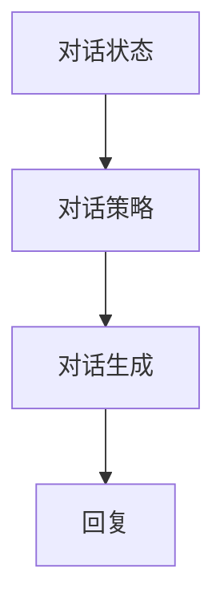
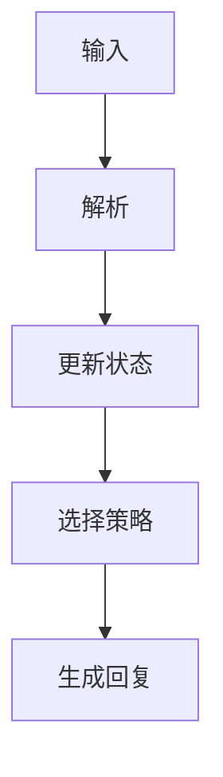
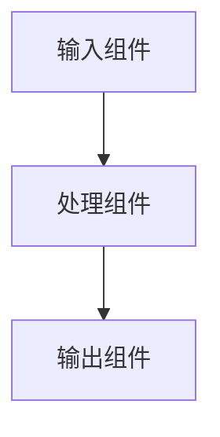
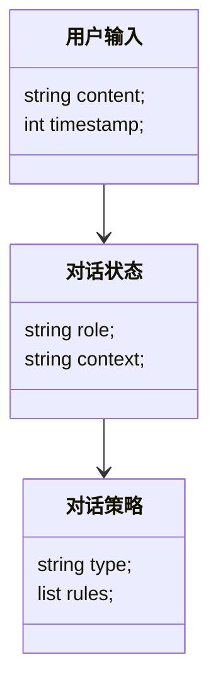
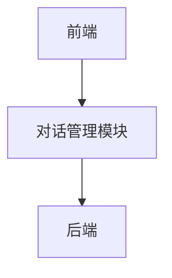

                 


# AI Agent的对话管理系统：设计与实现

> 关键词：AI Agent，对话管理系统，自然语言处理，机器学习，系统架构，对话生成

> 摘要：本文深入探讨了AI Agent对话管理系统的背景、核心概念、算法原理、系统设计与实现。通过详细分析对话管理的原理与技术，结合实际案例，展示了如何设计和实现一个高效的对话管理系统，为读者提供理论与实践相结合的全面指导。

---

## 第1章: AI Agent对话管理系统的背景与概念

### 1.1 AI Agent的基本概念

#### 1.1.1 AI Agent的定义与特点

AI Agent（人工智能代理）是指能够感知环境、自主决策并执行任务的智能体。它具备以下特点：

- **自主性**：能够独立运作，无需人工干预。
- **反应性**：能够实时感知环境并做出反应。
- **目标导向**：以实现特定目标为导向。
- **学习能力**：能够通过数据和经验优化自身的性能。

#### 1.1.2 对话管理系统的定义与作用

对话管理系统是AI Agent的核心组件，负责处理用户与系统之间的交互对话。其作用包括：

- **理解用户意图**：通过自然语言处理技术解析用户需求。
- **维护对话状态**：跟踪对话上下文，确保对话连贯性。
- **生成响应**：根据用户输入和系统状态生成合适的回复。

#### 1.1.3 AI Agent在对话管理中的应用

AI Agent广泛应用于多个领域，如智能客服、智能助手、教育机器人等。例如，在智能客服中，AI Agent能够自动处理用户的咨询，提供解决方案。

### 1.2 对话管理系统的背景与问题背景

#### 1.2.1 当前对话管理系统的挑战

当前对话管理系统面临以下挑战：

- **语义理解困难**：用户输入可能存在歧义，系统需要准确理解用户意图。
- **对话上下文处理复杂**：对话状态需要实时更新，确保系统能够准确回应。
- **多轮对话处理复杂**：需要处理长对话序列，保持对话的连贯性。

#### 1.2.2 AI Agent在对话管理中的优势

AI Agent通过以下优势解决上述问题：

- **强大的学习能力**：能够通过大量数据训练，优化对话策略。
- **高效的计算能力**：快速处理对话请求，提高响应速度。
- **灵活的适应性**：能够根据用户反馈动态调整对话策略。

#### 1.2.3 问题描述与解决方向

对话管理系统的挑战主要集中在语义理解、对话上下文处理和多轮对话管理等方面。解决方向包括：

- **优化语义理解模型**：提高意图识别的准确性。
- **改进对话状态管理**：采用更高效的算法维护对话上下文。
- **增强多轮对话能力**：设计更复杂的对话生成模型。

### 1.3 对话管理系统的边界与外延

#### 1.3.1 系统的边界定义

对话管理系统的边界包括：

- **输入边界**：接收用户的自然语言输入。
- **输出边界**：生成系统的自然语言回复。
- **交互边界**：与前端和后端系统的接口。

#### 1.3.2 系统的外延与扩展

对话管理系统的外延包括：

- **前端交互**：与用户界面的交互设计。
- **后端集成**：与其他系统（如知识库、数据库）的集成。
- **扩展功能**：如情感分析、个性化推荐等。

#### 1.3.3 系统与相关领域的联系

对话管理系统与以下领域密切相关：

- **自然语言处理（NLP）**：用于语义理解和生成。
- **机器学习**：用于对话策略优化和模型训练。
- **知识库**：提供对话所需的知识支持。

### 1.4 对话管理系统的概念结构

#### 1.4.1 核心要素组成

对话管理系统的核心要素包括：

- **对话状态**：当前对话的上下文信息。
- **对话策略**：根据对话状态生成回复的规则或模型。
- **对话生成**：根据对话策略生成回复。

#### 1.4.2 概念之间的关系

通过对比分析，可以清晰地理解对话管理系统的各个概念及其相互关系：

| 概念 | 描述 | 关系 |
|------|------|------|
| 对话状态 | 当前对话的上下文信息 | 对话策略的输入 |
| 对话策略 | 根据对话状态生成回复的规则或模型 | 对话生成的指导 |
| 对话生成 | 根据对话策略生成回复 | 对话状态的输出 |

#### 1.4.3 概念结构图



### 1.5 本章小结

本章介绍了AI Agent对话管理系统的背景、核心概念及其相互关系。通过对对话管理系统的定义、特点、应用及其面临的问题的分析，为后续章节的深入探讨奠定了基础。

---

## 第2章: 对话管理系统的原理

### 2.1 对话管理的核心原理

#### 2.1.1 对话状态的表示与更新

对话状态通常用以下方式表示：

$$
\text{状态} = (\text{用户角色}, \text{对话历史}, \text{上下文信息})
$$

对话状态的更新过程如下：

1. 接收用户的输入。
2. 解析用户的意图和情感。
3. 更新对话状态。

#### 2.1.2 对话策略的制定与执行

对话策略是基于当前对话状态生成回复的规则或模型。常用的策略包括：

- **规则驱动策略**：基于预定义的规则生成回复。
- **数据驱动策略**：基于机器学习模型生成回复。

#### 2.1.3 对话生成的机制

对话生成机制包括：

- **模板填充**：使用预定义的模板生成回复。
- **生成式模型**：使用如GPT等生成式模型生成回复。

### 2.2 对话管理系统的流程

#### 2.2.1 用户输入的接收与解析

用户输入的接收与解析流程如下：

1. 接收用户的自然语言输入。
2. 使用NLP技术解析用户的意图。
3. 更新对话状态。

#### 2.2.2 系统状态的更新与维护

系统状态的更新与维护包括：

1. 根据用户输入更新对话状态。
2. 维护对话上下文，确保对话连贯性。

#### 2.2.3 对话生成与输出

对话生成与输出流程如下：

1. 根据对话状态选择合适的对话策略。
2. 生成回复并输出。

### 2.3 对话管理系统的数学模型

#### 2.3.1 对话状态的表示

对话状态可以用向量表示：

$$
s = [s_1, s_2, \ldots, s_n]
$$

其中，$s_i$ 表示状态的一个特征。

#### 2.3.2 对话策略的优化

对话策略的优化可以通过强化学习实现，目标函数为：

$$
\theta = \arg\max \sum_{i=1}^n r_i
$$

其中，$\theta$ 是策略参数，$r_i$ 是奖励值。

#### 2.3.3 对话生成的概率模型

对话生成的概率模型可以表示为：

$$
P(y|x) = \text{模型}(x) \rightarrow y
$$

其中，$x$ 是输入，$y$ 是输出。

### 2.4 本章小结

本章详细讲解了对话管理系统的原理，包括对话状态的表示与更新、对话策略的制定与执行以及对话生成的机制。通过对这些核心原理的分析，为后续的算法实现奠定了理论基础。

---

## 第3章: 对话管理算法的原理与流程

### 3.1 对话管理算法的原理

#### 3.1.1 基于规则的对话管理

基于规则的对话管理通过预定义的规则生成回复。例如：

- 如果用户输入是“你好”，则回复“你好！有什么可以帮助你的吗？”

#### 3.1.2 基于统计的对话管理

基于统计的对话管理通过分析用户输入的历史数据，统计出最佳回复。例如：

$$
P(\text{回复} | \text{输入}) = \frac{\text{输入出现的次数}}{\text{总输入次数}}
$$

#### 3.1.3 基于深度学习的对话管理

基于深度学习的对话管理使用如LSTM等模型，通过训练生成回复。例如：

$$
\text{模型} = \text{LSTM}(x)
$$

### 3.2 对话管理算法的流程

#### 3.2.1 输入处理

输入处理流程如下：

1. 接收用户的输入。
2. 使用NLP技术解析输入。
3. 更新对话状态。

#### 3.2.2 状态更新

状态更新过程：

1. 根据用户输入更新对话状态。
2. 维护对话上下文。

#### 3.2.3 策略选择

策略选择流程：

1. 根据对话状态选择合适的对话策略。
2. 生成回复。

### 3.3 对话管理算法的实现

#### 3.3.1 算法流程图



#### 3.3.2 算法实现的代码示例

以下是一个简单的基于规则的对话管理算法代码示例：

```python
def manage_dialogue(user_input, state):
    # 解析用户输入
    intent = parse_input(user_input)
    # 更新对话状态
    new_state = update_state(state, intent)
    # 选择对话策略
    response = generate_response(new_state)
    return response
```

### 3.4 本章小结

本章详细讲解了对话管理算法的原理与流程，包括基于规则、统计和深度学习的对话管理方法。通过对这些算法的分析，为后续的系统设计与实现提供了理论支持。

---

## 第4章: 对话管理系统的系统设计与实现

### 4.1 系统架构设计

#### 4.1.1 分层架构设计

对话管理系统的分层架构包括：

- **输入层**：接收用户的输入。
- **处理层**：解析输入并更新对话状态。
- **输出层**：生成回复并输出。

#### 4.1.2 组件划分

系统组件包括：

- **输入组件**：接收用户的输入。
- **处理组件**：解析输入并更新状态。
- **输出组件**：生成回复并输出。

#### 4.1.3 架构图



### 4.2 系统功能设计

#### 4.2.1 领域模型设计

领域模型设计如下：



#### 4.2.2 系统架构设计

系统架构设计如下：



### 4.3 系统接口设计

系统接口设计如下：

- **输入接口**：接收用户的自然语言输入。
- **输出接口**：生成并输出回复。
- **状态接口**：维护对话状态。

### 4.4 本章小结

本章详细讲解了对话管理系统的系统设计与实现，包括分层架构、组件划分、领域模型设计以及系统架构设计。通过对系统的整体设计，为后续的项目实战奠定了基础。

---

## 第5章: 项目实战

### 5.1 环境安装

安装所需的环境包括：

- Python 3.6+
- Numpy
- Scikit-learn
- Transformers

安装命令：

```bash
pip install numpy scikit-learn transformers
```

### 5.2 系统核心实现源代码

以下是一个简单的对话管理系统的代码实现：

```python
from transformers import AutoTokenizer, AutoModelForSeq2Seq
import numpy as np

class DialogueManager:
    def __init__(self):
        self.tokenizer = AutoTokenizer.from_pretrained('facebook/bart-large')
        self.model = AutoModelForSeq2Seq.from_pretrained('facebook/bart-large')

    def manage_dialogue(self, user_input, state):
        # 解析用户输入
        inputs = self.tokenizer(user_input, return_tensors='np')
        # 生成回复
        outputs = self.model.generate(inputs.input_ids, max_length=50)
        response = self.tokenizer.decode(outputs[0], skip_special_tokens=True)
        return response

# 使用示例
dialogue_manager = DialogueManager()
response = dialogue_manager.manage_dialogue("你好", {})
print(response)
```

### 5.3 代码应用解读与分析

上述代码实现了一个简单的对话管理系统，使用了预训练的BART模型生成回复。通过解析用户的输入，生成合适的回复。

### 5.4 实际案例分析和详细讲解剖析

以一个简单的客服场景为例：

**用户输入**：我忘记了我的密码。

**系统回复**：请提供您的注册邮箱，我将帮助您重置密码。

### 5.5 项目小结

本章通过实际案例分析和代码实现，展示了如何设计和实现一个简单的对话管理系统。通过对项目的实战，加深了对对话管理系统的理解。

---

## 第6章: 总结与展望

### 6.1 全文总结

本文详细探讨了AI Agent对话管理系统的背景、核心概念、算法原理、系统设计与实现。通过对对话管理系统的全面分析，为读者提供了理论与实践相结合的全面指导。

### 6.2 未来展望

未来，对话管理系统将朝着以下方向发展：

- **多模态对话**：结合视觉、听觉等多模态信息，提供更丰富的对话体验。
- **个性化对话**：根据用户个性化需求，提供定制化的对话服务。
- **自适应学习**：通过持续学习，优化对话策略，提高对话质量。

### 6.3 最佳实践 tips

- **选择合适的算法**：根据具体场景选择合适的对话管理算法。
- **优化系统状态**：通过持续优化对话状态，提高对话系统的性能。
- **关注用户体验**：注重用户体验设计，提高用户满意度。

### 6.4 小结

通过对对话管理系统的全面总结，展望了未来的发展方向，并给出了最佳实践的建议。

---

## 作者：AI天才研究院/AI Genius Institute & 禅与计算机程序设计艺术 /Zen And The Art of Computer Programming

---

以上是《AI Agent的对话管理系统：设计与实现》的文章内容，涵盖了从理论到实践的各个方面，为读者提供了全面的指导。

