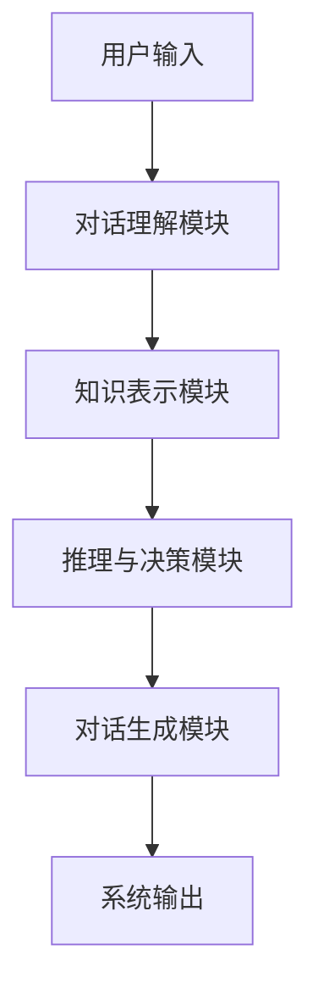

                 


# 从零构建AI Agent的目标导向对话系统

> 关键词：AI Agent，目标导向对话，自然语言处理，强化学习，对话系统

> 摘要：本文将详细讲解从零构建一个基于目标导向的AI对话系统的完整过程，涵盖从理论基础到实际应用的各个层面。通过系统化的分析与设计，结合具体的技术实现和代码示例，读者将能够掌握构建此类系统的关键技术和实践方法。

---

## 第一章: AI Agent与目标导向对话系统概述

### 1.1 AI Agent的基本概念

AI Agent（人工智能代理）是指能够感知环境、自主决策并采取行动的智能体。它通过与用户交互，理解用户需求，并通过内部逻辑和知识库生成相应的响应。

#### 1.1.1 什么是AI Agent
AI Agent是一种能够执行特定任务的智能系统，具备以下核心特征：
- **自主性**：能够在没有外部干预的情况下运行。
- **反应性**：能够感知环境并实时调整行为。
- **目标导向性**：通过设定目标来指导行动。

#### 1.1.2 AI Agent的核心特征
- **自主性**：AI Agent能够独立决策，无需人工干预。
- **反应性**：能够实时感知环境变化并做出反应。
- **目标导向性**：通过设定和优化目标来实现任务。

#### 1.1.3 目标导向对话的定义
目标导向对话是指在对话过程中，系统始终围绕一个明确的目标进行，确保对话内容与目标相关，从而提高对话效率和准确性。

---

### 1.2 目标导向对话系统的应用场景

目标导向对话系统广泛应用于多个领域，包括：
- **客服系统**：帮助用户解决问题，提高客户满意度。
- **智能助手**：如 Siri、Alexa 等，能够执行多种目标导向的任务。
- **教育辅助**：为学生提供个性化的学习建议和指导。

#### 1.2.1 什么是目标导向对话
目标导向对话是指在对话过程中，系统始终围绕一个明确的目标进行，确保对话内容与目标相关，从而提高对话效率和准确性。

#### 1.2.2 目标导向对话的分类
- **任务型对话**：以完成特定任务为目标，如预订机票、酒店等。
- **信息型对话**：以获取信息为目标，如查询天气、新闻等。
- **混合型对话**：结合任务和信息的对话，如在任务执行过程中需要获取相关信息。

#### 1.2.3 目标导向对话系统的应用领域
目标导向对话系统可以应用于多个领域，包括客服、教育、医疗、金融等，帮助用户快速解决问题，提高效率。

---

### 1.3 为什么需要构建目标导向对话系统

#### 1.3.1 当前对话系统的局限性
传统的对话系统往往缺乏明确的目标，导致对话效率低下，用户体验不佳。

#### 1.3.2 目标导向对话的优势
- **提高效率**：通过明确的目标，减少无效对话。
- **提升用户体验**：用户能够更快地完成任务，提高满意度。
- **增强智能性**：通过目标导向，系统能够更智能地理解用户需求。

#### 1.3.3 构建目标导向对话系统的必要性
随着人工智能技术的发展，目标导向对话系统已成为提升用户体验和效率的重要手段。

---

## 第二章: 目标导向对话系统的技术背景

### 2.1 自然语言处理技术

自然语言处理（NLP）是实现目标导向对话系统的核心技术之一。

#### 2.1.1 NLP的基本概念
自然语言处理是指计算机对人类语言的处理和理解，包括文本的分析、理解和生成。

#### 2.1.2 NLP的核心技术
- **文本预处理**：包括分词、词干提取、停用词去除等。
- **特征提取**：通过词袋模型、TF-IDF 等方法提取文本特征。
- **文本分类**：将文本分为不同类别，如垃圾邮件分类。
- **文本生成**：通过语言模型生成自然语言文本。

#### 2.1.3 NLP在目标导向对话中的应用
- **对话理解**：通过NLP技术理解用户意图。
- **对话生成**：通过NLP技术生成系统回应。

---

### 2.2 强化学习与对话策略

强化学习是目标导向对话系统中常用的策略优化方法。

#### 2.2.1 强化学习的基本概念
强化学习是一种通过试错机制，学习最优策略的方法，适用于目标导向对话中的决策过程。

#### 2.2.2 对话策略的定义与分类
- **策略**：指系统在给定状态下选择动作的规则。
- **基于规则的策略**：通过预定义的规则进行决策。
- **基于模型的策略**：通过学习模型生成策略。

#### 2.2.3 强化学习在对话策略中的应用
- **策略梯度方法**：通过优化策略参数，最大化奖励函数。
- **Q-learning**：通过学习状态-动作价值函数，选择最优动作。

---

### 2.3 知识图谱与对话理解

知识图谱是目标导向对话系统中重要的知识表示方法。

#### 2.3.1 知识图谱的基本概念
知识图谱是一种结构化的知识表示方法，由实体和关系组成，能够表示复杂的语义信息。

#### 2.3.2 知识图谱在对话理解中的作用
- **实体识别**：识别对话中的实体，如人名、地名等。
- **关系抽取**：提取实体之间的关系，理解对话中的语义。
- **知识推理**：基于知识图谱进行推理，回答复杂问题。

#### 2.3.3 知识图谱构建与应用
- **知识图谱构建**：通过爬取、清洗和结构化处理，构建领域知识图谱。
- **知识图谱应用**：在对话系统中，通过查询知识图谱，生成准确的对话响应。

---

## 第三章: 目标导向对话系统的构建目标

### 3.1 明确对话目标

#### 3.1.1 确定对话目标的方法
- **用户需求分析**：通过用户调研、数据分析等方式，明确用户需求。
- **任务分解**：将复杂任务分解为多个子任务，明确每个子任务的目标。
- **目标优先级排序**：根据任务的重要性和紧急性，排序目标的优先级。

#### 3.1.2 目标分解与优先级排序
- **任务分解**：将复杂任务分解为多个子任务，明确每个子任务的目标。
- **优先级排序**：根据任务的重要性和紧急性，排序目标的优先级。

#### 3.1.3 目标与对话流程的关系
- **目标驱动对话流程**：对话流程的设计应围绕目标展开，确保每个对话步骤都与目标相关。
- **动态调整对话流程**：根据对话过程中的反馈，动态调整对话流程，确保目标的实现。

---

### 3.2 对话目标与用户需求的匹配

#### 3.2.1 用户需求的分析与提取
- **需求分析**：通过用户输入，提取用户的显式和隐式需求。
- **需求提取**：利用NLP技术，从用户输入中提取关键信息。

#### 3.2.2 目标导向对话中的需求匹配
- **需求匹配**：将用户需求与系统目标进行匹配，确保对话内容与目标相关。
- **需求反馈**：根据用户需求，动态调整对话目标。

#### 3.2.3 需求匹配的实现方法
- **基于关键词匹配**：通过关键词匹配，确定用户需求与系统目标的相关性。
- **基于语义匹配**：通过语义分析，理解用户需求的深层含义，进行精准匹配。

---

### 3.3 对话目标的动态调整

#### 3.3.1 动态目标调整的必要性
- **对话情境变化**：对话过程中，用户需求或对话目标可能发生变化。
- **系统反馈**：根据对话过程中的反馈，调整对话目标。

#### 3.3.2 动态目标调整的实现方法
- **基于反馈的调整**：根据用户反馈，动态调整对话目标。
- **基于上下文的调整**：根据对话上下文，调整对话目标。

#### 3.3.3 动态目标调整的优化策略
- **实时监测**：实时监测对话过程，捕捉目标变化的信号。
- **灵活调整**：根据目标变化，快速调整对话策略，确保对话目标的实现。

---

## 第四章: 对话模型与算法原理

### 4.1 基于强化学习的对话模型

#### 4.1.1 强化学习在对话模型中的应用
- **策略梯度方法**：通过优化策略参数，最大化奖励函数。
- **Q-learning**：通过学习状态-动作价值函数，选择最优动作。

#### 4.1.2 基于策略梯度的对话模型
- **策略梯度方法**：通过优化策略参数，最大化奖励函数。
- **Actor-Critic 架构**：通过Actor网络生成动作，Critic网络评估动作的价值。

#### 4.1.3 基于Q-learning的对话模型
- **Q-learning方法**：通过学习状态-动作价值函数，选择最优动作。
- **经验回放**：通过存储经验，增强学习效果。

---

### 4.2 基于预训练语言模型的对话系统

#### 4.2.1 预训练语言模型的基本原理
- **预训练语言模型**：如BERT、GPT等，通过大量数据预训练，学习语言的语义表示。
- **微调**：根据具体任务，对预训练模型进行微调，适应特定领域的需求。

#### 4.2.2 基于预训练模型的对话生成
- **对话生成**：通过预训练语言模型，生成自然语言对话文本。
- **目标导向生成**：在生成对话时，考虑目标导向的约束条件。

#### 4.2.3 预训练模型的微调与优化
- **微调**：根据具体任务，对预训练模型进行微调，适应特定领域的需求。
- **优化策略**：通过优化模型参数，提升目标导向对话的效果。

---

### 4.3 对话策略优化算法

#### 4.3.1 对话策略优化算法的分类
- **基于规则的策略优化**：通过预定义的规则，优化对话策略。
- **基于模型的策略优化**：通过学习模型，优化对话策略。

#### 4.3.2 基于强化学习的策略优化
- **策略梯度方法**：通过优化策略参数，最大化奖励函数。
- **Q-learning方法**：通过学习状态-动作价值函数，选择最优动作。

#### 4.3.3 基于知识图谱的策略优化
- **知识图谱的应用**：通过知识图谱，增强对话策略的语义理解能力。
- **知识推理的应用**：通过知识推理，优化对话策略的决策过程。

---

## 第五章: 对话系统的知识表示与推理

### 5.1 知识图谱的构建与应用

#### 5.1.1 知识图谱的构建
- **数据采集**：通过爬取、清洗和结构化处理，构建领域知识图谱。
- **知识抽取**：从文本中抽取实体和关系，构建知识图谱。
- **知识融合**：将多个来源的知识进行融合，构建完整的知识图谱。

#### 5.1.2 知识图谱在对话系统中的应用
- **实体识别**：识别对话中的实体，如人名、地名等。
- **关系抽取**：提取实体之间的关系，理解对话中的语义。
- **知识推理**：基于知识图谱进行推理，回答复杂问题。

---

### 5.2 对话系统的推理机制

#### 5.2.1 对话系统的推理机制
- **基于知识图谱的推理**：通过查询知识图谱，生成准确的对话响应。
- **基于规则的推理**：通过预定义的规则，进行推理和决策。
- **基于模型的推理**：通过学习模型，进行推理和决策。

#### 5.2.2 推理机制的优化
- **知识图谱的优化**：通过优化知识图谱的结构和内容，提升推理的准确性和效率。
- **推理算法的优化**：通过改进推理算法，提升推理的效率和准确性。

---

## 第六章: 对话系统的系统设计与实现

### 6.1 系统架构设计

#### 6.1.1 系统架构设计概述
- **模块化设计**：将系统划分为多个模块，如对话理解、对话生成、知识表示等。
- **模块间的交互**：通过模块间的协作，实现系统的整体功能。

#### 6.1.2 系统功能模块设计
- **对话理解模块**：负责理解用户输入的对话内容，提取用户意图。
- **对话生成模块**：根据用户意图，生成系统的对话响应。
- **知识表示模块**：负责知识图谱的构建和管理，支持对话过程中的知识推理。
- **推理与决策模块**：根据对话内容和知识图谱，进行推理和决策，指导对话流程。

#### 6.1.3 系统架构图



---

### 6.2 对话系统的实现

#### 6.2.1 环境安装与配置
- **Python环境**：安装Python 3.8 或更高版本。
- **依赖库安装**：安装必要的依赖库，如numpy、pandas、scikit-learn等。
- **预训练语言模型**：下载并安装预训练语言模型，如BERT、GPT等。

#### 6.2.2 系统核心实现

```python
class DialogSystem:
    def __init__(self):
        self.nlp_model = self.initialize_nlp_model()
        self.knowledge_graph = self.initialize_knowledge_graph()
        self.dialog_strategy = self.initialize_dialog_strategy()

    def initialize_nlp_model(self):
        # 初始化自然语言处理模型
        pass

    def initialize_knowledge_graph(self):
        # 初始化知识图谱
        pass

    def initialize_dialog_strategy(self):
        # 初始化对话策略
        pass

    def process_input(self, input_text):
        # 处理用户输入
        pass

    def generate_response(self, input_text):
        # 生成系统响应
        pass
```

---

## 第七章: 对话系统的优化与扩展

### 7.1 对话系统的优化策略

#### 7.1.1 对话系统的优化目标
- **提高对话效率**：减少无效对话，加快对话速度。
- **提升对话质量**：生成更准确、更自然的对话内容。
- **增强系统智能性**：通过优化算法和知识表示，提升系统的智能性。

#### 7.1.2 对话系统的优化方法
- **算法优化**：通过改进算法，提升对话系统的性能。
- **知识图谱优化**：通过优化知识图谱的结构和内容，提升对话系统的智能性。
- **系统调优**：通过系统调优，提升对话系统的运行效率。

---

### 7.2 对话系统的扩展方向

#### 7.2.1 扩展方向概述
- **多轮对话**：支持更长的对话流程，增强系统的对话能力。
- **多语言支持**：支持多种语言的对话，扩大系统的应用范围。
- **情感分析**：通过情感分析，提升对话系统的用户体验。

#### 7.2.2 对话系统的扩展实现
- **多轮对话**：通过维护对话上下文，实现多轮对话。
- **多语言支持**：通过多语言NLP模型，支持多种语言的对话。
- **情感分析**：通过情感分析技术，理解用户情感，生成更贴心的对话响应。

---

## 第八章: 对话系统的实际应用案例

### 8.1 对话系统的实际应用

#### 8.1.1 应用案例概述
- **智能客服**：通过目标导向对话系统，实现智能客服的自动化。
- **智能助手**：通过目标导向对话系统，为用户提供个性化的服务。
- **教育辅助**：通过目标导向对话系统，为学生提供个性化的学习支持。

#### 8.1.2 应用案例分析
- **智能客服**：通过目标导向对话系统，实现智能客服的自动化，提高客户满意度。
- **智能助手**：通过目标导向对话系统，为用户提供个性化的服务，提升用户体验。
- **教育辅助**：通过目标导向对话系统，为学生提供个性化的学习支持，提高学习效率。

---

## 第九章: 总结与展望

### 9.1 总结

#### 9.1.1 从零构建目标导向对话系统的总结
- **系统构建过程**：从需求分析、系统设计到实现和优化，详细介绍了目标导向对话系统的构建过程。
- **关键技术应用**：重点介绍了自然语言处理、强化学习、知识图谱等关键技术的应用。
- **系统实现与优化**：通过具体的代码实现和优化策略，展示了如何构建高效的目标导向对话系统。

#### 9.1.2 目标导向对话系统的应用价值
- **提高效率**：通过明确的目标，减少无效对话，提高对话效率。
- **提升用户体验**：通过目标导向对话，为用户提供更精准的服务，提升用户体验。
- **增强智能性**：通过知识图谱和强化学习，增强系统的智能性，提升对话质量。

---

### 9.2 展望

#### 9.2.1 未来发展方向
- **多模态对话**：结合视觉、听觉等多种模态信息，提升对话系统的智能化水平。
- **自适应对话**：通过自适应学习，提升对话系统的灵活性和适应性。
- **人机协作**：通过人机协作，实现更高效的对话体验。

#### 9.2.2 对话系统技术的未来发展
- **更智能的对话模型**：通过更先进的算法和模型，提升对话系统的智能性。
- **更广泛的应用场景**：将目标导向对话系统应用于更多的领域，如医疗、法律等。
- **更高效的对话优化**：通过优化算法和系统架构，提升对话系统的运行效率。

---

## 作者：AI天才研究院/AI Genius Institute & 禅与计算机程序设计艺术 /Zen And The Art of Computer Programming

---

希望这篇文章能够帮助读者从零开始，逐步构建一个高效的目标导向AI对话系统，掌握相关的技术和实践方法。

