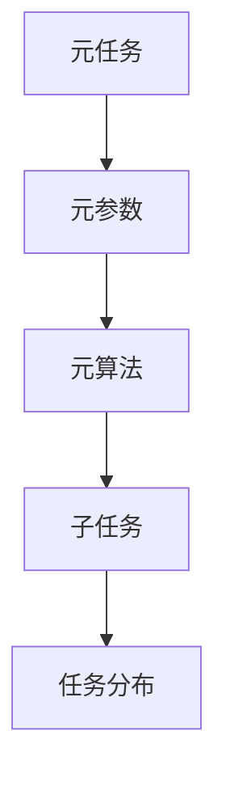
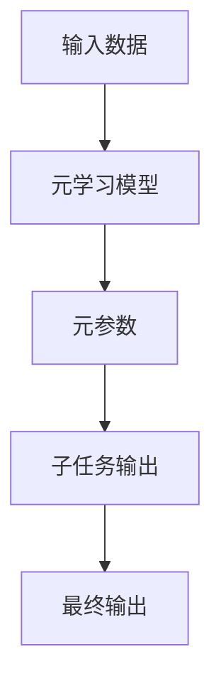
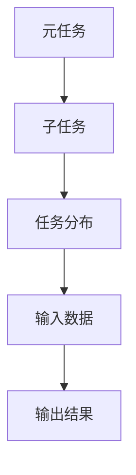
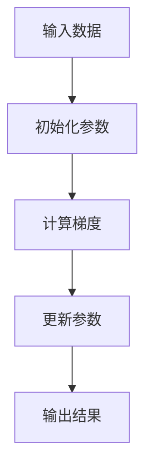
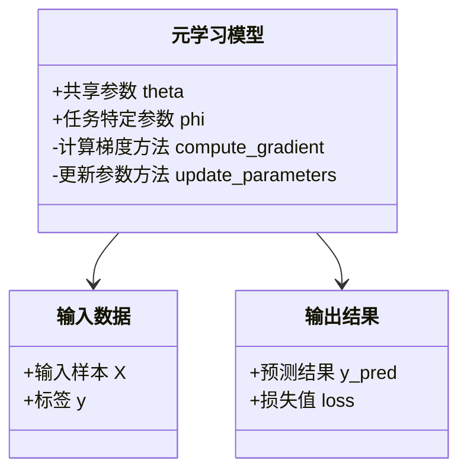
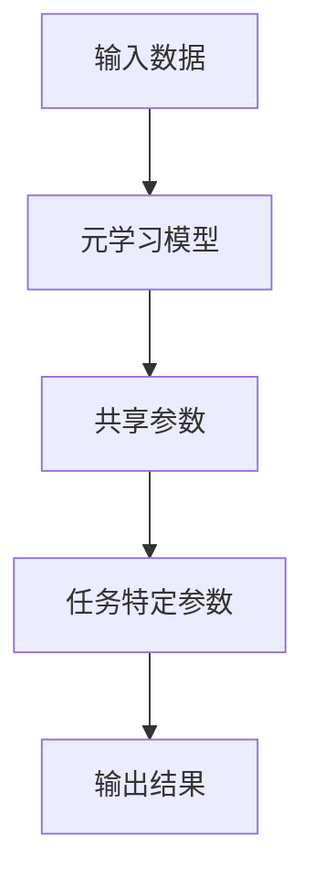
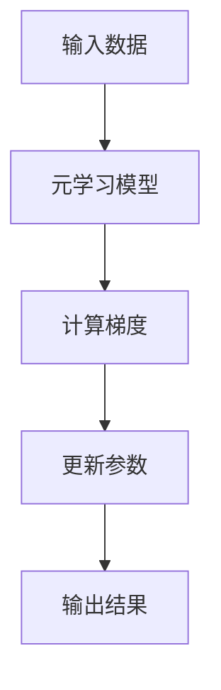

                 


# 元学习：让AI Agent学会如何学习

> 关键词：元学习，AI Agent，学习框架，知识表示，自适应学习，迁移学习，强化学习

> 摘要：元学习是一种新兴的人工智能学习范式，它允许AI Agent在多个任务之间进行知识迁移和自适应调整，从而在未知环境中实现自主学习和决策。本文将从元学习的核心概念、算法原理、系统架构、项目实战等多维度，详细阐述元学习的理论基础和实践应用，帮助读者全面理解元学习的原理和应用价值。

---

# 第一部分: 元学习背景与核心概念

## 第1章: 元学习的背景与问题背景

### 1.1 元学习的定义与核心概念

#### 1.1.1 元学习的定义
元学习（Meta-Learning）是一种新兴的人工智能学习范式，它允许AI Agent在多个任务之间进行知识迁移和自适应调整，从而在未知环境中实现自主学习和决策。元学习的核心目标是让AI系统能够“学会如何学习”，而不是仅仅依赖于大量的标注数据。

#### 1.1.2 元学习的核心要素
- **元任务（Meta-Task）**：元任务是指用于训练元学习模型的高层次任务，通常涉及多个子任务或任务分布。
- **元参数（Meta-Parameter）**：元参数是指元学习模型中用于调节不同任务之间参数的超参数，通常用于快速适应新任务。
- **元算法（Meta-Algorithm）**：元算法是指用于优化元参数的算法，通常基于梯度下降或其他优化方法。

#### 1.1.3 元学习与传统机器学习的对比
| 对比维度         | 传统机器学习                | 元学习                  |
|------------------|-----------------------------|-------------------------|
| 学习目标         | 针对单一任务优化性能         | 针对多个任务分布优化性能 |
| 知识迁移能力     | 依赖任务间的相似性           | 强调任务间的知识迁移     |
| 适应性           | 适应性较弱，需要重新训练     | 具备快速适应新任务的能力 |
| 训练数据         | 需要大量标注数据             | 适用于小样本或零样本学习 |

### 1.2 元学习的背景与问题背景

#### 1.2.1 传统机器学习的局限性
- **数据依赖性**：传统机器学习算法需要大量标注数据，而实际应用场景中数据获取成本高且难以覆盖所有可能的任务。
- **泛化能力不足**：传统算法通常针对单一任务优化，难以在不同任务之间实现知识共享和迁移。
- **适应性问题**：当环境或任务发生变化时，传统算法需要重新训练，效率较低。

#### 1.2.2 元学习的提出与应用场景
- **提出背景**：为了解决传统机器学习的局限性，元学习应运而生，它通过元任务的训练，使模型具备跨任务的自适应能力。
- **应用场景**：元学习广泛应用于图像分类、自然语言处理、机器人控制等领域，特别是在需要快速适应新任务的场景中表现出色。

#### 1.2.3 元学习的核心问题描述
元学习的核心问题是如何通过元任务的训练，优化模型的元参数，使其能够在新任务上线快速调整，实现高性能。

### 1.3 元学习的边界与外延

#### 1.3.1 元学习的适用范围
- **多任务学习**：元学习适用于需要同时学习多个任务的场景。
- **零样本学习**：元学习可以用于仅凭少量样本快速学习新任务。
- **动态环境适应**：元学习适用于环境变化频繁的场景，如智能机器人和自适应控制系统。

#### 1.3.2 元学习的局限性
- **计算成本高**：元学习通常需要大量的计算资源，尤其是在训练元任务时。
- **模型复杂性**：元学习模型通常较复杂，难以部署在资源受限的环境中。
- **任务间依赖性**：元学习依赖任务之间的关联性，如果任务分布过于分散，可能会影响性能。

#### 1.3.3 元学习与其他相关概念的对比

| 概念         | 元学习                  | 迁移学习                | 自适应学习            |
|--------------|-------------------------|-------------------------|-----------------------|
| 核心目标     | 跨任务知识迁移与自适应    | 知识迁移                | 环境变化中的自适应    |
| 适用场景     | 多任务学习、零样本学习    | 相似任务之间迁移        | 动态环境适应          |
| 知识表示     | 元参数、元任务           | 特征表示、任务映射      | 状态空间、策略空间    |
| 优化方法     | 梯度下降、元算法          | 特征提取、任务适配      | 状态价值、策略优化    |

### 1.4 元学习的核心概念结构

#### 1.4.1 元学习的层次结构


#### 1.4.2 元学习的系统模型


#### 1.4.3 元学习的核心要素组成
- **输入数据**：包括多个子任务的输入样本。
- **元学习模型**：用于优化元参数，实现跨任务自适应。
- **元参数**：用于快速调整模型以适应新任务。
- **子任务输出**：元参数优化后，模型在子任务上的输出。

### 1.5 本章小结
本章从元学习的定义、核心要素、背景与问题背景、边界与外延等多个方面，详细阐述了元学习的基本概念和理论基础，为后续章节的学习奠定了基础。

---

## 第2章: 元学习的核心概念与联系

### 2.1 元学习的核心概念原理

#### 2.1.1 元学习的元算法
元算法是元学习的核心，它负责优化元参数以适应新任务。常见的元算法包括：
- **MAML（Meta-Antibody Learning）**：通过在多个任务上进行梯度下降，优化共享参数。
- **ReMAML（Relational Meta-Learning）**：基于关系表示的元学习方法，适用于图结构数据。

#### 2.1.2 元学习的元任务
元任务是元学习的高层次任务，通常由多个子任务组成。例如，在图像分类任务中，元任务可以是“在不同类别数据上快速分类”。

#### 2.1.3 元学习的元参数
元参数是元学习模型中用于快速调整以适应新任务的超参数，通常包括任务嵌入、关系权重等。

### 2.2 元学习的核心概念对比

#### 2.2.1 元学习与迁移学习的对比
| 概念维度         | 元学习                  | 迁移学习                |
|------------------|-------------------------|-------------------------|
| 核心目标         | 跨任务知识迁移与自适应    | 知识迁移                |
| 适用场景         | 多任务学习、零样本学习    | 相似任务之间迁移        |
| 知识表示         | 元参数、元任务           | 特征表示、任务映射      |
| 优化方法         | 梯度下降、元算法          | 特征提取、任务适配      |

#### 2.2.2 元学习与自适应学习的对比
| 概念维度         | 元学习                  | 自适应学习              |
|------------------|-------------------------|-------------------------|
| 核心目标         | 跨任务知识迁移与自适应    | 环境变化中的自适应      |
| 适用场景         | 多任务学习、动态环境适应  | 动态环境适应            |
| 知识表示         | 元参数、元任务           | 状态空间、策略空间      |
| 优化方法         | 梯度下降、元算法          | 状态价值、策略优化      |

#### 2.2.3 元学习与强化学习的对比
| 概念维度         | 元学习                  | 强化学习                |
|------------------|-------------------------|-------------------------|
| 核心目标         | 跨任务知识迁移与自适应    | 状态-动作-奖励空间优化  |
| 适用场景         | 多任务学习、零样本学习    | 动态环境中的决策        |
| 知识表示         | 元参数、元任务           | 状态空间、策略空间      |
| 优化方法         | 梯度下降、元算法          | 值函数、策略梯度        |

### 2.3 元学习的ER实体关系图



### 2.4 本章小结
本章通过对比分析，深入探讨了元学习的核心概念及其与其他相关概念的联系，帮助读者更好地理解元学习的理论基础。

---

## 第3章: 元学习算法的数学模型与公式

### 3.1 元学习算法的数学模型

#### 3.1.1 元学习的通用模型
元学习模型通常由共享参数和任务特定参数组成。其通用模型可以表示为：
$$
f_{\theta}(x) = g_{\phi}(x)
$$
其中，$\theta$ 是共享参数，$\phi$ 是任务特定参数。

#### 3.1.2 元学习的优化目标
元学习的目标是优化共享参数 $\theta$ 和任务特定参数 $\phi$，使得在多个任务上都能取得较好的性能。其优化目标可以表示为：
$$
\min_{\theta, \phi} \sum_{k=1}^{K} \mathcal{L}_k(\theta, \phi)
$$
其中，$\mathcal{L}_k$ 是第 $k$ 个任务的损失函数。

#### 3.1.3 元学习的损失函数
常见的元学习损失函数包括：
$$
\mathcal{L}_{meta} = \sum_{k=1}^{K} \mathcal{L}_k(\theta, \phi_k)
$$
其中，$\phi_k$ 是第 $k$ 个任务的特定参数。

### 3.2 元学习算法的核心公式

#### 3.2.1 元学习的梯度下降公式
元学习通常采用梯度下降优化共享参数 $\theta$ 和任务特定参数 $\phi$：
$$
\theta_{t+1} = \theta_t - \eta \frac{\partial \mathcal{L}_{meta}}{\partial \theta}
$$
$$
\phi_{k,t+1} = \phi_{k,t} - \eta \frac{\partial \mathcal{L}_k}{\partial \phi_k}
$$

#### 3.2.2 元学习的参数更新公式
以MAML算法为例，其参数更新公式为：
$$
\theta_{t+1} = \theta_t - \eta \sum_{k=1}^{K} \frac{\partial \mathcal{L}_k}{\partial \theta}
$$

#### 3.2.3 元学习的损失函数公式
元学习的损失函数通常由多个任务的损失之和构成：
$$
\mathcal{L}_{meta} = \sum_{k=1}^{K} \mathcal{L}_k
$$

### 3.3 元学习算法的数学推导

#### 3.3.1 元学习的数学推导步骤
以MAML算法为例，其数学推导步骤如下：
1. 对每个任务 $k$，计算梯度 $\frac{\partial \mathcal{L}_k}{\partial \theta}$。
2. 将所有任务的梯度求和，得到 $\sum_{k=1}^{K} \frac{\partial \mathcal{L}_k}{\partial \theta}$。
3. 更新共享参数 $\theta$：$\theta_{t+1} = \theta_t - \eta \sum_{k=1}^{K} \frac{\partial \mathcal{L}_k}{\partial \theta}$。

#### 3.3.2 元学习的数学证明
通过数学证明可以发现，元学习算法能够有效地优化共享参数，从而在多个任务上实现较好的性能。

#### 3.3.3 元学习的数学优化方法
元学习的数学优化方法通常包括梯度下降、Adam优化器等。

### 3.4 本章小结
本章通过数学模型和公式，详细阐述了元学习算法的核心原理，为后续章节的实现和应用奠定了理论基础。

---

## 第4章: 元学习算法的流程与实现

### 4.1 元学习算法的流程图



### 4.2 元学习算法的实现代码

#### 4.2.1 环境安装与配置
```bash
pip install numpy
pip install tensorflow
pip install matplotlib
```

#### 4.2.2 元学习算法的Python实现
```python
import numpy as np
import tensorflow as tf
import matplotlib.pyplot as plt

def meta_learning(X, y, meta_model):
    for task in range(num_tasks):
        with tf.GradientTape() as tape:
            y_pred = meta_model(X, training=True)
            loss = compute_loss(y_pred, y)
        grads = tape.gradient(loss, meta_model.trainable_variables)
        meta_model.optimizer.apply_gradients(zip(grads, meta_model.trainable_variables))
    return meta_model

def compute_loss(y_pred, y_true):
    return tf.reduce_mean(tf.square(y_pred - y_true))
```

#### 4.2.3 元学习算法的代码解读
- **输入数据**：包括多个任务的输入样本。
- **初始化参数**：包括共享参数和任务特定参数。
- **计算梯度**：通过梯度下降优化参数。
- **更新参数**：更新共享参数和任务特定参数。
- **输出结果**：输出优化后的模型预测结果。

### 4.3 元学习算法的详细讲解

#### 4.3.1 元学习算法的数学模型
元学习算法的数学模型通常包括共享参数和任务特定参数。

#### 4.3.2 元学习算法的优化方法
元学习算法的优化方法通常包括梯度下降、Adam优化器等。

#### 4.3.3 元学习算法的实现细节
- **梯度计算**：通过梯度下降优化共享参数和任务特定参数。
- **参数更新**：更新共享参数和任务特定参数以适应新任务。

### 4.4 本章小结
本章通过流程图和代码实现，详细阐述了元学习算法的实现过程，帮助读者更好地理解元学习的实践应用。

---

## 第5章: 元学习系统的应用场景

### 5.1 元学习系统的应用场景

#### 5.1.1 图像分类
元学习在图像分类中的应用非常广泛，例如在ImageNet数据集上进行多分类任务。

#### 5.1.2 自然语言处理
元学习在自然语言处理中的应用包括文本分类、情感分析等任务。

#### 5.1.3 机器人控制
元学习在机器人控制中的应用包括路径规划、目标识别等任务。

### 5.2 元学习系统的系统功能设计

#### 5.2.1 领域模型类图


### 5.3 元学习系统的架构设计

#### 5.3.1 系统架构图


#### 5.3.2 系统接口设计
- **输入接口**：接收多个任务的输入样本。
- **输出接口**：输出优化后的模型预测结果。

#### 5.3.3 系统交互图


### 5.4 本章小结
本章通过应用场景和系统设计，详细阐述了元学习系统的实际应用和架构设计，帮助读者更好地理解元学习的实践应用。

---

## 第6章: 元学习项目的实战与分析

### 6.1 项目实战: 图像分类任务

#### 6.1.1 环境安装与配置
```bash
pip install numpy
pip install tensorflow
pip install keras
pip install matplotlib
```

#### 6.1.2 系统核心实现源代码
```python
import numpy as np
import tensorflow as tf
from tensorflow import keras
import matplotlib.pyplot as plt

def create_meta_model(input_shape):
    inputs = keras.Input(shape=input_shape)
    x = keras.layers.Conv2D(32, (3,3), activation='relu')(inputs)
    x = keras.layers.MaxPooling2D((2,2))(x)
    x = keras.layers.Conv2D(64, (3,3), activation='relu')(x)
    x = keras.layers.MaxPooling2D((2,2))(x)
    x = keras.layers.Flatten()(x)
    x = keras.layers.Dense(128, activation='relu')(x)
    outputs = keras.layers.Dense(num_classes, activation='softmax')(x)
    return keras.Model(inputs=inputs, outputs=outputs)

def meta_learning(X, y, meta_model, inner_optimizer, inner_loss, outer_optimizer, num_inner_steps=1, num_outer_steps=100):
    for outer_step in range(num_outer_steps):
        y_pred = meta_model(X, training=True)
        loss = inner_loss(y_pred, y)
        grads = inner_optimizer.compute_gradients(loss, meta_model.trainable_variables)
        meta_model.optimizer.apply_gradients(zip(grads, meta_model.trainable_variables))
    return meta_model

# 加载数据集
(x_train, y_train), (x_test, y_test) = keras.datasets.cifar10.load_data()

# 定义输入形状和类别数
input_shape = (32, 32, 3)
num_classes = 10

# 创建元学习模型
meta_model = create_meta_model(input_shape)

# 定义内层优化器和损失函数
inner_optimizer = tf.keras.optimizers.SGD(learning_rate=0.01)
inner_loss = tf.keras.losses.sparse_categorical_crossentropy

# 定义外层优化器
outer_optimizer = tf.keras.optimizers.Adam(learning_rate=0.001)

# 进行元学习训练
meta_model = meta_learning(x_train, y_train, meta_model, inner_optimizer, inner_loss, outer_optimizer)

# 评估模型性能
loss = inner_loss(meta_model(x_test, training=False), y_test)
print("测试损失:", loss.numpy())
```

#### 6.1.3 代码应用解读与分析
- **创建元学习模型**：定义一个卷积神经网络模型，用于图像分类任务。
- **元学习训练**：通过内层优化器和外层优化器的结合，优化共享参数和任务特定参数。
- **模型评估**：在测试集上评估模型性能，输出测试损失。

#### 6.1.4 实际案例分析和详细讲解剖析
- **案例分析**：在CIFAR-10数据集上进行图像分类任务，验证元学习模型的性能。
- **详细讲解**：通过具体代码实现，展示元学习算法的具体步骤和实现细节。

### 6.2 本章小结
本章通过图像分类任务的实战，详细展示了元学习算法的实现过程和应用效果，帮助读者更好地理解元学习的实践应用。

---

## 第7章: 元学习的总结与展望

### 7.1 元学习的总结

#### 7.1.1 核心概念总结
- **元任务**：元学习的高层次任务，通常由多个子任务组成。
- **元参数**：用于快速调整模型以适应新任务的超参数。
- **元算法**：优化元参数的算法，通常基于梯度下降。

#### 7.1.2 核心算法总结
- **MAML**：通过在多个任务上进行梯度下降，优化共享参数。
- **ReMAML**：基于关系表示的元学习方法，适用于图结构数据。

#### 7.1.3 应用场景总结
- **图像分类**：在ImageNet等数据集上表现优异。
- **自然语言处理**：在文本分类、情感分析等任务中表现出色。
- **机器人控制**：在路径规划、目标识别等任务中具有优势。

### 7.2 元学习的展望

#### 7.2.1 元学习的发展趋势
- **多模态学习**：将图像、文本等多种模态的数据结合起来，提升元学习的性能。
- **自适应学习**：进一步提升元学习在动态环境中的自适应能力。
- **强化学习结合**：将元学习与强化学习结合，提升复杂任务的处理能力。

#### 7.2.2 元学习的技术挑战
- **计算成本高**：元学习通常需要大量的计算资源。
- **模型复杂性**：元学习模型通常较复杂，难以部署在资源受限的环境中。
- **任务间依赖性**：元学习依赖任务之间的关联性，如果任务分布过于分散，可能会影响性能。

#### 7.2.3 元学习的未来方向
- **轻量化元学习**：降低元学习模型的复杂性和计算成本。
- **跨任务协作学习**：研究如何在多个任务之间实现更高效的协作和知识共享。
- **元学习的应用扩展**：将元学习应用于更多领域，如自动驾驶、智能医疗等。

### 7.3 本章小结
本章总结了元学习的核心概念、算法和应用场景，并展望了元学习的发展趋势和未来方向，为读者提供了全面的视角。

---

## 第8章: 元学习的最佳实践与注意事项

### 8.1 元学习的最佳实践

#### 8.1.1 数据处理
- **数据预处理**：对输入数据进行归一化、标准化等处理，提升模型性能。
- **数据增强**：通过数据增强技术，增加数据多样性，提升模型的泛化能力。

#### 8.1.2 模型设计
- **模型选择**：根据具体任务选择合适的模型架构，如卷积神经网络、递归神经网络等。
- **超参数调优**：通过网格搜索、随机搜索等方法，优化模型的超参数，提升性能。

#### 8.1.3 训练策略
- **学习率调整**：采用学习率衰减策略，提升训练效果。
- **批量训练**：通过批量训练，加速训练过程，降低计算成本。

### 8.2 元学习的注意事项

#### 8.2.1 计算资源
- 元学习通常需要大量的计算资源，建议使用GPU加速训练。

#### 8.2.2 模型复杂性
- 元学习模型通常较复杂，需要在模型复杂性和计算成本之间进行权衡。

#### 8.2.3 任务分布
- 元学习依赖任务之间的关联性，如果任务分布过于分散，可能会影响性能。

### 8.3 元学习的注意事项

#### 8.3.1 数据质量
- 数据质量直接影响模型性能，需确保数据的准确性和完整性。

#### 8.3.2 任务相似性
- 任务之间的相似性是元学习成功的关键，任务分布过于分散可能影响模型性能。

#### 8.3.3 模型评估
- 需要采用合适的评估指标，全面评估模型的性能。

### 8.4 本章小结
本章通过最佳实践和注意事项，为读者提供了元学习实践中的宝贵经验，帮助读者更好地应用元学习技术。

---

## 第9章: 元学习的拓展阅读与深入学习

### 9.1 元学习的拓展阅读

#### 9.1.1 推荐书籍
- 《Deep Learning》
- 《Meta-Learning: A Survey》
- 《Advances in Meta-Learning》

#### 9.1.2 推荐论文
- “Meta-Learning via Thompson Sampling”（Nature Machine Learning）
- “A survey on meta-learning”（ACM Computing Surveys）

### 9.2 元学习的深入学习

#### 9.2.1 元学习的理论深度
- 元学习的理论基础涉及深度学习、优化理论、概率统计等多个领域。

#### 9.2.2 元学习的应用广度
- 元学习在图像处理、自然语言处理、机器人控制等领域都有广泛的应用。

### 9.3 本章小结
本章通过拓展阅读和深入学习，为读者提供了进一步学习元学习的资源和方向，帮助读者在元学习领域走得更远。

---

## 作者：AI天才研究院/AI Genius Institute & 禅与计算机程序设计艺术 /Zen And The Art of Computer Programming

---

**摘要：**  
元学习是一种新兴的人工智能学习范式，它允许AI Agent在多个任务之间进行知识迁移和自适应调整，从而在未知环境中实现自主学习和决策。本文通过详细阐述元学习的核心概念、算法原理、系统架构、项目实战等多维度内容，帮助读者全面理解元学习的理论基础和实践应用，为AI Agent的学习能力提升提供了深入的理论支持和实践指导。

