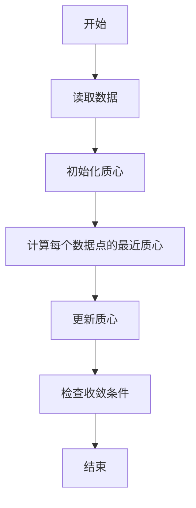
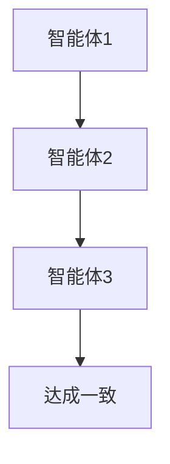
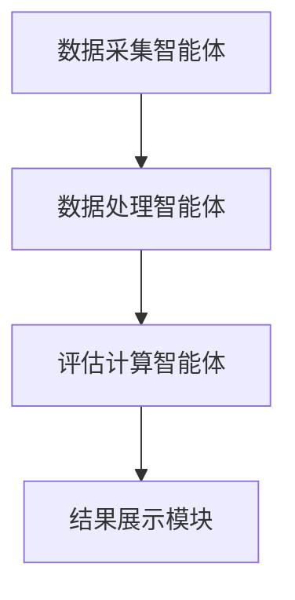
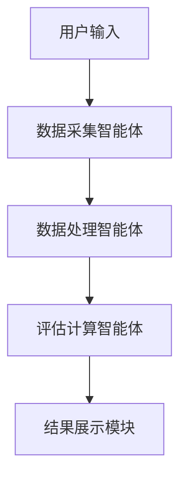

                 


# 多智能体系统在公司治理评估中的应用

> 关键词：多智能体系统、公司治理评估、分布式计算、协作算法、系统架构

> 摘要：多智能体系统是一种分布式计算范式，通过多个智能体的协作来解决复杂问题。在公司治理评估中，多智能体系统能够通过分布式计算和协作算法，提升评估的准确性和效率。本文将详细探讨多智能体系统在公司治理评估中的应用，包括其理论基础、算法原理、系统设计以及实际案例。

---

# 第1章: 多智能体系统与公司治理评估概述

## 1.1 多智能体系统的定义与特点

### 1.1.1 多智能体系统的定义
多智能体系统（Multi-Agent System, MAS）是由多个智能体组成的分布式系统，这些智能体能够通过自主决策和协作完成特定任务。智能体可以是软件程序或硬件设备，具备感知环境、推理、规划和执行的能力。

### 1.1.2 多智能体系统的特征
- **自主性**：智能体能够独立决策，无需外部干预。
- **反应性**：智能体能够实时感知环境并做出响应。
- **协作性**：多个智能体通过通信和协作完成复杂任务。
- **分布式性**：智能体分布在不同的节点上，通过网络进行通信。

### 1.1.3 多智能体系统与传统单智能体系统的区别
传统单智能体系统依赖中心化决策，而多智能体系统通过分布式协作完成任务，适用于复杂环境下的问题解决。

## 1.2 公司治理评估的定义与方法

### 1.2.1 公司治理的基本概念
公司治理是指通过合理配置公司权力和利益相关者的权益，确保公司高效运作和合规经营。治理结构包括董事会、高管团队、股东等。

### 1.2.2 公司治理评估的目的与意义
评估公司治理的目的是发现潜在风险，优化治理结构，提升公司整体绩效。传统方法通常依赖财务指标和人工审查，存在效率低、主观性强的问题。

### 1.2.3 传统公司治理评估方法的局限性
- **主观性**：评估结果依赖评估者的经验和判断。
- **效率低**：人工审查耗时长，难以应对大规模数据。
- **缺乏动态性**：传统方法难以实时跟踪公司治理的变化。

## 1.3 多智能体系统在公司治理评估中的应用前景

### 1.3.1 多智能体系统的优势
- **分布式计算**：能够处理大规模数据，提高评估效率。
- **协作能力**：多个智能体可以分别负责不同的评估维度，提升评估的全面性。
- **实时性**：智能体能够实时感知公司治理的动态变化，提供实时反馈。

### 1.3.2 公司治理评估中的复杂性与挑战
- **信息分散**：公司治理涉及多个部门和利益相关者，信息分散。
- **动态变化**：公司治理环境不断变化，需要实时调整评估策略。
- **多目标优化**：评估需要在多个目标之间寻找平衡，例如效率与合规性。

### 1.3.3 多智能体系统在公司治理评估中的潜在价值
通过多智能体系统的协作，可以实现对公司治理的实时、全面评估，提升评估的准确性和效率。

---

## 1.4 本章小结
本章介绍了多智能体系统的定义与特点，分析了公司治理评估的传统方法及其局限性，并探讨了多智能体系统在公司治理评估中的应用前景。通过多智能体系统的分布式计算和协作能力，可以显著提升公司治理评估的效率和准确性。

---

# 第2章: 多智能体系统的原理与架构

## 2.1 多智能体系统的结构与组成

### 2.1.1 智能体的定义与分类
智能体是多智能体系统的基本单元，可以分为简单反应式智能体、基于模型的反应式智能体和基于目标的智能体。

### 2.1.2 多智能体系统的组成要素
- **智能体**：负责执行具体任务的个体。
- **通信机制**：智能体之间交换信息的方式。
- **协作机制**：智能体之间协同工作的规则。
- **环境**：智能体所处的外部环境。

### 2.1.3 多智能体系统的层次结构
- **物理层**：智能体的硬件或执行环境。
- **逻辑层**：智能体的推理和决策机制。
- **通信层**：智能体之间的信息交换。

## 2.2 多智能体系统的通信与协作机制

### 2.2.1 智能体之间的通信方式
- **直接通信**：智能体之间直接交换信息。
- **间接通信**：通过中间代理或消息队列进行通信。

### 2.2.2 协作机制与协调算法
- **协商机制**：智能体通过协商达成一致。
- **拍卖机制**：智能体通过竞争资源分配。
- **基于规则的协作**：根据预定义规则进行协作。

### 2.2.3 冲突解决与共识达成
- **冲突检测**：识别潜在的冲突。
- **冲突解决**：通过协商或仲裁机制解决冲突。

## 2.3 多智能体系统的性能评估与优化

### 2.3.1 系统性能评估指标
- **响应时间**：系统对请求的响应速度。
- **吞吐量**：系统在单位时间内处理的任务数量。
- **稳定性**：系统在异常情况下的表现。

### 2.3.2 性能优化策略
- **负载均衡**：合理分配任务，避免资源浪费。
- **局部优化**：优化单个智能体的性能。
- **全局优化**：从整体系统角度进行优化。

### 2.3.3 系统可扩展性与鲁棒性
- **可扩展性**：系统能够轻松扩展智能体数量。
- **鲁棒性**：系统在部分智能体失效时仍能正常运行。

---

## 2.4 本章小结
本章详细探讨了多智能体系统的结构、通信机制和协作机制，并分析了系统的性能评估与优化策略。通过合理设计系统架构和通信协议，可以充分发挥多智能体系统的潜力。

---

# 第3章: 公司治理评估的理论基础

## 3.1 公司治理的基本理论

### 3.1.1 公司治理的定义与内涵
公司治理是指通过合理配置权力和利益相关者的权益，确保公司高效运作和合规经营。

### 3.1.2 公司治理的主要原则
- **透明性**：公司运营透明，便于监督。
- **问责制**：公司高管需要对决策负责。
- **利益相关者权益保护**：保护股东、员工、客户等利益相关者的权益。

### 3.1.3 公司治理的 stakeholders 分析
- **股东**：公司所有者，关注投资回报。
- **董事会**：负责公司战略和治理。
- **高管团队**：执行公司战略。
- **员工**：关注工作环境和权益。
- **客户**：关注产品和服务质量。

## 3.2 公司治理评估的主要方法

### 3.2.1 财务指标法
- **净利润率**：衡量公司盈利能力。
- **资产负债率**：衡量公司财务风险。

### 3.2.2 非财务指标法
- **员工满意度**：衡量公司内部管理。
- **客户满意度**：衡量公司外部服务。

### 3.2.3 综合评估法
- **加权评分法**：根据不同指标的重要性进行加权计算。
- **因子分析法**：通过因子分析提取核心评估维度。

---

## 3.3 多智能体系统在公司治理评估中的理论价值

### 3.3.1 分布式计算的优势
- **并行处理**：多智能体可以同时处理不同评估维度。
- **实时反馈**：智能体能够实时更新评估结果。

### 3.3.2 协作算法的应用
- **分布式评估**：通过多个智能体协作完成全面评估。
- **动态调整**：根据实时数据动态调整评估策略。

---

## 3.4 本章小结
本章分析了公司治理评估的主要方法，并探讨了多智能体系统在其中的理论价值。通过分布式计算和协作算法，多智能体系统能够显著提升公司治理评估的效率和准确性。

---

# 第4章: 多智能体系统在公司治理评估中的应用

## 4.1 应用场景与挑战

### 4.1.1 公司治理评估的典型场景
- **风险评估**：识别公司治理中的潜在风险。
- **绩效分析**：评估公司治理的绩效表现。
- **合规性检查**：确保公司治理符合相关法规。

### 4.1.2 应用挑战
- **数据隐私**：公司治理数据涉及敏感信息，需要确保数据隐私。
- **智能体协作**：需要设计高效的协作算法。
- **系统稳定性**：确保多智能体系统的稳定运行。

## 4.2 多智能体系统的具体应用

### 4.2.1 风险评估
- **智能体分工**：不同智能体负责不同的风险维度。
- **协作机制**：智能体通过协商确定风险优先级。

### 4.2.2 绩效分析
- **数据收集**：智能体实时收集公司治理数据。
- **综合评估**：通过协作算法计算综合绩效评分。

## 4.3 算法与实现

### 4.3.1 分布式评估算法
- **分布式K-Means算法**：用于聚类分析公司治理数据。
- **协商算法**：用于智能体之间的协作决策。

### 4.3.2 系统实现
- **智能体设计**：设计不同类型的智能体，负责不同的评估任务。
- **通信协议**：定义智能体之间的通信规则。

---

## 4.4 本章小结
本章详细探讨了多智能体系统在公司治理评估中的应用场景，并分析了具体的算法与实现。通过合理设计多智能体系统，可以显著提升公司治理评估的效率和准确性。

---

# 第5章: 多智能体系统在公司治理评估中的算法原理

## 5.1 算法概述

### 5.1.1 分布式计算算法
- **MapReduce**：用于大规模数据处理。
- **分布式协同算法**：用于智能体之间的协作。

## 5.2 分布式评估算法

### 5.2.1 分布式K-Means算法


### 5.2.2 协商算法


## 5.3 算法实现

### 5.3.1 Python实现
```python
import numpy as np

def distribute_kmeans(data, num_clusters):
    # 初始化质心
    centroids = np.random.randn(num_clusters, data.shape[1])
    
    while True:
        # 分配数据点到最近的质心
        distances = np.sqrt(np.sum((data[:, np.newaxis] - centroids)**2, axis=2))
        nearest = np.argmin(distances, axis=1)
        
        # 更新质心
        new_centroids = np.zeros_like(centroids)
        for i in range(num_clusters):
            new_centroids[i] = np.mean(data[nearest == i], axis=0)
        
        if np.allclose(centroids, new_centroids):
            break
        centroids = new_centroids
    return centroids
```

---

## 5.4 本章小结
本章详细介绍了多智能体系统在公司治理评估中的算法原理，包括分布式计算算法和协商算法，并给出了具体的Python实现示例。这些算法为多智能体系统的实际应用提供了理论基础。

---

# 第6章: 多智能体系统的系统设计与实现

## 6.1 系统架构设计

### 6.1.1 系统功能设计
- **数据采集**：智能体实时采集公司治理数据。
- **数据处理**：对数据进行清洗和预处理。
- **评估计算**：通过协作算法计算综合评估结果。
- **结果展示**：将评估结果以可视化方式展示。

### 6.1.2 系统架构图


## 6.2 系统实现细节

### 6.2.1 系统接口设计
- **智能体接口**：定义智能体之间的通信接口。
- **数据接口**：定义数据的输入和输出格式。

### 6.2.2 系统交互流程


---

## 6.3 系统优化与扩展

### 6.3.1 系统可扩展性
- **模块化设计**：通过模块化设计，方便扩展新功能。
- **负载均衡**：通过负载均衡技术提升系统性能。

### 6.3.2 系统鲁棒性
- **容错设计**：设计容错机制，确保系统在部分智能体失效时仍能正常运行。
- **备份机制**：定期备份数据，防止数据丢失。

---

## 6.4 本章小结
本章详细探讨了多智能体系统的系统设计与实现，包括系统架构设计、接口设计和交互流程。通过合理设计系统架构和优化系统性能，可以确保多智能体系统的稳定运行。

---

# 第7章: 项目实战——基于多智能体系统的公司治理评估平台

## 7.1 项目背景与目标

### 7.1.1 项目背景
随着公司规模的扩大，传统的公司治理评估方法已经无法满足需求，亟需引入多智能体系统来提升评估效率和准确性。

### 7.1.2 项目目标
开发一个基于多智能体系统的公司治理评估平台，实现对公司治理的实时、全面评估。

## 7.2 环境搭建

### 7.2.1 环境需求
- **操作系统**：Linux或Windows。
- **编程语言**：Python 3.8以上。
- **开发工具**：PyCharm或VS Code。

### 7.2.2 第三方库安装
```bash
pip install numpy
pip install matplotlib
pip install scikit-learn
```

## 7.3 系统核心实现

### 7.3.1 数据采集模块
```python
import requests

def fetch_data(api_url):
    response = requests.get(api_url)
    return response.json()
```

### 7.3.2 数据处理模块
```python
import numpy as np

def preprocess_data(data):
    # 数据清洗和预处理
    return np.array(data)
```

### 7.3.3 评估计算模块
```python
from sklearn.cluster import KMeans

def perform_clustering(data, num_clusters):
    kmeans = KMeans(n_clusters=num_clusters)
    kmeans.fit(data)
    return kmeans.labels_
```

### 7.3.4 结果展示模块
```python
import matplotlib.pyplot as plt

def visualize_results(labels, data):
    plt.scatter(data[:, 0], data[:, 1], c=labels)
    plt.show()
```

## 7.4 实际案例分析

### 7.4.1 案例背景
某公司希望对其子公司进行公司治理评估，涉及多个评估维度。

### 7.4.2 数据收集与处理
假设我们从多个数据源收集了公司的财务数据、员工满意度数据和客户满意度数据。

### 7.4.3 评估计算与展示
通过上述模块实现对公司治理的评估，并将结果以可视化形式展示。

---

## 7.5 项目小结
本章通过一个实际案例展示了如何基于多智能体系统开发公司治理评估平台。通过数据采集、处理、计算和展示模块的实现，可以显著提升公司治理评估的效率和准确性。

---

# 第8章: 总结与展望

## 8.1 全文总结

### 8.1.1 多智能体系统的应用价值
多智能体系统通过分布式计算和协作算法，显著提升了公司治理评估的效率和准确性。

### 8.1.2 本文的主要贡献
本文系统性地探讨了多智能体系统在公司治理评估中的应用，提出了分布式评估算法和系统架构设计。

## 8.2 未来展望

### 8.2.1 研究方向
- **智能体协作优化**：研究更高效的协作算法。
- **系统安全性**：提升多智能体系统的安全性，防止数据泄露。
- **多模态数据处理**：引入多模态数据，提升评估的全面性。

### 8.2.2 技术发展
随着人工智能和分布式计算技术的不断发展，多智能体系统在公司治理评估中的应用前景将更加广阔。

---

## 8.3 最佳实践 tips

### 8.3.1 系统设计建议
- **模块化设计**：确保系统的可扩展性。
- **数据安全性**：重视数据隐私保护。
- **性能优化**：通过负载均衡提升系统性能。

### 8.3.2 代码实现建议
- **代码复用**：尽量复用已有的开源库和框架。
- **测试与调试**：确保代码的健壮性。

### 8.3.3 未来研究方向
- **智能体协作算法**：研究更高效的协作算法。
- **多模态数据处理**：探索多模态数据在公司治理评估中的应用。

---

## 8.4 本章小结
本章总结了全文的主要内容，并展望了多智能体系统在公司治理评估中的未来发展方向。通过不断优化系统设计和算法实现，可以进一步提升公司治理评估的效率和准确性。

---

# 作者：AI天才研究院/AI Genius Institute & 禅与计算机程序设计艺术 /Zen And The Art of Computer Programming

---

**注**：以上内容为文章的完整目录和部分章节内容，实际撰写时需要根据具体需求扩展每一章节的内容，确保文章字数达到10000～12000字，并在每一部分加入更多的细节和具体案例分析。

