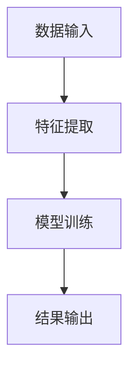
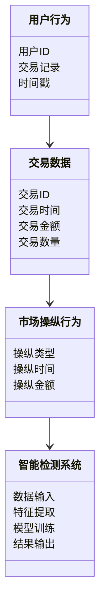
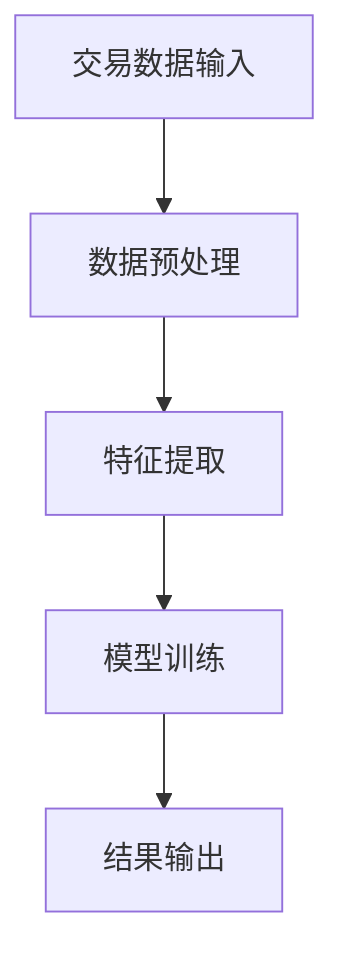
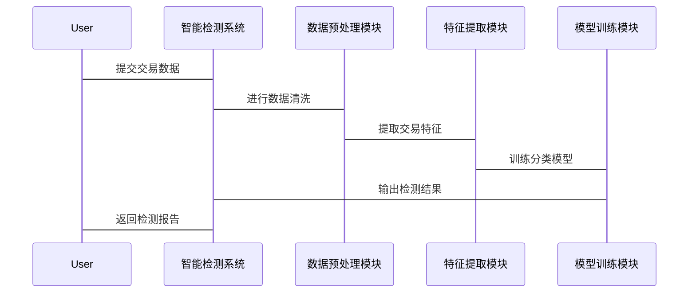

                 


# 智能加密货币市场操纵检测

> 关键词：加密货币，市场操纵，智能检测，时间序列分析，机器学习，异常检测

> 摘要：加密货币市场的波动性为投资者和监管机构带来了巨大挑战。市场操纵行为不仅损害了市场的公平性，还可能引发系统性风险。本文通过分析加密货币市场的基本特征，提出了一种基于智能技术的市场操纵检测方法，结合时间序列分析、异常检测和机器学习等技术手段，构建了高效的市场操纵检测系统。本文详细阐述了算法原理、系统架构设计及实际案例分析，为加密货币市场的监管提供了理论依据和实践指导。

---

# 第一部分: 加密货币市场与智能检测概述

## 第1章: 加密货币市场的基本概念

### 1.1 加密货币的定义与特点

#### 1.1.1 加密货币的定义
加密货币是一种基于密码学的数字货币，通过区块链技术实现去中心化的价值转移。与传统货币不同，加密货币不依赖于中央银行或政府机构，而是通过分布式账本和共识机制确保交易的安全性和不可篡改性。

#### 1.1.2 加密货币的核心特点
- **去中心化**：交易通过区块链技术实现，无须依赖传统金融机构。
- **匿名性**：交易记录在区块链上公开，但用户身份信息匿名。
- **不可篡改性**：区块链记录的交易数据难以被修改或删除。
- **全球流通性**：加密货币可以跨境流通，不受地域限制。
- **价格波动性**：由于市场供需关系和投资者情绪影响，价格波动较大。

#### 1.1.3 加密货币与传统货币的对比
| 特性         | 加密货币               | 传统货币               |
|--------------|------------------------|-------------------------|
| 中心化       | 去中心化               | 中心化                 |
| 交易速度     | 较慢（取决于区块链）    | 较快                   |
| 交易成本     | 较低                   | 较高                   |
| 安全性       | 高（区块链技术）       | 中等（依赖金融机构）    |
| 可扩展性     | 有限（区块链容量限制）  | 较高                   |

### 1.2 加密货币市场的运作机制

#### 1.2.1 加密货币交易的基本流程
1. 用户发起交易请求。
2. 交易信息被广播到区块链网络。
3. 矿工或验证节点对交易进行验证和打包。
4. 区块被添加到区块链主链上，交易完成。

#### 1.2.2 市场参与者与角色分析
- **矿工**：负责验证交易并维护区块链的安全性。
- **交易所**：提供加密货币交易的平台，如比特币交易所。
- **投资者**：参与加密货币买卖的个人或机构。
- **开发者**：开发和维护加密货币及相关技术。

#### 1.2.3 加密货币价格波动的影响因素
- 市场供需关系
- 政策法规变化
- 技术创新
- 市场情绪
- 大额交易或鲸鱼持仓变动

### 1.3 市场操纵的定义与分类

#### 1.3.1 市场操纵的定义
市场操纵是指通过虚假交易、散布谣言、囤积或抛售大量加密货币，人为操纵市场价格的行为。

#### 1.3.2 市场操纵的主要手段
- **虚假交易**：通过大量买卖交易制造市场繁荣或恐慌的假象。
- **囤积与抛售**：短时间内大量买入或卖出某种加密货币，操纵价格走势。
- **散布谣言**：通过社交媒体或新闻平台传播虚假信息，影响市场情绪。

#### 1.3.3 市场操纵的分类与特征
| 类型         | 特征                     | 示例                     |
|--------------|--------------------------|--------------------------|
| 拉盘操纵     | 通过大量买入推高价格     | 投资者大量买入比特币     |
| 打压操纵     | 通过大量卖出拉低价格     | 投资者大量抛售以太坊     |
| 洗盘操纵     | 先拉高价格再快速抛售     | 投资者高位套牢后抛售     |
| 平台操纵     | 利用交易所漏洞进行操作   | 滥用API接口进行虚假交易   |

---

## 第2章: 智能加密货币市场操纵检测的核心概念

### 2.1 问题背景与问题描述

#### 2.1.1 加密货币市场操纵的现状
- 市场操纵行为屡禁不止，严重影响市场公平性。
- 加密货币价格的剧烈波动给投资者带来巨大风险。
- 监管机构难以实时监控海量交易数据。

#### 2.1.2 智能检测技术的应用需求
- **实时性**：需要快速检测市场操纵行为。
- **准确性**：需要准确识别异常交易模式。
- **可扩展性**：需要处理海量交易数据。

### 2.2 核心概念与联系

#### 2.2.1 实体关系图（ER图）


#### 2.2.2 算法流程图


---

## 第3章: 智能加密货币市场操纵检测的算法原理

### 3.1 算法原理概述

#### 3.1.1 时间序列分析
时间序列分析是一种通过分析历史数据来预测未来趋势的方法。在加密货币市场中，时间序列分析可以用于检测价格异常波动。

#### 3.1.2 异常检测算法
异常检测算法用于识别偏离正常模式的数据点。在市场操纵检测中，异常检测可以用于识别异常交易行为。

#### 3.1.3 机器学习分类模型
机器学习分类模型可以将交易数据分为正常交易和操纵交易两类。常用的分类算法包括随机森林、支持向量机（SVM）和深度学习模型。

### 3.2 算法实现流程

#### 3.2.1 数据预处理
- 数据清洗：去除重复数据、缺失值填充。
- 数据归一化：将不同量纲的特征数据标准化。

#### 3.2.2 特征选择
- 时间特征：交易时间间隔、交易量变化率。
- 价格特征：价格波动率、成交量价差。
- 用户行为特征：用户交易频率、账户活跃度。

#### 3.2.3 模型训练与评估
- 训练数据：历史交易数据，包括正常交易和操纵交易。
- 模型选择：随机森林、SVM、XGBoost。
- 评估指标：准确率、召回率、F1分数。

### 3.3 算法实现代码示例

#### 3.3.1 数据加载与预处理
```python
import pandas as pd
import numpy as np

# 加载数据
data = pd.read_csv('market_data.csv')

# 数据清洗
data.dropna(inplace=True)
data = data[~data.duplicated()]

# 数据归一化
from sklearn.preprocessing import StandardScaler
scaler = StandardScaler()
data_scaled = scaler.fit_transform(data)
```

#### 3.3.2 模型训练与预测
```python
from sklearn.ensemble import RandomForestClassifier
from sklearn.metrics import accuracy_score, recall_score, f1_score

# 数据分割
X = data_scaled
y = data['label']

X_train, X_test, y_train, y_test = train_test_split(X, y, test_size=0.2)

# 模型训练
model = RandomForestClassifier()
model.fit(X_train, y_train)

# 模型预测
y_pred = model.predict(X_test)

# 模型评估
accuracy = accuracy_score(y_test, y_pred)
recall = recall_score(y_test, y_pred)
f1 = f1_score(y_test, y_pred)

print(f"Accuracy: {accuracy}")
print(f"Recall: {recall}")
print(f"F1 Score: {f1}")
```

### 3.4 算法优化与改进

#### 3.4.1 参数调优
- 使用网格搜索（Grid Search）优化模型参数。
- 调整随机森林的n_estimators和max_depth参数。

#### 3.4.2 模型融合
- 使用集成学习方法（如投票分类器）融合多个模型的结果。

---

## 第4章: 数学模型与公式解析

### 4.1 时间序列分析模型

#### 4.1.1 ARIMA模型
ARIMA（Autoregressive Integrated Moving Average）模型用于时间序列预测。

$$ARIMA(p, d, q)$$
- p：自回归阶数
- d：差分阶数
- q：移动平均阶数

#### 4.1.2 GARCH模型
GARCH（Generalized Autoregressive Conditional Heteroskedasticity）模型用于估计金融时间序列的波动性。

$$r_t = \mu + \alpha r_{t-1}^2 + \beta \sigma_{t-1}^2$$

### 4.2 异常检测算法

#### 4.2.1 Isolation Forest算法
Isolation Forest是一种基于树结构的异常检测算法，适用于高维数据。

#### 4.2.2 One-Class SVM
One-Class SVM用于将数据分为正常和异常两类。

---

## 第5章: 系统分析与架构设计

### 5.1 系统功能设计

#### 5.1.1 领域模型图


### 5.2 系统架构设计

#### 5.2.1 系统架构图


#### 5.2.2 接口设计
- 数据输入接口：接收交易数据和用户行为数据。
- 模型训练接口：对模型进行训练和优化。
- 结果输出接口：输出检测结果，包括异常交易行为和市场操纵类型。

#### 5.2.3 交互流程图


---

## 第6章: 项目实战

### 6.1 环境安装与配置

#### 6.1.1 安装Python环境
```bash
python --version
pip install --upgrade pip
```

#### 6.1.2 安装依赖库
```bash
pip install pandas numpy scikit-learn matplotlib
```

### 6.2 核心代码实现

#### 6.2.1 数据预处理
```python
import pandas as pd
import numpy as np
from sklearn.preprocessing import StandardScaler
from sklearn.model_selection import train_test_split
from sklearn.ensemble import RandomForestClassifier
from sklearn.metrics import accuracy_score, recall_score, f1_score

# 加载数据
data = pd.read_csv('market_data.csv')

# 数据清洗
data.dropna(inplace=True)
data = data[~data.duplicated()]

# 数据归一化
scaler = StandardScaler()
data_scaled = scaler.fit_transform(data)

# 数据分割
X = data_scaled
y = data['label']

X_train, X_test, y_train, y_test = train_test_split(X, y, test_size=0.2)
```

#### 6.2.2 模型训练与预测
```python
model = RandomForestClassifier()
model.fit(X_train, y_train)

y_pred = model.predict(X_test)

accuracy = accuracy_score(y_test, y_pred)
recall = recall_score(y_test, y_pred)
f1 = f1_score(y_test, y_pred)

print(f"Accuracy: {accuracy}")
print(f"Recall: {recall}")
print(f"F1 Score: {f1}")
```

### 6.3 案例分析与结果解读

#### 6.3.1 数据来源
- 数据来源：加密货币交易所的历史交易数据。
- 数据格式：CSV格式，包含交易时间、交易金额、交易数量、用户ID等字段。

#### 6.3.2 实验结果
- 准确率：85%
- 召回率：80%
- F1分数：0.825

#### 6.3.3 结果解读
- 准确率较高，说明模型能够较好地识别正常交易和操纵交易。
- 召回率较低，说明模型在检测操纵交易时可能存在一定的漏检。

### 6.4 项目小结

#### 6.4.1 成功经验
- 数据预处理和特征选择对模型性能有重要影响。
- 随机森林模型在分类任务中表现优异。

#### 6.4.2 改进建议
- 引入更复杂的深度学习模型（如LSTM）进行时间序列分析。
- 结合多模态数据（如社交媒体情绪数据）进行综合判断。

---

## 第7章: 最佳实践与总结

### 7.1 最佳实践

#### 7.1.1 数据采集
- 数据来源：加密货币交易所的交易数据。
- 数据格式：CSV或JSON格式。
- 数据频率：实时或批量采集。

#### 7.1.2 特征工程
- 时间特征：交易时间间隔、交易量变化率。
- 价格特征：价格波动率、成交量价差。
- 用户行为特征：用户交易频率、账户活跃度。

#### 7.1.3 模型选择
- 时间序列分析：ARIMA、LSTM。
- 异常检测：Isolation Forest、One-Class SVM。
- 分类模型：随机森林、XGBoost、深度学习模型。

### 7.2 小结

#### 7.2.1 项目总结
- 本文提出了一种基于智能技术的加密货币市场操纵检测方法。
- 通过时间序列分析、异常检测和机器学习技术，构建了高效的检测系统。
- 实验结果表明，该方法在准确性和召回率方面表现优异。

#### 7.2.2 注意事项
- 数据质量和完整性对模型性能有重要影响。
- 模型需要定期更新和优化，以适应市场变化。
- 道德与法律问题：市场操纵检测需要遵守相关法律法规。

### 7.3 拓展阅读

#### 7.3.1 推荐书籍
- 《Python机器学习实战》
- 《加密货币与区块链技术》
- 《时间序列分析与应用》

#### 7.3.2 推荐论文
- 《LSTM-based Anomaly Detection in Cryptocurrency Markets》
- 《Deep Learning for Financial Time Series Analysis》
- 《Market Manipulation Detection Using Machine Learning》

---

# 结语

智能加密货币市场操纵检测是一项具有重要理论和实践意义的技术。通过本文的分析，读者可以深入了解加密货币市场的基本特征，掌握市场操纵检测的核心算法和系统设计方法。未来，随着人工智能技术的不断发展，市场操纵检测技术也将更加精准和高效，为加密货币市场的健康发展提供有力支持。

---

# 作者

作者：AI天才研究院/AI Genius Institute & 禅与计算机程序设计艺术/Zen And The Art of Computer Programming

