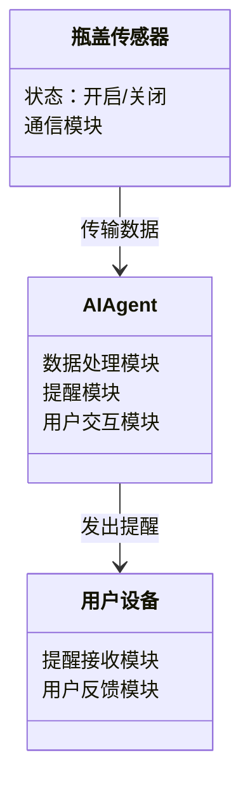
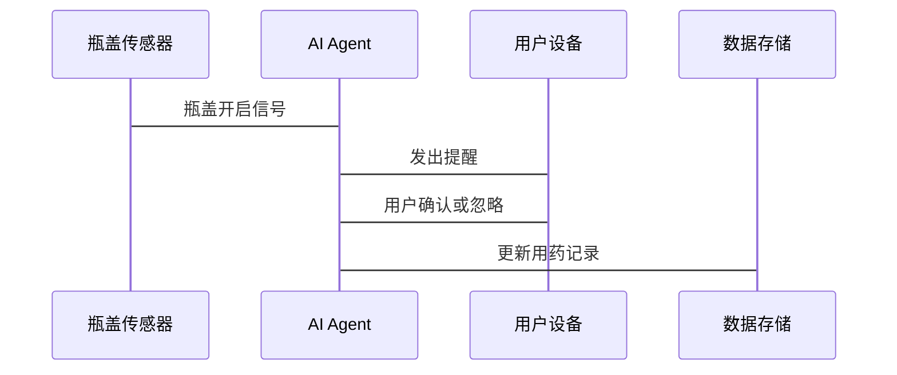

                 


# 智能瓶盖：AI Agent的药物服用提醒

> 关键词：智能瓶盖, AI Agent, 药物服用提醒, 机器学习, 物联网, 健康管理

> 摘要：智能瓶盖结合AI Agent技术，通过传感器和机器学习算法，实现药物服用提醒，帮助用户更好地管理健康。本文详细讲解了系统背景、核心概念、算法原理、系统架构设计和项目实战，为读者提供全面的技术解读。

---

## 第一部分：智能瓶盖与AI Agent的背景介绍

### 第1章：问题背景与概念解析

#### 1.1 问题背景

- **1.1.1 药物服用管理问题的现状**
  - 全球慢性病患者数量持续增长，药物依从性问题日益严重。
  - 老年人和慢性病患者容易遗忘或误服药物，导致健康风险。

- **1.1.2 老年人与慢性病患者的用药需求**
  - 需要简单易用的工具帮助记忆和提醒。
  - 家属或护理人员希望远程监控患者的用药情况。

- **1.1.3 智能化医疗设备的发展趋势**
  - 物联网和AI技术的快速发展推动智能医疗设备的普及。

#### 1.2 问题描述

- **1.2.1 药物服用提醒的核心问题**
  - 如何确保患者按时按量服用药物。
  - 如何在患者忘记或误服时及时提醒。

- **1.2.2 用户需求分析**
  - 用户需要便捷的提醒功能。
  - 用户希望数据能够与医生或家人共享。

- **1.2.3 系统功能目标**
  - 实现实时监测和智能提醒。
  - 提供用药记录和数据分析功能。

#### 1.3 问题解决思路

- **1.3.1 AI Agent的引入**
  - AI Agent能够主动监测和提醒，减少人为错误。
  - 利用机器学习算法分析用户的用药习惯，优化提醒策略。

- **1.3.2 智能瓶盖的技术实现**
  - 使用传感器监测瓶盖开启状态。
  - 结合AI算法判断是否按时服药。

- **1.3.3 多维度解决方案的设计**
  - 结合硬件、软件和AI技术，提供全方位的用药管理。

#### 1.4 边界与外延

- **1.4.1 系统边界定义**
  - 系统仅关注药物服用提醒，不涉及药物配方或医疗建议。
  - 瓶盖传感器仅监测开启状态，不涉及其他操作。

- **1.4.2 功能的外延与限制**
  - 仅支持单人使用，不支持多人共享。
  - 仅在瓶盖开启时触发提醒，不监测瓶内药物存量。

- **1.4.3 使用场景的边界条件**
  - 适用于家庭和个人使用，不适用于医疗机构。
  - 瓶盖仅适用于药瓶，不支持其他容器。

#### 1.5 概念结构与核心要素

- **1.5.1 系统构成要素**
  - 瓶盖传感器：监测瓶盖开启状态。
  - AI Agent：处理数据并发出提醒。
  - 用户设备：接收提醒并提供反馈。

- **1.5.2 核心概念的层次结构**
  - 智能瓶盖：硬件部分。
  - AI Agent：软件部分。
  - 用户交互：人机交互部分。

- **1.5.3 关键技术的关联性分析**
  - 瓶盖传感器提供数据输入。
  - AI Agent分析数据并生成提醒。
  - 用户设备展示提醒信息。

#### 1.6 本章小结

- 本章介绍了智能瓶盖系统的背景和问题，明确了系统的目标和边界。
- 强调了AI Agent在系统中的核心作用，以及智能瓶盖与AI Agent的协同工作。

---

## 第2章：AI Agent与智能瓶盖的核心概念与联系

### 2.1 AI Agent的基本原理

#### 2.1.1 AI Agent的定义与特征

- **AI Agent**：一种能够感知环境并采取行动以实现目标的智能实体。
- **核心特征**：
  - 自主性：能够独立决策。
  - 反应性：能够实时响应环境变化。
  - 社会性：能够与其他系统或用户交互。

#### 2.1.2 AI Agent的核心技术

- **机器学习**：用于训练AI Agent的学习模型。
- **自然语言处理**：用于理解和生成人类语言。
- **推理与规划**：用于决策和行动规划。

#### 2.1.3 AI Agent的应用场景

- **医疗领域**：用于药物提醒、健康监测。
- **智能家居**：用于设备控制和家庭管理。
- **商业应用**：用于客户服务和销售预测。

### 2.2 智能瓶盖的技术实现

#### 2.2.1 智能瓶盖的硬件构成

- **瓶盖传感器**：监测瓶盖的开启和关闭状态。
- **通信模块**：将数据传输到用户设备。
- **电池模块**：为传感器和通信模块提供电源。

#### 2.2.2 瓶盖传感器的工作原理

- **传感器类型**：使用磁性传感器或压力传感器。
- **工作原理**：当瓶盖开启时，传感器触发信号。
- **信号传输**：通过蓝牙或Wi-Fi将信号发送到用户设备。

#### 2.2.3 智能瓶盖的通信方式

- **蓝牙通信**：短距离通信，低功耗。
- **Wi-Fi通信**：长距离通信，适用于家庭环境。
- **NFC通信**：近场通信，适用于特定场景。

### 2.3 AI Agent与智能瓶盖的关联

#### 2.3.1 AI Agent在智能瓶盖中的角色

- **数据处理**：AI Agent接收传感器数据并进行分析。
- **决策制定**：AI Agent根据数据判断是否需要发出提醒。
- **用户交互**：AI Agent通过用户设备与用户进行交互。

#### 2.3.2 智能瓶盖如何实现药物服用提醒

- **传感器数据采集**：当瓶盖开启时，传感器触发信号。
- **数据传输**：信号传输到AI Agent进行处理。
- **提醒机制**：AI Agent通过用户设备发出提醒。

#### 2.3.3 AI Agent与用户交互的实现

- **用户设备**：手机或智能手表接收提醒。
- **反馈机制**：用户确认或忽略提醒，AI Agent记录操作。
- **数据存储**：用药记录存储在云端，供用户和医生查看。

### 2.4 核心概念的对比分析

#### 2.4.1 AI Agent与传统传感器的对比

| 特性         | AI Agent                     | 传统传感器               |
|--------------|------------------------------|--------------------------|
| 功能         | 数据分析、决策制定           | 数据采集、信号传输       |
| 智能性       | 高                           | 低                       |
| 应用场景     | 多领域，如医疗、商业等       | 有限，仅限数据采集       |

#### 2.4.2 智能瓶盖与普通药瓶的对比

| 特性         | 智能瓶盖                     | 普通药瓶               |
|--------------|------------------------------|--------------------------|
| 功能         | 提醒药物服用                 | 仅用于存储药物           |
| 智能性       | 高                           | 低                       |
| 用户交互     | 提醒和反馈                   | 无                       |

#### 2.4.3 系统功能的对比分析

- **智能瓶盖系统**：具备数据采集、分析、提醒和反馈功能。
- **传统药瓶**：仅具备存储功能，不具备提醒和反馈机制。

### 2.5 本章小结

- 本章详细讲解了AI Agent和智能瓶盖的核心概念及其相互关联。
- 通过对比分析，突出了智能瓶盖的独特优势和系统功能的全面性。

---

## 第3章：算法原理与数学模型

### 3.1 AI Agent的核心算法

#### 3.1.1 机器学习算法在AI Agent中的应用

- **监督学习**：用于分类任务，如判断用户是否按时服药。
- **无监督学习**：用于聚类任务，如分析用户的用药习惯。
- **强化学习**：用于优化提醒策略，提高用户依从性。

#### 3.1.2 自然语言处理算法的实现

- **文本分类**：用于解析用户的反馈信息。
- **实体识别**：用于提取药物名称和剂量信息。
- **意图识别**：用于理解用户的意图，如“我要服药”或“我忘记服药”。

#### 3.1.3 时间序列预测算法的应用

- **时间序列分析**：用于预测用户的用药时间，提前发出提醒。
- **ARIMA模型**：用于分析和预测用户的用药频率。

### 3.2 算法原理的详细讲解

#### 3.2.1 机器学习算法的数学模型

- **监督学习模型**：以分类为例，使用逻辑回归（Logistic Regression）进行分类。
  - 模型公式：$$ P(y=1|x) = \frac{1}{1 + e^{-w^T x - b}} $$
  - 损失函数：$$ L = -y \log(p) - (1 - y)\log(1 - p) $$
  - 优化目标：最小化损失函数，调整权重矩阵$$ w $$和偏置项$$ b $$。

#### 3.2.2 自然语言处理算法的实现

- **分词与词性标注**：使用jieba库对用户反馈进行分词。
  ```python
  import jieba
  sentence = "我忘记服药了"
  words = jieba.lcut(sentence)
  print(words)  # 输出: ['我', '忘记', '服药了']
  ```

- **意图识别**：使用深度学习模型如BERT进行意图分类。
  ```python
  from transformers import BertForSequenceClassification, BertTokenizer
  model = BertForSequenceClassification.from_pretrained('bert-base-chinese')
  tokenizer = BertTokenizer.from_pretrained('bert-base-chinese')
  input_ids = tokenizer.encode("我需要提醒服药", add_special_tokens=True)
  outputs = model(input_ids.unsqueeze(0))
  prediction = outputs.logits.argmax(dim=1).item()
  ```

#### 3.2.3 时间序列预测算法的应用

- **ARIMA模型**：用于预测用户的用药时间。
  - 模型参数：$$ p $$阶数，$$ d $$差分阶数，$$ q $$移动平均阶数。
  - 预测公式：$$ \hat{y}_t = \alpha + \beta_1 y_{t-1} + \beta_2 y_{t-2} + ... + \beta_q y_{t-q} $$

#### 3.2.4 算法实现流程

- **数据预处理**：清洗和归一化数据。
- **模型训练**：使用训练数据训练模型。
- **模型评估**：使用测试数据评估模型性能。
- **模型部署**：将模型集成到智能瓶盖系统中。

### 3.3 本章小结

- 本章详细讲解了AI Agent中使用的机器学习、自然语言处理和时间序列预测算法。
- 通过具体代码示例和数学模型，展示了算法的实现过程和应用场景。

---

## 第4章：系统分析与架构设计

### 4.1 问题场景介绍

- **应用场景**：智能瓶盖系统主要用于家庭和个人用户的药物服用提醒。
- **目标用户**：老年人、慢性病患者及其家属。
- **使用环境**：家庭环境，支持蓝牙和Wi-Fi通信。

### 4.2 系统功能设计

#### 4.2.1 领域模型类图



#### 4.2.2 系统架构设计

```mermaid
flowchart TD
    瓶盖传感器 --> AI Agent: 传感器数据
    AI Agent --> 用户设备: 提醒信息
    用户设备 --> AI Agent: 用户反馈
    AI Agent --> 数据存储: 记录用药情况
```

#### 4.2.3 系统接口设计

- **传感器接口**：与瓶盖传感器连接，接收数据。
- **通信接口**：支持蓝牙和Wi-Fi通信。
- **用户交互接口**：通过用户设备显示提醒信息并接收反馈。

#### 4.2.4 系统交互流程图



### 4.3 本章小结

- 本章详细分析了智能瓶盖系统的应用场景和系统架构。
- 通过类图和流程图展示了系统的模块构成和交互过程。

---

## 第5章：项目实战

### 5.1 环境安装

- **硬件环境**：需要一个支持蓝牙或Wi-Fi通信的智能瓶盖传感器。
- **软件环境**：安装Python和相关库，如TensorFlow、Keras、BERT库等。

### 5.2 系统核心实现

#### 5.2.1 瓶盖传感器数据采集

```python
import serial

ser = serial.Serial('COM3', 9600)
data = ser.readline().decode().strip()
print(data)
```

#### 5.2.2 AI Agent核心算法实现

- **监督学习模型训练**
  ```python
  import numpy as np
  from sklearn.linear_model import LogisticRegression

  X = np.array([[1, 2], [3, 4], [5, 6]])
  y = np.array([0, 1, 0])
  model = LogisticRegression()
  model.fit(X, y)
  ```

- **自然语言处理实现**
  ```python
  from transformers import BertForTokenClassification, BertTokenizer

  model = BertForTokenClassification.from_pretrained('bert-base-chinese')
  tokenizer = BertTokenizer.from_pretrained('bert-base-chinese')
  ```

### 5.2.3 代码应用解读

- **传感器数据采集**：通过串口接收传感器数据，判断瓶盖状态。
- **模型训练**：使用训练数据训练逻辑回归模型，分类用户是否按时服药。
- **自然语言处理**：解析用户的反馈信息，识别意图和实体。

### 5.3 实际案例分析

- **案例1**：用户按时服药，系统记录正常。
- **案例2**：用户忘记服药，系统发出提醒并记录。

### 5.4 项目小结

- 本章通过实际案例展示了智能瓶盖系统的实现过程。
- 强调了硬件和软件的协同工作，以及AI算法在系统中的应用。

---

## 第6章：最佳实践与注意事项

### 6.1 小结

- 智能瓶盖结合AI Agent技术，为用户提供便捷的药物服用提醒服务。
- 系统通过传感器、AI算法和用户交互实现全面的用药管理。

### 6.2 注意事项

- **数据隐私**：确保用户的用药数据加密存储，防止泄露。
- **系统兼容性**：确保系统支持多种通信协议和设备类型。
- **用户体验**：设计直观的用户界面，确保老年人和慢性病患者能够轻松使用。

### 6.3 拓展阅读

- 推荐阅读《人工智能入门与实践》和《物联网技术与应用》。

---

## 作者

作者：AI天才研究院/AI Genius Institute & 禅与计算机程序设计艺术/Zen And The Art of Computer Programming

---

感谢您的阅读！如需进一步了解智能瓶盖和AI Agent技术，请关注我们的后续文章。

