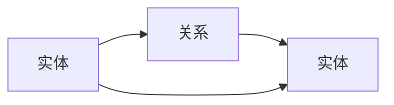

                 

# 构建AI Agent的知识图谱推理引擎优化

> 关键词：AI Agent，知识图谱，推理引擎，优化，知识图谱推理

> 摘要：本文旨在探讨如何构建高效的知识图谱推理引擎以优化AI Agent的性能。首先，我们将介绍AI Agent与知识图谱的基本概念，分析当前存在的问题与挑战。接着，深入讲解知识图谱的构建流程与表示方法，以及推理引擎的工作原理和分类。随后，我们将详细分析知识图谱推理引擎的算法原理，包括符号逻辑推理与概率推理，并结合实际案例进行探讨。最后，我们将从系统架构设计、项目实战、最佳实践等多方面展开，总结知识图谱推理引擎优化的关键点，并展望未来的发展方向。

---

# 第一部分: 构建AI Agent的知识图谱推理引擎优化基础

---

# 第1章: 问题背景与核心概念

## 1.1 问题背景介绍

### 1.1.1 AI Agent与知识图谱的结合

AI Agent（人工智能代理）是一种能够感知环境、自主决策并执行任务的智能体。它广泛应用于智能助手、自动驾驶、智能客服等领域。知识图谱作为一种结构化的知识表示形式，能够帮助AI Agent更好地理解和处理复杂的信息。

知识图谱通过实体和关系的表示，构建了一个语义网络，使得AI Agent能够进行推理和知识推理。例如，在智能问答系统中，AI Agent可以通过知识图谱快速定位到所需的信息，并通过推理引擎进行推理，从而提供更准确的答案。

### 1.1.2 知识图谱推理引擎的定义与作用

知识图谱推理引擎是一种用于在知识图谱上执行推理的工具或算法。它的作用是根据知识图谱中的已知信息，推导出新的知识或结论。推理引擎是AI Agent的核心组件之一，它使得AI Agent能够具备推理能力，从而更好地理解和解决复杂问题。

### 1.1.3 当前存在的问题与挑战

尽管知识图谱和推理引擎在AI Agent中发挥了重要作用，但目前仍面临一些问题与挑战：

1. **知识图谱的构建与维护**：知识图谱的构建需要大量的数据清洗、实体识别和关系抽取工作，且需要不断更新以保持准确性。
2. **推理引擎的效率与准确性**：在大规模知识图谱中，推理引擎的效率和准确性是关键问题，尤其是在实时应用场景中。
3. **跨领域知识的融合**：不同领域知识的融合和推理是一个复杂的问题，需要设计高效的算法来处理。
4. **可解释性与透明性**：推理引擎的决策过程需要具备可解释性，以便用户和开发者能够理解AI Agent的推理过程。

---

## 1.2 核心概念与边界

### 1.2.1 知识图谱的基本概念

知识图谱是一种以实体和关系为核心的知识表示形式。实体可以是任何具体的对象，如“人”、“地点”、“组织”等，而关系则是实体之间的联系，如“位于”、“属于”、“拥有”等。知识图谱通过三元组（头实体、关系、尾实体）的形式，构建了一个语义网络。

### 1.2.2 推理引擎的工作原理

推理引擎通过分析知识图谱中的已知信息，推导出新的知识或结论。推理引擎可以分为两类：基于符号逻辑的推理和基于概率的推理。基于符号逻辑的推理通过规则和逻辑推理得出结论，而基于概率的推理则通过概率模型计算事件的可能性。

### 1.2.3 AI Agent的定义与特点

AI Agent是一种能够感知环境、自主决策并执行任务的智能体。AI Agent的核心特点包括自主性、反应性、目标导向和社交能力。它能够根据环境中的信息做出决策，并与人类或其他智能体进行交互。

### 1.2.4 边界与外延

知识图谱推理引擎的边界包括其输入数据、推理规则和推理结果的输出。外延则涉及知识图谱的构建、推理算法的设计与优化、推理结果的应用等。

---

## 1.3 核心概念关系图

### 1.3.1 ER实体关系图

### 1.3.2 核心概念属性对比表

| 概念 | 定义 | 特点 |
|------|------|------|
| 实体 | 知识图谱中的基本单元，表示具体对象。 | 唯一性、可标识性 |
| 关系 | 实体之间的联系，表示实体之间的关联。 | 二元关系、多关系 |
| 推理引擎 | 用于在知识图谱上执行推理的工具或算法。 | 逻辑推理、概率推理 |
| AI Agent | 能够感知环境、自主决策的智能体。 | 自主性、目标导向 |

---

## 1.4 本章小结

本章主要介绍了AI Agent、知识图谱和推理引擎的基本概念，并分析了它们之间的关系。通过实体关系图和属性对比表，我们明确了各个核心概念的特点和作用。下一章将深入探讨知识图谱的构建流程和表示方法。

---

# 第2章: 知识图谱基础

## 2.1 知识图谱的定义与特点

### 2.1.1 知识图谱的定义

知识图谱是一种以实体和关系为核心的知识表示形式。它通过三元组（头实体、关系、尾实体）的形式，构建了一个语义网络，能够表示复杂的语义关系。

### 2.1.2 知识图谱的核心特点

知识图谱具有以下核心特点：

1. **结构化**：知识图谱通过实体和关系的结构化表示，使得信息的组织和检索更加高效。
2. **语义化**：知识图谱能够表示实体之间的语义关系，从而实现语义理解。
3. **动态性**：知识图谱需要不断更新以保持准确性，能够实时反映现实世界的变化。

### 2.1.3 知识图谱与传统数据库的区别

知识图谱与传统数据库的主要区别如下：

| 特性 | 知识图谱 | 传统数据库 |
|------|----------|-------------|
| 数据模型 | 图结构 | 行为结构 |
| 数据关系 | 复杂关系 | 简单关系 |
| 数据规模 | 大规模 | 中小规模 |

---

## 2.2 知识图谱的构建流程

### 2.2.1 数据采集与预处理

知识图谱的构建流程包括数据采集、预处理、实体识别、关系抽取、知识融合和知识存储等步骤。

1. **数据采集**：从多种来源（如网页、数据库、文本等）采集数据。
2. **数据预处理**：对采集的数据进行清洗、去重和格式化处理。

### 2.2.2 实体识别与链接

实体识别是指从文本中识别出实体并建立唯一标识的过程。实体链接则是将实体映射到知识图谱中的具体节点。

### 2.2.3 关系抽取与构建

关系抽取是指从文本中抽取实体之间的关系，并构建关系三元组。

### 2.2.4 知识图谱存储与管理

知识图谱通常存储在图数据库中，如Neo4j、RDF数据库等。存储时需要考虑查询效率和扩展性。

---

## 2.3 知识图谱的表示方法

### 2.3.1 RDF三元组表示

RDF（Resource Description Framework）是一种基于三元组的知识表示方法，三元组的形式为（主语、谓词、宾语）。

例如：（张三，属于，中国）。

### 2.3.2 图数据库表示

图数据库通过节点和边的形式表示实体和关系。节点代表实体，边代表关系。

### 2.3.3 知识图谱的可视化表示

知识图谱可以通过图形化工具进行可视化展示，例如使用Gephi、Neo4j自带的可视化工具等。

---

## 2.4 知识图谱的实际应用案例

### 2.4.1 智能问答系统

知识图谱可以用于智能问答系统的知识库构建，使得问答系统能够根据知识图谱中的信息进行推理和回答。

### 2.4.2 知识图谱在推荐系统中的应用

知识图谱可以用于推荐系统的知识增强，通过分析用户的兴趣和实体之间的关系，提供更精准的推荐。

### 2.4.3 知识图谱在自然语言处理中的应用

知识图谱可以用于自然语言处理中的实体识别、关系抽取和语义理解。

---

## 2.5 本章小结

本章详细介绍了知识图谱的定义、特点、构建流程和表示方法，并通过实际应用案例展示了知识图谱的应用场景。下一章将探讨推理引擎的基本原理和分类。

---

# 第3章: 推理引擎基础

## 3.1 推理引擎的定义与分类

### 3.1.1 推理引擎的定义

推理引擎是一种用于在知识图谱上执行推理的工具或算法。它的作用是根据知识图谱中的已知信息，推导出新的知识或结论。

### 3.1.2 推理引擎的分类

推理引擎可以分为以下几类：

1. **符号逻辑推理引擎**：基于符号逻辑的推理，如基于规则的推理。
2. **概率推理引擎**：基于概率模型的推理，如贝叶斯推理。
3. **混合推理引擎**：结合符号逻辑和概率推理的混合推理引擎。

---

## 3.2 推理引擎的工作原理

### 3.2.1 符号逻辑推理

符号逻辑推理是一种基于逻辑规则的推理方法。例如，可以通过以下规则进行推理：

- 如果A，则B。
- 如果B，则C。
- 因此，如果A，则C。

### 3.2.2 概率推理

概率推理是一种基于概率模型的推理方法。例如，可以通过贝叶斯网络进行推理。

### 3.2.3 增量推理与实时推理

增量推理是指在已有推理结果的基础上，逐步添加新的知识并进行推理。实时推理是指在动态变化的环境中，实时进行推理的过程。

---

## 3.3 推理引擎的关键算法

### 3.3.1 前向 chaining 算法

前向 chaining 算法是一种基于符号逻辑的推理算法，从已知的事实出发，逐步应用推理规则，推导出新的事实。

### 3.3.2 后向 chaining 算法

后向 chaining 算法是一种基于目标的推理算法，从目标出发，逐步寻找支持目标的事实。

---

## 3.4 本章小结

本章介绍了推理引擎的定义、分类和工作原理，并详细讲解了符号逻辑推理和概率推理的关键算法。下一章将探讨知识图谱推理引擎的优化方法。

---

# 第二部分: 知识图谱推理引擎的算法原理

---

# 第4章: 知识图谱构建中的算法优化

## 4.1 实体链接算法

### 4.1.1 实体识别与链接

实体识别是指从文本中识别出实体，实体链接则是将实体映射到知识图谱中的具体节点。

### 4.1.2 实体链接算法

常用的实体链接算法包括基于字符串匹配的算法和基于语义相似度的算法。

### 4.1.3 实体链接算法的优化

实体链接算法的优化可以通过引入上下文信息和使用深度学习模型来提高准确率。

---

## 4.2 关系抽取算法

### 4.2.1 关系抽取的定义

关系抽取是指从文本中抽取实体之间的关系，并构建关系三元组。

### 4.2.2 关系抽取算法

常用的关系抽取算法包括基于规则的算法和基于机器学习的算法。

### 4.2.3 关系抽取算法的优化

关系抽取算法的优化可以通过引入外部知识库和使用注意力机制来提高准确率。

---

## 4.3 知识图谱构建的数学模型

### 4.3.1 实体表示的数学模型

实体可以表示为向量，通过向量空间模型进行表示。

### 4.3.2 关系表示的数学模型

关系可以表示为矩阵或向量，通过关系向量进行表示。

---

## 4.4 本章小结

本章详细介绍了知识图谱构建中的算法优化方法，并探讨了实体链接和关系抽取的数学模型。下一章将探讨推理引擎的优化方法。

---

# 第5章: 推理引擎的优化算法

## 5.1 符号逻辑推理的优化

### 5.1.1 前向 chaining 的优化

通过引入规则优先级和剪枝策略，可以提高前向 chaining 的效率。

### 5.1.2 后向 chaining 的优化

通过引入目标优先级和剪枝策略，可以提高后向 chaining 的效率。

---

## 5.2 概率推理的优化

### 5.2.1 贝叶斯网络的优化

通过优化贝叶斯网络的结构和参数，可以提高推理的准确率。

### 5.2.2 马尔可夫链的优化

通过优化马尔可夫链的转移概率，可以提高推理的效率。

---

## 5.3 混合推理的优化

### 5.3.1 混合推理的定义

混合推理是指结合符号逻辑推理和概率推理的推理方法。

### 5.3.2 混合推理的优化

通过引入混合推理模型，可以提高推理的准确率和效率。

---

## 5.4 本章小结

本章详细介绍了符号逻辑推理、概率推理和混合推理的优化方法，并探讨了它们在知识图谱推理中的应用。下一章将探讨知识图谱推理引擎的系统设计与优化。

---

# 第三部分: 知识图谱推理引擎的系统设计与优化

---

# 第6章: 知识图谱推理引擎的系统架构设计

## 6.1 系统功能设计

### 6.1.1 领域模型设计

领域模型设计是系统功能设计的核心，需要明确系统的功能模块和功能流程。

### 6.1.2 功能模块划分

知识图谱推理引擎的系统功能模块包括数据输入模块、推理引擎模块、结果输出模块等。

### 6.1.3 功能流程设计

功能流程设计需要明确各个功能模块之间的调用关系和数据流。

---

## 6.2 系统架构设计

### 6.2.1 分层架构设计

知识图谱推理引擎的系统架构可以采用分层架构，包括数据层、推理层和应用层。

### 6.2.2 模块化设计

系统架构设计需要采用模块化设计，明确各个模块的功能和接口。

---

## 6.3 系统接口设计

### 6.3.1 接口定义

系统接口设计需要明确各个模块之间的接口定义，包括输入格式和输出格式。

### 6.3.2 接口实现

系统接口设计需要考虑接口的可扩展性和可维护性。

---

## 6.4 系统交互设计

### 6.4.1 交互流程设计

系统交互设计需要明确用户的操作流程和系统响应流程。

### 6.4.2 交互界面设计

系统交互设计需要设计友好的用户界面，提高用户体验。

---

## 6.5 本章小结

本章详细介绍了知识图谱推理引擎的系统架构设计、功能设计和接口设计，并探讨了系统交互设计的关键点。下一章将探讨知识图谱推理引擎的优化策略。

---

# 第7章: 知识图谱推理引擎的优化策略

## 7.1 知识图谱推理引擎的优化目标

### 7.1.1 提高推理效率

通过优化推理算法和数据结构，可以提高推理的效率。

### 7.1.2 提高推理准确率

通过优化推理模型和引入外部知识，可以提高推理的准确率。

---

## 7.2 知识图谱推理引擎的优化方法

### 7.2.1 算法优化

通过优化推理算法，可以提高推理的效率和准确率。

### 7.2.2 数据优化

通过优化知识图谱的数据结构和存储方式，可以提高推理的效率。

---

## 7.3 知识图谱推理引擎的优化案例

### 7.3.1 案例分析

通过实际案例分析，探讨知识图谱推理引擎的优化方法。

### 7.3.2 优化效果评估

通过实验评估优化方法的效果，包括推理时间、准确率等指标。

---

## 7.4 本章小结

本章详细介绍了知识图谱推理引擎的优化目标和优化方法，并通过实际案例分析了优化效果。下一章将总结全文并展望未来的发展方向。

---

# 第8章: 总结与展望

## 8.1 全文总结

本文详细探讨了构建AI Agent的知识图谱推理引擎优化的关键点，包括知识图谱的构建、推理引擎的优化和系统设计等内容。

## 8.2 未来展望

未来，随着AI技术的不断发展，知识图谱推理引擎将面临更多挑战和机遇。我们需要进一步优化推理算法，提高推理的效率和准确率，并探索新的应用场景。

---

# 作者：AI天才研究院/AI Genius Institute & 禅与计算机程序设计艺术 /Zen And The Art of Computer Programming

---

以上是《构建AI Agent的知识图谱推理引擎优化》的完整文章大纲和内容。希望对您有所帮助！

