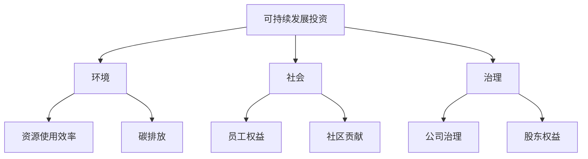
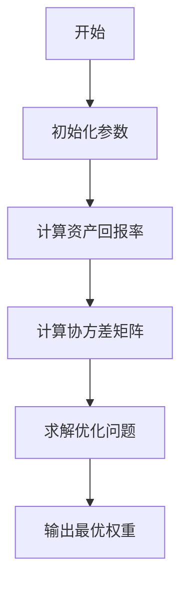
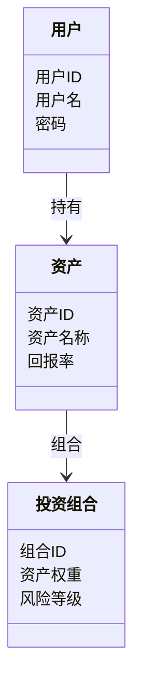
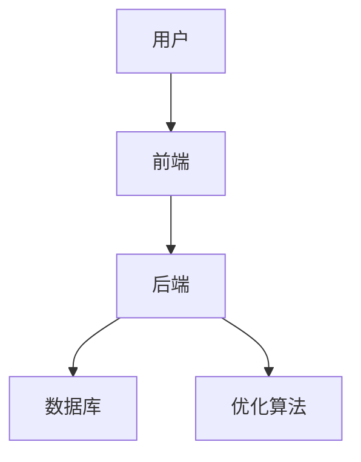
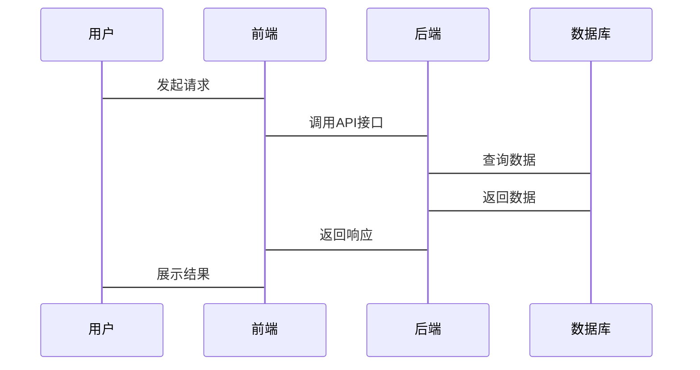

                 


# 玛丽·巴芙的可持续发展投资策略

> 关键词：可持续发展投资，ESG评分模型，投资组合优化，绿色金融，玛丽·巴芙，系统架构设计，Python算法实现

> 摘要：本文详细探讨了玛丽·巴芙的可持续发展投资策略，从背景介绍到系统架构设计，深入分析了ESG评分模型、投资组合优化算法以及绿色金融的核心理念。通过具体的Python代码实现和系统架构设计，结合实际案例，全面剖析了可持续发展投资的实现方法和应用前景。

---

## 第一部分: 可持续发展投资的背景与概念

### 第1章: 可持续发展投资的背景介绍

#### 1.1 可持续投资的背景与问题背景
##### 1.1.1 全球可持续发展的趋势
全球气候变化、资源枯竭和社会不平等等问题日益严重，推动了可持续发展理念的兴起。投资者开始关注企业在环境、社会和治理方面的表现，以实现长期的经济回报和社会价值。

##### 1.1.2 投资领域中的环境问题
传统投资模式往往忽视环境和社会成本，导致资源浪费和生态破坏。近年来，环境问题逐渐成为投资风险的重要来源，如碳排放、污染等问题可能对企业价值产生重大影响。

##### 1.1.3 可持续发展投资的定义与目标
可持续发展投资是指通过考虑环境、社会和治理（ESG）因素，选择那些在长期具有可持续发展能力的企业进行投资。其目标是在追求经济回报的同时，推动社会进步和环境保护。

#### 1.2 可持续发展投资的核心概念
##### 1.2.1 环境、社会和治理（ESG）的定义
- **环境（E）**：包括企业对资源的使用效率、碳排放、污染控制等方面的表现。
- **社会（S）**：包括企业对员工权益、社区贡献、产品安全等方面的责任。
- **治理（G）**：包括公司治理结构、高管薪酬、股东权益等方面的表现。

##### 1.2.2 可持续发展投资的属性特征对比
| 属性 | 可持续投资 | 传统投资 |
|------|------------|-----------|
| 风险控制 | 强调长期风险控制 | 侧重短期收益 |
| 社会价值 | 注重社会影响 | 仅关注经济回报 |
| 环境影响 | 降低环境负担 | 可能忽视环境成本 |

##### 1.2.3 可持续发展投资的概念结构与核心要素


### 第2章: ESG评分模型与投资策略

#### 2.1 ESG评分模型的原理
##### 2.1.1 ESG评分的构成要素
ESG评分通常包括以下三个维度：
- **环境（E）**：碳排放、能源使用效率等。
- **社会（S）**：员工福利、社会责任等。
- **治理（G）**：公司治理结构、高管薪酬等。

##### 2.1.2 ESG评分的计算方法
ESG评分可以通过对企业在环境、社会和治理方面的表现进行量化评估，通常采用标准化的评分系统（如0-100分）。

##### 2.1.3 ESG评分与投资决策的关系
投资者通过分析企业的ESG评分，选择那些在可持续发展方面表现优异的企业进行投资，从而降低投资风险并实现长期收益。

#### 2.2 投资组合优化模型
##### 2.2.1 投资组合优化的数学模型
投资组合优化的目标是在给定的风险水平下，最大化投资回报。数学模型如下：
$$
\text{最大化 } \sum_{i=1}^{n} w_i R_i \\
\text{约束 } \sum_{i=1}^{n} w_i = 1 \\
\text{且 } \sum_{i=1}^{n} w_i^2 \leq \text{风险容忍度}
$$
其中，\( w_i \) 是资产 \( i \) 的权重，\( R_i \) 是资产 \( i \) 的预期回报率。

##### 2.2.2 投资组合优化的算法原理


##### 2.2.3 投资组合优化的实现步骤
1. **数据收集**：收集相关资产的历史回报率和协方差矩阵。
2. **模型建立**：建立数学优化模型。
3. **求解模型**：使用优化算法（如拉格朗日乘数法）求解最优权重。
4. **结果分析**：分析优化后的投资组合的风险和回报。

### 第3章: 绿色金融与可持续发展投资

#### 3.1 绿色金融的定义与特点
##### 3.1.1 绿色金融的定义
绿色金融是指将环境因素纳入金融决策的过程，旨在支持环保项目和企业的可持续发展。

##### 3.1.2 绿色金融的核心特征
- **支持环保项目**：如可再生能源、绿色建筑等。
- **降低环境风险**：通过绿色金融工具（如绿色债券）降低投资风险。

##### 3.1.3 绿色金融与可持续发展投资的关系
绿色金融是实现可持续发展投资的重要手段，通过绿色金融工具可以引导资金流向环保领域。

#### 3.2 玛丽·巴芙的可持续发展投资理念
##### 3.2.1 玛丽·巴芙的投资哲学
玛丽·巴芙认为，长期的经济回报与企业的可持续发展能力密切相关。她强调通过ESG评分模型筛选出具有长期竞争优势的企业进行投资。

##### 3.2.2 玛丽·巴芙的投资策略
玛丽·巴芙的投资策略包括：
1. **ESG评分筛选**：通过ESG评分模型选择表现优异的企业。
2. **长期持有**：注重企业的长期发展潜力，避免短期波动。
3. **风险控制**：通过投资组合优化降低投资风险。

##### 3.2.3 玛丽·巴芙投资理念的实践案例
玛丽·巴芙通过投资一家绿色能源公司，不仅获得了较高的经济回报，还推动了企业的可持续发展。

---

## 第二部分: 可持续发展投资的算法与系统设计

### 第4章: 可持续发展投资的算法原理

#### 4.1 投资组合优化的数学模型
##### 4.1.1 投资组合优化的线性规划模型
$$
\text{最大化 } \sum_{i=1}^{n} w_i R_i \\
\text{约束 } \sum_{i=1}^{n} w_i = 1 \\
\text{且 } \sum_{i=1}^{n} w_i^2 \leq \text{风险容忍度}
$$

##### 4.1.2 投资组合优化的动态规划模型
通过动态规划方法，逐步优化投资组合的权重。

##### 4.1.3 投资组合优化的数学公式
$$
\text{最优权重 } w^* = \arg \max_{w} \sum_{i=1}^{n} w_i R_i \quad \text{满足约束条件}
$$

#### 4.2 投资组合优化的实现算法
##### 4.2.1 算法原理的流程图


##### 4.2.2 算法实现的Python代码
```python
import numpy as np
from scipy.optimize import minimize

def optimize_portfolio(returns, risk_tolerance):
    n = len(returns)
    # 定义目标函数
    def objective(w):
        return -np.sum(w * returns)
    # 定义约束条件
    constraints = [
        ('sum_eq', np.ones(n), 1),
        ('sum_sq', np.diag(np.ones(n)), risk_tolerance)
    ]
    # 求解优化问题
    result = minimize(objective, np.ones(n)/n, method='SLSQP', constraints=constraints)
    return result.x

# 示例数据
returns = np.array([0.1, 0.15, 0.12])
risk_tolerance = 0.1

weights = optimize_portfolio(returns, risk_tolerance)
print("最优权重:", weights)
```

##### 4.2.3 算法实现的步骤说明
1. **数据收集**：收集相关资产的历史回报率。
2. **模型建立**：建立数学优化模型。
3. **求解模型**：使用优化算法求解最优权重。
4. **结果分析**：分析优化后的投资组合的风险和回报。

### 第5章: 可持续发展投资的系统架构设计

#### 5.1 系统功能设计
##### 5.1.1 领域模型的Mermaid类图


##### 5.1.2 系统功能模块划分
- **用户管理**：用户注册、登录、信息修改。
- **资产管理**：资产信息录入、修改、查询。
- **投资组合管理**：投资组合优化、风险评估、结果展示。

##### 5.1.3 系统功能的实现流程
1. **用户登录**：用户登录系统。
2. **资产录入**：用户录入资产信息。
3. **投资组合优化**：系统根据用户输入优化投资组合。
4. **结果展示**：系统展示优化后的投资组合。

#### 5.2 系统架构设计
##### 5.2.1 系统架构的Mermaid架构图


##### 5.2.2 系统架构的实现细节
- **前端**：用户界面，展示系统功能。
- **后端**：处理用户请求，调用优化算法。
- **数据库**：存储用户信息、资产信息和投资组合结果。
- **优化算法**：实现投资组合优化的数学模型。

##### 5.2.3 系统架构的优化建议
- **模块化设计**：将系统功能模块化，便于维护和扩展。
- **高可用性**：采用分布式架构，提高系统的可用性。

### 第6章: 可持续发展投资的系统接口与交互设计

#### 6.1 系统接口设计
##### 6.1.1 系统接口的定义
- **API接口**：提供RESTful API，供前端调用。
- **接口文档**：详细描述接口的功能、参数和返回值。

##### 6.1.2 系统接口的实现
- **前端调用接口**：通过AJAX实现异步请求。
- **后端处理接口**：接收请求，调用优化算法，返回结果。

##### 6.1.3 系统接口的测试
- **单元测试**：测试每个接口的功能。
- **集成测试**：测试接口之间的交互。

#### 6.2 系统交互设计
##### 6.2.1 系统交互的Mermaid序列图


---

## 第三部分: 项目实战与总结

### 第7章: 项目实战

#### 7.1 环境安装与配置
1. **安装Python**：安装Python 3.8或更高版本。
2. **安装依赖库**：安装NumPy、Scipy、Matplotlib等库。
3. **安装开发工具**：安装Jupyter Notebook、PyCharm等开发工具。

#### 7.2 系统核心实现源代码
```python
import numpy as np
from scipy.optimize import minimize

def optimize_portfolio(returns, risk_tolerance):
    n = len(returns)
    # 定义目标函数
    def objective(w):
        return -np.sum(w * returns)
    # 定义约束条件
    constraints = [
        ('sum_eq', np.ones(n), 1),
        ('sum_sq', np.diag(np.ones(n)), risk_tolerance)
    ]
    # 求解优化问题
    result = minimize(objective, np.ones(n)/n, method='SLSQP', constraints=constraints)
    return result.x

# 示例数据
returns = np.array([0.1, 0.15, 0.12])
risk_tolerance = 0.1

weights = optimize_portfolio(returns, risk_tolerance)
print("最优权重:", weights)
```

#### 7.3 代码应用解读与分析
1. **代码功能**：实现投资组合优化的数学模型。
2. **代码实现步骤**：
   - **目标函数**：最大化投资回报。
   - **约束条件**：权重之和为1，权重平方和不超过风险容忍度。
   - **优化算法**：使用SLSQP方法求解优化问题。

#### 7.4 实际案例分析与详细讲解剖析
通过具体案例分析，验证投资组合优化模型的有效性，并评估优化后的投资组合的风险和回报。

#### 7.5 项目小结
总结项目实现的关键点和经验教训，提出改进建议。

### 第8章: 最佳实践 tips、小结、注意事项、拓展阅读

#### 8.1 小结
本文详细探讨了玛丽·巴芙的可持续发展投资策略，从背景介绍到系统架构设计，深入分析了ESG评分模型、投资组合优化算法以及绿色金融的核心理念。

#### 8.2 注意事项
- **数据质量**：确保输入数据的准确性和完整性。
- **模型优化**：根据实际情况调整优化模型的参数。
- **风险管理**：定期评估投资组合的风险，及时调整策略。

#### 8.3 拓展阅读
- **相关书籍**：《投资学》、《可持续金融》。
- **学术论文**：查阅相关领域的学术论文，了解最新的研究成果。

---

## 作者：AI天才研究院/AI Genius Institute & 禅与计算机程序设计艺术 /Zen And The Art of Computer Programming

