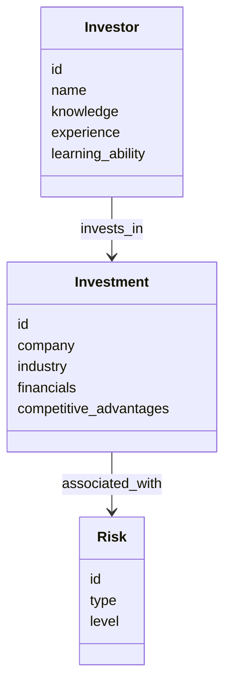
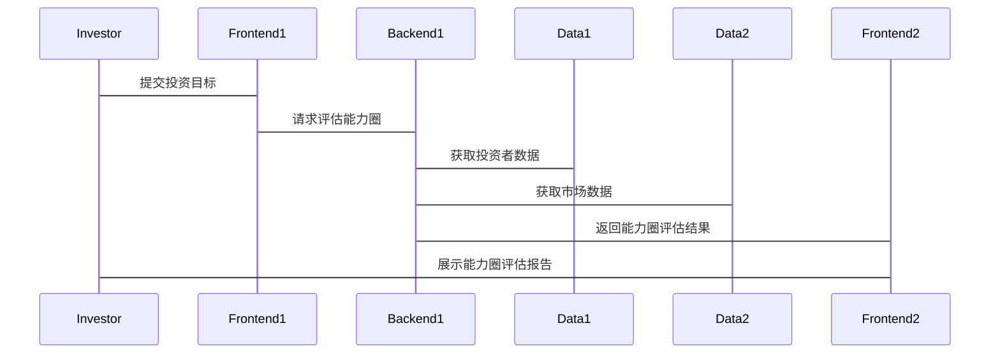

                 


# 芒格的"远离"策略：知道自己不懂什么同样重要

> 关键词：芒格、远离策略、能力圈、认知边界、投资决策、风险管理

> 摘要：本文深入探讨了芒格的“远离”策略，从其核心概念、能力圈的构建、认知边界的影响、风险管理与投资组合优化，到系统架构设计和实际项目案例分析，全面解析了如何通过识别和避免自己不懂的领域，实现更有效的投资决策。本文不仅提供了理论支持，还通过数学模型和算法实现，结合系统架构设计，展示了“远离”策略在实际投资中的应用。

---

## 第一章: 芒格的"远离"策略概述

### 1.1 芒格的背景与投资哲学

#### 1.1.1 芒格的生平简介
查理·芒格（Charlie Munger）是世界著名投资家，伯克希尔·哈撒韦公司（Berkshire Hathaway）的副主席，与沃伦·巴菲特（Warren Buffett）共同创造了伯克希尔的辉煌投资业绩。芒格以其独特的投资哲学和思维框架闻名，他强调理性思考、逆向思维和长期价值投资。

#### 1.1.2 芒格的投资理念
芒格的投资理念以“能力圈”为核心，主张投资者应专注于自己真正了解的领域，避免涉足自己不熟悉或无法评估的领域。他认为，投资的本质是通过深入研究和理性判断，找到具有持续竞争优势的企业，并长期持有。

#### 1.1.3 "远离"策略的核心思想
芒格的“远离”策略强调，投资者应清楚地认识到自己的认知边界，避免在自己不擅长的领域进行投资。这种策略不仅是一种风险管理手段，更是一种投资哲学，旨在通过专注于自己的能力圈，避免重大损失，从而实现长期稳定的收益。

---

### 1.2 "远离"策略的定义与特点

#### 1.2.1 "远离"策略的定义
“远离”策略是指投资者通过识别和避免自己不熟悉或无法评估的领域，专注于自己真正了解的领域，从而降低投资风险并提高投资收益的一种策略。

#### 1.2.2 "远离"策略的核心特点
1. **专注能力圈**：投资者专注于自己熟悉和了解的领域，避免盲目扩张。
2. **风险管理优先**：通过避免不熟悉的领域，降低潜在的损失风险。
3. **长期价值导向**：注重企业的长期竞争优势和内在价值，而非短期市场波动。

#### 1.2.3 "远离"策略与传统投资策略的区别
传统的投资策略往往强调市场分析、技术分析或短期收益，而“远离”策略则更注重投资者的自身能力、认知边界和长期价值判断。这种方法更加注重投资者的内在能力，而非市场的外在表现。

---

### 1.3 "远离"策略的背景与意义

#### 1.3.1 投资市场的复杂性
投资市场充满不确定性，企业面临的竞争、政策变化和技术进步都会对投资结果产生重大影响。投资者需要面对复杂的市场环境和不断变化的投资机会。

#### 1.3.2 认知局限性与能力圈
每个人的认知都是有限的，投资者不可能对所有领域都具备足够的了解。通过“远离”策略，投资者可以更好地管理自己的认知边界，专注于自己真正擅长的领域。

#### 1.3.3 "远离"策略在现代投资中的价值
在全球化和信息化的今天，“远离”策略的价值愈发凸显。投资者需要在海量信息中找到真正有价值的机会，而专注于自己的能力圈是实现这一目标的关键。

---

## 第二章: 能力圈与认知边界

### 2.1 能力圈的概念与构建

#### 2.1.1 能力圈的定义
能力圈（Circle of Competence）是指投资者真正了解和熟悉的企业或行业领域。这一概念强调投资者应专注于自己具备竞争优势和专业知识的领域。

#### 2.1.2 能力圈的核心要素
1. **专业知识**：投资者需要具备相关领域的专业知识和经验。
2. **竞争优势**：企业应具备明显的竞争优势，如技术壁垒、品牌影响力或成本优势。
3. **长期稳定性**：企业应具备长期稳定的盈利能力和发展潜力。

#### 2.1.3 能力圈的边界与扩展
能力圈的边界是动态变化的，投资者需要根据市场环境和个人能力的变化，不断调整和扩展自己的能力圈。然而，扩展能力圈的前提是投资者具备足够的知识和经验。

---

### 2.2 认知局限性与投资决策

#### 2.2.1 认知局限性的表现
认知局限性主要表现在以下几个方面：
1. **信息过载**：投资者无法处理海量信息，容易被误导。
2. **认知偏差**：投资者容易受到心理偏差的影响，做出非理性的决策。
3. **知识盲区**：投资者对自己不熟悉领域的判断容易出错。

#### 2.2.2 认知局限性对投资决策的影响
认知局限性可能导致投资者做出错误的投资决策，例如误判企业的价值、错估市场的风险或盲目跟风。

#### 2.2.3 如何识别和克服认知局限性
1. **自我认知**：投资者需要清楚地认识到自己的认知边界。
2. **持续学习**：通过不断学习和研究，扩展自己的知识面。
3. **避免过度自信**：投资者应避免过度自信，尤其是在自己不熟悉领域。

---

### 2.3 能力圈与"远离"策略的联系

#### 2.3.1 能力圈是"远离"策略的基础
能力圈是“远离”策略的核心，投资者只有清楚地认识到自己的能力圈，才能有效地实施“远离”策略。

#### 2.3.2 "远离"策略如何帮助投资者聚焦能力圈
通过“远离”策略，投资者可以避免涉足自己不熟悉领域，从而更好地专注于自己的能力圈。

#### 2.3.3 能力圈的动态调整与优化
能力圈并非一成不变，投资者需要根据市场环境和个人能力的变化，不断调整和优化自己的能力圈。

---

## 第三章: "远离"策略的核心要素

### 3.1 识别与评估投资标的

#### 3.1.1 投资标的的基本评估方法
1. **财务指标分析**：分析企业的财务报表，评估企业的盈利能力、成长性和财务健康状况。
2. **非财务指标分析**：评估企业的市场地位、竞争优势、管理团队等。

#### 3.1.2 财务指标与非财务指标的综合评估
通过综合分析财务和非财务指标，投资者可以更全面地评估企业的价值和风险。

#### 3.1.3 行业分析与竞争优势的识别
投资者需要对行业进行深入分析，识别企业的竞争优势，如成本优势、技术壁垒、品牌影响力等。

---

### 3.2 风险管理与投资组合优化

#### 3.2.1 风险管理的核心原则
1. **分散投资**：通过分散投资降低单一投资的风险。
2. **止损策略**：设定止损点，避免重大损失。
3. **动态调整**：根据市场环境和个人能力的变化，动态调整投资组合。

#### 3.2.2 投资组合的构建与优化
1. **资产配置**：根据投资者的风险承受能力和收益目标，合理配置资产。
2. **行业分散**：避免过度集中于某一行业或领域。
3. **定期评估**：定期评估投资组合的表现，并根据市场变化进行调整。

#### 3.2.3 "远离"策略下的风险管理策略
通过避免不熟悉的领域，投资者可以有效降低投资风险。同时，投资者还需要结合其他风险管理策略，如分散投资和止损策略，进一步优化投资组合。

---

### 3.3 投资决策的框架与流程

#### 3.3.1 投资决策的基本框架
1. **确定投资目标**：明确投资目标和收益预期。
2. **评估投资标的**：通过财务和非财务指标，评估企业的价值和风险。
3. **制定投资策略**：根据评估结果，制定具体的投资策略。
4. **实施投资策略**：执行投资决策，进行投资操作。
5. **监控与调整**：定期监控投资组合的表现，并根据市场变化进行调整。

#### 3.3.2 "远离"策略下的决策流程
1. **识别能力圈**：明确自己的能力圈，避免涉足不熟悉领域。
2. **评估投资标的**：通过综合分析，评估企业的价值和风险。
3. **制定投资策略**：根据评估结果，制定具体的投资策略。
4. **实施与监控**：执行投资策略，并定期监控投资组合的表现。

#### 3.3.3 决策中的关键考量因素
1. **企业的竞争优势**：企业的竞争优势是投资决策的核心考量因素。
2. **市场的不确定性**：投资者需要充分考虑市场的不确定性和潜在风险。
3. **个人能力与认知边界**：投资者需要清楚地认识到自己的能力圈，避免超出自己的认知范围。

---

## 第四章: "远离"策略的数学模型与算法

### 4.1 能力圈评估的数学模型

#### 4.1.1 能力圈评估的基本假设
1. 投资者的知识和经验有限，只能在自己的能力圈内进行投资。
2. 投资者需要通过不断学习和研究，扩展自己的能力圈。

#### 4.1.2 能力圈评估的数学公式
$$
\text{能力圈} = \text{知识} + \text{经验} + \text{学习能力}
$$

#### 4.1.3 能力圈评估的算法实现
```python
def assess_ability_circle(knowledge, experience, learning_ability):
    return knowledge + experience + learning_ability

# 示例：评估能力圈
knowledge = 80
experience = 70
learning_ability = 90
ability_circle = assess_ability_circle(knowledge, experience, learning_ability)
print("能力圈评估结果：", ability_circle)
```

---

### 4.2 投资组合优化的数学模型

#### 4.2.1 投资组合优化的基本原理
投资组合优化的目标是在给定的风险水平下，实现最大的预期收益，或在给定的预期收益下，实现最小的风险。

#### 4.2.2 基于"远离"策略的投资组合优化模型
$$
\text{最大化收益} = \sum_{i=1}^{n} w_i r_i
$$
$$
\text{最小化风险} = \sum_{i=1}^{n} w_i^2 \sigma_i^2
$$
其中，\( w_i \) 是投资比例，\( r_i \) 是预期收益，\( \sigma_i \) 是风险。

#### 4.2.3 投资组合优化的算法实现
```python
import numpy as np
from scipy.optimize import minimize

def optimize_portfolio(weights, returns, covariance_matrix):
    n = len(weights)
    # 定义目标函数
    def objective(x):
        return -np.dot(x, returns)  # 最大化收益

    # 定义约束条件
    constraints = [{'type': 'eq', 'fun': lambda x: np.sum(x) - 1},  # 投资比例和为1
                   {'type': 'ineq', 'fun': lambda x: x - 0}]  # 权重非负

    # 最优化问题
    result = minimize(objective, np.ones(n)/n, method='SLSQP', constraints=constraints)
    return result.x

# 示例：投资组合优化
returns = np.array([0.1, 0.15, 0.08, 0.12])
covariance_matrix = np.array([[0.02, 0.01, 0.015, 0.01],
                              [0.01, 0.03, 0.02, 0.015],
                              [0.015, 0.02, 0.03, 0.01],
                              [0.01, 0.015, 0.01, 0.02]])
weights = np.array([0.25, 0.25, 0.25, 0.25])
optimal_weights = optimize_portfolio(weights, returns, covariance_matrix)
print("最优投资比例：", optimal_weights)
```

---

## 第五章: 系统分析与架构设计方案

### 5.1 问题场景介绍
为了实现“远离”策略，我们需要构建一个投资决策支持系统，帮助投资者识别和评估自己的能力圈，制定和优化投资策略。

---

### 5.2 系统功能设计

#### 5.2.1 领域模型（ER实体关系图）


---

#### 5.2.2 系统架构设计


---

#### 5.2.3 系统接口设计


---

## 第六章: 项目实战

### 6.1 环境安装
1. **Python环境**：安装Python 3.8及以上版本。
2. **依赖库安装**：安装numpy、pandas、scipy等依赖库。

### 6.2 核心实现源代码

#### 6.2.1 能力圈评估函数
```python
def assess_ability_circle(knowledge, experience, learning_ability):
    return knowledge + experience + learning_ability
```

#### 6.2.2 投资组合优化函数
```python
def optimize_portfolio(weights, returns, covariance_matrix):
    n = len(weights)
    def objective(x):
        return -np.dot(x, returns)
    constraints = [{'type': 'eq', 'fun': lambda x: np.sum(x) - 1},
                   {'type': 'ineq', 'fun': lambda x: x - 0}]
    result = minimize(objective, np.ones(n)/n, method='SLSQP', constraints=constraints)
    return result.x
```

---

### 6.3 代码应用解读与分析
通过上述代码，投资者可以评估自己的能力圈，并进行投资组合优化。例如，投资者可以根据自己的知识、经验和学习能力，评估自己在某个领域的投资能力，然后根据市场数据和财务指标，优化自己的投资组合。

---

### 6.4 实际案例分析
假设投资者A的知识为80，经验为70，学习能力为90，能力圈评分为：
$$
\text{能力圈} = 80 + 70 + 90 = 240
$$
投资者A可以通过能力圈评估，专注于自己最熟悉的领域，如科技行业，然后根据市场数据和财务指标，优化投资组合。

---

### 6.5 项目小结
通过项目实战，投资者可以更好地理解“远离”策略的核心思想，并将其应用于实际投资中。通过能力圈评估和投资组合优化，投资者可以更有效地管理自己的投资组合，降低风险并提高收益。

---

## 第七章: 最佳实践 tips、小结、注意事项、拓展阅读

### 7.1 小结
芒格的“远离”策略强调投资者应专注于自己的能力圈，避免涉足不熟悉领域。通过能力圈评估和投资组合优化，投资者可以更有效地管理自己的投资组合，降低风险并提高收益。

### 7.2 注意事项
1. **避免过度自信**：投资者需要清楚地认识到自己的认知边界，避免过度自信。
2. **持续学习**：通过不断学习和研究，扩展自己的知识面。
3. **动态调整**：根据市场环境和个人能力的变化，动态调整自己的能力圈和投资组合。

### 7.3 拓展阅读
1. **《穷查理宝典》**：查理·芒格的智慧和投资哲学。
2. **《投资学原理》**：投资学的基本原理和理论框架。
3. **《风险管理与投资组合优化》**：风险管理的核心原则和投资组合优化的数学模型。

---

## 作者：AI天才研究院/AI Genius Institute & 禅与计算机程序设计艺术/Zen And The Art of Computer Programming

---

**本文为AI天才研究院（AI Genius Institute）原创，转载请注明出处。**

