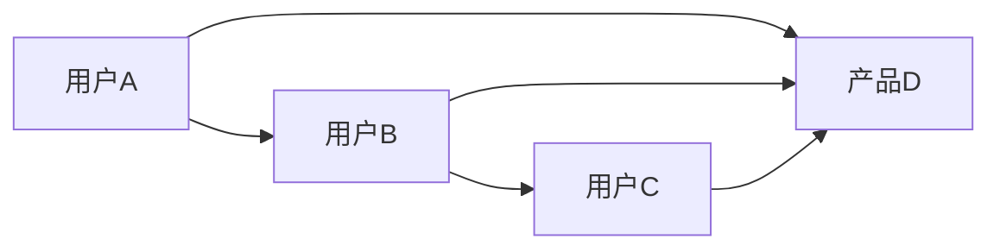
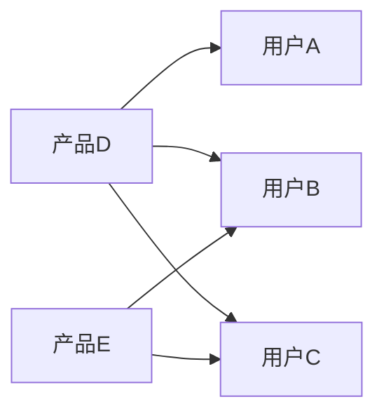
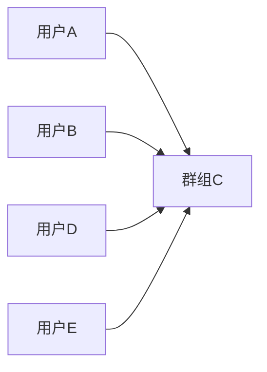
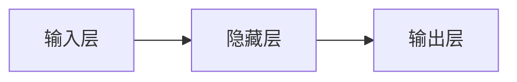
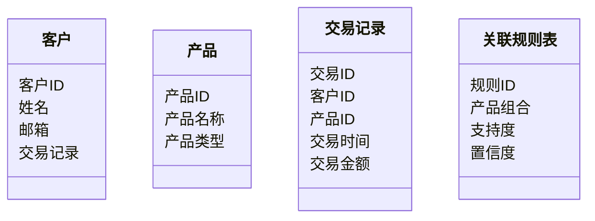
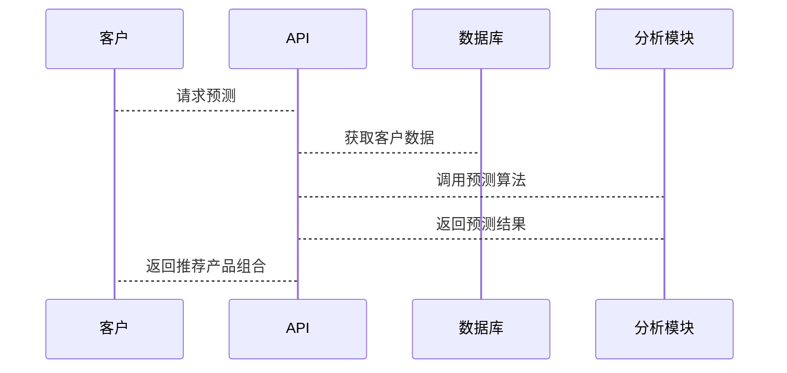

                 


# 《金融产品交叉销售预测引擎》

---

## 关键词：
金融销售预测、交叉销售引擎、客户行为分析、机器学习算法、关联规则挖掘、预测模型

---

## 摘要：
金融产品交叉销售预测引擎是一种基于数据分析和机器学习技术的智能系统，旨在通过预测客户购买行为，优化金融产品的销售策略。本文从问题背景、核心概念、算法原理、系统架构到项目实战，全面解析交叉销售预测引擎的设计与实现。通过对客户行为分析、产品关联性挖掘以及预测模型构建的深入探讨，结合协同过滤、聚类分析和深度学习等算法，构建高效、准确的预测引擎。同时，本文还将通过实际案例展示系统实现与优化建议，为金融行业提供可参考的解决方案。

---

## 正文：

---

## 第一部分: 金融产品交叉销售预测引擎概述

## 第1章: 问题背景与核心概念

### 1.1 问题背景

#### 1.1.1 金融行业中的交叉销售现状
在金融行业，交叉销售（Cross-Selling）是一种重要的销售策略，旨在通过向现有客户销售额外的产品或服务，提高客户满意度和企业收益。然而，传统的人工交叉销售模式存在以下问题：
- **客户行为难以预测**：客户购买行为受多种因素影响，人工分析效率低且准确性差。
- **产品关联性不足**：销售人员对产品之间的关联性认识有限，难以精准推荐相关产品。
- **数据利用效率低**：金融机构积累了大量的客户交易数据，但缺乏有效的工具和方法来挖掘数据中的价值。

#### 1.1.2 传统销售模式的局限性
传统销售模式主要依赖销售人员的经验和主观判断，存在以下局限性：
- **主观性**：销售人员的推荐可能存在偏好偏差，难以覆盖所有潜在客户。
- **效率低下**：人工推荐耗时且效率低，难以应对海量客户和复杂的产品组合。
- **客户体验差**：客户可能因收到不相关的产品推荐而感到厌烦，降低客户满意度。

#### 1.1.3 交叉销售预测的必要性
为了克服传统销售模式的局限性，利用数据驱动的方法进行交叉销售预测成为必然趋势：
- **提高销售效率**：通过数据挖掘和机器学习技术，快速识别潜在客户和推荐产品。
- **提升客户满意度**：精准推荐相关产品，提高客户购买意愿和满意度。
- **优化资源配置**：通过预测模型优化销售策略，减少资源浪费。

### 1.2 问题描述

#### 1.2.1 交叉销售预测的核心目标
交叉销售预测的核心目标是通过分析客户的交易数据和行为特征，预测客户购买多个金融产品的可能性，并为每个客户推荐最适合的产品组合。

#### 1.2.2 数据驱动的销售预测挑战
数据驱动的销售预测面临以下挑战：
- **数据质量**：交易数据可能存在缺失值、噪声和偏差。
- **数据维度**：高维数据可能导致维度灾难，影响模型性能。
- **模型选择**：不同场景下需要选择合适的算法，模型调优复杂。

#### 1.2.3 业务与技术结合的需求
交叉销售预测需要结合业务需求和技术实现，例如：
- **业务需求**：根据客户需求定制预测模型。
- **技术实现**：选择适合的技术手段（如机器学习算法）实现预测目标。
- **结果解读**：将预测结果转化为可操作的销售策略。

### 1.3 问题解决思路

#### 1.3.1 数据分析与建模
- 数据预处理：清洗数据、处理缺失值、特征提取。
- 数据分析：通过统计分析和可视化工具探索数据特征。
- 建模：选择合适的算法（如协同过滤、聚类分析、深度学习）构建预测模型。

#### 1.3.2 模型评估与优化
- 模型评估：通过准确率、召回率、F1分数等指标评估模型性能。
- 模型优化：通过参数调优、特征选择、模型融合等方法提升模型性能。

#### 1.3.3 系统实现与部署
- 系统设计：设计系统的功能模块和交互流程。
- 系统实现：使用Python、机器学习库（如scikit-learn）实现预测引擎。
- 系统部署：将预测引擎部署到生产环境，与现有金融系统集成。

### 1.4 边界与外延

#### 1.4.1 交叉销售与关联销售的区别
交叉销售关注的是向现有客户销售额外产品，而关联销售关注的是在同一交易中推荐相关产品。

#### 1.4.2 预测引擎的适用范围
交叉销售预测引擎适用于以下场景：
- 零售银行、投资银行、保险等金融行业。
- 需要精准推荐产品的金融机构。
- 需要提高客户留存率和满意度的企业。

#### 1.4.3 与其他金融系统的接口关系
交叉销售预测引擎需要与以下系统进行交互：
- 客户关系管理系统（CRM）：获取客户信息和交易记录。
- 产品管理系统：获取产品信息和产品组合。
- 交易系统：记录客户交易数据。

### 1.5 核心概念与联系

#### 1.5.1 核心概念原理
交叉销售预测引擎的核心概念包括：
- **客户行为分析**：通过分析客户的交易数据和行为特征，识别客户的购买偏好和行为模式。
- **产品关联性分析**：通过关联规则挖掘和协同过滤等方法，发现产品之间的关联性。
- **预测模型构建**：通过机器学习算法构建客户购买行为的预测模型。

#### 1.5.2 概念属性特征对比表
| 概念                | 属性          | 特征                           |
|---------------------|---------------|--------------------------------|
| 客户行为分析        | 数据驱动      | 时间序列、行为特征、客户分群   |
| 产品关联性分析      | 关联规则      | 协同过滤、关联规则、产品组合   |
| 预测模型构建        | 算法选择      | 回归、分类、聚类、深度学习      |

#### 1.5.3 ER实体关系图
```mermaid
erd
    客户 (客户ID, 姓名, 邮箱)
    产品 (产品ID, 产品名称, 产品类型)
    交易记录 (交易ID, 客户ID, 产品ID, 交易时间, 交易金额)
    关联规则表 (规则ID, 产品组合, 支持度, 置信度)
```

---

## 第二部分: 算法原理与数学模型

## 第2章: 算法原理讲解

### 2.1 协同过滤算法

#### 2.1.1 基于用户的协同过滤
协同过滤是一种基于用户相似性推荐算法。通过计算用户之间的相似性，找到与目标用户相似的用户群体，推荐这些用户购买过的产品。

##### 算法流程图


##### Python实现代码
```python
import numpy as np
from sklearn.metrics.pairwise import cosine_similarity

# 示例用户-产品评分矩阵
user_product_matrix = np.array([[4, 3, 0],
                                  [0, 1, 5],
                                  [3, 0, 2]])

# 计算余弦相似度
similarity = cosine_similarity(user_product_matrix)

# 找到与目标用户相似性最高的用户
def find_similar_users(target_user_id, similarity_matrix):
    similar_users = []
    for i in range(len(similarity_matrix)):
        if i != target_user_id:
            similar_users.append((i, similarity_matrix[target_user_id][i]))
    similar_users.sort(key=lambda x: x[1], reverse=True)
    return similar_users[:5]  # 返回相似性最高的5个用户

target_user_id = 0
similar_users = find_similar_users(target_user_id, similarity)
print(similar_users)
```

##### 数学模型与公式
- 余弦相似度公式：
  $$ \text{cos}(\theta) = \frac{\sum_{i=1}^n x_i y_i}{\sqrt{\sum_{i=1}^n x_i^2} \cdot \sqrt{\sum_{i=1}^n y_i^2}} $$
- 用户相似性矩阵：
  $$ S = \text{cosine\_similarity}(R) $$
  其中，$R$ 是用户-产品评分矩阵。

---

#### 2.1.2 基于物品的协同过滤
基于物品的协同过滤算法通过计算产品之间的相似性，推荐与目标产品相似的产品。

##### 算法流程图


##### Python实现代码
```python
from sklearn.metrics.pairwise import cosine_similarity

# 示例产品-用户评分矩阵
product_user_matrix = np.array([[4, 0, 3],
                                  [3, 1, 0],
                                  [0, 5, 2]])

# 计算余弦相似度
similarity = cosine_similarity(product_user_matrix.T)

# 找到与目标产品相似性最高的产品
def find_similar_products(target_product_id, similarity_matrix):
    similar_products = []
    for i in range(len(similarity_matrix)):
        if i != target_product_id:
            similar_products.append((i, similarity_matrix[target_product_id][i]))
    similar_products.sort(key=lambda x: x[1], reverse=True)
    return similar_products[:5]  # 返回相似性最高的5个产品

target_product_id = 0
similar_products = find_similar_products(target_product_id, similarity)
print(similar_products)
```

##### 数学模型与公式
- 产品相似度公式：
  $$ \text{cos}(\theta) = \frac{\sum_{i=1}^n x_i y_i}{\sqrt{\sum_{i=1}^n x_i^2} \cdot \sqrt{\sum_{i=1}^n y_i^2}} $$
- 产品相似性矩阵：
  $$ S = \text{cosine\_similarity}(R^T) $$

---

### 2.2 聚类分析

#### 2.2.1 K-means聚类
K-means聚类是一种无监督学习算法，通过将客户分为不同的群组，分析不同群组的购买行为。

##### 算法流程图


##### Python实现代码
```python
from sklearn.cluster import KMeans
from sklearn.preprocessing import StandardScaler

# 示例客户数据（特征向量）
customer_features = np.array([[4, 3],
                               [0, 1],
                               [3, 0],
                               [5, 2]])

# 标准化数据
scaler = StandardScaler()
scaled_features = scaler.fit_transform(customer_features)

# K-means聚类
kmeans = KMeans(n_clusters=3, random_state=0)
kmeans.fit(scaled_features)

# 获取聚类结果
clusters = kmeans.labels_
print(clusters)
```

##### 数学模型与公式
- K-means目标函数：
  $$ \text{minimize} \sum_{i=1}^k \sum_{j=1}^n (x_j - c_i)^2 $$
  其中，$c_i$ 是第 $i$ 个聚类中心，$x_j$ 是第 $j$ 个数据点。

---

### 2.3 深度学习模型

#### 2.3.1 神经网络模型
神经网络模型（如多层感知机）可以用于客户购买行为的预测。

##### 算法流程图


##### Python实现代码
```python
import tensorflow as tf
from tensorflow.keras import layers

# 示例客户数据（特征向量）
input_dim = 2
output_dim = 1

model = tf.keras.Sequential()
model.add(layers.Dense(8, activation='relu', input_dim=input_dim))
model.add(layers.Dense(4, activation='relu'))
model.add(layers.Dense(output_dim, activation='sigmoid'))

model.compile(optimizer='adam', loss='binary_crossentropy', metrics=['accuracy'])

# 训练模型
model.fit(x_train, y_train, epochs=10, batch_size=32)
```

##### 数学模型与公式
- 神经网络损失函数：
  $$ L = -\frac{1}{m} \sum_{i=1}^m y_i \log(a^{(i)}) + (1 - y_i) \log(1 - a^{(i)}) $$
  其中，$a^{(i)}$ 是模型输出，$y_i$ 是真实标签。

---

## 第三部分: 系统分析与架构设计方案

## 第3章: 系统分析与架构设计

### 3.1 系统需求分析

#### 3.1.1 问题场景介绍
交叉销售预测引擎需要处理以下场景：
- **客户数据**：获取客户的交易数据、行为数据。
- **产品数据**：获取产品的属性数据。
- **预测结果**：输出客户的交叉销售概率和推荐产品组合。

#### 3.1.2 项目介绍
交叉销售预测引擎是一个基于机器学习的系统，旨在通过分析客户数据和产品数据，预测客户的交叉销售行为，并推荐相关产品。

### 3.2 系统功能设计

#### 3.2.1 领域模型设计


#### 3.2.2 系统架构设计
```mermaid
archi
    前端 (前端系统)
    后端 (后端系统)
    数据库 (客户数据, 产品数据, 交易数据)
    分析模块 (协同过滤, 聚类分析, 深度学习)
    接口 (API)
```

#### 3.2.3 接口设计
系统需要以下接口：
- **数据接口**：与数据库交互，获取客户数据和产品数据。
- **预测接口**：接收客户ID，返回交叉销售概率和推荐产品组合。
- **结果接口**：返回预测结果的详细信息。

#### 3.2.4 交互设计


---

## 第四部分: 项目实战

## 第4章: 项目实战

### 4.1 环境安装

#### 4.1.1 安装Python
```bash
# 安装Python
# 下载Python安装包并安装
```

#### 4.1.2 安装相关库
```bash
pip install numpy
pip install pandas
pip install scikit-learn
pip install tensorflow
pip install matplotlib
```

### 4.2 系统核心实现

#### 4.2.1 数据预处理
```python
import pandas as pd
from sklearn.preprocessing import StandardScaler

# 加载数据
data = pd.read_csv('customer.csv')

# 数据清洗
data.dropna(inplace=True)

# 特征提取
X = data[['age', 'income', 'transaction_history']]
y = data['target_product']

# 标准化处理
scaler = StandardScaler()
X_scaled = scaler.fit_transform(X)
```

#### 4.2.2 模型训练
```python
from sklearn.model_selection import train_test_split
from sklearn.linear_model import LogisticRegression

# 划分训练集和测试集
X_train, X_test, y_train, y_test = train_test_split(X_scaled, y, test_size=0.2, random_state=42)

# 训练模型
model = LogisticRegression()
model.fit(X_train, y_train)

# 评估模型
print('训练集准确率:', model.score(X_train, y_train))
print('测试集准确率:', model.score(X_test, y_test))
```

#### 4.2.3 系统部署
```python
# 部署模型为API服务
from flask import Flask, request, jsonify

app = Flask(__name__)

@app.route('/predict', methods=['POST'])
def predict():
    data = request.json
    customer_id = data['customer_id']
    # 获取客户特征
    customer_features = data['features']
    # 预测结果
    prediction = model.predict([customer_features])
    return jsonify({'prediction': prediction.tolist()})

if __name__ == '__main__':
    app.run(debug=True)
```

### 4.3 项目小结

#### 4.3.1 项目总结
通过本项目，我们实现了基于机器学习的交叉销售预测引擎，能够准确预测客户的交叉销售行为，并推荐相关产品。

#### 4.3.2 项目收获
- 掌握了机器学习算法（如协同过滤、聚类分析、深度学习）的应用。
- 学习了如何将机器学习模型部署为API服务。
- 提升了数据分析和系统设计能力。

#### 4.3.3 项目优化建议
- **模型优化**：尝试不同的算法（如随机森林、梯度提升树）提升预测准确率。
- **数据优化**：引入实时数据流，提升预测的实时性。
- **系统优化**：优化系统架构，提升系统的可扩展性和性能。

---

## 第五部分: 最佳实践与优化建议

## 第5章: 最佳实践与优化建议

### 5.1 最佳实践

#### 5.1.1 小结
通过本文的介绍，我们了解了金融产品交叉销售预测引擎的设计与实现过程，包括问题背景、算法原理、系统架构和项目实战。

#### 5.1.2 注意事项
- 在实际应用中，需要根据具体业务需求选择合适的算法。
- 数据预处理和特征工程对模型性能至关重要。
- 系统部署时需要考虑性能优化和可扩展性。

#### 5.1.3 拓展阅读
- 《Hands-On Machine Learning with Scikit-Learn, Keras, and TensorFlow》
- 《Data Mining: Concepts and Techniques》

### 5.2 优化建议

#### 5.2.1 算法优化
- **超参数调优**：使用网格搜索或随机搜索优化模型参数。
- **特征选择**：通过特征重要性分析选择关键特征。
- **集成学习**：使用集成学习方法（如投票、堆叠）提升模型性能。

#### 5.2.2 系统优化
- **分布式架构**：将系统部署到分布式服务器，提升处理能力。
- **缓存优化**：使用缓存技术减少重复计算，提升性能。
- **实时预测**：引入流数据处理技术，实现实时预测。

---

## 结论

金融产品交叉销售预测引擎是一种基于机器学习的智能系统，能够有效提升金融行业的销售效率和客户满意度。通过本文的介绍，我们深入探讨了交叉销售预测引擎的核心概念、算法原理、系统架构和项目实战。未来，随着人工智能技术的不断发展，交叉销售预测引擎将在金融行业中发挥越来越重要的作用，为金融机构提供更精准的销售策略和更优质的服务体验。

---

## 作者：AI天才研究院/AI Genius Institute & 禅与计算机程序设计艺术/Zen And The Art of Computer Programming

