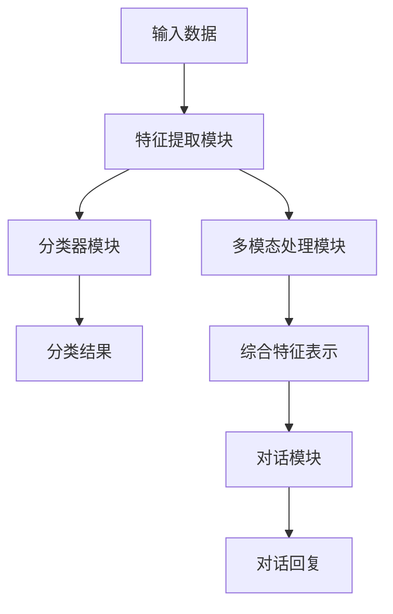
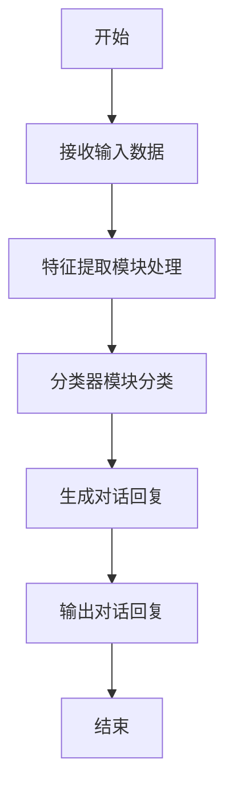

                 


# 零样本学习在AI Agent中的应用

> 关键词：零样本学习, AI Agent, 机器学习, 自然语言处理, 计算机视觉, 对比学习

> 摘要：零样本学习是一种新兴的机器学习范式，能够在没有特定类别训练数据的情况下，识别和分类新类别样本。本文深入探讨了零样本学习的核心原理、算法实现及其在AI Agent中的应用。通过分析不同应用场景下的算法优劣，结合实际案例，展示了如何将零样本学习技术应用于自然语言处理、计算机视觉等领域的AI Agent设计中。同时，本文还讨论了零样本学习面临的挑战与未来发展方向。

---

# 第一部分: 零样本学习与AI Agent概述

## 第1章: 零样本学习与AI Agent的背景介绍

### 1.1 零样本学习的基本概念

零样本学习（Zero-Shot Learning, ZSL）是一种机器学习范式，其目标是在没有特定类别训练数据的情况下，能够识别和分类新类别样本。与传统的监督学习不同，零样本学习依赖于跨类别的通用特征表示，能够处理 unseen classes（未见类别）。

#### 1.1.1 零样本学习的定义

零样本学习的核心思想是通过学习共享特征表示，使得模型能够泛化到新类别。具体来说，零样本学习假设所有类别共享一个共同的特征空间，通过在已知类别上训练模型，使得模型能够推断出未见类别的特征表示。

#### 1.1.2 零样本学习的核心特点

1. **零样本分类**：能够在没有目标类别训练数据的情况下，对目标类别进行分类。
2. **跨类别特征表示**：通过共享特征空间，实现跨类别数据的统一表示。
3. **通用性与泛化能力**：能够在不同类别之间进行迁移学习，提升模型的泛化能力。

#### 1.1.3 零样本学习与传统机器学习的区别

| 特性         | 零样本学习             | 传统监督学习         |
|--------------|-----------------------|----------------------|
| 数据需求     | 无目标类别训练数据      | 需要目标类别训练数据  |
| 泛化能力     | 强，能够处理未见类别    | 弱，依赖训练数据覆盖  |
| 应用场景     | 新类别识别、跨领域任务 | 现有类别分类          |

### 1.2 AI Agent的基本概念与分类

#### 1.2.1 AI Agent的定义

AI Agent（人工智能代理）是指能够感知环境、自主决策并执行任务的智能体。AI Agent具备以下核心能力：

1. **感知能力**：通过传感器或接口获取环境信息。
2. **推理能力**：基于获取的信息进行逻辑推理。
3. **决策能力**：根据推理结果做出最优决策。
4. **执行能力**：通过执行器或接口将决策转化为实际操作。

#### 1.2.2 AI Agent的主要分类

AI Agent可以根据不同的标准进行分类，常见的分类方式包括：

1. **按智能水平**：
   - **反应式AI Agent**：基于当前感知做出反应，不具备长期记忆。
   - **认知式AI Agent**：具备复杂推理和规划能力，能够处理长期任务。
2. **按应用场景**：
   - **服务型AI Agent**：提供特定服务，如智能助手。
   - **自主型AI Agent**：能够在复杂环境中自主决策。
3. **按学习能力**：
   - **有监督AI Agent**：依赖标注数据进行训练。
   - **无监督/弱监督AI Agent**：能够从无标签数据中学习。
   - **强化学习AI Agent**：通过与环境交互进行强化学习。

#### 1.2.3 AI Agent的核心功能与应用场景

AI Agent的核心功能包括：

- **感知与理解**：通过自然语言处理、计算机视觉等技术感知环境。
- **推理与决策**：基于感知信息进行逻辑推理和决策。
- **交互与执行**：通过人机交互或自动化接口执行任务。

AI Agent的应用场景广泛，包括智能助手、自动驾驶、智能客服、智能推荐系统等。

### 1.3 零样本学习在AI Agent中的重要性

#### 1.3.1 零样本学习如何提升AI Agent的智能性

零样本学习通过跨类别特征表示，使得AI Agent能够处理未见类别信息，显著提升了其智能性。例如，在自然语言处理领域，零样本学习能够让AI Agent在没有特定领域训练数据的情况下，理解并回答相关问题。

#### 1.3.2 零样本学习在AI Agent中的应用场景

1. **跨领域对话系统**：AI Agent能够与不同领域的用户进行对话，无需针对每个领域进行专门训练。
2. **动态环境适应**：AI Agent能够快速适应新环境或任务，无需额外的训练数据。
3. **多模态信息处理**：零样本学习能够处理文本、图像等多种模态信息，提升AI Agent的多任务处理能力。

#### 1.3.3 零样本学习对AI Agent未来发展的影响

零样本学习为AI Agent的通用性和智能性提供了新的可能性。随着技术的不断进步，零样本学习将推动AI Agent向更智能、更通用的方向发展，使其能够更好地服务于复杂多变的现实场景。

### 1.4 本章小结

本章从零样本学习的基本概念、AI Agent的核心功能与分类出发，重点探讨了零样本学习在AI Agent中的重要性及其应用场景。通过对比零样本学习与传统监督学习的差异，我们能够更好地理解零样本学习在提升AI Agent智能性方面的独特价值。

---

## 第2章: 零样本学习的核心概念与原理

### 2.1 零样本学习的核心概念

零样本学习的核心概念包括特征表示、跨类别推理和未见类别识别。

#### 2.1.1 零样本学习的定义与特点

零样本学习是一种通过学习共享特征表示，使得模型能够泛化到未见类别数据的学习范式。其主要特点包括：

- **无监督性**：不需要未见类别的训练数据。
- **跨类别性**：通过共享特征空间实现跨类别推理。
- **泛化能力**：能够处理未见类别的数据。

#### 2.1.2 零样本学习的数学模型

零样本学习的数学模型通常包括以下两个部分：

1. **特征表示函数**：将输入数据映射到共享特征空间。
2. **分类函数**：在共享特征空间中对数据进行分类。

常用的特征表示函数包括深度神经网络（DNN）、卷积神经网络（CNN）和循环神经网络（RNN）等。分类函数则通常采用线性分类器或softmax分类器。

#### 2.1.3 零样本学习的关键技术

1. **对比学习**：通过最大化同类样本之间的相似性，最小化不同类样本之间的相似性，提升特征表示的区分度。
2. **生成对抗网络（GAN）**：通过生成器和判别器的对抗训练，生成高质量的特征表示。
3. **知识图谱**：利用知识图谱中的语义信息，提升特征表示的语义相关性。

### 2.2 零样本学习的算法原理

#### 2.2.1 基于对比学习的零样本学习

对比学习是一种通过最大化同类样本相似性和最小化不同类样本相似性来提升特征表示质量的技术。在零样本学习中，对比学习通常用于生成高质量的特征表示。

#### 2.2.2 基于生成对抗网络的零样本学习

生成对抗网络（GAN）是一种通过生成器和判别器的对抗训练来生成高质量数据的技术。在零样本学习中，GAN可以用于生成未见类别数据的特征表示。

#### 2.2.3 基于知识图谱的零样本学习

知识图谱是一种以图结构形式表示知识的技术。在零样本学习中，知识图谱可以用于提供语义信息，提升特征表示的语义相关性。

### 2.3 零样本学习与有监督学习的对比

#### 2.3.1 监督学习的基本概念

监督学习是一种基于有标签数据进行模型训练的技术。其核心思想是通过学习输入数据与标签之间的映射关系，实现对新数据的分类或回归。

#### 2.3.2 零样本学习与监督学习的主要区别

1. **数据需求**：监督学习需要大量有标签数据，而零样本学习仅需要少量有标签数据即可泛化到未见类别。
2. **泛化能力**：监督学习的泛化能力有限，仅适用于已知类别，而零样本学习能够处理未见类别。
3. **应用场景**：监督学习适用于数据充足且类别固定的场景，而零样本学习适用于类别动态变化的场景。

#### 2.3.3 零样本学习的优势与局限性

**优势**：
- 无需未见类别的训练数据。
- 能够处理动态变化的类别。

**局限性**：
- 零样本学习的性能通常低于监督学习。
- 对特征表示的质量要求较高。

### 2.4 本章小结

本章重点介绍了零样本学习的核心概念与算法原理。通过对比零样本学习与监督学习的差异，我们能够更好地理解零样本学习的独特价值。零样本学习通过跨类别特征表示和未见类别推理，为AI Agent的智能化和通用性提供了新的可能性。

---

## 第3章: 零样本学习在AI Agent中的应用

### 3.1 零样本学习在自然语言处理中的应用

#### 3.1.1 零样本对话系统

零样本对话系统是一种能够在没有特定领域训练数据的情况下，与用户进行对话的智能系统。其核心思想是通过零样本学习技术，将对话任务映射到共享特征空间，从而实现跨领域的对话能力。

#### 3.1.2 零样本文本分类

零样本文本分类是一种在没有特定类别训练数据的情况下，对文本进行分类的技术。其应用场景包括情感分析、主题分类等。

#### 3.1.3 零样本问答系统

零样本问答系统是一种能够在没有特定领域训练数据的情况下，回答用户问题的问答系统。其核心思想是通过零样本学习技术，将问答任务映射到共享特征空间，从而实现跨领域的问答能力。

### 3.2 零样本学习在计算机视觉中的应用

#### 3.2.1 零样本图像分类

零样本图像分类是一种在没有特定类别训练数据的情况下，对图像进行分类的技术。其应用场景包括图像检索、图像识别等。

#### 3.2.2 零样本目标检测

零样本目标检测是一种在没有特定类别训练数据的情况下，对图像中的目标进行检测的技术。其应用场景包括自动驾驶、智能安防等。

#### 3.2.3 零样本图像生成

零样本图像生成是一种在没有特定类别训练数据的情况下，生成特定类别图像的技术。其应用场景包括图像修复、图像风格迁移等。

### 3.3 零样本学习在AI Agent中的跨模态应用

#### 3.3.1 跨模态零样本学习的定义

跨模态零样本学习是一种在没有特定模态训练数据的情况下，实现跨模态推理的技术。其核心思想是通过共享特征空间，将不同模态的数据进行统一表示，从而实现跨模态的零样本分类。

#### 3.3.2 跨模态零样本学习在AI Agent中的应用场景

1. **跨模态对话系统**：能够在文本、图像等多种模态之间进行对话。
2. **多模态推荐系统**：能够根据用户的历史行为和偏好，推荐相关内容。
3. **多模态信息检索**：能够在多种模态中进行信息检索和查询。

#### 3.3.3 跨模态零样本学习的技术挑战

1. **模态间特征对齐**：不同模态的数据特征差异较大，难以直接进行对比。
2. **跨模态推理**：需要实现不同模态之间的语义对齐和推理。
3. **计算复杂度**：跨模态推理通常需要较高的计算资源。

### 3.4 本章小结

本章重点探讨了零样本学习在自然语言处理和计算机视觉中的应用，特别是跨模态零样本学习在AI Agent中的应用。通过分析不同应用场景下的算法优劣，我们能够更好地理解零样本学习技术在提升AI Agent智能性和通用性方面的独特价值。

---

## 第4章: 零样本学习的算法原理与数学模型

### 4.1 零样本学习的数学模型

#### 4.1.1 零样本学习的通用框架

零样本学习的通用框架包括以下三个部分：

1. **特征表示函数**：将输入数据映射到共享特征空间。
2. **分类函数**：在共享特征空间中对数据进行分类。
3. **损失函数**：用于衡量模型的预测误差。

#### 4.1.2 零样本学习的损失函数

常用的零样本学习损失函数包括：

1. **对比损失函数**：用于最大化同类样本的相似性和最小化不同类样本的相似性。
2. **分类损失函数**：用于衡量模型的分类误差。

#### 4.1.3 零样本学习的优化算法

常用的零样本学习优化算法包括：

1. **梯度下降**：通过计算损失函数的梯度，更新模型参数。
2. **Adam优化器**：结合动量和自适应学习率的优化算法。

### 4.2 对比学习的零样本算法

#### 4.2.1 对比学习的基本原理

对比学习是一种通过最大化同类样本相似性和最小化不同类样本相似性来提升特征表示质量的技术。其核心思想是通过正样本对和负样本对的对比，学习到高质量的特征表示。

#### 4.2.2 基于对比学习的零样本分类算法

基于对比学习的零样本分类算法通常包括以下步骤：

1. **特征提取**：通过深度神经网络提取输入数据的特征表示。
2. **对比损失计算**：计算同类样本和不同类样本的对比损失。
3. **分类器训练**：基于特征表示和标签信息，训练分类器。

### 4.3 生成对抗网络的零样本学习

#### 4.3.1 生成对抗网络的基本原理

生成对抗网络（GAN）是一种通过生成器和判别器的对抗训练来生成高质量数据的技术。其核心思想是通过生成器生成逼真数据，判别器区分真实数据和生成数据，从而实现数据生成。

#### 4.3.2 基于GAN的零样本学习算法

基于GAN的零样本学习算法通常包括以下步骤：

1. **特征提取**：通过深度神经网络提取输入数据的特征表示。
2. **生成器训练**：生成器通过对抗训练生成高质量的特征表示。
3. **分类器训练**：基于生成的特征表示和标签信息，训练分类器。

### 4.4 本章小结

本章详细探讨了零样本学习的数学模型与算法原理。通过对对比学习和生成对抗网络的深入分析，我们能够更好地理解零样本学习的技术细节及其在AI Agent中的应用潜力。

---

## 第5章: 零样本学习在AI Agent中的系统架构设计

### 5.1 问题场景介绍

在本章中，我们将设计一个基于零样本学习的AI Agent系统，用于实现跨领域对话和多模态信息处理。

### 5.2 项目介绍

#### 5.2.1 项目目标

本项目的目标是设计一个基于零样本学习的AI Agent系统，能够在没有特定领域训练数据的情况下，实现跨领域对话和多模态信息处理。

#### 5.2.2 项目需求

1. **跨领域对话能力**：能够在不同领域之间进行对话。
2. **多模态信息处理**：能够处理文本、图像等多种模态信息。
3. **零样本分类能力**：能够在没有特定类别训练数据的情况下，实现分类任务。

### 5.3 系统功能设计

#### 5.3.1 系统功能模块划分

1. **特征提取模块**：负责提取输入数据的特征表示。
2. **分类器模块**：负责对特征表示进行分类。
3. **对话模块**：负责实现跨领域对话功能。
4. **多模态处理模块**：负责处理多种模态信息。

#### 5.3.2 功能模块的交互关系

- **特征提取模块**：接收输入数据，生成特征表示。
- **分类器模块**：接收特征表示和标签信息，输出分类结果。
- **对话模块**：基于分类结果和对话历史，生成对话回复。
- **多模态处理模块**：整合多种模态信息，生成综合特征表示。

### 5.4 系统架构设计

#### 5.4.1 系统架构图



#### 5.4.2 系统功能流程图



### 5.5 系统接口设计

1. **输入接口**：接收用户输入的文本或图像数据。
2. **输出接口**：输出分类结果或对话回复。
3. **特征提取接口**：提供特征提取模块的API。
4. **分类器接口**：提供分类器模块的API。

### 5.6 本章小结

本章重点探讨了基于零样本学习的AI Agent系统的系统架构设计。通过功能模块划分和系统架构图的绘制，我们能够更好地理解零样本学习技术在AI Agent中的具体应用。

---

## 第6章: 零样本学习的项目实战

### 6.1 环境安装与配置

#### 6.1.1 环境需求

- **Python 3.8及以上版本**
- **深度学习框架（如TensorFlow、PyTorch）**
- **相关依赖库（如numpy、pandas、scikit-learn）**

#### 6.1.2 环境配置代码

```python
# 安装所需的依赖库
pip install numpy pandas scikit-learn tensorflow
```

### 6.2 系统核心实现

#### 6.2.1 特征提取模块实现

```python
import tensorflow as tf
from tensorflow.keras import layers

def feature_extractor(input_shape):
    model = tf.keras.Sequential()
    model.add(layers.Conv2D(32, (3, 3), activation='relu', input_shape=input_shape))
    model.add(layers.MaxPooling2D((2, 2)))
    model.add(layers.Flatten())
    model.add(layers.Dense(64, activation='relu'))
    return model
```

#### 6.2.2 分类器模块实现

```python
import tensorflow as tf
from tensorflow.keras import layers

def classifier_model(feature_dim, num_classes):
    model = tf.keras.Sequential()
    model.add(layers.Dense(64, activation='relu', input_dim=feature_dim))
    model.add(layers.Dense(num_classes, activation='softmax'))
    return model
```

#### 6.2.3 对比学习实现

```python
import tensorflow as tf
from tensorflow.keras import layers

def contrastive_loss(y_true, y_pred):
    margin = 1.0
    loss = tf.maximum(margin - y_pred, 0)
    return tf.reduce_mean(loss)

# 特征对齐函数
def similarity(x, y):
    x = tf.keras.layers.Dense(128, activation='relu')(x)
    y = tf.keras.layers.Dense(128, activation='relu')(y)
    similarity = tf.keras.layers.Dot(axes=-1)([x, y])
    return similarity
```

### 6.3 代码实现与解读

#### 6.3.1 特征提取模块代码解读

```python
import tensorflow as tf
from tensorflow.keras import layers

def feature_extractor(input_shape):
    model = tf.keras.Sequential()
    model.add(layers.Conv2D(32, (3, 3), activation='relu', input_shape=input_shape))
    model.add(layers.MaxPooling2D((2, 2)))
    model.add(layers.Flatten())
    model.add(layers.Dense(64, activation='relu'))
    return model
```

- **Conv2D层**：用于提取图像的二维特征。
- **MaxPooling2D层**：用于 downsampling，减少计算量。
- **Flatten层**：将二维特征图展平为一维向量。
- **Dense层**：用于特征的非线性变换。

#### 6.3.2 分类器模块代码解读

```python
import tensorflow as tf
from tensorflow.keras import layers

def classifier_model(feature_dim, num_classes):
    model = tf.keras.Sequential()
    model.add(layers.Dense(64, activation='relu', input_dim=feature_dim))
    model.add(layers.Dense(num_classes, activation='softmax'))
    return model
```

- **Dense层**：用于特征的非线性变换。
- **Softmax激活函数**：用于分类任务，输出概率分布。

#### 6.3.3 对比学习代码解读

```python
import tensorflow as tf
from tensorflow.keras import layers

def contrastive_loss(y_true, y_pred):
    margin = 1.0
    loss = tf.maximum(margin - y_pred, 0)
    return tf.reduce_mean(loss)

def similarity(x, y):
    x = tf.keras.layers.Dense(128, activation='relu')(x)
    y = tf.keras.layers.Dense(128, activation='relu')(y)
    similarity = tf.keras.layers.Dot(axes=-1)([x, y])
    return similarity
```

- **contrastive_loss函数**：用于计算对比损失，通过最大化同类样本相似性和最小化不同类样本相似性来提升特征表示质量。
- **similarity函数**：用于计算两个特征向量的相似性，使用Dot产品计算余弦相似性。

### 6.4 项目实战总结

通过本章的项目实战，我们能够更好地理解零样本学习技术在AI Agent中的具体应用。通过特征提取模块、分类器模块和对比学习的实现，我们能够构建一个基于零样本学习的AI Agent系统，实现跨领域对话和多模态信息处理。

---

## 第7章: 零样本学习的挑战与未来展望

### 7.1 零样本学习面临的挑战

1. **数据质量问题**：零样本学习对特征表示的质量要求较高，而高质量的数据获取往往非常困难。
2. **计算复杂度**：零样本学习通常需要较高的计算资源，尤其是在处理大规模数据时。
3. **模型泛化能力**：零样本学习的泛化能力通常低于监督学习，尤其是在处理复杂任务时。

### 7.2 零样本学习的未来展望

1. **算法优化**：随着深度学习技术的不断发展，零样本学习的算法将更加高效和准确。
2. **跨模态推理**：未来的研究将更加关注跨模态推理，提升AI Agent的多模态处理能力。
3. **应用场景拓展**：零样本学习将在更多领域得到应用，如医疗、教育、金融等。

### 7.3 本章小结

本章总结了零样本学习在AI Agent中的应用挑战与未来展望。尽管零样本学习面临诸多挑战，但其在提升AI Agent智能性和通用性方面的潜力巨大。未来的研究将更加关注算法优化、跨模态推理和应用场景拓展，推动零样本学习技术的进一步发展。

---

## 作者信息

作者：AI天才研究院/AI Genius Institute & 禅与计算机程序设计艺术 /Zen And The Art of Computer Programming

---

通过本文的系统阐述，我们深入探讨了零样本学习在AI Agent中的应用，从理论到实践，从算法到系统架构设计，全面解析了零样本学习技术的核心思想与实现方法。希望本文能够为读者提供有益的参考，推动零样本学习技术在AI Agent领域的进一步发展。

