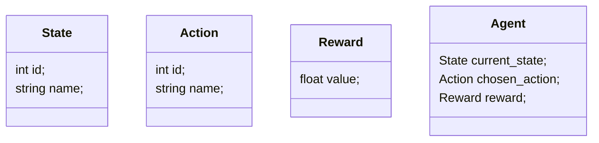
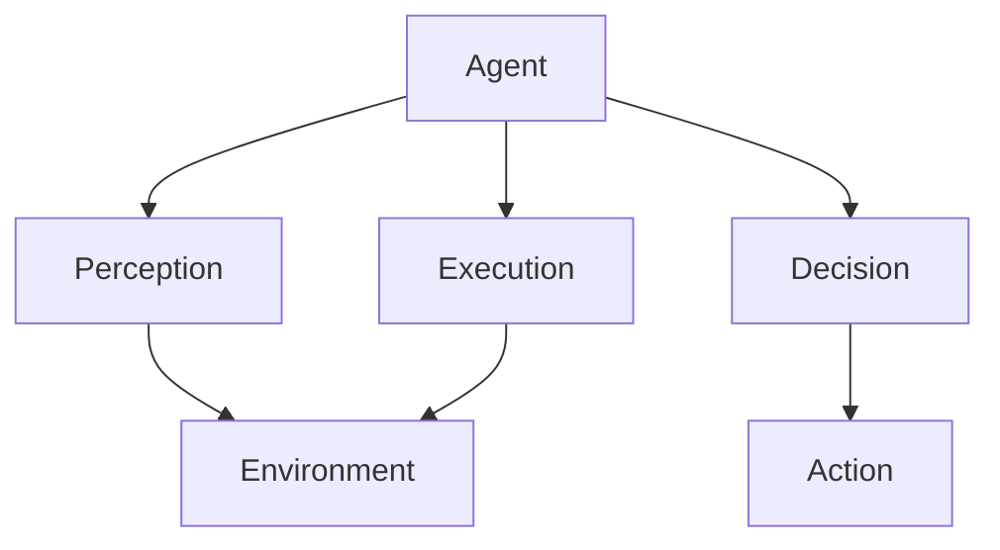
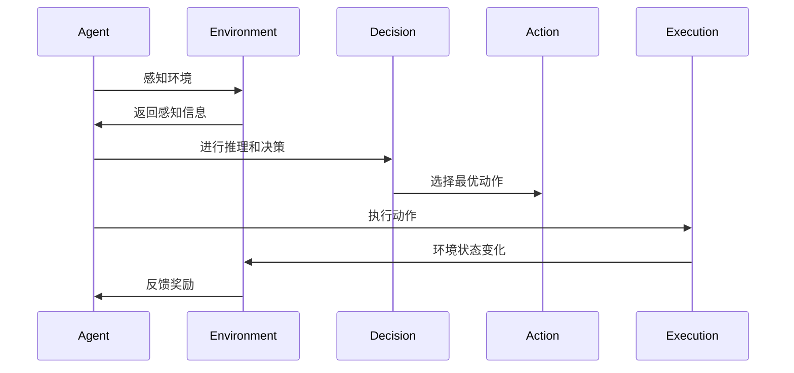

                 


# AI Agent开发实践：关键步骤和最佳实践

> **关键词**: AI Agent, 人工智能, 机器学习, 强化学习, 系统架构, 项目实战

> **摘要**: 本文深入探讨了AI Agent的开发实践，从核心概念、算法原理到系统架构设计，再到项目实战，全面解析了AI Agent的开发流程和关键步骤。通过详细分析强化学习算法、系统架构设计、项目实战案例以及最佳实践，本文为读者提供了从理论到实践的全面指导。

---

# 正文

## 第1章: AI Agent概述

### 1.1 AI Agent的基本概念

#### 1.1.1 什么是AI Agent
AI Agent（人工智能代理）是一种能够感知环境、自主决策并执行任务的智能实体。它可以是一个软件程序、机器人或其他智能系统，旨在帮助用户完成特定任务或提供服务。

#### 1.1.2 AI Agent的类型
AI Agent可以分为以下几种类型：
- **基于规则的Agent**：通过预定义的规则进行决策。
- **基于逻辑推理的Agent**：利用逻辑推理来解决问题。
- **基于强化学习的Agent**：通过与环境互动来学习最优策略。
- **基于机器学习的Agent**：利用机器学习模型进行预测和决策。

#### 1.1.3 AI Agent的应用场景
AI Agent广泛应用于以下场景：
- **智能助手**：如Siri、Alexa等。
- **自动驾驶**：如特斯拉的自动驾驶系统。
- **游戏AI**：如电子游戏中的智能NPC。
- **机器人控制**：如工业机器人和家庭服务机器人。

### 1.2 AI Agent与传统软件的区别

#### 1.2.1 传统软件的特点
传统软件依赖于固定的逻辑和规则，无法自主学习和适应环境。

#### 1.2.2 AI Agent的独特性
AI Agent具有自主性、反应性、目标导向性和学习能力。

#### 1.2.3 两者的对比分析
| 特性 | 传统软件 | AI Agent |
|------|-----------|-----------|
| 自主性 | 无 | 有 |
| 学习能力 | 无 | 有 |
| 环境适应性 | 无 | 有 |
| 决策能力 | 无 | 有 |

### 1.3 AI Agent的背景与发展

#### 1.3.1 AI技术的演进
从早期的专家系统到现在的深度学习，AI技术不断进步。

#### 1.3.2 Agent概念的起源
Agent概念起源于人工智能研究，早期用于多智能体系统。

#### 1.3.3 当前AI Agent的发展现状
当前，强化学习和深度学习技术推动了AI Agent的发展。

---

## 第2章: AI Agent的核心概念与原理

### 2.1 AI Agent的结构与功能

#### 2.1.1 感知层
感知层负责获取环境信息，如传感器数据和用户输入。

#### 2.1.2 决策层
决策层基于感知信息进行推理和决策。

#### 2.1.3 执行层
执行层负责将决策转化为具体行动。

### 2.2 AI Agent的工作原理

#### 2.2.1 信息获取与处理
AI Agent通过传感器或其他数据源获取信息，并进行处理和分析。

#### 2.2.2 感知与推理
AI Agent利用逻辑推理或机器学习模型对信息进行推理。

#### 2.2.3 决策与执行
AI Agent根据推理结果制定行动方案，并通过执行层执行。

### 2.3 AI Agent的数学模型

#### 2.3.1 状态空间模型
状态空间模型描述了AI Agent可能的状态及其转移关系。

#### 2.3.2 行为选择模型
行为选择模型基于当前状态选择最优行为。

#### 2.3.3 奖励函数与优化目标
奖励函数定义了AI Agent在特定行为下的奖励值，优化目标是最大化累积奖励。

---

## 第3章: AI Agent的核心算法与实现

### 3.1 常见AI Agent算法

#### 3.1.1 基于规则的AI Agent
基于规则的AI Agent通过预定义规则进行决策。

#### 3.1.2 基于逻辑推理的AI Agent
基于逻辑推理的AI Agent利用逻辑推理进行决策。

#### 3.1.3 基于强化学习的AI Agent
基于强化学习的AI Agent通过与环境互动学习最优策略。

### 3.2 强化学习算法实现

#### 3.2.1 Q-Learning算法
Q-Learning是一种经典的强化学习算法，通过更新Q值表来学习最优策略。

#### 3.2.2 DQN算法
DQN（Deep Q-Network）算法结合了深度学习和强化学习，通过神经网络近似Q值函数。

#### 3.2.3 算法实现的代码示例
以下是一个简单的Q-Learning算法实现示例：

```python
import numpy as np

class QLearning:
    def __init__(self, state_space, action_space, alpha=0.1, gamma=0.9):
        self.state_space = state_space
        self.action_space = action_space
        self.alpha = alpha
        self.gamma = gamma
        self.q_table = np.zeros((state_space, action_space))
    
    def choose_action(self, state):
        return np.argmax(self.q_table[state])
    
    def update_q_table(self, state, action, reward, next_state):
        current_q = self.q_table[state, action]
        next_max_q = np.max(self.q_table[next_state])
        self.q_table[state, action] = current_q + self.alpha * (reward + self.gamma * next_max_q - current_q)
```

#### 3.3 算法原理的数学模型
Q-Learning的数学公式如下：
$$ Q(s,a) = Q(s,a) + \alpha [r + \gamma \max Q(s',a') - Q(s,a)] $$

---

## 第4章: AI Agent的系统架构与设计

### 4.1 系统架构概述

#### 4.1.1 系统架构设计目标
系统架构设计目标是实现AI Agent的功能需求。

#### 4.1.2 系统架构设计原则
- **模块化**：各模块独立实现特定功能。
- **可扩展性**：便于功能扩展和升级。
- **可维护性**：便于调试和维护。

#### 4.1.3 系统架构设计的步骤
1. **需求分析**：明确系统功能需求。
2. **模块划分**：将系统划分为功能模块。
3. **接口设计**：定义模块之间的接口。
4. **流程设计**：设计系统的流程图。

### 4.2 系统架构设计

#### 4.2.1 领域模型类图
以下是一个简单的领域模型类图：



#### 4.2.2 系统架构图
以下是一个系统的架构图：



#### 4.2.3 系统交互流程图
以下是一个系统的交互流程图：



---

## 第5章: AI Agent的项目实战

### 5.1 环境安装

#### 5.1.1 安装Python
安装Python 3.x版本。

#### 5.1.2 安装依赖库
安装以下依赖库：
```bash
pip install numpy matplotlib
```

### 5.2 核心代码实现

#### 5.2.1 AI Agent核心代码
以下是一个简单的AI Agent实现：

```python
import numpy as np

class AI_Agent:
    def __init__(self, state_space, action_space):
        self.state_space = state_space
        self.action_space = action_space
        self.q_table = np.zeros((state_space, action_space))
    
    def choose_action(self, state):
        return np.argmax(self.q_table[state])
    
    def update_q_table(self, state, action, reward, next_state):
        current_q = self.q_table[state, action]
        next_max_q = np.max(self.q_table[next_state])
        self.q_table[state, action] = current_q + 0.1 * (reward + 0.9 * next_max_q - current_q)
```

#### 5.2.2 环境模拟代码
以下是一个简单的环境模拟代码：

```python
import numpy as np

class Environment:
    def __init__(self, state_space):
        self.state_space = state_space
        self.current_state = 0
    
    def reset(self):
        self.current_state = 0
        return self.current_state
    
    def step(self, action):
        if action == 1:
            reward = 1
            next_state = 1
        else:
            reward = 0
            next_state = 0
        return next_state, reward
```

### 5.3 项目实战案例

#### 5.3.1 案例分析
以下是一个简单的迷宫导航案例。

#### 5.3.2 代码实现与解读
以下是一个迷宫导航的代码实现：

```python
import numpy as np

class MazeEnvironment:
    def __init__(self, size):
        self.size = size
        self.current_state = (0, 0)
    
    def reset(self):
        self.current_state = (0, 0)
        return self.current_state
    
    def step(self, action):
        if action == 0:
            new_state = (self.current_state[0], self.current_state[1] + 1)
        elif action == 1:
            new_state = (self.current_state[0] + 1, self.current_state[1])
        elif action == 2:
            new_state = (self.current_state[0], self.current_state[1] - 1)
        elif action == 3:
            new_state = (self.current_state[0] - 1, self.current_state[1])
        
        if new_state[0] < 0 or new_state[0] >= self.size or new_state[1] < 0 or new_state[1] >= self.size:
            reward = -1
            done = True
        else:
            if new_state == (self.size - 1, self.size - 1):
                reward = 10
                done = True
            else:
                reward = 0
                done = False
        
        return new_state, reward, done

# 初始化环境和AI Agent
env = MazeEnvironment(5)
agent = AI_Agent(25, 4)

# 训练过程
for episode in range(100):
    state = env.reset()
    while not done:
        action = agent.choose_action(state)
        next_state, reward, done = env.step(action)
        agent.update_q_table(state, action, reward, next_state)
```

#### 5.3.3 案例分析与总结
通过迷宫导航案例，我们可以看到AI Agent如何通过强化学习算法逐步学会导航。

---

## 第6章: AI Agent开发的最佳实践

### 6.1 开发过程中的注意事项

#### 6.1.1 环境依赖管理
确保所有依赖库版本一致。

#### 6.1.2 数据预处理
对数据进行归一化或标准化处理。

#### 6.1.3 模型调优
通过交叉验证和网格搜索进行模型调优。

### 6.2 项目小结

#### 6.2.1 核心知识点回顾
- AI Agent的基本概念
- 强化学习算法实现
- 系统架构设计

#### 6.2.2 开发经验总结
- 代码复用性
- 系统可扩展性
- 调试与维护

### 6.3 未来发展趋势

#### 6.3.1 强化学习的优化
- 更高效的算法
- 更好的模型压缩

#### 6.3.2 多智能体协作
- 多智能体协同
- 联合学习

#### 6.3.3 新兴技术的融合
- 区块链
- 边缘计算

---

## 作者

作者：AI天才研究院/AI Genius Institute & 禅与计算机程序设计艺术/Zen And The Art of Computer Programming

---

# 附录

## 附录A: 常用AI Agent算法列表

| 算法名称 | 类型 | 描述 |
|----------|------|------|
| Q-Learning | 强化学习 | 经典强化学习算法 |
| DQN | 深度强化学习 | 基于深度神经网络的强化学习算法 |
| A* | 优化算法 | 最短路径搜索算法 |
| BFS | 图搜索算法 | 广度优先搜索算法 |

## 附录B: AI Agent开发工具推荐

| 工具名称 | 类型 | 描述 |
|----------|------|------|
| TensorFlow | 深度学习框架 | 开源深度学习框架 |
| PyTorch | 深度学习框架 | 开源深度学习框架 |
| OpenAI Gym | 环境模拟 | 强化学习环境模拟库 |
| ROS | 机器人操作系统 | 机器人开发框架 |

---

## 附录C: AI Agent开发资源

| 资源类型 | 资源名称 | 链接 |
|----------|----------|------|
| 在线课程 | "AI Agent开发实战" | [课程链接](#) |
| 技术博客 | "强化学习入门" | [博客链接](#) |
| 书籍 | 《深度学习》 | [书籍链接](#) |

---

**全文完**

