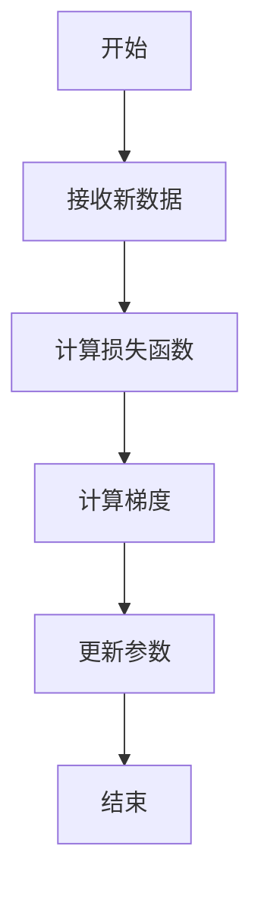
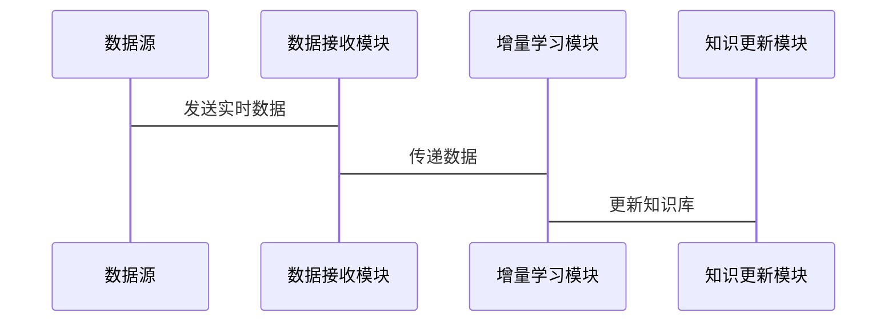

                 


# AI Agent的增量式概念学习与知识更新

## 关键词：AI Agent, 增量式学习, 知识更新, 概念学习, 算法原理

## 摘要：本文详细探讨了AI Agent在增量式概念学习与知识更新方面的核心原理和实现方法。通过分析增量式学习的背景、核心概念，结合具体的算法流程和系统架构设计，本文为读者提供了从理论到实践的全面指导。通过实际项目案例，进一步展示了如何将增量式概念学习与知识更新应用于AI Agent的设计与实现中，帮助读者更好地理解和掌握这一领域的关键技术。

---

# 第一部分: 背景介绍

## 第1章: 问题背景与核心概念

### 1.1 问题背景

#### 1.1.1 当前AI Agent面临的挑战

随着人工智能技术的快速发展，AI Agent（智能体）在各个领域的应用越来越广泛。然而，AI Agent在实际应用中面临着动态环境和不确定性问题的挑战。传统的批量学习方法难以应对实时更新的需求，而增量式学习和知识更新机制为AI Agent提供了持续进化的能力。

#### 1.1.2 增量式学习的必要性

增量式学习是一种基于在线学习的策略，能够在数据流中逐步更新模型。相比于传统的批量学习，增量式学习具有以下优势：

1. **实时性**：能够实时处理数据流，适应动态变化的环境。
2. **高效性**：不需要重新训练整个模型，仅更新部分参数。
3. **灵活性**：适用于数据分布变化的场景。

#### 1.1.3 知识更新的现实需求

知识更新是指AI Agent能够根据新数据调整其知识库，保持知识的准确性和完整性。在实际应用中，知识更新的需求主要体现在以下方面：

1. **动态环境适应**：面对环境变化，AI Agent需要不断更新知识以保持准确性。
2. **领域知识扩展**：随着领域知识的扩展，AI Agent需要不断吸收新的概念和信息。
3. **错误修正**：当旧知识与实际情况不符时，AI Agent需要及时更新知识以避免错误。

### 1.2 核心概念与定义

#### 1.2.1 AI Agent的基本概念

AI Agent是一种能够感知环境并采取行动以实现目标的智能实体。它可以分为以下几类：

1. **简单反射型Agent**：基于当前感知做出反应，不依赖知识库。
2. **基于模型的反射型Agent**：利用内部模型和知识库进行推理和决策。
3. **目标驱动型Agent**：根据目标选择最优行动方案。
4. **效用驱动型Agent**：通过最大化效用函数来优化决策。

#### 1.2.2 增量式概念学习的定义

增量式概念学习是指AI Agent在接收到新的数据或信息时，逐步更新和扩展其概念库的过程。与批量学习不同，增量式学习能够在数据流中动态更新模型，适应变化的环境。

#### 1.2.3 知识更新的机制与特点

知识更新是指AI Agent通过新数据或反馈调整其知识库的过程。其主要机制包括：

1. **在线更新**：基于实时数据流进行模型参数调整。
2. **增量推理**：根据新信息更新知识库中的概念和关系。
3. **反馈驱动**：通过用户反馈或结果评估调整知识。

### 1.3 问题描述

#### 1.3.1 AI Agent学习中的增量式问题

AI Agent在面对动态环境时，需要解决以下问题：

1. **数据稀疏性**：新数据可能不足以覆盖所有概念。
2. **概念漂移**：数据分布的变化可能导致模型失效。
3. **知识碎片化**：新信息可能导致知识库的不一致。

#### 1.3.2 知识更新的动态性与挑战

知识更新面临以下挑战：

1. **高效性**：如何在有限时间内完成知识更新。
2. **准确性**：如何确保更新后的知识准确无误。
3. **一致性**：如何保证更新后的知识与现有知识一致。

#### 1.3.3 增量式学习与知识更新的结合

增量式学习与知识更新的结合可以实现AI Agent的动态进化，具体包括：

1. **概念扩展**：根据新数据扩展概念库。
2. **知识优化**：通过反馈优化知识表示。
3. **动态推理**：根据更新的知识进行推理和决策。

### 1.4 问题解决与边界

#### 1.4.1 增量式学习的解决方案

增量式学习的解决方案包括：

1. **在线学习算法**：如随机梯度下降（SGD）。
2. **增量特征学习**：如增量主成分分析（IPCA）。
3. **概念漂移检测**：如使用滑动窗口方法检测数据分布变化。

#### 1.4.2 知识更新的边界与限制

知识更新的边界包括：

1. **计算资源限制**：更新过程需要考虑计算资源的限制。
2. **知识依赖性**：某些概念可能依赖于其他概念的更新。
3. **更新频率**：更新频率需要平衡准确性和实时性。

#### 1.4.3 核心概念的结构与组成

核心概念的结构包括：

1. **概念层**：基本概念及其属性。
2. **关系层**：概念之间的关系。
3. **实例层**：具体实例及其属性值。

---

# 第二部分: 核心概念与联系

## 第2章: 核心概念与联系

### 2.1 核心概念原理

#### 2.1.1 增量式学习的原理

增量式学习的原理包括以下步骤：

1. **数据流接收**：AI Agent接收实时数据流。
2. **模型更新**：基于新数据更新模型参数。
3. **概念扩展**：根据新数据扩展概念库。

#### 2.1.2 知识更新的机制

知识更新的机制包括：

1. **数据驱动更新**：根据新数据自动更新知识。
2. **反馈驱动更新**：根据用户反馈调整知识。
3. **推理驱动更新**：根据推理结果调整知识。

#### 2.1.3 概念间的关系与依赖

概念间的关系包括：

1. **包含关系**：如“汽车”包含“引擎”。
2. **并列关系**：如“水果”包括“苹果”和“香蕉”。
3. **关联关系**：如“医生”与“患者”之间的关联。

### 2.2 概念属性对比

#### 2.2.1 增量式学习与传统学习的对比

| 特性               | 增量式学习                 | 传统学习                 |
|--------------------|--------------------------|--------------------------|
| 数据获取方式       | 实时数据流               | 批量数据                 |
| 训练时间           | 在线实时                 | 离线批量                 |
| 模型更新方式       | 部分参数更新             | 重新训练整个模型         |

#### 2.2.2 知识更新与知识保持的对比

| 特性               | 知识更新                 | 知识保持                 |
|--------------------|--------------------------|--------------------------|
| 目标               | 根据新数据调整知识       | 保持现有知识不变         |
| 驻入方式           | 动态调整                 | 静态保持                 |
| 应用场景           | 动态环境                 | 稳定环境                 |

#### 2.2.3 概念间的关系分析

概念间的关系分析可以通过ER图（实体关系图）来展示。以下是使用Mermaid绘制的ER图：

```mermaid
erDiagram
    customer[客户] {
        code : string
        name : string
        age : integer
    }
    order[订单] {
        id : integer
        amount : integer
        date : date
    }
    product[产品] {
        id : integer
        name : string
        price : integer
    }
    customer -- order : 下单
    order -- product : 订单包含的产品
```

### 2.3 ER实体关系图

ER实体关系图用于描述概念之间的关系。以下是使用Mermaid绘制的概念关系图：

```mermaid
erDiagram
    概念 {
        id : integer
        name : string
        属性 : string
    }
    关系 {
        id : integer
        name : string
        类型 : string
    }
    概念 -- 关系 : 参与
```

---

# 第三部分: 算法原理讲解

## 第3章: 算法原理与流程

### 3.1 算法原理

#### 3.1.1 增量式学习算法的概述

增量式学习算法是一种基于在线学习的策略，其核心思想是逐步更新模型参数以适应新数据。常用的增量式学习算法包括随机梯度下降（SGD）和AdaGrad。

#### 3.1.2 知识更新的算法原理

知识更新算法通过以下步骤实现：

1. **接收新数据**：AI Agent接收新数据或反馈。
2. **调整知识库**：根据新数据调整知识库中的概念和关系。
3. **验证与优化**：通过验证数据优化知识库。

#### 3.1.3 算法的数学模型与公式

增量式学习的数学模型可以表示为：

$$
w_{t+1} = w_t - \eta \nabla J(w_t)
$$

其中，\( w_t \) 表示第 \( t \) 次迭代的模型参数，\( \eta \) 表示学习率，\( \nabla J(w_t) \) 表示损失函数的梯度。

### 3.2 算法流程图

以下是增量式学习算法的流程图，使用Mermaid绘制：



### 3.3 算法实现

以下是增量式学习的Python代码实现：

```python
import numpy as np

def incremental_learning(data_stream, model, learning_rate=0.1):
    for batch in data_stream:
        # 计算损失函数
        loss = model.compute_loss(batch)
        # 计算梯度
        gradient = model.compute_gradient(batch)
        # 更新参数
        model.update_parameters(gradient, learning_rate)
    return model
```

---

# 第四部分: 系统分析与架构设计

## 第4章: 系统分析与架构设计

### 4.1 问题场景介绍

AI Agent需要在动态环境中实时处理数据流，同时保持知识的准确性。这要求系统具备高效的增量式学习和知识更新能力。

### 4.2 系统功能设计

系统功能设计包括：

1. **数据接收模块**：接收实时数据流。
2. **增量学习模块**：基于新数据更新模型。
3. **知识更新模块**：调整知识库以适应新数据。
4. **结果验证模块**：验证更新后的模型和知识库的准确性。

### 4.3 系统架构设计

以下是系统的架构设计，使用Mermaid绘制：


### 4.4 系统接口设计

系统接口设计包括：

1. **数据接口**：与数据源对接，接收实时数据流。
2. **模型接口**：与增量学习模块对接，传递模型参数和梯度。
3. **知识库接口**：与知识更新模块对接，传递概念和关系。

### 4.5 系统交互设计

以下是系统交互的序列图，使用Mermaid绘制：



---

# 第五部分: 项目实战

## 第5章: 项目实战

### 5.1 环境安装

项目实战需要以下环境：

1. **Python 3.6+**
2. **NumPy库**
3. **Scikit-learn库**

### 5.2 系统核心实现

以下是系统核心实现的代码：

```python
class IncrementalLearner:
    def __init__(self, model):
        self.model = model

    def update_model(self, data, learning_rate=0.1):
        # 计算损失函数
        loss = self.model.compute_loss(data)
        # 计算梯度
        gradient = self.model.compute_gradient(data)
        # 更新参数
        self.model.update_parameters(gradient, learning_rate)
        return self.model
```

### 5.3 代码应用解读与分析

代码解读：

1. **类定义**：`IncrementalLearner`类封装了增量式学习的逻辑。
2. **初始化**：初始化时传入模型实例。
3. **更新模型**：根据新数据更新模型参数。

### 5.4 实际案例分析

以下是一个实际案例分析：

假设我们有一个AI Agent用于股票市场的预测，每天接收新的股票数据。AI Agent需要根据新数据更新其预测模型。

```python
# 初始化模型
model = LinearRegressor()
# 初始化增量学习器
learner = IncrementalLearner(model)
# 模拟接收新数据
new_data = next(data_stream)
# 更新模型
updated_model = learner.update_model(new_data, learning_rate=0.1)
```

### 5.5 项目小结

通过上述代码实现，我们可以看到增量式学习和知识更新在实际项目中的应用。AI Agent能够实时更新模型参数，保持预测的准确性。

---

# 第六部分: 最佳实践

## 第6章: 最佳实践

### 6.1 小结

本文详细探讨了AI Agent在增量式概念学习与知识更新方面的核心原理和实现方法。通过理论分析和实际案例，展示了如何将增量式学习和知识更新应用于AI Agent的设计与实现中。

### 6.2 注意事项

在实际应用中，需要注意以下几点：

1. **数据质量**：确保新数据的准确性和完整性。
2. **模型选择**：根据具体场景选择合适的增量式学习算法。
3. **资源管理**：合理分配计算资源，确保实时更新的高效性。

### 6.3 拓展阅读

建议读者进一步阅读以下内容：

1. **增量式学习的最新研究**：如《Incremental Learning: Theory and Algorithms》。
2. **知识图谱的动态更新**：如《Dynamic Knowledge Graphs: Representation, Reasoning, and Applications》。

---

# 作者：AI天才研究院/AI Genius Institute & 禅与计算机程序设计艺术 /Zen And The Art of Computer Programming

