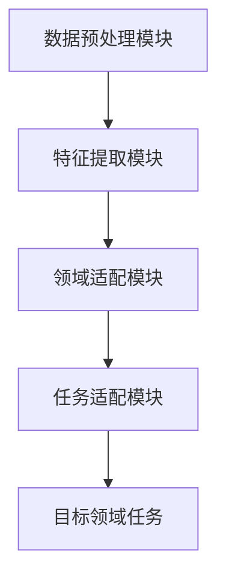
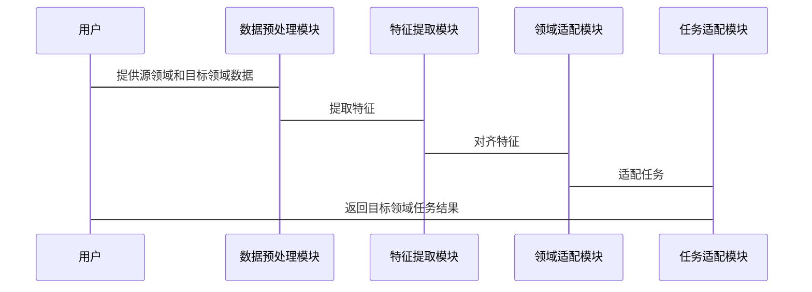

                 


# AI Agent的领域迁移学习：从通用LLM到专业模型

> **关键词**：AI Agent, 领域迁移学习, 大语言模型, 迁移学习, 模型微调

> **摘要**：  
> 随着大语言模型（LLM）的广泛应用，AI Agent在不同领域的迁移学习成为提升其专业性和实用性的关键。本文系统地探讨了从通用LLM到专业模型的迁移学习方法，涵盖领域迁移学习的背景、核心概念、算法原理、系统架构及项目实战，旨在帮助读者深入理解并掌握AI Agent的领域迁移学习技术。

---

# 第一章: AI Agent与领域迁移学习概述

## 1.1 AI Agent的基本概念

### 1.1.1 AI Agent的定义与特点
AI Agent（智能体）是指能够感知环境、自主决策并执行任务的智能实体。其特点包括：
- **自主性**：无需外部干预，自主完成任务。
- **反应性**：能实时感知环境变化并做出反应。
- **目标导向性**：基于目标驱动行为。
- **社会性**：能与其他Agent或人类进行交互协作。

### 1.1.2 AI Agent的分类与应用场景
AI Agent可分为**简单反射型**、**基于模型的反射型**、**目标驱动型**和**实用驱动型**。其应用场景包括：
- 自然语言处理：对话系统、文本生成。
- 机器人控制：自主导航、机械臂操作。
- 智能推荐：个性化推荐、智能决策支持。

### 1.1.3 从通用LLM到专业模型的必要性
通用LLM（如GPT）虽然在广泛领域表现出色，但在特定领域（如医学、法律）可能缺乏专业性。通过领域迁移学习，可以将通用模型迁移到专业领域，提升其在特定任务中的性能。

## 1.2 领域迁移学习的背景与意义

### 1.2.1 领域迁移学习的定义
领域迁移学习（Domain Adaptation）是指将从一个领域（源领域）学习到的知识应用到另一个领域（目标领域）的过程。其核心在于解决源领域与目标领域数据分布差异的问题。

### 1.2.2 领域迁移学习的核心问题
- 数据分布差异：源领域和目标领域的数据分布可能不同。
- 标签空间差异：目标领域可能有新的标签或任务。
- 数据稀缺性：目标领域可能数据量小或标注困难。

### 1.2.3 领域迁移学习在AI Agent中的作用
- 提高AI Agent在特定领域的适应能力。
- 降低对大量目标领域数据的依赖。
- 提升AI Agent的泛化能力和实用性。

## 1.3 本章小结
本章介绍了AI Agent的基本概念、分类及应用场景，并重点阐述了领域迁移学习的背景与意义，为后续内容奠定了基础。

---

# 第二章: 领域迁移学习的核心概念与联系

## 2.1 领域适应的基本原理

### 2.1.1 数据分布的差异性
源领域和目标领域的数据分布可能不同，具体表现为：
- 特征分布差异：例如，医学领域的数据可能包含更多专业术语，而通用领域的数据可能更广泛。
- 标签分布差异：目标领域可能对某些标签的权重不同。

### 2.1.2 领域适应的目标函数
领域适应的目标是最小化源领域和目标领域之间的分布差异，同时最大化目标领域任务的性能。目标函数通常包含两部分：
- **分布对齐项**：衡量源领域和目标领域数据的相似性。
- **任务适配项**：优化目标领域任务的性能。

### 2.1.3 领域适应的关键技术
- **特征提取**：提取对领域无关的特征，降低分布差异。
- **对抗训练**：通过生成对抗网络（GAN）对齐源领域和目标领域的特征分布。
- **任务适配**：根据目标领域任务调整模型参数。

## 2.2 领域迁移学习的核心算法

### 2.2.1 基于特征提取的迁移学习
- **特征提取器**：通过深度学习模型提取领域无关的特征。
- **领域对齐**：通过对抗训练或对齐损失对齐源领域和目标领域的特征分布。

### 2.2.2 基于任务适配的迁移学习
- **任务适配器**：根据目标领域任务调整模型输出。
- **参数微调**：在目标领域数据上微调模型参数。

### 2.2.3 对抗迁移学习
- **对抗网络**：通过生成对抗网络（GAN）对齐源领域和目标领域的特征分布。
- **领域判别器**：用于区分源领域和目标领域数据。

## 2.3 领域迁移学习的挑战与解决方案

### 2.3.1 数据稀缺性问题
- **数据增强**：通过数据增强技术增加目标领域数据量。
- **无监督/半监督学习**：利用未标注数据进行迁移学习。

### 2.3.2 领域差异性问题
- **领域对齐技术**：通过对抗训练或对齐损失对齐特征分布。
- **多领域迁移学习**：处理多个源领域和目标领域的情况。

### 2.3.3 解决方案与优化策略
- **预训练-微调框架**：在通用领域预训练模型，然后在目标领域进行微调。
- **跨领域对抗训练**：通过对抗训练同时对齐多个领域特征分布。

## 2.4 本章小结
本章详细讲解了领域迁移学习的核心概念与联系，分析了其在AI Agent中的应用，并总结了领域迁移学习的挑战与解决方案。

---

# 第三章: 领域迁移学习的算法实现

## 3.1 基于特征提取的迁移学习算法

### 3.1.1 特征提取的基本原理
- **特征提取器**：通过深度神经网络提取领域无关的特征。
- **领域对齐**：通过对抗训练或对齐损失对齐源领域和目标领域的特征分布。

### 3.1.2 基于深度学习的特征提取
- **模型结构**：使用如BERT、GPT等预训练模型提取特征。
- **对齐方法**：通过对抗训练或对齐损失优化特征对齐。

### 3.1.3 特征对齐技术
- **对抗训练**：使用生成对抗网络（GAN）对齐特征分布。
- **对齐损失**：通过衡量源领域和目标领域特征的相似性优化对齐。

## 3.2 基于任务适配的迁移学习算法

### 3.2.1 任务适配的基本原理
- **任务适配器**：根据目标领域任务调整模型输出。
- **参数微调**：在目标领域数据上微调模型参数。

### 3.2.2 基于对抗训练的任务适配
- **对抗网络**：通过对抗训练优化任务适配。
- **领域判别器**：用于区分源领域和目标领域数据。

### 3.2.3 任务权重调整方法
- **任务权重**：根据目标领域任务的重要性调整权重。
- **多任务学习**：同时优化多个任务的性能。

## 3.3 领域迁移学习的数学模型

### 3.3.1 领域适应的数学公式
- **源领域损失**：$L_s = \mathbb{E}_{x_s, y_s \sim P_s}[ \mathcal{L}(f(x_s), y_s)]$
- **目标领域损失**：$L_t = \mathbb{E}_{x_t, y_t \sim P_t}[ \mathcal{L}(f(x_t), y_t)]$
- **领域对齐损失**：$L_d = \mathbb{E}_{x_s, x_t \sim P_s, P_t}[ \mathcal{D}(f(x_s), f(x_t))]$

### 3.3.2 对抗训练的数学模型
- **生成器损失**：$L_G = \mathbb{E}_{x_s, x_t \sim P_s, P_t}[ \mathcal{D}(f(x_s), f(x_t))]$
- **判别器损失**：$L_D = \mathbb{E}_{x_s \sim P_s}[ \mathcal{D}(f(x_s))] + \mathbb{E}_{x_t \sim P_t}[1 - \mathcal{D}(f(x_t))]$

### 3.3.3 任务适配的数学表达
- **任务适配器**：$f_{\theta}(x) = W_{\theta}f_{\phi}(x) + b_{\theta}$
- **优化目标**：$\min_{\theta} \sum_{i=1}^n \mathcal{L}(f_{\theta}(x_i), y_i)$

## 3.4 算法实现的Python代码示例

### 3.4.1 特征提取代码示例
```python
import torch
import torch.nn as nn

class FeatureExtractor(nn.Module):
    def __init__(self, feature_dim):
        super(FeatureExtractor, self).__init__()
        self.fc = nn.Linear(feature_dim, 128)
        self.dropout = nn.Dropout(0.5)
        self.relu = nn.ReLU()

    def forward(self, x):
        x = self.fc(x)
        x = self.dropout(x)
        x = self.relu(x)
        return x

# 使用对抗训练对齐特征分布
def对抗训练(源特征, 目标特征):
    discriminator = nn.Linear(128, 1)
    loss_fn = nn.BCEWithLogitsLoss()
    optimizer = torch.optim.Adam(discriminator.parameters(), lr=1e-4)
    
    for _ in range(100):
        # 源领域特征
        x_s = 源特征
        y_s = torch.ones(x_s.size(0), 1)
        
        # 目标领域特征
        x_t = 目标特征
        y_t = torch.zeros(x_t.size(0), 1)
        
        # 前向传播
        out_s = discriminator(x_s)
        out_t = discriminator(x_t)
        
        # 计算损失
        loss = loss_fn(out_s, y_s) + loss_fn(out_t, y_t)
        
        # 反向传播和优化
        optimizer.zero_grad()
        loss.backward()
        optimizer.step()
```

### 3.4.2 任务适配代码示例
```python
class TaskAdapter(nn.Module):
    def __init__(self, input_size, output_size):
        super(TaskAdapter, self).__init__()
        self.fc = nn.Linear(input_size, output_size)
        self.dropout = nn.Dropout(0.5)
        self.relu = nn.ReLU()

    def forward(self, x):
        x = self.fc(x)
        x = self.dropout(x)
        x = self.relu(x)
        return x

# 在目标领域数据上微调模型
def微调模型(model, 目标数据集):
    optimizer = torch.optim.Adam(model.parameters(), lr=1e-4)
    loss_fn = nn.CrossEntropyLoss()
    
    for epoch in range(10):
        for batch_x, batch_y in 目标数据集:
            outputs = model(batch_x)
            loss = loss_fn(outputs, batch_y)
            optimizer.zero_grad()
            loss.backward()
            optimizer.step()
```

## 3.5 本章小结
本章详细讲解了领域迁移学习的算法实现，包括基于特征提取和任务适配的迁移学习方法，并通过Python代码示例展示了如何实现这些算法。

---

# 第四章: 系统分析与架构设计

## 4.1 系统功能设计

### 4.1.1 领域模型设计
- **领域实体**：如医疗领域的病灶、法律领域的条款。
- **领域关系**：如医疗领域的症状与疾病的关系。

### 4.1.2 系统功能模块
- **数据预处理模块**：处理源领域和目标领域的数据。
- **特征提取模块**：提取领域无关的特征。
- **领域适配模块**：对齐源领域和目标领域的特征分布。
- **任务适配模块**：根据目标领域任务调整模型输出。

## 4.2 系统架构设计

### 4.2.1 系统架构图


### 4.2.2 接口设计
- **数据输入接口**：接收源领域和目标领域的数据。
- **模型接口**：提供特征提取和任务适配的接口。
- **结果输出接口**：输出目标领域任务的结果。

### 4.2.3 交互序列图


## 4.3 本章小结
本章从系统角度分析了领域迁移学习的实现，设计了系统的功能模块和架构，并通过Mermaid图展示了系统的交互过程。

---

# 第五章: 项目实战

## 5.1 环境安装与配置

### 5.1.1 安装依赖
```bash
pip install torch torchvision numpy matplotlib
```

### 5.1.2 配置运行环境
- **硬件配置**：建议使用GPU加速。
- **软件配置**：确保Python版本为3.6以上，PyTorch版本适配。

## 5.2 核心代码实现

### 5.2.1 数据预处理代码
```python
import torch
from torch.utils.data import Dataset, DataLoader

class CustomDataset(Dataset):
    def __init__(self, data, labels):
        self.data = data
        self.labels = labels
        
    def __len__(self):
        return len(self.data)
    
    def __getitem__(self, idx):
        return self.data[idx], self.labels[idx]

# 加载数据
train_data = CustomDataset(源数据, 源标签)
train_loader = DataLoader(train_data, batch_size=32, shuffle=True)
```

### 5.2.2 领域适配代码
```python
class对抗训练器:
    def __init__(self, feature_dim):
        self.disc = nn.Linear(feature_dim, 1)
        
    def forward(self, x):
        return self.disc(x)
    
# 初始化对抗训练器
对抗器 = 对抗训练器(128)
optimizer = torch.optim.Adam(对抗器.parameters(), lr=1e-4)
loss_fn = nn.BCEWithLogitsLoss()
    
# 对抗训练
for epoch in range(100):
    for batch_x, _ in 数据加载器:
        outputs = 对抗器(batch_x)
        loss = loss_fn(outputs, torch.ones_like(outputs))
        optimizer.zero_grad()
        loss.backward()
        optimizer.step()
```

### 5.2.3 任务适配代码
```python
class任务适配器(nn.Module):
    def __init__(self, input_size, output_size):
        super(任务适配器, self).__init__()
        self.fc = nn.Linear(input_size, output_size)
        self.dropout = nn.Dropout(0.5)
        self.relu = nn.ReLU()
        
    def forward(self, x):
        x = self.fc(x)
        x = self.dropout(x)
        x = self.relu(x)
        return x

# 初始化任务适配器
适配器 = 任务适配器(128, 输出维度)
optimizer = torch.optim.Adam(适配器.parameters(), lr=1e-4)
loss_fn = nn.CrossEntropyLoss()
    
# 微调模型
for epoch in range(10):
    for batch_x, batch_y in 目标数据集:
        outputs = 适配器(batch_x)
        loss = loss_fn(outputs, batch_y)
        optimizer.zero_grad()
        loss.backward()
        optimizer.step()
```

## 5.3 案例分析与详细解读

### 5.3.1 案例分析
假设我们有一个医疗领域的目标任务，需要将通用的GPT模型迁移到医疗领域。我们首先通过对抗训练对齐GPT在通用领域和医疗领域的特征分布，然后在医疗领域数据上微调模型，最终在医疗领域任务上取得更好的性能。

### 5.3.2 实际案例解读
- **数据准备**：收集通用领域和医疗领域的文本数据。
- **特征提取**：使用GPT模型提取文本特征。
- **领域适配**：通过对抗训练对齐通用领域和医疗领域的特征分布。
- **任务适配**：在医疗领域数据上微调模型，使其适应医疗领域任务。

## 5.4 项目小结
本章通过一个实际案例展示了领域迁移学习的实现过程，包括环境配置、核心代码实现和案例分析，帮助读者更好地理解和应用领域迁移学习技术。

---

# 第六章: 最佳实践与小结

## 6.1 最佳实践

### 6.1.1 数据预处理
- 确保数据质量，去除噪声。
- 对目标领域数据进行适当的增强。

### 6.1.2 模型选择
- 根据任务需求选择合适的模型架构。
- 使用预训练模型可以显著提升迁移效果。

### 6.1.3 超参数调优
- 调整学习率、批量大小、正则化参数等超参数。
- 使用网格搜索或随机搜索优化超参数。

### 6.1.4 评估指标
- 使用准确率、召回率、F1分数等指标评估模型性能。
- 在目标领域数据上进行交叉验证。

## 6.2 小结

### 6.2.1 核心内容回顾
- AI Agent的领域迁移学习从通用LLM到专业模型。
- 领域迁移学习的核心概念与算法实现。
- 系统设计与项目实战。

### 6.2.2 注意事项
- 数据分布差异可能影响迁移效果。
- 需要根据具体任务调整模型和算法。

### 6.2.3 拓展阅读
- 深入研究对抗迁移学习的最新进展。
- 探索多领域迁移学习的方法。

## 6.3 本章小结
本章总结了领域迁移学习的最佳实践，并展望了未来的研究方向，为读者提供了进一步学习和实践的指导。

---

# 附录

## 附录A: 领域迁移学习的数学公式汇总

- **领域适应损失**：$L_d = \mathbb{E}_{x_s, x_t \sim P_s, P_t}[ \mathcal{D}(f(x_s), f(x_t))]$
- **对抗训练损失**：$L_{adv} = \mathbb{E}_{x_s \sim P_s}[ \mathcal{D}(f(x_s))] + \mathbb{E}_{x_t \sim P_t}[1 - \mathcal{D}(f(x_t))]$
- **任务适配损失**：$L_t = \mathbb{E}_{x_t \sim P_t}[ \mathcal{L}(f(x_t), y_t)]$

---

## 附录B: 领域迁移学习的Python库与工具

- **Transformers库**：用于加载和微调预训练模型。
- **Adversarial Attacks and Defenses**：用于实现对抗训练。
- **Scikit-learn**：用于数据预处理和评估。

---

## 附录C: 领域迁移学习的论文推荐

1. **Domain-Adaptive Neural Networks**（ICML 2014）
2. **A Survey on Deep Learning for Domain Adaptation**（ACM Computing Surveys, 2020）
3. **Adversarial Training for Domain Adaptation**（CVPR 2017）

---

# 作者

作者：AI天才研究院/AI Genius Institute & 禅与计算机程序设计艺术 /Zen And The Art of Computer Programming

