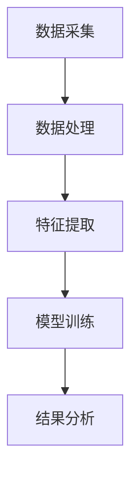
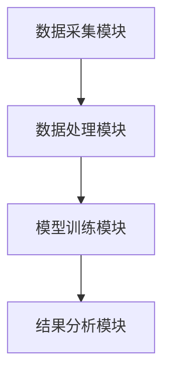
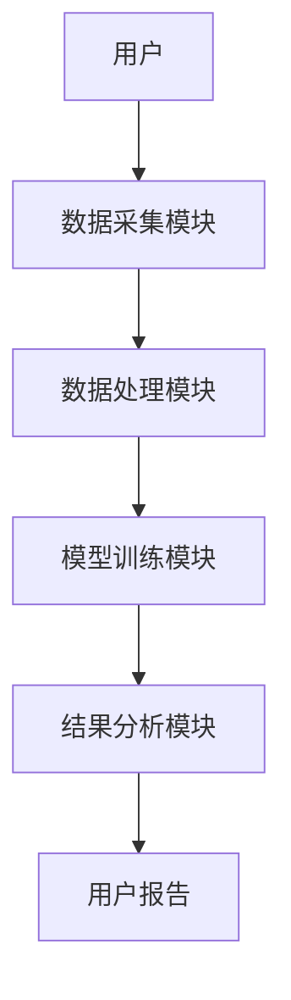
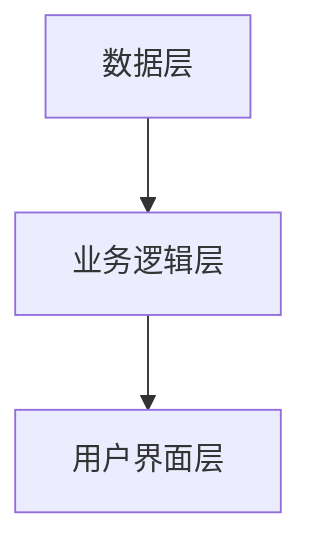

                 


# AI协作分析公司环境责任：可持续价值投资新维度

## 关键词：AI协作分析，环境责任，可持续价值投资，企业责任评估，AI驱动

## 摘要：本文探讨了AI在公司环境责任与可持续价值投资中的应用，分析了AI协作分析的核心概念、算法实现和系统架构，并通过具体案例展示了AI如何帮助投资者和企业实现环境责任目标。文章从背景、理论、实践等多个维度展开，为读者提供了全面的技术解读。

---

# 第1章: 环境责任与可持续价值投资背景

## 1.1 环境责任的定义与重要性

### 1.1.1 环境责任的核心概念

环境责任是指企业在经营过程中对环境保护和社会责任的承担，包括减少碳排放、节约资源、保护生态系统等。企业的环境责任不仅影响企业的声誉，还影响其长期的可持续发展能力。

### 1.1.2 可持续发展与企业责任的关系

可持续发展强调经济、社会和环境的协调统一，企业责任是实现可持续发展的关键。企业通过履行环境责任，可以减少对环境的负面影响，同时提升社会形象和经济效益。

### 1.1.3 环境责任对企业价值的影响

环境责任直接影响企业的信用评级、投资吸引力和市场竞争力。越来越多的投资者将环境因素纳入投资决策，成为企业价值的重要评估维度。

## 1.2 可持续价值投资的定义与特点

### 1.2.1 可持续价值投资的定义

可持续价值投资是指投资者在选择投资标的时，不仅关注财务回报，还考虑企业的环境、社会和治理（ESG）因素。通过投资那些在环境责任、社会责任和公司治理方面表现良好的企业，实现长期的价值增长。

### 1.2.2 可持续价值投资的核心特征

- **环境因素**：关注企业的碳排放、资源利用效率等环境指标。
- **社会因素**：关注企业的劳动权益、社会贡献等社会指标。
- **治理因素**：关注企业的董事会结构、高管薪酬、公司治理透明度等治理指标。

### 1.2.3 可持续价值投资与传统投资的区别

传统投资主要关注企业的财务指标和市场表现，而可持续价值投资则将非财务指标（如ESG）作为重要考量。AI技术的应用使得可持续价值投资更加数据化、智能化。

## 1.3 AI在环境责任与可持续价值投资中的作用

### 1.3.1 AI技术在环境数据分析中的应用

AI可以通过自然语言处理（NLP）技术分析企业的社会责任报告，提取关键的环境数据。同时，机器学习算法可以预测企业的环境表现，帮助企业制定更有效的环保策略。

### 1.3.2 AI在企业环境责任评估中的优势

- **数据处理能力**：AI可以快速处理大量非结构化数据，如企业社会责任报告、新闻报道等。
- **预测能力**：通过机器学习模型，AI可以预测企业的环境风险和潜在的环境问题。
- **个性化建议**：AI可以根据企业的具体情况，提供个性化的环境责任改进建议。

### 1.3.3 AI驱动的可持续价值投资新维度

AI技术使得投资者能够更精准地评估企业的环境责任表现，从而优化投资组合，降低投资风险。同时，AI还可以帮助企业在环境责任方面进行自我评估和优化。

## 1.4 本章小结

本章介绍了环境责任和可持续价值投资的基本概念，分析了AI在其中的作用和优势。通过AI技术，企业可以更高效地履行环境责任，投资者可以更科学地进行可持续价值投资。

---

# 第2章: AI协作分析的核心概念与原理

## 2.1 AI协作分析的基本原理

### 2.1.1 数据驱动的环境责任分析

AI协作分析依赖于大量数据，包括企业的环境表现数据、社会责任报告、新闻报道等。通过对这些数据的分析，AI可以识别企业的环境风险和机遇。

### 2.1.2 AI算法在可持续价值评估中的应用

AI算法，如支持向量机（SVM）、随机森林（Random Forest）和神经网络（Neural Networks），可以用于预测企业的环境表现和投资价值。

### 2.1.3 AI协作分析的系统架构

AI协作分析系统通常包括数据采集、数据处理、模型训练和结果分析四个模块。系统架构需要高效的数据处理能力和强大的计算能力。

## 2.2 AI协作分析的关键技术

### 2.2.1 自然语言处理在企业责任报告中的应用

NLP技术可以自动提取企业社会责任报告中的关键信息，如碳排放数据、环保投入等。这些信息可以用于企业的环境表现评估。

### 2.2.2 机器学习在环境数据预测中的作用

机器学习算法可以预测企业的环境表现，帮助企业识别潜在的环境风险。例如，可以通过时间序列分析预测企业的碳排放趋势。

### 2.2.3 图神经网络在企业关联分析中的应用

图神经网络可以分析企业之间的关联关系，识别行业内的环境表现优秀的企业，为投资者提供参考。

## 2.3 AI协作分析的数学模型与公式

### 2.3.1 环境影响评估的数学模型

环境影响评估模型通常包括多个指标，如碳排放强度、资源利用效率等。可以通过加权平均的方法计算企业的环境影响指数。

$$
\text{环境影响指数} = \sum_{i=1}^{n} w_i \cdot x_i
$$

其中，$w_i$ 是指标 $i$ 的权重，$x_i$ 是指标 $i$ 的表现值。

### 2.3.2 可持续价值的量化公式

可持续价值可以通过企业的财务表现、环境表现和社会责任表现综合评估。常用的方法是将各维度的得分加权求和。

$$
\text{可持续价值指数} = w_e \cdot E + w_s \cdot S + w_g \cdot G
$$

其中，$E$ 是环境表现得分，$S$ 是社会责任得分，$G$ 是公司治理得分，$w_e$、$w_s$、$w_g$ 是各维度的权重。

### 2.3.3 AI协作分析的算法流程图（Mermaid）



---

## 2.4 本章小结

本章详细介绍了AI协作分析的核心概念和关键技术，包括数据驱动的环境责任分析、AI算法在可持续价值评估中的应用以及系统的数学模型和流程图。

---

# 第3章: AI协作分析的系统架构与设计

## 3.1 系统功能模块设计

### 3.1.1 数据采集模块

数据采集模块负责从企业社会责任报告、新闻报道等来源获取环境相关数据。

### 3.1.2 数据处理模块

数据处理模块对采集到的数据进行清洗、转换和标准化处理。

### 3.1.3 模型训练模块

模型训练模块使用机器学习算法训练环境表现预测模型。

### 3.1.4 结果分析模块

结果分析模块对模型预测结果进行分析，生成环境责任评估报告。

## 3.2 系统架构设计

### 3.2.1 分层架构设计

系统的分层架构包括数据层、业务逻辑层和用户界面层。

### 3.2.2 微服务架构设计

系统采用微服务架构，每个功能模块独立运行，便于扩展和维护。

### 3.2.3 数据流与交互设计（Mermaid）



## 3.3 系统接口设计

### 3.3.1 数据接口规范

数据接口需要支持多种数据格式，如CSV、JSON等。

### 3.3.2 API接口设计

API接口设计需要考虑安全性、可扩展性和易用性。

### 3.3.3 用户交互界面设计

用户交互界面需要简洁直观，方便用户查询和分析环境责任数据。

---

## 3.4 本章小结

本章详细介绍了AI协作分析系统的功能模块、架构设计和接口设计，为系统的实现提供了理论基础。

---

# 第4章: AI协作分析的算法实现与实战

## 4.1 环境责任评估算法实现

### 4.1.1 数据预处理与特征提取

数据预处理包括数据清洗、缺失值处理等。特征提取需要选择与环境责任相关的特征，如碳排放、能源消耗等。

### 4.1.2 基于机器学习的环境影响预测

使用随机森林算法进行环境影响预测，代码示例如下：

```python
from sklearn.ensemble import RandomForestRegressor
import pandas as pd

# 加载数据
data = pd.read_csv('environment_data.csv')

# 分割特征和目标变量
X = data.drop('environment_impact', axis=1)
y = data['environment_impact']

# 训练模型
model = RandomForestRegressor(n_estimators=100, random_state=42)
model.fit(X, y)

# 预测结果
y_pred = model.predict(X)
```

### 4.1.3 算法实现的Python代码示例

上述代码展示了如何使用随机森林算法进行环境影响预测。通过调整模型参数和特征选择，可以进一步优化预测效果。

---

## 4.2 可持续价值评估实战案例

### 4.2.1 数据集介绍与准备

以某行业的企业数据为例，数据集包括企业的财务数据、环境数据和社会责任数据。

### 4.2.2 算法实现与结果分析

使用支持向量机（SVM）模型进行可持续价值评估，代码示例如下：

```python
from sklearn.svm import SVC
import pandas as pd

# 加载数据
data = pd.read_csv('sustainable_value_data.csv')

# 分割特征和目标变量
X = data.drop('sustainable_value', axis=1)
y = data['sustainable_value']

# 训练模型
model = SVC(C=1.0, gamma='auto', random_state=42)
model.fit(X, y)

# 预测结果
y_pred = model.predict(X)
```

### 4.2.3 案例分析与解读

通过分析模型预测结果，识别出哪些企业在环境责任方面表现优秀，哪些企业存在潜在的环境风险。

---

## 4.3 系统实现与优化

### 4.3.1 系统核心代码实现

系统核心代码包括数据处理、模型训练和结果分析三个部分。

### 4.3.2 算法优化与性能提升

通过交叉验证和网格搜索优化模型参数，提高预测准确率。

### 4.3.3 系统部署与测试

系统部署在云平台上，通过压力测试和功能测试确保系统的稳定性和可靠性。

---

## 4.4 本章小结

本章通过具体的算法实现和实战案例，展示了AI协作分析在环境责任评估和可持续价值投资中的实际应用。

---

# 第5章: 系统分析与架构设计方案

## 5.1 问题场景介绍

### 5.1.1 环境责任评估的挑战

环境责任评估需要处理大量非结构化数据，且数据质量参差不齐。

### 5.1.2 可持续价值投资的痛点

投资者难以快速获取企业的环境责任信息，且缺乏有效的评估工具。

### 5.1.3 AI协作分析的解决方案

通过AI技术，实现对企业环境责任的自动评估和预测，为投资者提供科学的决策支持。

---

## 5.2 系统功能设计

### 5.2.1 领域模型设计（Mermaid）



### 5.2.2 功能模块划分

系统功能模块包括数据采集、数据处理、模型训练和结果分析。

### 5.2.3 用户角色与权限设计

系统用户分为普通用户和管理员，普通用户可以查询环境责任报告，管理员可以管理数据和模型。

---

## 5.3 系统架构设计

### 5.3.1 分层架构设计（Mermaid）



### 5.3.2 微服务架构设计

系统采用微服务架构，每个功能模块独立运行，便于扩展和维护。

### 5.3.3 系统扩展性设计

系统设计具有良好的扩展性，支持数据量和用户量的快速增长。

---

## 5.4 系统接口设计

### 5.4.1 数据接口规范

数据接口支持CSV、JSON等格式，便于数据的导入和导出。

### 5.4.2 API接口设计

API接口设计遵循RESTful风格，提供GET、POST、PUT、DELETE等标准操作。

### 5.4.3 用户交互界面设计

用户交互界面采用响应式设计，支持PC和移动端访问。

---

## 5.5 本章小结

本章详细介绍了AI协作分析系统的功能设计、架构设计和接口设计，为系统的实际应用提供了指导。

---

# 第6章: 项目实

## 6.1 项目介绍

本项目旨在通过AI技术实现对公司环境责任的自动评估，为投资者提供可持续价值投资的决策支持。

---

## 6.2 系统实现

### 6.2.1 环境安装

安装Python、Scikit-learn、Pandas等必要的开发工具和库。

### 6.2.2 系统核心实现源代码

以下是系统的核心代码：

```python
import pandas as pd
from sklearn.ensemble import RandomForestRegressor

# 加载数据
data = pd.read_csv('environment_data.csv')

# 分割特征和目标变量
X = data.drop('environment_impact', axis=1)
y = data['environment_impact']

# 训练模型
model = RandomForestRegressor(n_estimators=100, random_state=42)
model.fit(X, y)

# 预测结果
y_pred = model.predict(X)

# 保存结果
result = pd.DataFrame({'实际值': y, '预测值': y_pred})
result.to_csv('environment_impact_prediction.csv', index=False)
```

### 6.2.3 代码应用解读与分析

上述代码展示了如何使用随机森林算法进行环境影响预测。通过模型训练和预测，可以评估企业的环境责任表现。

---

## 6.3 实际案例分析

### 6.3.1 案例分析

以某行业为例，分析企业在环境责任方面的表现，预测其未来的环境影响。

### 6.3.2 详细讲解剖析

通过对具体案例的分析，展示AI协作分析在实际应用中的优势和效果。

---

## 6.4 本章小结

本章通过具体的项目实施，展示了AI协作分析在环境责任评估中的实际应用，验证了系统的可行性和有效性。

---

# 第7章: 总结与展望

## 7.1 本章总结

本文详细探讨了AI在公司环境责任与可持续价值投资中的应用，分析了AI协作分析的核心概念、算法实现和系统架构，并通过具体案例展示了其实际应用。

## 7.2 未来展望

未来，随着AI技术的不断发展，AI协作分析在环境责任和可持续价值投资中的应用将更加广泛和深入。可以通过引入更多的数据源和更复杂的算法，进一步提高评估的准确性和科学性。

---

## 7.3 最佳实践 tips

- 在进行环境责任评估时，应选择合适的数据源和算法。
- 定期更新模型和数据，以适应环境责任评估的新要求。
- 注重数据质量和数据安全，确保评估结果的准确性和可靠性。

---

## 7.4 本章小结

本文总结了AI协作分析在环境责任与可持续价值投资中的应用，并展望了未来的发展方向，为读者提供了全面的技术解读和实践指导。

---

# 作者：AI天才研究院/AI Genius Institute & 禅与计算机程序设计艺术 /Zen And The Art of Computer Programming

---

通过本文的详细阐述，我们希望读者能够全面理解AI在公司环境责任与可持续价值投资中的作用，并能够将这些技术应用到实际的业务场景中，推动企业和社会的可持续发展。

