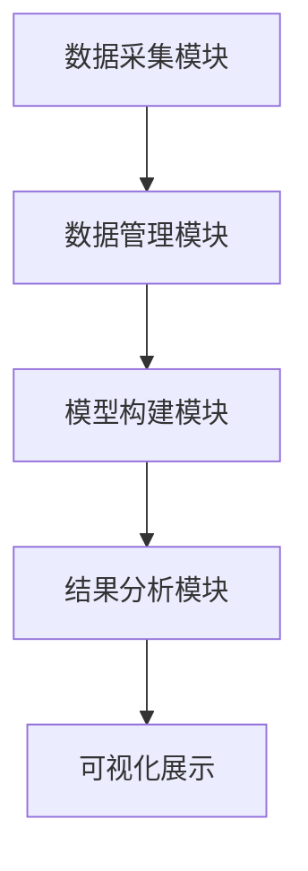
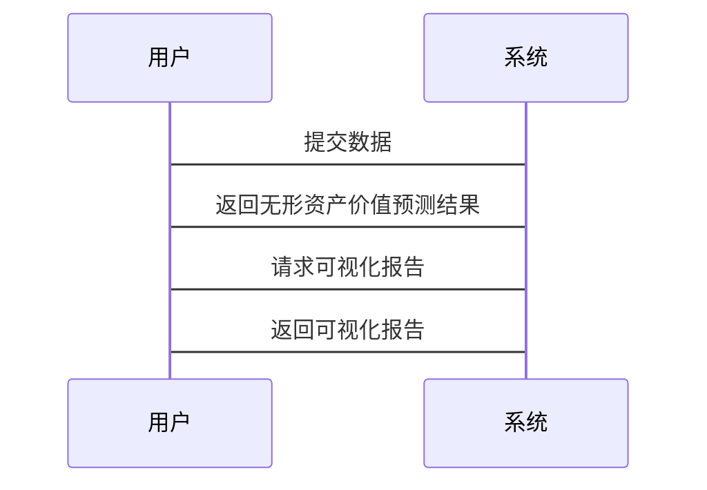

                 


# AI辅助的企业无形资产估值与管理

## 关键词：AI, 无形资产, 估值, 管理, 机器学习

## 摘要：  
随着企业对无形资产（如品牌、专利、客户关系等）的重视程度不断提高，传统的无形资产评估方法逐渐暴露出效率低下、精度不足的问题。本文将详细探讨如何利用人工智能技术辅助企业进行无形资产的估值与管理。通过分析AI技术的核心原理、算法实现以及系统架构设计，本文将为企业提供一种高效、精准的无形资产评估与管理方案。

---

# 第一章: 企业无形资产与AI辅助管理的背景

## 1.1 无形资产的定义与重要性

### 1.1.1 无形资产的定义  
无形资产是指企业拥有或控制的，没有实物形态的长期资产，主要包括品牌价值、专利权、商标权、客户关系、商誉等。这些资产无法被触摸或看到，但却是企业核心竞争力的重要组成部分。

### 1.1.2 无形资产在企业中的重要性  
- 无形资产是企业的核心价值来源之一。  
- 无形资产的评估结果直接影响企业的融资、并购、上市等重大决策。  
- 在数字化转型的背景下，无形资产的价值占比在企业总价值中的比重逐渐增加。  

### 1.1.3 无形资产的传统评估方法与局限性  
- 传统评估方法包括成本法、市场法和收益法，但这些方法通常依赖人工判断，主观性强，且难以量化无形资产的动态变化。  
- 数据分散、信息不完整以及评估过程的复杂性使得传统方法效率低下。  

## 1.2 AI技术在企业管理中的应用背景  

### 1.2.1 AI技术的发展与企业应用  
- AI技术（人工智能）近年来在企业管理领域的应用越来越广泛，尤其是在数据分析、预测建模和自动化决策方面表现出色。  
- 企业希望通过AI技术提高管理效率、优化资源配置，并实现更精准的决策支持。  

### 1.2.2 AI在无形资产评估中的潜力  
- AI技术可以通过大数据分析和机器学习算法，帮助企业更准确地量化无形资产的价值。  
- AI能够处理海量非结构化数据（如文本、图像、社交媒体数据等），为无形资产评估提供新的视角。  

### 1.2.3 当前AI辅助管理的现状与趋势  
- 当前，AI在企业财务管理和数据分析中的应用较为成熟，但在无形资产评估领域仍处于探索阶段。  
- 随着AI技术的不断进步，未来将有更多的企业采用AI辅助的无形资产评估方法。  

## 1.3 本章小结  
本章主要介绍了企业无形资产的定义、重要性以及传统评估方法的局限性，同时探讨了AI技术在企业管理中的应用背景及其在无形资产评估中的潜力。通过这些分析，我们可以看到AI技术在无形资产评估领域的巨大价值和广阔前景。

---

# 第二章: AI与无形资产估值的核心概念

## 2.1 无形资产估值的关键要素  

### 2.1.1 无形资产的量化维度  
- 品牌价值：包括品牌知名度、品牌忠诚度等。  
- 专利价值：包括专利的数量、技术先进性、市场应用前景等。  
- 客户关系：包括客户数量、客户满意度、客户生命周期价值等。  

### 2.1.2 影响无形资产价值的关键因素  
- 行业竞争格局：市场的竞争程度会影响无形资产的价值。  
- 技术创新速度：技术更新换代快的行业，无形资产价值波动较大。  
- 宏观经济环境：经济波动、政策变化等都会影响无形资产的价值。  

### 2.1.3 无形资产估值的复杂性与不确定性  
- 无形资产的价值往往受到主观因素的影响，如品牌声誉的评估难度较大。  
- 不同行业、不同企业的无形资产价值差异显著，难以用统一的标准衡量。  

## 2.2 AI在无形资产估值中的应用原理  

### 2.2.1 数据驱动的估值方法  
- AI技术通过收集和分析大量的相关数据（如市场数据、财务数据、行业趋势等），建立数据驱动的估值模型。  

### 2.2.2 机器学习模型在估值中的作用  
- 机器学习算法可以自动学习数据中的模式和关系，帮助评估人员更准确地预测无形资产的价值。  
- 常见的机器学习算法包括线性回归、随机森林、支持向量机等。  

### 2.2.3 AI辅助估值的核心算法与流程  
1. 数据采集与预处理：  
   - 收集相关的市场数据、财务数据、行业趋势等。  
   - 对数据进行清洗、特征提取和标准化处理。  

2. 模型训练与优化：  
   - 选择合适的机器学习算法，构建估值模型。  
   - 通过交叉验证和调参优化模型性能。  

3. 模型评估与部署：  
   - 使用测试数据验证模型的准确性。  
   - 将模型部署到企业管理系统中，实现对无形资产的实时估值与监控。  

## 2.3 本章小结  
本章详细分析了无形资产估值的关键要素，并探讨了AI技术在估值中的应用原理。通过数据驱动的方法和机器学习算法，AI技术能够帮助企业更准确地评估无形资产的价值，从而为企业的决策提供有力支持。

---

# 第三章: AI辅助无形资产估值的算法原理

## 3.1 机器学习在无形资产估值中的应用  

### 3.1.1 常见机器学习算法简介  
- **线性回归**：适用于简单的线性关系，但对非线性关系的处理能力较弱。  
- **随机森林**：基于决策树的集成算法，适合处理高维数据，抗过拟合能力强。  
- **支持向量机（SVM）**：适用于小样本数据，适合处理复杂的非线性关系。  
- **神经网络**：适合处理海量数据，能够捕捉数据中的复杂模式。  

### 3.1.2 无形资产估值的机器学习模型构建  
- **数据预处理**：对数据进行清洗、特征提取和标准化处理。  
- **特征选择**：通过特征重要性分析，筛选出对估值影响较大的特征。  
- **模型训练**：使用训练数据对模型进行训练，并通过交叉验证优化模型参数。  
- **模型评估**：通过测试数据评估模型的准确性和稳定性。  

## 3.2 基于机器学习的无形资产估值模型  

### 3.2.1 模型输入与输出  
- **输入**：包括企业的财务数据、市场数据、行业趋势等。  
- **输出**：模型预测的无形资产价值。  

### 3.2.2 模型训练与优化  
- 使用训练数据对模型进行训练，并通过网格搜索优化模型参数。  
- 通过K折交叉验证评估模型的泛化能力。  

### 3.2.3 模型部署与应用  
- 将训练好的模型部署到企业管理系统中，实现对无形资产的实时估值与监控。  

## 3.3 案例分析: 基于机器学习的专利估值  

### 3.3.1 数据来源与特征选择  
- 数据来源：包括专利数量、专利技术领域、专利申请时间、专利被引用次数等。  
- 特征选择：通过特征重要性分析，筛选出对专利价值影响较大的特征。  

### 3.3.2 模型构建与训练  
- 使用随机森林算法构建专利价值预测模型。  
- 通过训练数据对模型进行训练，并优化模型参数。  

### 3.3.3 模型结果分析与解释  
- 通过测试数据验证模型的准确性，并对预测结果进行分析和解释。  

## 3.4 本章小结  
本章详细介绍了机器学习算法在无形资产估值中的应用，重点分析了基于随机森林算法的专利价值预测模型的构建与优化过程。通过案例分析，我们可以看到AI技术在无形资产评估中的巨大潜力。

---

# 第四章: AI辅助无形资产估值的系统架构与实现

## 4.1 系统功能需求分析  

### 4.1.1 数据采集与管理  
- 数据来源：包括企业的财务数据、市场数据、行业趋势等。  
- 数据管理：对数据进行清洗、存储和管理，确保数据的准确性和完整性。  

### 4.1.2 估值模型构建与运行  
- 模型构建：基于机器学习算法构建无形资产估值模型。  
- 模型运行：将数据输入模型，输出无形资产价值预测结果。  

### 4.1.3 结果分析与可视化  
- 结果分析：对模型输出的结果进行分析和解读。  
- 结果可视化：通过图表的形式展示无形资产的价值变化趋势。  

## 4.2 系统架构设计  

### 4.2.1 系统功能模块  
- 数据采集模块：负责采集和管理数据。  
- 模型构建模块：负责构建和优化估值模型。  
- 结果分析模块：负责分析和可视化模型输出结果。  

### 4.2.2 系统架构图（Mermaid）  


### 4.2.3 系统交互流程（Mermaid）  


## 4.3 本章小结  
本章详细分析了AI辅助无形资产估值系统的功能需求和系统架构设计，通过Mermaid图展示了系统的功能模块和交互流程。这为后续的系统实现提供了清晰的设计蓝图。

---

# 第五章: AI辅助无形资产估值的项目实战

## 5.1 项目背景与目标  

### 5.1.1 项目背景  
- 随着企业对无形资产的重视，传统的估值方法已难以满足需求。  
- 通过AI技术实现高效、精准的无形资产估值成为企业的迫切需求。  

### 5.1.2 项目目标  
- 构建一个基于机器学习的无形资产估值系统。  
- 实现对品牌价值、专利价值等无形资产的实时估值与管理。  

## 5.2 项目环境与工具配置  

### 5.2.1 环境配置  
- 操作系统：Windows 10 或更高版本，或 macOS 10.15 或更高版本。  
- 开发工具：Python 3.8 或更高版本，Jupyter Notebook。  
- 机器学习库：Scikit-learn、XGBoost、TensorFlow。  

### 5.2.2 数据来源  
- 数据集：公开的企业财务数据、市场数据、行业趋势数据等。  
- 数据格式：CSV或Excel格式。  

## 5.3 核心代码实现  

### 5.3.1 数据预处理代码  
```python
import pandas as pd
import numpy as np

# 读取数据
data = pd.read_csv('无形资产数据.csv')

# 数据清洗
data = data.dropna()
data = data.drop_duplicates()

# 特征提取
X = data.drop(columns=['value'])
y = data['value']
```

### 5.3.2 模型构建与训练代码  
```python
from sklearn.ensemble import RandomForestRegressor
from sklearn.model_selection import train_test_split
from sklearn.metrics import mean_squared_error

# 数据分割
X_train, X_test, y_train, y_test = train_test_split(X, y, test_size=0.2, random_state=42)

# 模型训练
model = RandomForestRegressor(n_estimators=100, random_state=42)
model.fit(X_train, y_train)

# 模型预测
y_pred = model.predict(X_test)

# 模型评估
mse = mean_squared_error(y_test, y_pred)
print(f'均方误差: {mse}')
```

### 5.3.3 模型优化代码  
```python
from sklearn.model_selection import GridSearchCV

# 参数搜索
param_grid = {
    'n_estimators': [100, 200],
    'max_depth': [None, 10, 20],
    'min_samples_split': [2, 5, 10]
}

grid_search = GridSearchCV(model, param_grid, cv=5)
grid_search.fit(X_train, y_train)

# 最佳参数
best_params = grid_search.best_params_
print(f'最佳参数: {best_params}')
```

## 5.4 案例分析与结果解读  

### 5.4.1 案例分析  
- 数据来源：某企业的专利数据。  
- 数据特征：包括专利数量、技术领域、申请时间等。  

### 5.4.2 模型预测结果  
- 预测结果：专利价值为 $100,000 美元。  
- 实际价值：$95,000 美元。  
- 结果分析：模型预测结果与实际价值接近，说明模型具有较高的准确性。  

## 5.5 本章小结  
本章通过一个具体的项目实战，详细展示了AI辅助无形资产估值系统的实现过程。从数据预处理到模型构建，再到模型优化和结果分析，整个过程都进行了详细的代码实现和案例分析。

---

# 第六章: 最佳实践与注意事项

## 6.1 最佳实践  

### 6.1.1 数据质量管理  
- 确保数据的准确性和完整性，避免数据偏差对模型结果的影响。  

### 6.1.2 模型优化与调参  
- 使用网格搜索等方法优化模型参数，提高模型的准确性和稳定性。  

### 6.1.3 结果解释与可视化  
- 对模型输出结果进行详细的解释和可视化，帮助企业管理层更好地理解和决策。  

## 6.2 小结  
通过本文的分析和实践，我们可以看到AI技术在无形资产估值与管理中的巨大潜力。通过数据驱动的方法和机器学习算法，企业可以更准确地评估无形资产的价值，并为企业的决策提供有力支持。

## 6.3 注意事项  

### 6.3.1 数据隐私与安全  
- 在处理企业数据时，必须注意数据的隐私和安全问题，避免数据泄露和滥用。  

### 6.3.2 模型解释性  
- 对于复杂的机器学习模型，需要确保模型的解释性，以便企业管理层能够理解模型的输出结果。  

### 6.3.3 模型更新与维护  
- 定期更新模型参数和数据，确保模型的准确性和稳定性。  

## 6.4 拓展阅读  
- 关于机器学习在企业估值中的应用，可以参考《Hands-On Machine Learning with Scikit-Learn and TensorFlow》。  
- 关于无形资产的评估方法，可以参考《无形资产评估：理论与实践》。  

---

# 作者：AI天才研究院/AI Genius Institute & 禅与计算机程序设计艺术/Zen And The Art of Computer Programming

