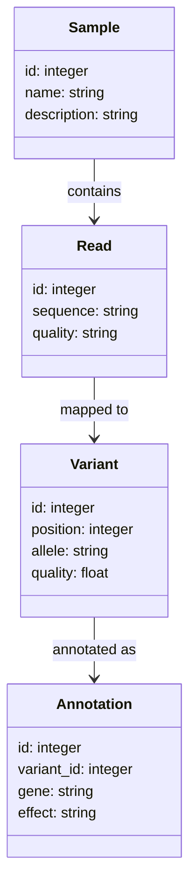
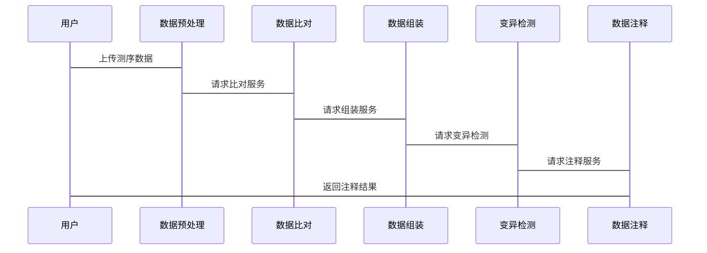

                 


# 价值投资中的下一代DNA测序技术前景

> 关键词：DNA测序技术、价值投资、生物技术、医疗行业、投资策略

> 摘要：本文探讨了下一代DNA测序技术（NGS）在价值投资中的潜在影响，分析了测序技术如何改变生物技术公司的评估和医疗行业的投资策略。通过详细讲解测序技术的核心原理、算法和系统架构，结合实际案例，展示了如何将测序技术应用于投资决策，并展望了未来的发展趋势。

---

# 第一部分: 背景介绍

## 第1章: DNA测序技术的发展历程

### 1.1 DNA测序技术的起源与演变

#### 1.1.1 第一代测序技术的诞生
- **Sanger测序法**：1977年，Sanger等人开发了双脱氧核苷酸测序法，奠定了现代测序技术的基础。
- **测序步骤**：通过凝胶电泳分离DNA片段，根据放射性同位素标记的链终止来读取序列。
- **局限性**：测序成本高、效率低，适合研究用途，不适合大规模应用。

#### 1.1.2 第二代测序技术的突破
- **Illumina平台**：采用边合成边测序技术（Solexa测序），通过高通量并行测序大幅降低了成本。
- **测序原理**：利用可逆终止子和实时荧光检测，实现单个流动槽上数百万条序列的并行测序。
- **优势**：高通量、低成本，适用于基因组测序和转录组测序。

#### 1.1.3 第三代及后续测序技术的发展
- **单分子测序**：例如Pacific Biosciences的SMRT（单分子实时测序技术），无需PCR扩增，直接测序单分子DNA。
- **Oxford Nanopore技术**：基于纳米孔的单分子测序，可以在同一设备上实时读取序列。
- **测序速度与成本**：第三代技术进一步降低了成本，提高了测序速度，推动了精准医学的发展。

### 1.2 价值投资的定义与核心理念

#### 1.2.1 价值投资的起源与发展
- **格雷厄姆与多德的价值投资理论**：强调以低于内在价值的价格购买优质的公司股票，长期持有以实现收益。
- **现代价值投资的演变**：从传统的企业评估扩展到新兴技术领域的投资，如生物技术和人工智能。

#### 1.2.2 价值投资的核心要素
- **内在价值**：公司未来现金流的现值，需要考虑公司的财务状况、盈利能力、竞争优势等因素。
- **安全边际**：买入价格低于内在价值，以降低投资风险。
- **长期视角**：关注公司的长期增长潜力，而非短期市场波动。

#### 1.2.3 价值投资与现代金融的结合
- **量化分析**：现代价值投资结合大数据分析和机器学习，提高评估的准确性和效率。
- **行业多样性**：从传统行业扩展到高科技、医疗等领域，寻找高成长性的投资标的。

### 1.3 下一代测序技术与价值投资的结合

#### 1.3.1 下一代测序技术的定义
- 下一代测序技术（NGS）：指采用高通量测序方法，能够在较短时间以较低成本完成大规模测序的技术。

#### 1.3.2 下一代测序技术在生物医学中的应用
- **疾病诊断**：通过测序发现致病基因，辅助诊断罕见病和癌症。
- **药物研发**：用于目标识别、疗效预测和药物副作用评估。
- **基因组研究**：支持大规模人群基因组研究，推动个性化医疗的发展。

#### 1.3.3 下一代测序技术如何影响价值投资
- **生物技术公司评估**：测序技术的性能、成本和市场应用能力是评估公司价值的重要指标。
- **医疗行业投资策略**：测序技术的进展可能改变医疗行业的格局，投资者需要关注相关公司的技术优势和市场地位。

---

# 第二部分: 下一代DNA测序技术的核心概念与原理

## 第2章: 下一代测序技术的核心原理

### 2.1 测序技术的基本原理

#### 2.1.1 测序的基本步骤
- **样本制备**：提取DNA片段，进行末端修复、添加接头等处理。
- **文库制备**：将DNA片段连接到接头，形成测序文库。
- **测序反应**：通过化学反应和荧光标记，记录每个碱基的读取过程。

#### 2.1.2 测序的关键技术
- **测序芯片**：Illumina平台使用flow cell，每个flow cell包含数百万个纳米孔，每个孔可以同时测序一条DNA分子。
- **数据采集**：利用实时荧光检测记录每个碱基的读取过程，生成原始数据。

#### 2.1.3 测序的数据处理流程
- **数据清洗**：去除低质量数据，如去除接头序列、过滤低质量reads。
- **序列比对**：将测序reads比对到参考基因组，识别变异位点。
- **数据组装**：通过计算reads的重叠区域，组装完整的基因组。

### 2.2 测序技术的数学模型

#### 2.2.1 测序数据的概率模型
- **测序错误模型**：描述测序过程中可能出现的错误，如碱基误读和插入/缺失错误。
- **概率分布**：假设测序错误独立，错误率服从泊松分布。

#### 2.2.2 测序数据的组装算法
- **De Bruijn图方法**：将测序reads分解为k-mer，构建图结构，寻找欧拉路径进行组装。
- **Overlap-Layout-Consensus（OLC）方法**：通过reads的重叠关系构建序列。

#### 2.2.3 测序数据的分析流程
- **读取清理**：去除低质量reads和接头序列。
- **比对与组装**：将reads比对到参考基因组或从头组装。
- **变异检测**：识别基因组中的单核苷酸多态性（SNP）和插入/缺失（indel）。

---

# 第三部分: 价值投资中的测序技术应用

## 第3章: 下一代测序技术在价值投资中的应用

### 3.1 生物技术公司的价值评估

#### 3.1.1 公司技术优势的评估
- **测序技术性能**：包括测序深度、准确性和成本。
- **技术专利布局**：评估公司的技术储备和市场竞争力。

#### 3.1.2 市场应用潜力
- **市场规模**：测序技术在疾病诊断、药物研发等领域的应用前景。
- **客户基础**：公司现有的客户群体和合作伙伴。

#### 3.1.3 财务表现
- **收入增长**：公司近年来的收入情况。
- **研发投入**：公司对测序技术的研发投入和未来计划。

### 3.2 医疗行业的投资策略

#### 3.2.1 精准医学的发展
- **个体化治疗**：基于测序结果制定个性化治疗方案。
- **药物研发加速**：通过测序技术筛选药物靶点，缩短研发周期。

#### 3.2.2 下一代测序技术的市场渗透
- **成本下降**：测序成本的持续下降将推动其在临床的应用。
- **政策支持**：各国政府对精准医学的政策支持，推动测序技术的普及。

#### 3.2.3 投资机会
- **技术创新公司**：投资于具有创新测序技术的公司。
- **下游应用企业**：投资于测序技术应用的医疗公司，如诊断试剂和制药公司。

---

# 第四部分: 系统分析与架构设计

## 第4章: 测序技术系统的架构设计

### 4.1 问题场景介绍
- **目标**：设计一个基于测序技术的数据分析系统，支持价值投资中的数据处理和决策支持。
- **需求分析**：需要处理大规模测序数据，提供高效的分析工具和可视化界面。

### 4.2 系统功能设计

#### 4.2.1 领域模型设计
- **类图设计**：包括Sample、Read、Variant、Annotation等核心类。
- **关系设计**：Sample与Read关联，Read与Variant关联，Variant与Annotation关联。



#### 4.2.2 系统架构设计
- **分层架构**：包括数据采集层、数据处理层、用户界面层。
- **组件设计**：数据预处理、比对、组装、变异检测和注释。


### 4.3 系统接口设计
- **API设计**：提供RESTful API，支持数据上传、下载和分析结果查询。
- **接口文档**：
  - POST /samples: 上传测序样本。
  - GET /variants: 获取变异列表。
  - PUT /annotations: 更新注释信息。

### 4.4 系统交互设计

#### 4.4.1 用户与系统的交互流程


---

# 第五部分: 项目实战与未来展望

## 第5章: 项目实战

### 5.1 环境安装

#### 5.1.1 安装Illumina测序平台
- **安装步骤**：
  1. 下载Illumina的bcl2fastq工具。
  2. 安装必要的依赖库，如Python和Java。
  3. 配置环境变量，确保工具可以在命令行调用。

#### 5.1.2 安装分析工具
- **FastQC**：用于数据质控。
- **BWA**：用于序列比对。
- **GATK**：用于变异检测。

### 5.2 核心实现

#### 5.2.1 数据预处理
- **代码示例**：
  ```python
  import os
  import subprocess

  def process_fastq(fastq_file):
      # 质控步骤
      fastqc_cmd = f"fastqc {fastq_file}"
      subprocess.run(fastqc_cmd, shell=True, check=True)
      # 去除低质量reads
      trim_cmd = f"fastx_toolkit -input {fastq_file} -quality_floor 20"
      subprocess.run(trim_cmd, shell=True, check=True)
      return "processed_data.fastq"

  process_fastq("raw_data.fastq")
  ```

#### 5.2.2 数据比对
- **代码示例**：
  ```python
  def align_reads(reference, read_file):
      bwa_cmd = f"bwa align -t 4 {reference} {read_file}"
      subprocess.run(bwa_cmd, shell=True, check=True)
      sam_file = f"{os.path.splitext(read_file)[0]}_aligned.sam"
      return sam_file

  aligned_file = align_reads("reference.fasta", "processed_data.fastq")
  ```

#### 5.2.3 变异检测
- **代码示例**：
  ```python
  def call_variants(sam_file):
      gatk_cmd = f"gatk -Xmx4g -jar GenomeAnalysisTK.jar" \
                  f" -T UnifiedGenotyper -input {sam_file}" \
                  f" -output {os.path.splitext(sam_file)[0]}_variants.vcf"
      subprocess.run(gatk_cmd, shell=True, check=True)
      return "output.vcf"

  variants_file = call_variants("aligned.sam")
  ```

### 5.3 实际案例分析

#### 5.3.1 案例背景
- **目标**：分析一个癌症患者的测序数据，寻找潜在的治疗靶点。

#### 5.3.2 数据分析
- **步骤**：
  1. 数据预处理：质控和去 adaptor。
  2. 测序比对：将reads比对到参考基因组。
  3. 变异检测：识别SNP和indel。
  4. 数据注释：将变异位点与基因关联，评估其生物学意义。

#### 5.3.3 结果解读
- **结果展示**：
  - 发现多个癌症相关基因的突变，如EGFR和BRCA1。
  - 这些突变可能影响药物的选择和治疗效果。

### 5.4 项目小结

#### 5.4.1 项目总结
- **项目目标**：展示如何利用测序技术进行数据分析，支持价值投资中的决策。
- **主要成果**：成功处理了一组测序数据，发现了潜在的治疗靶点。
- **经验教训**：测序数据的处理需要高效的算法和充足的计算资源。

---

# 第六部分: 未来展望与最佳实践

## 第6章: 未来展望

### 6.1 下一代测序技术的发展趋势
- **技术进步**：测序成本持续下降，速度加快。
- **新应用领域**：扩展到农业、环境监测等领域。
- **与人工智能结合**：利用AI技术优化测序数据分析，提高准确性。

### 6.2 价值投资中的测序技术应用前景
- **精准医疗**：基于测序结果提供个性化治疗方案，影响医疗公司的价值。
- **药物研发加速**：通过测序技术筛选药物靶点，缩短研发周期，降低投资风险。

### 6.3 投资机会与风险

#### 6.3.1 投资机会
- **技术创新公司**：投资于具有创新测序技术的公司。
- **下游应用企业**：投资于测序技术应用的医疗公司。
- **政策支持**：政府对精准医学的支持为相关公司提供了良好的发展环境。

#### 6.3.2 风险与挑战
- **技术风险**：测序技术的快速迭代可能导致投资标的技术落伍。
- **市场竞争**：行业内竞争激烈，可能导致收益下降。
- **数据隐私**：测序数据涉及个人隐私，可能引发法律和伦理问题。

---

# 第七部分: 结论

## 第7章: 结论

### 7.1 总结全文
- 下一代DNA测序技术在价值投资中具有重要的潜力，特别是在生物技术和医疗行业。
- 通过分析测序技术的性能、成本和市场应用，投资者可以更准确地评估公司的价值和市场前景。
- 测序技术的进步将推动精准医学的发展，改变医疗行业的投资策略。

### 7.2 未来研究方向
- **技术评估模型的优化**：开发更精确的测序技术评估指标，帮助投资者做出决策。
- **跨学科研究**：结合测序技术与其他生物技术，如CRISPR，进行更全面的评估。
- **政策与伦理研究**：研究测序技术应用中的政策和伦理问题，确保投资的合规性。

---

# 作者：AI天才研究院/AI Genius Institute & 禅与计算机程序设计艺术 /Zen And The Art of Computer Programming

