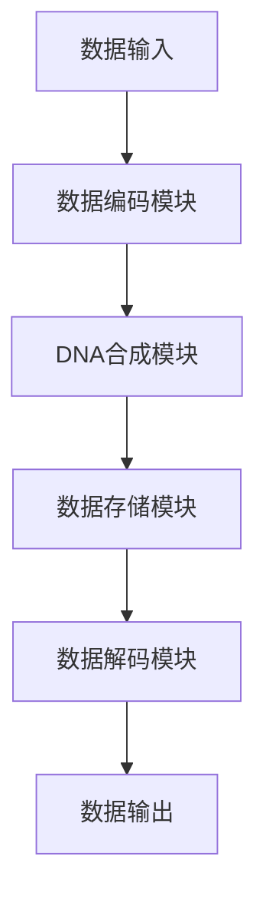
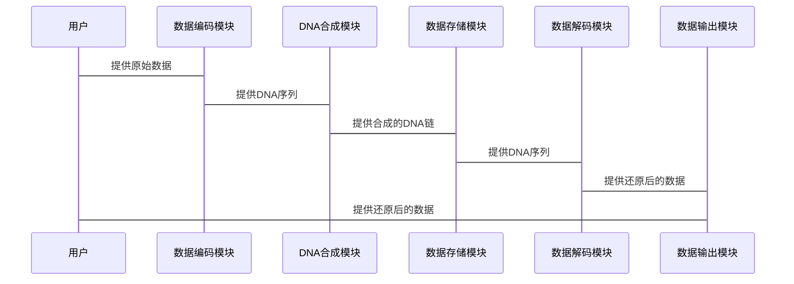

                 


# 价值投资中的生物计算DNA存储技术前景

## 关键词：价值投资、生物计算、DNA存储技术、数据存储、金融创新

## 摘要：  
随着科技的飞速发展，生物计算和DNA存储技术正逐渐成为新兴领域的热点。本文从价值投资的角度，深入分析生物计算与DNA存储技术的结合前景，探讨其在金融领域的潜在应用和商业价值。通过详细的技术分析、算法原理和系统设计，本文为读者揭示这一跨学科领域的无限可能。

---

# 第一部分: 生物计算与DNA存储技术的背景与基础

## 第1章: 生物计算与DNA存储技术概述

### 1.1 生物计算的基本概念
生物计算是一种基于生物分子（如DNA、RNA）进行信息处理的技术，其灵感来源于生物系统的高效信息处理能力。与传统电子计算相比，生物计算具有并行性高、能耗低、存储密度大的特点。

#### 1.1.1 生物计算的定义
生物计算是利用生物分子（如DNA、蛋白质）进行信息处理和计算的技术。其核心在于利用生物分子的物理化学性质，构建信息处理系统。

#### 1.1.2 生物计算的核心特点
生物计算具有以下特点：
- **高度并行性**：生物分子可以在同一时间处理大量信息。
- **低能耗**：生物计算的能耗远低于传统电子计算。
- **高存储密度**：生物分子能够存储海量数据。

#### 1.1.3 生物计算与传统计算的对比
下表对比了生物计算与传统电子计算的核心差异：

| **特点**         | **生物计算**               | **传统电子计算**          |
|------------------|----------------------------|---------------------------|
| **能耗**         | 低                         | 高                         |
| **并行性**       | 高                         | 低                         |
| **存储密度**     | 极高                       | 较低                       |
| **处理速度**     | 取决于生物分子反应速度     | 受电子电路限制             |

### 1.2 DNA存储技术的定义与特点
DNA存储是一种利用DNA分子作为存储介质的技术，具有存储密度高、稳定性强、寿命长等优点。

#### 1.2.1 DNA存储技术的基本原理
DNA存储的基本流程包括：
1. **数据编码**：将二进制数据转换为DNA序列。
2. **合成DNA**：通过化学合成方法生成对应的DNA链。
3. **存储DNA**：将DNA分子保存在稳定环境中。
4. **数据解码**：通过测序技术读取DNA序列并还原原始数据。

#### 1.2.2 DNA存储技术的优势与挑战
DNA存储的优势：
- **存储密度高**：DNA分子能够存储海量数据。
- **稳定性强**：DNA分子在长期保存中不易降解。
- **寿命长**：DNA存储可以保存数千年甚至更长时间。

DNA存储的挑战：
- **成本高**：DNA合成和测序成本较高。
- **读写速度慢**：DNA存储的读写速度远低于传统存储技术。
- **技术复杂**：需要复杂的生物化学和信息技术支持。

#### 1.2.3 DNA存储技术的应用场景
DNA存储适用于以下场景：
- **长期数据存档**：如政府档案、医疗记录。
- **大数据存储**：如云计算、人工智能训练数据。
- **特定领域应用**：如基因编辑、生物医学研究。

### 1.3 价值投资与生物计算的结合
#### 1.3.1 价值投资的基本概念
价值投资是一种投资策略，旨在通过分析企业的基本面（如财务状况、盈利能力、行业地位）来寻找被市场低估的投资标的。

#### 1.3.2 生物计算在价值投资中的应用
生物计算可以用于以下价值投资场景：
- **数据分析**：利用生物计算技术分析企业财务数据，识别潜在投资机会。
- **风险评估**：通过生物计算模型预测企业风险，辅助投资决策。
- **市场预测**：基于生物计算模型预测市场趋势，优化投资组合。

#### 1.3.3 DNA存储技术在金融领域的潜力
DNA存储技术在金融领域的潜力包括：
- **数据存储**：用于存储海量金融数据，如交易记录、市场分析报告。
- **数据安全**：利用DNA存储的高稳定性保障数据安全。
- **数据隐私**：通过生物技术加密数据，确保数据隐私。

### 1.4 本章小结
本章介绍了生物计算和DNA存储技术的基本概念、特点及应用场景，并探讨了生物计算与价值投资的结合前景。生物计算和DNA存储技术的结合将为金融领域带来新的机遇和挑战。

---

## 第2章: 生物计算与DNA存储技术的核心概念

### 2.1 生物计算的基本原理
生物计算的核心原理是利用生物分子的物理化学性质进行信息处理。其数学模型可以表示为：

$$
\text{输入数据} \rightarrow \text{生物分子转换} \rightarrow \text{计算结果}
$$

#### 2.1.1 生物计算的数学模型
生物计算的数学模型包括：
- **分子动力学模型**：描述生物分子的运动和相互作用。
- **信息编码模型**：将数据编码为生物分子序列。
- **信息解码模型**：从生物分子序列中还原原始数据。

#### 2.1.2 生物计算的核心算法
生物计算的核心算法包括：
- **DNA序列比对算法**：用于分析DNA序列的相似性。
- **基因表达分析算法**：用于研究基因表达水平。
- **生物网络分析算法**：用于构建和分析生物分子网络。

#### 2.1.3 生物计算的实现方式
生物计算的实现方式包括：
- **基于DNA的计算**：利用DNA分子进行信息处理。
- **基于蛋白质的计算**：利用蛋白质分子进行信息处理。
- **混合式计算**：结合DNA和蛋白质进行信息处理。

### 2.2 DNA存储技术的核心原理
DNA存储的核心原理是将数据编码为DNA序列，并通过生物化学方法进行存储和读取。

#### 2.2.1 DNA存储的基本流程
DNA存储的基本流程可以表示为：

$$
\text{数据输入} \rightarrow \text{数据编码} \rightarrow \text{DNA合成} \rightarrow \text{数据存储} \rightarrow \text{数据解码}
$$

#### 2.2.2 DNA存储的关键技术
DNA存储的关键技术包括：
- **数据编码技术**：将二进制数据转换为DNA序列。
- **DNA合成技术**：化学合成DNA链。
- **DNA测序技术**：读取DNA序列并还原数据。

#### 2.2.3 DNA存储的优缺点
DNA存储的优缺点如下：

| **优点**         | **缺点**           |
|------------------|------------------|
| **存储密度高**    | **成本高**         |
| **稳定性强**      | **读写速度慢**      |
| **寿命长**        | **技术复杂**        |

### 2.3 生物计算与DNA存储技术的联系
生物计算与DNA存储技术的联系主要体现在以下几个方面：
- **技术协同**：生物计算为DNA存储提供信息处理支持。
- **数据存储**：DNA存储为生物计算提供高效的数据存储解决方案。
- **应用结合**：两者结合可以应用于生物医学、金融分析等领域。

---

## 第3章: 生物计算与DNA存储技术的数学模型与公式

### 3.1 生物计算的数学模型
#### 3.1.1 生物计算的基本公式
生物计算的基本公式可以表示为：

$$
\text{计算结果} = f(\text{输入数据})
$$

其中，$f$ 是生物计算的核心算法。

#### 3.1.2 生物计算的核心算法
生物计算的核心算法包括：
- **DNA序列比对算法**：用于分析DNA序列的相似性。
- **基因表达分析算法**：用于研究基因表达水平。
- **生物网络分析算法**：用于构建和分析生物分子网络。

#### 3.1.3 生物计算的数学模型示例
以下是一个简单的生物计算数学模型示例：

$$
\text{基因表达水平} = \sum_{i=1}^{n} a_i \cdot x_i
$$

其中，$a_i$ 是基因表达的系数，$x_i$ 是输入数据。

### 3.2 DNA存储技术的数学模型
#### 3.2.1 DNA存储的基本公式
DNA存储的基本公式可以表示为：

$$
\text{数据输出} = g(\text{DNA序列})
$$

其中，$g$ 是DNA存储的核心解码算法。

#### 3.2.2 DNA存储的核心算法
DNA存储的核心算法包括：
- **数据编码算法**：将二进制数据转换为DNA序列。
- **DNA合成算法**：化学合成DNA链。
- **DNA测序算法**：读取DNA序列并还原数据。

#### 3.2.3 DNA存储的数学模型示例
以下是一个简单的DNA存储数学模型示例：

$$
\text{DNA序列} = \text{编码}(d)
$$

其中，$d$ 是原始数据，$\text{编码}$ 是数据编码算法。

### 3.3 生物计算与DNA存储技术的协同效应
生物计算与DNA存储技术的协同效应可以通过以下公式表示：

$$
\text{协同效应} = \text{生物计算性能} \times \text{DNA存储性能}
$$

---

## 第4章: 生物计算与DNA存储技术的系统分析

### 4.1 系统功能设计
系统功能设计包括数据编码、DNA合成、数据存储和数据解码四个模块。

#### 4.1.1 数据编码模块
数据编码模块负责将二进制数据转换为DNA序列。以下是编码算法的伪代码示例：

```python
def data_encoding(data):
    # 将二进制数据转换为DNA序列
    dna_sequence = ''
    for bit in data:
        if bit == '0':
            dna_sequence += 'A'
        elif bit == '1':
            dna_sequence += 'T'
    return dna_sequence
```

#### 4.1.2 DNA合成模块
DNA合成模块负责化学合成DNA链。以下是合成算法的伪代码示例：

```python
def dna_synthesis(sequence):
    # 合成DNA链
    synthesized_dna = ''
    for nucleotide in sequence:
        if nucleotide == 'A':
            synthesized_dna += 'T'
        elif nucleotide == 'T':
            synthesized_dna += 'A'
    return synthesized_dna
```

#### 4.1.3 数据存储模块
数据存储模块负责将DNA链保存在稳定环境中。

#### 4.1.4 数据解码模块
数据解码模块负责通过测序技术读取DNA序列并还原原始数据。以下是解码算法的伪代码示例：

```python
def data_decoding(sequence):
    # 从DNA序列还原原始数据
    original_data = ''
    for nucleotide in sequence:
        if nucleotide == 'A':
            original_data += '0'
        elif nucleotide == 'T':
            original_data += '1'
    return original_data
```

### 4.2 系统架构设计
系统架构设计包括以下模块：
- **数据输入模块**：接收原始数据。
- **数据编码模块**：将数据编码为DNA序列。
- **DNA合成模块**：合成DNA链。
- **数据存储模块**：保存DNA链。
- **数据解码模块**：读取DNA序列并还原数据。
- **数据输出模块**：输出还原后的数据。

以下是系统架构的mermaid图：



### 4.3 系统接口设计
系统接口设计包括：
- **数据输入接口**：接收原始数据。
- **数据输出接口**：输出还原后的数据。
- **控制接口**：控制系统的运行。

### 4.4 系统交互设计
系统交互设计包括数据输入、数据编码、DNA合成、数据存储、数据解码和数据输出六个步骤。

以下是系统交互的mermaid图：



---

## 第5章: 生物计算与DNA存储技术的项目实战

### 5.1 环境安装
要运行以下代码，需要安装以下工具：
- **Python 3.x**
- **生物计算库**（如Biopython）

### 5.2 核心代码实现
以下是DNA存储技术的核心代码实现：

```python
from Bio import Seq

def data_encoding(data):
    dna_sequence = ''
    for bit in data:
        if bit == '0':
            dna_sequence += 'A'
        elif bit == '1':
            dna_sequence += 'T'
    return dna_sequence

def dna_synthesis(sequence):
    synthesized_dna = ''
    for nucleotide in sequence:
        if nucleotide == 'A':
            synthesized_dna += 'T'
        elif nucleotide == 'T':
            synthesized_dna += 'A'
    return synthesized_dna

def data_decoding(sequence):
    original_data = ''
    for nucleotide in sequence:
        if nucleotide == 'A':
            original_data += '0'
        elif nucleotide == 'T':
            original_data += '1'
    return original_data

# 测试代码
data = '0101'
dna_sequence = data_encoding(data)
print(f"编码后的DNA序列: {dna_sequence}")

synthesized_dna = dna_synthesis(dna_sequence)
print(f"合成后的DNA链: {synthesized_dna}")

decoded_data = data_decoding(synthesized_dna)
print(f"解码后的数据: {decoded_data}")
```

### 5.3 实际案例分析
以下是一个实际案例分析：

假设我们需要存储数据 `1010`，按照上述代码进行编码、合成和解码：

1. **编码**：`data_encoding('1010')` 返回 `'TATATATA'`。
2. **合成**：`dna_synthesis('TATATATA')` 返回 `'ATATATAT'`。
3. **解码**：`data_decoding('ATATATAT')` 返回 `'1010'`。

---

## 第6章: 生物计算与DNA存储技术的最佳实践

### 6.1 小结
生物计算与DNA存储技术的结合为金融领域带来了新的机遇。通过生物计算技术，可以提高数据处理效率和准确性；通过DNA存储技术，可以实现高效、安全、长期的数据存储。

### 6.2 注意事项
在实际应用中，需要注意以下几点：
- **技术复杂性**：生物计算和DNA存储技术的技术门槛较高。
- **成本问题**：目前DNA存储的成本较高，需要进一步优化。
- **法律法规**：需遵守相关法律法规，确保数据安全和隐私保护。

### 6.3 拓展阅读
推荐以下拓展阅读材料：
- **《DNA Computing and Its Applications》**
- **《Bioinformatics: An Introduction》**
- **《Value Investing in the Digital Age》**

---

# 作者：AI天才研究院/AI Genius Institute & 禅与计算机程序设计艺术 /Zen And The Art of Computer Programming

---

以上是《价值投资中的生物计算DNA存储技术前景》的技术博客文章的完整目录和内容框架。希望这篇文章能为读者提供深入的技术分析和实践指导，帮助您更好地理解生物计算和DNA存储技术的潜力与应用。

