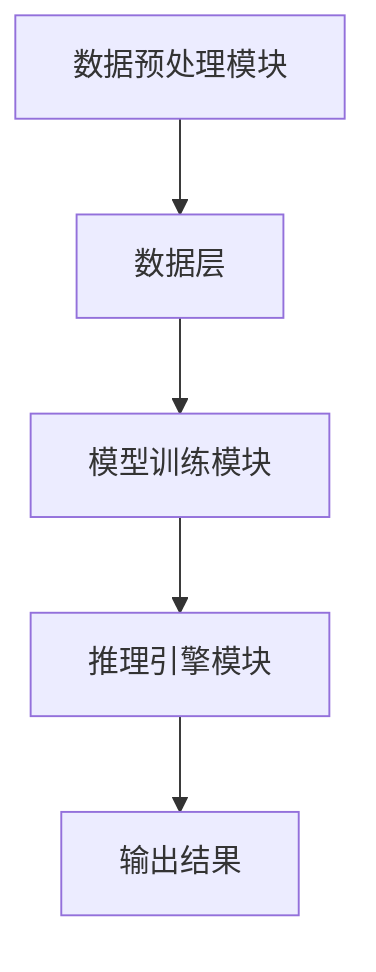
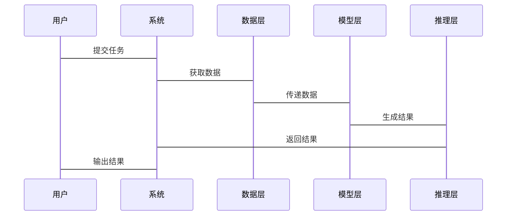

                 


# 企业AI Agent的图神经网络应用：复杂关系建模

> 关键词：企业AI Agent，图神经网络，复杂关系建模，深度学习，图数据挖掘，人工智能系统设计

> 摘要：本文探讨了企业AI Agent在复杂关系建模中的应用，重点介绍了图神经网络（Graph Neural Networks, GNN）在其中的关键作用。通过分析图神经网络的核心概念、算法原理、系统架构设计以及实际项目案例，本文详细阐述了如何利用图神经网络提升企业AI Agent的智能水平和决策能力。文章最后总结了图神经网络在企业AI Agent应用中的优势与挑战，并提出了未来的发展方向。

---

# 第1章 企业AI Agent与图神经网络概述

## 1.1 企业AI Agent的定义与特点

### 1.1.1 企业AI Agent的定义
企业AI Agent是一种智能代理系统，能够感知企业内外部环境，执行复杂任务，优化企业运营效率。它通过与用户的交互或与其他系统的协作，提供智能化的决策支持或自动化操作。

### 1.1.2 企业AI Agent的核心特点
- **自主性**：能够自主决策和行动。
- **反应性**：能够实时感知环境变化并做出响应。
- **学习能力**：通过数据和经验不断优化自身行为。
- **协作性**：能够与人、系统或其他AI Agent协同工作。

### 1.1.3 企业AI Agent与传统AI的区别
| 特性 | 传统AI | 企业AI Agent |
|------|--------|--------------|
| 智能水平 | 基于规则或简单模型 | 具备自主决策和学习能力 |
| 应用场景 | 单一任务处理 | 复杂场景下的多任务协作 |
| 适应性 | 静态 | 动态且灵活 |

---

## 1.2 图神经网络的定义与特点

### 1.2.1 图神经网络的定义
图神经网络是一种基于图数据结构的深度学习模型，能够处理节点之间的复杂关系。它通过在图上进行信息传播和特征聚合，学习节点的表示，并用于各种图相关任务（如节点分类、链路预测等）。

### 1.2.2 图神经网络的核心特点
- **图结构**：基于图数据，能够处理复杂的非树状关系。
- **节点表示**：通过聚合邻居节点的信息，生成节点的低维表示。
- **边权重**：边的权重反映了节点之间关系的强度或类型。

### 1.2.3 图神经网络与传统神经网络的区别
| 特性 | 传统神经网络 | 图神经网络 |
|------|---------------|------------|
| 数据结构 | 矩阵或向量 | 图结构 |
| 关系建模 | 无法处理复杂关系 | 能够建模复杂关系 |
| 应用场景 | 图无关任务 | 图相关任务 |

---

## 1.3 企业AI Agent与图神经网络的结合

### 1.3.1 企业AI Agent的复杂关系建模需求
企业AI Agent需要处理复杂的组织结构、业务流程和人机交互关系，传统的基于规则的方法难以应对动态变化的场景。

### 1.3.2 图神经网络在复杂关系建模中的优势
- **全局视角**：能够捕捉全局关系，而非仅仅局部信息。
- **动态适应**：支持动态更新节点和边的信息，适应变化。
- **鲁棒性**：能够在稀疏或噪声数据中鲁棒地建模关系。

### 1.3.3 企业AI Agent与图神经网络结合的应用场景
- **客户关系管理**：通过图神经网络建模客户-产品-渠道的关系，优化客户体验。
- **供应链优化**：分析供应商、生产过程和物流的关系，提升供应链效率。
- **风险控制**：建模企业之间的信用关系，评估和控制金融风险。

---

## 1.4 本章小结

本章介绍了企业AI Agent和图神经网络的基本概念，并分析了它们结合的必要性和优势。企业AI Agent需要处理复杂的业务关系，而图神经网络提供了强大的图数据建模能力，两者结合能够显著提升企业的智能化水平。

---

# 第2章 图神经网络的核心概念与原理

## 2.1 图的基本概念与表示

### 2.1.1 图的定义与基本术语
- **节点（Node）**：图的基本单元，表示实体。
- **边（Edge）**：连接两个节点的边，表示实体之间的关系。
- **权重（Weight）**：边的权重反映了关系的强度或类型。

### 2.1.2 图的表示方法
- **邻接矩阵**：一个二维矩阵，表示节点之间的连接情况。
- **邻接表**：通过列表存储每个节点的邻居节点。
- **边列表**：存储所有边的信息，包括起点、终点和权重。

### 2.1.3 图的属性与特征
- **度数（Degree）**：节点的邻居数量。
- **聚类系数（Clustering Coefficient）**：图中三角形的密度。
- **路径长度（Path Length）**：图中两点之间的最短路径长度。

---

## 2.2 节点表示与边权重

### 2.2.1 节点表示的定义与作用
节点表示是将节点的特征信息压缩为低维向量，便于后续的计算和分析。

### 2.2.2 边权重的定义与作用
边权重反映了两个节点之间的关系强度或类型，可以是实数、概率或类别信息。

### 2.2.3 节点表示与边权重的对比分析

| 特性 | 节点表示 | 边权重 |
|------|----------|--------|
| 作用 | 表示单个节点的特征 | 表示节点之间的关系 |
| 形式 | 向量 | 标量或向量 |
| 应用 | 节点分类、聚类 | 链路预测、推荐系统 |

---

## 2.3 图神经网络的核心原理

### 2.3.1 图神经网络的基本原理
图神经网络通过在图上进行信息传播和特征聚合，学习节点的表示，并用于各种图相关任务。

### 2.3.2 图神经网络的传播机制
信息传播是图神经网络的核心步骤，通常包括以下两个阶段：
1. **聚合阶段**：将节点及其邻居的信息聚合到当前节点。
2. **更新阶段**：基于聚合的信息更新节点的表示。

### 2.3.3 图神经网络的聚合函数
聚合函数是图神经网络的关键组成部分，常用的聚合函数包括：
- **求和（Sum）**：将邻居节点的特征向量相加。
- **平均（Mean）**：将邻居节点的特征向量取平均值。
- **最大值（Max）**：取邻居节点特征向量的最大值。

---

## 2.4 本章小结

本章详细介绍了图神经网络的核心概念，包括图的基本定义、节点表示、边权重以及图神经网络的传播机制。这些内容为后续章节的应用奠定了基础。

---

# 第3章 图神经网络的算法原理

## 3.1 图神经网络的基本算法

### 3.1.1 GCN（Graph Convolutional Networks）
GCN是最早提出的图神经网络模型，通过在图上进行卷积操作，学习节点的表示。

### 3.1.2 GAT（Graph Attention Networks）
GAT通过引入注意力机制，增强了对重要邻居的重视，提高了模型的性能。

### 3.1.3 GNN（Graph Neural Networks）
GNN是一种通用的图神经网络框架，支持多种图结构和任务。

---

## 3.2 图神经网络的传播机制

### 3.2.1 节点表示的更新公式
GCN的更新公式如下：
$$ h^{(l+1)}_i = \sigma\left(\sum_{j \in N(i)} \frac{1}{d_j} W h_j^{(l)}\right) $$
其中，$h_i^{(l)}$是节点$i$在第$l$层的表示，$N(i)$是节点$i$的邻居节点集合，$d_j$是节点$j$的度数，$W$是参数矩阵，$\sigma$是激活函数。

---

## 3.3 图神经网络的训练与推理

### 3.3.1 图神经网络的训练流程
1. **输入图数据**：包括节点特征和边信息。
2. **初始化参数**：包括节点表示和边权重。
3. **前向传播**：通过图神经网络的传播机制生成节点表示。
4. **计算损失**：使用损失函数（如交叉熵损失）计算预测值与真实值之间的差异。
5. **反向传播**：通过梯度下降优化模型参数。

### 3.3.2 图神经网络的推理流程
1. **输入新的图数据**：包括节点特征和边信息。
2. **前向传播**：生成节点表示。
3. **输出结果**：根据节点表示进行分类、推荐或其他任务。

---

## 3.4 本章小结

本章详细介绍了图神经网络的基本算法及其传播机制，并通过公式和流程图展示了模型的训练与推理过程。这些内容为后续章节的实际应用提供了理论基础。

---

# 第4章 企业AI Agent的系统分析与架构设计

## 4.1 企业AI Agent的系统分析

### 4.1.1 问题场景介绍
企业AI Agent需要处理复杂的业务关系，例如客户-产品-渠道的关系、供应链中的供应商-生产过程-物流的关系等。

### 4.1.2 系统功能设计
- **数据预处理**：将企业数据转换为图数据结构。
- **模型训练**：使用图神经网络对图数据进行建模。
- **推理引擎**：基于模型生成决策或推荐。

### 4.1.3 系统架构设计
- **数据层**：存储企业数据，包括节点和边信息。
- **模型层**：图神经网络模型，负责学习节点表示。
- **推理层**：根据模型输出生成决策或推荐。

---

## 4.2 系统架构设计

### 4.2.1 系统功能模块
- **数据预处理模块**：将企业数据转换为图数据结构。
- **模型训练模块**：使用图神经网络对图数据进行建模。
- **推理引擎模块**：根据模型输出生成决策或推荐。

### 4.2.2 系统架构图


---

## 4.3 系统接口设计

### 4.3.1 系统接口设计
- **输入接口**：接收企业数据，包括节点和边信息。
- **输出接口**：输出模型结果，如节点分类、链路预测等。

### 4.3.2 系统交互流程图


---

## 4.4 本章小结

本章分析了企业AI Agent的系统架构，并通过流程图和架构图展示了系统的整体设计。这些内容为后续章节的实际应用提供了系统化的指导。

---

# 第5章 项目实战：企业AI Agent的图神经网络实现

## 5.1 项目环境安装

### 5.1.1 安装Python环境
建议使用Python 3.6及以上版本。

### 5.1.2 安装依赖库
```bash
pip install numpy
pip install networkx
pip install pytorch
pip install dgl
```

---

## 5.2 系统核心实现源代码

### 5.2.1 数据加载
```python
import dgl
import numpy as np

# 创建图
graph = dgl.DGLGraph()
graph.add_nodes(5)
graph.add_edges([0,1], [1,2], {'weight': [0.5, 0.3]})
```

### 5.2.2 模型定义
```python
import dgl
import torch
import torch.nn as nn

class GCNModel(nn.Module):
    def __init__(self, in_features, hidden_features, out_features):
        super(GCNModel, self).__init__()
        self.conv1 = dgl.nn.GraphConv(in_features, hidden_features)
        self.conv2 = dgl.nn.GraphConv(hidden_features, out_features)
        self.relu = nn.ReLU()
    
    def forward(self, graph, inputs):
        h = self.conv1(graph, inputs)
        h = self.relu(h)
        h = self.conv2(graph, h)
        return h
```

### 5.2.3 训练循环
```python
model = GCNModel(2, 16, 1)
optimizer = torch.optim.Adam(model.parameters(), lr=0.01)
criterion = nn.CrossEntropyLoss()

for epoch in range(100):
    model.train()
    outputs = model(graph, inputs)
    loss = criterion(outputs, labels)
    loss.backward()
    optimizer.step()
```

---

## 5.3 代码应用解读与分析

### 5.3.1 数据加载
我们使用DGL库创建了一个简单的图，包含5个节点和两条边，边权重分别为0.5和0.3。

### 5.3.2 模型定义
GCNModel定义了一个两层的GCN模型，使用DGL库中的GraphConv层进行图卷积操作，并通过ReLU激活函数提升模型的非线性表达能力。

### 5.3.3 训练循环
模型通过交叉熵损失函数和Adam优化器进行训练，每轮更新模型参数，以最小化预测值与真实值之间的差异。

---

## 5.4 实际案例分析

### 5.4.1 案例背景
以客户关系管理为例，我们希望通过图神经网络建模客户-产品-渠道的关系，优化客户体验。

### 5.4.2 模型训练
通过训练GCN模型，我们能够学习到客户的特征表示，并预测客户的购买行为。

### 5.4.3 模型推理
在推理阶段，模型可以根据新的客户信息，预测其潜在的购买行为，并提供个性化的推荐。

---

## 5.5 项目小结

本章通过一个实际的项目案例，详细介绍了企业AI Agent的图神经网络实现过程，包括数据加载、模型定义、训练循环以及案例分析。这些内容为读者提供了实践指导。

---

# 第6章 最佳实践与未来展望

## 6.1 最佳实践

### 6.1.1 数据预处理
- 确保数据的完整性和准确性。
- 对图数据进行归一化处理，提升模型的训练效率。

### 6.1.2 模型优化
- 使用更复杂的图神经网络模型（如GAT、GIN）提升模型性能。
- 调整模型超参数（如学习率、批量大小）优化训练效果。

### 6.1.3 系统设计
- 设计高效的系统架构，确保系统的可扩展性和可维护性。
- 使用分布式计算技术，提升系统的计算能力。

---

## 6.2 小结

图神经网络在企业AI Agent中的应用前景广阔，能够显著提升企业的智能化水平。通过不断优化模型和系统设计，我们可以进一步提升模型的性能和系统的效率。

---

## 6.3 注意事项

- 在实际应用中，需要注意图数据的稀疏性和噪声问题。
- 需要定期更新模型，以适应企业的动态变化。
- 在多任务场景下，需要合理设计模型结构，避免过拟合。

---

## 6.4 拓展阅读

- 《Graph Neural Networks: A Review of Methods, Applications, and Open Challenges》
- 《Deep Learning on Graph Data》

---

# 作者：AI天才研究院/AI Genius Institute & 禅与计算机程序设计艺术/Zen And The Art of Computer Programming

---

以上是文章的完整目录和内容框架，您可以根据需要进一步扩展每个部分的具体内容，添加更多的细节和案例分析。

