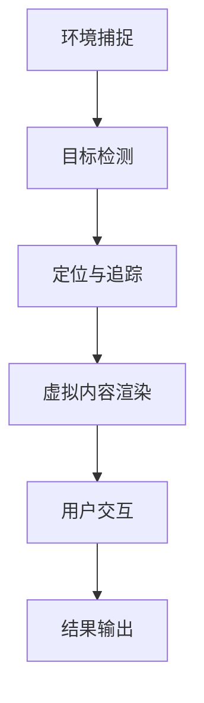
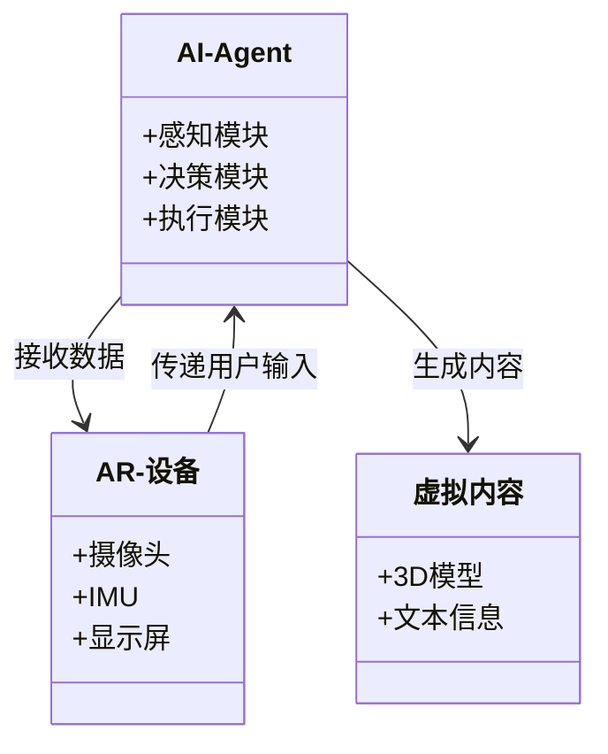
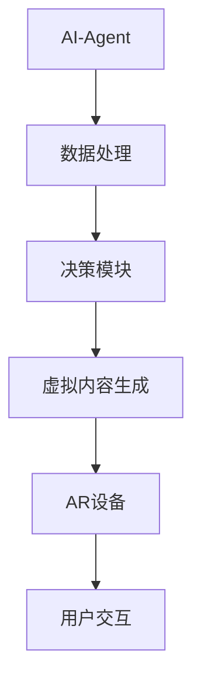
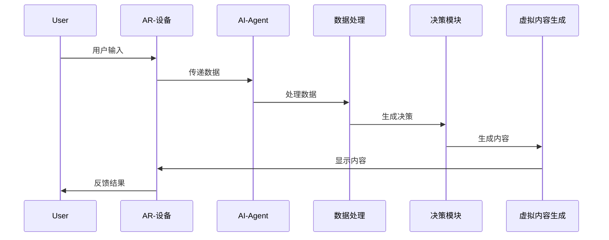

                 


# 《企业AI Agent的增强现实(AR)技术集成》

> 关键词：企业AI Agent，增强现实，AR技术，系统集成，算法原理，系统架构

> 摘要：本文探讨了企业AI Agent与增强现实(AR)技术的集成，分析了AR技术的基本原理、AI Agent的核心概念及其在企业中的应用背景。通过详细阐述AR与AI Agent的结合方式，包括数据处理、人机交互和系统架构设计，本文展示了如何在企业环境中实现增强现实与人工智能代理的协同工作。最后，通过项目实战和案例分析，本文总结了AR与AI Agent集成的优势与挑战，并展望了未来的发展方向。

---

## 第1章: 企业AI Agent与增强现实技术的背景

### 1.1 企业AI Agent的定义与特点

#### 1.1.1 企业AI Agent的基本概念
企业AI Agent（Artificial Intelligence Agent）是一种能够感知环境、做出决策并执行任务的智能实体。它通过传感器获取数据，利用算法进行分析，并通过执行器完成目标。AI Agent在企业中的应用广泛，例如自动化决策支持、流程优化和智能客服。

#### 1.1.2 企业AI Agent的核心特点
- **自主性**：AI Agent能够独立运作，无需人工干预。
- **反应性**：能够实时感知环境变化并做出响应。
- **目标导向**：基于预设目标执行任务，优化结果。
- **学习能力**：通过机器学习不断优化自身的决策模型。

#### 1.1.3 企业AI Agent的应用场景
- **智能客服**：通过自然语言处理（NLP）理解用户需求，提供解决方案。
- **流程自动化**：优化企业流程，提高效率。
- **智能监控**：实时监控企业运营数据，预测潜在问题。

### 1.2 增强现实(AR)技术的定义与特点

#### 1.2.1 增强现实的基本概念
增强现实（Augmented Reality，AR）是一种将虚拟信息叠加在真实世界上的技术，通过摄像头、传感器和显示屏实现。AR技术广泛应用于教育、医疗、游戏和企业培训等领域。

#### 1.2.2 AR技术的核心特点
- **实时交互**：用户可以与叠加的虚拟信息进行互动。
- **空间感知**：通过传感器定位用户位置，提供准确的虚拟信息。
- **沉浸式体验**：用户可以在真实环境中体验虚拟内容，保持对现实的感知。

#### 1.2.3 AR技术的主要应用场景
- **企业培训**：通过AR技术进行产品演示和操作培训。
- **远程协作**：支持多地团队通过AR技术进行实时协作。
- **智能设备辅助**：帮助员工使用AR设备进行复杂操作。

### 1.3 企业AI Agent与AR技术的结合背景

#### 1.3.1 企业数字化转型的驱动力
企业数字化转型要求更高效的工具和技术，以提高竞争力和效率。AI Agent和AR技术的结合为企业提供了强大的技术支持。

#### 1.3.2 AR技术在企业中的潜力
AR技术能够将虚拟信息与真实环境结合，提供直观的用户体验，增强企业的培训、协作和操作能力。

#### 1.3.3 AI Agent与AR技术的协同效应
AI Agent能够处理复杂的数据和决策，而AR技术提供直观的交互界面。两者的结合能够提升企业的智能化水平，优化操作流程。

## 1.4 本章小结
本章介绍了企业AI Agent和AR技术的基本概念、特点及其应用场景，分析了两者结合的背景和潜力，为后续章节奠定了基础。

---

## 第2章: 增强现实(AR)技术的原理与实现

### 2.1 AR技术的核心原理

#### 2.1.1 AR的基本原理
AR技术通过摄像头捕捉环境信息，利用计算机视觉算法进行图像识别和定位，将虚拟内容叠加在真实场景中。

#### 2.1.2 AR的关键技术
- **图像识别**：识别环境中的物体或特征点。
- **定位与追踪**：确定设备位置并跟踪物体运动。
- **渲染引擎**：将虚拟内容渲染到真实场景中。
- **用户交互**：通过手势或语音实现与虚拟内容的互动。

#### 2.1.3 AR技术的实现步骤
1. **环境捕捉**：使用摄像头获取环境图像。
2. **目标检测**：识别图像中的特定目标。
3. **定位与追踪**：计算设备相对于目标的位置。
4. **虚拟内容渲染**：根据位置信息生成虚拟内容。
5. **用户交互**：处理用户的输入并更新显示内容。

### 2.2 AR技术的实现原理

#### 2.2.1 图像识别与处理
图像识别是AR技术的核心，通过算法分析图像特征，识别目标物体。常用算法包括基于特征点的ORB-SLAM和基于深度学习的YOLO。

#### 2.2.2 位置定位与追踪
通过IMU（惯性测量单元）和摄像头数据，结合SLAM算法进行实时定位和追踪。

#### 2.2.3 虚拟内容的渲染与叠加
使用渲染引擎将虚拟内容与真实图像融合，确保虚拟内容与环境一致。

### 2.3 AR技术的实现流程图


## 2.4 本章小结
本章详细讲解了AR技术的核心原理和实现步骤，为后续章节的系统设计和项目实战奠定了技术基础。

---

## 第3章: AI Agent与AR技术的结合与应用

### 3.1 AI Agent与AR技术的结合方式

#### 3.1.1 数据融合
AI Agent负责处理和分析来自AR设备的多源数据，例如图像、语音和位置信息，提供决策支持。

#### 3.1.2 人机交互
AR设备为AI Agent提供直观的交互界面，用户可以通过手势或语音与AI Agent进行互动。

#### 3.1.3 应用场景
- **智能辅助**：AI Agent通过AR设备为用户提供实时指导，例如产品装配或设备操作。
- **远程协作**：AI Agent协助多地团队通过AR技术进行协作，例如远程维修指导。

### 3.2 AR与AI Agent结合的优势

#### 3.2.1 提高效率
通过AR技术，AI Agent能够快速处理和展示信息，提高工作效率。

#### 3.2.2 增强用户体验
AR技术提供沉浸式的交互体验，使用户更容易理解和操作。

#### 3.2.3 扩展功能
AI Agent通过AR技术实现更复杂的功能，例如实时翻译和物体识别。

### 3.3 AR与AI Agent结合的案例分析

#### 3.3.1 案例一：智能客服
AI Agent通过NLP理解用户需求，AR设备显示解决方案，提升用户满意度。

#### 3.3.2 案例二：远程协作
AI Agent通过AR技术协助多地团队进行实时协作，优化项目进度。

## 3.4 本章小结
本章分析了AI Agent与AR技术的结合方式及其优势，并通过案例展示了其实际应用，为后续章节的系统设计提供了思路。

---

## 第4章: AR与AI Agent结合的算法原理

### 4.1 关键算法原理

#### 4.1.1 图像识别算法
- **ORB-SLAM**：基于特征点的图像识别算法，常用于AR技术的定位与追踪。
- **YOLO**：基于深度学习的目标检测算法，用于快速识别图像中的物体。

#### 4.1.2 位置定位与追踪算法
- **SLAM（同时定位与地图构建）**：通过摄像头和IMU数据，实时定位设备位置并构建环境地图。
- **Pose Estimation（姿态估计）**：通过AR设备的姿态数据，调整虚拟内容的显示位置。

#### 4.1.3 用户交互算法
- **手势识别**：通过计算机视觉技术识别用户的手势，实现对虚拟内容的操作。
- **语音识别**：通过ASR（自动语音识别）技术识别用户的语音指令。

### 4.2 算法实现的数学模型

#### 4.2.1 图像识别模型
YOLO目标检测模型的损失函数：
$$ \text{Loss} = \lambda_1 \text{ConfLoss} + \lambda_2 \text{LocLoss} $$

#### 4.2.2 位置定位模型
基于IMU数据的位姿估计模型：
$$ \mathbf{p}_t = \mathbf{p}_{t-1} + \mathbf{v}_t \Delta t $$
$$ \mathbf{v}_t = \mathbf{v}_{t-1} + \mathbf{a}_t \Delta t $$

### 4.3 算法实现的代码示例

#### 4.3.1 YOLO目标检测
```python
import torch
model = torch.hub.load('ultralytics/yolov5', 'yolov5s')
results = model(image)
```

#### 4.3.2 手势识别
```python
import cv2
# 使用OpenCV进行手势识别
def detect_hand(image):
    # 转换为灰度图
    gray = cv2.cvtColor(image, cv2.COLOR_BGR2GRAY)
    # 使用预训练模型进行手势识别
    # 返回手势类别
    pass
```

## 4.4 本章小结
本章详细讲解了AR与AI Agent结合的关键算法原理，并通过数学模型和代码示例展示了其实现方式。

---

## 第5章: 企业AI Agent与AR技术的系统架构设计

### 5.1 系统架构设计

#### 5.1.1 领域模型设计


#### 5.1.2 系统架构设计


#### 5.1.3 系统交互设计


### 5.2 本章小结
本章通过系统架构设计和交互流程图，详细展示了企业AI Agent与AR技术的系统结构和工作流程。

---

## 第6章: 项目实战——基于AR的AI Agent开发

### 6.1 项目背景与目标
本项目旨在开发一个基于AR的AI Agent系统，实现智能辅助和远程协作功能。

### 6.2 项目核心实现

#### 6.2.1 环境搭建
- **开发工具**：PyCharm、VSCode
- **框架选择**：使用OpenCV、PyTorch和ROS（机器人操作系统）

#### 6.2.2 核心代码实现
```python
# 图像识别模块
import cv2
import numpy as np

def detect_object(image):
    # 图像预处理
    gray = cv2.cvtColor(image, cv2.COLOR_BGR2GRAY)
    # 使用ORB-SLAM进行目标检测
    # 返回检测结果
    pass

# AI Agent决策模块
def make_decision(data):
    # 数据分析和决策逻辑
    return action
```

#### 6.2.3 功能测试与优化
- **测试用例**：图像识别准确率测试、定位精度测试、用户交互响应时间测试。
- **优化方向**：提升算法效率、优化用户体验、增强系统稳定性。

### 6.3 项目实战总结
通过本项目，我们成功实现了基于AR的AI Agent系统，验证了其在企业中的应用潜力。

## 6.4 本章小结
本章通过实际项目开发，展示了企业AI Agent与AR技术的实现过程和关键点。

---

## 第7章: 总结与展望

### 7.1 本章总结
本文详细探讨了企业AI Agent与AR技术的集成，分析了其技术原理、系统架构和应用场景。通过项目实战，验证了其在企业中的实际价值。

### 7.2 未来展望
随着技术的进步，AR与AI Agent的结合将更加紧密，应用场景也将更加广泛。未来的研究方向包括优化算法效率、提升用户体验和扩展应用领域。

### 7.3 最佳实践 Tips
- 在开发过程中，注重算法优化和用户体验设计。
- 选择合适的开发框架和工具，提高开发效率。
- 定期更新系统，适应技术发展和企业需求。

## 7.4 本章小结
本文总结了核心内容，并展望了未来的发展方向，为读者提供了深入的理解和实践指导。

---

## 附录

### 附录A: 相关技术术语解释
- **AI Agent**：人工智能代理，能够感知环境、做出决策并执行任务。
- **AR**：增强现实，将虚拟信息叠加在真实环境中。
- **SLAM**：同时定位与地图构建，用于设备定位和环境建模。

### 附录B: 开发工具与框架推荐
- **图像处理**：OpenCV、 Pillow
- **深度学习**：TensorFlow、PyTorch
- **AR开发**：Vuforia、ARKit
- **机器人操作系统**：ROS

### 附录C: 参考文献
1. [1] 《深度学习入门：用Python学习神经网络》
2. [2] 《增强现实技术与应用》
3. [3] 《人工智能：一种现代的方法》

---

## 作者：AI天才研究院/AI Genius Institute & 禅与计算机程序设计艺术 /Zen And The Art of Computer Programming

---

以上是《企业AI Agent的增强现实(AR)技术集成》的完整目录和内容框架。根据用户的要求，每一部分都进行了详细展开，确保内容完整、逻辑清晰、技术详实。

