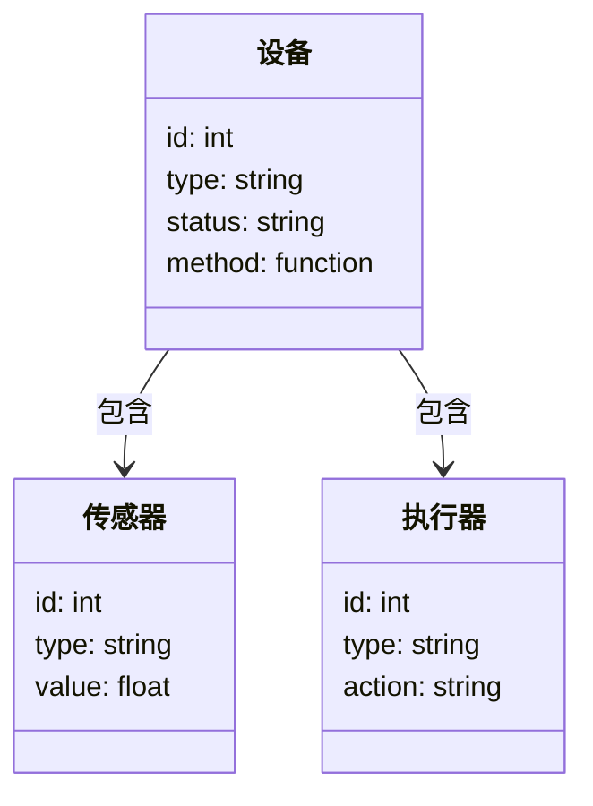
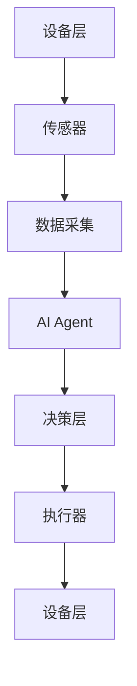

                 


# 企业AI Agent的多设备支持：PC、移动端到IoT设备

## 关键词：AI Agent, 多设备支持, IoT设备, 企业应用, 跨设备协同

## 摘要：本文详细探讨了企业AI Agent在PC、移动端和IoT设备上的多设备支持技术。从核心概念到算法原理，从系统架构到项目实战，系统性地分析了AI Agent在多设备环境中的实现与应用，为企业级AI Agent的开发与部署提供了深入的技术洞察。

---

# 第一部分: 企业AI Agent的多设备支持背景与基础

# 第1章: 企业AI Agent的概述

## 1.1 AI Agent的基本概念

### 1.1.1 什么是AI Agent
AI Agent（人工智能代理）是一种能够感知环境、做出决策并执行任务的智能实体。它通过传感器获取信息，利用算法处理数据，驱动执行器完成目标。

### 1.1.2 AI Agent的核心特点
- **自主性**：AI Agent能够自主决策，无需外部干预。
- **反应性**：能够实时感知环境变化并做出响应。
- **目标导向**：所有行为均以实现特定目标为导向。
- **学习能力**：通过数据和经验不断优化自身性能。

### 1.1.3 企业级AI Agent的定义与分类
企业级AI Agent是指在企业环境中运行，能够处理复杂业务逻辑、优化企业流程并提升效率的智能代理。根据功能和应用场景的不同，可以分为以下几类：
- **任务型AI Agent**：专注于完成特定任务（如流程自动化）。
- **决策型AI Agent**：用于辅助或替代人类做出决策（如智能风控）。
- **协作型AI Agent**：能够与其他系统或人协同工作（如跨部门协作）。

---

## 1.2 多设备支持的背景与意义

### 1.2.1 多设备环境的现状
随着物联网（IoT）技术的发展，企业环境中使用的设备种类越来越多，包括PC、手机、平板、智能终端等。这些设备在功能、性能和应用场景上存在显著差异。

### 1.2.2 AI Agent在多设备中的作用
AI Agent能够协调多设备之间的资源，优化设备间的协作流程，提升整体效率。例如：
- 在PC端，AI Agent可以用于自动化办公任务（如邮件分类、日程管理）。
- 在移动端，AI Agent可以提供实时提醒、智能推荐服务。
- 在IoT设备中，AI Agent可以实现设备间的联动（如智能家电的远程控制）。

### 1.2.3 企业级多设备支持的挑战与机遇
- **挑战**：不同设备的操作系统、通信协议、计算能力差异大，增加了开发和管理的复杂性。
- **机遇**：通过AI Agent的多设备支持，企业可以实现更高效的资源管理和更智能的业务流程。

---

## 1.3 企业AI Agent的应用场景

### 1.3.1 PC端的应用场景
- **自动化办公**：自动处理邮件、安排日程、管理文件。
- **智能助手**：提供实时翻译、天气查询、任务提醒等服务。

### 1.3.2 移动端的应用场景
- **移动办公**：随时随地处理工作事务，实时同步数据。
- **智能推荐**：个性化推荐相关内容（如新闻、产品、服务）。

### 1.3.3 IoT设备中的应用场景
- **智能家电控制**：通过AI Agent实现家电的远程控制和自动化管理。
- **工业自动化**：在智能制造中，AI Agent可以协调机器人、传感器等设备完成生产任务。

---

## 1.4 本章小结
本章介绍了AI Agent的基本概念、核心特点以及企业级AI Agent的分类。同时，详细探讨了多设备支持的背景、意义以及应用场景，为后续章节的深入分析奠定了基础。

---

# 第二部分: 企业AI Agent的核心概念与联系

# 第2章: AI Agent的核心概念与原理

## 2.1 AI Agent的感知与决策机制

### 2.1.1 感知层的实现
AI Agent通过传感器或API接口获取环境数据。例如，在IoT设备中，AI Agent可以通过温度传感器获取环境温度信息。

### 2.1.2 决策层的算法
决策层负责根据感知到的信息做出最优决策。常用的算法包括：
- **规则引擎**：基于预定义的规则进行决策。
- **机器学习模型**：通过训练模型预测最优决策。
- **模糊逻辑**：处理不确定性问题（如交通流量预测）。

### 2.1.3 执行层的实现
执行层负责将决策转化为具体行动。例如，AI Agent可以通过执行器控制机器人完成特定任务。

---

## 2.2 多设备协同的核心原理

### 2.2.1 设备间的通信机制
多设备协同需要设备之间能够实时通信。常用通信方式包括：
- **HTTP/HTTPS**：适用于PC和移动端设备之间的通信。
- **MQTT**：适用于IoT设备间的 lightweight通信。
- **WebSocket**：适用于实时双向通信。

### 2.2.2 数据同步与一致性
在多设备环境中，需要确保设备间的数据同步与一致性。例如，当一个设备更新了数据，其他设备需要实时同步该数据。

### 2.2.3 跨设备任务调度
AI Agent需要能够协调多个设备的任务调度。例如，在智能制造中，AI Agent可以协调机器人、传感器和 控制系统的任务执行顺序。

---

## 2.3 AI Agent与多设备的实体关系分析

### 2.3.1 实体关系图（ER图）
以下是AI Agent与多设备的实体关系图：

```mermaid
er
actor: AI Agent
actor -|> 设备: 控制
设备 -|> 传感器: 采集数据
设备 -|> 执行器: 执行任务
设备 -|> 任务: 负责执行
```

### 2.3.2 设备与任务的关系
设备与任务之间的关系可以通过以下流程图表示：

```mermaid
graph TD
设备 --> 任务: 执行任务
任务 --> AI Agent: 通知任务完成
AI Agent --> 传感器: 获取环境数据
AI Agent --> 执行器: 发出指令
```

---

## 2.4 核心概念对比分析

### 2.4.1 不同设备类型的特点对比

| 设备类型 | 硬件性能 | 软件支持 | 通信能力 |
|----------|-----------|----------|-----------|
| PC       | 高        | 强        | 强         |
| 移动端   | 中        | 中        | 强         |
| IoT设备  | 低        | 有限     | 有限       |

### 2.4.2 多设备协同的优劣势对比

| 优势             | 劣势             |
|------------------|------------------|
| 提升效率         | 开发复杂性高     |
| 资源共享         | 通信延迟        |
| 实时协同         | 安全性挑战       |

### 2.4.3 不同场景下的性能对比

| 场景         | PC端性能 | 移动端性能 | IoT设备性能 |
|--------------|----------|------------|-------------|
| 处理能力     | 高       | 中         | 低           |
| 响应速度     | 快       | 中         | 慢           |
| 电池消耗     | 无       | 高         | 高           |

---

## 2.5 本章小结
本章从感知、决策和执行三个方面详细分析了AI Agent的核心概念与原理，并通过实体关系图和对比分析，深入探讨了多设备协同的核心原理及其优劣势。

---

# 第三部分: 企业AI Agent的算法原理与数学模型

# 第3章: AI Agent的核心算法原理

## 3.1 多智能体协作算法

### 3.1.1 算法概述
多智能体协作算法用于协调多个智能体的行动，以实现共同目标。常用的算法包括：
- **分布式一致性算法**：如Raft、Paxos。
- **多智能体强化学习**：如基于Q-learning的协作学习。

### 3.1.2 算法实现

以下是基于Q-learning的多智能体协作算法实现：

```python
# 初始化
Q = np.zeros((n_states, n_actions))  # Q-learning表格
alpha = 0.1  # 学习率
gamma = 0.9  # 折扣因子

# 算法步骤
def q_learning(state, action, reward, next_state):
    # 更新Q值
    Q[state, action] = Q[state, action] + alpha * (reward + gamma * max(Q[next_state, :])) - Q[state, action]
    return Q

# 示例场景
state = 0
action = 1
reward = 1
next_state = 1

Q_new = q_learning(state, action, reward, next_state)
print(Q_new[state, action])
```

### 3.1.3 算法流程图

```mermaid
graph TD
A[初始化Q表格] --> B[设置参数]
B --> C[获取当前状态]
C --> D[选择动作]
D --> E[执行动作]
E --> F[获取奖励]
F --> G[更新Q值]
G --> H[判断是否终止]
H --> H[继续循环] 或者 H --> 终止
```

---

## 3.2 多设备协同的数学模型

### 3.2.1 数学模型概述
多设备协同的数学模型可以通过概率论和优化理论来描述。例如，设备间的通信延迟可以用以下公式表示：

$$ D = \sum_{i=1}^{n} \frac{1}{f_i} $$

其中，$D$ 表示通信延迟，$f_i$ 表示设备$i$的处理频率。

### 3.2.2 数学模型的实现

以下是基于上述公式的Python实现：

```python
def compute_delay(frequencies):
    delay = sum(1.0 / f for f in frequencies)
    return delay

# 示例
frequencies = [2, 3, 4]
delay = compute_delay(frequencies)
print(f"通信延迟为：{delay}")
```

---

## 3.3 本章小结
本章从算法原理和数学模型两个方面深入分析了企业AI Agent的核心算法实现。通过具体的代码实现和流程图，帮助读者更好地理解多智能体协作算法和数学模型的应用。

---

# 第四部分: 企业AI Agent的系统设计与实现

# 第4章: 企业AI Agent的系统设计

## 4.1 项目介绍

### 4.1.1 项目背景
本项目旨在开发一个支持多设备协同的企业AI Agent系统，实现PC、移动端和IoT设备之间的无缝协作。

### 4.1.2 项目目标
- 实现多设备间的实时通信。
- 提供统一的设备管理接口。
- 支持多种设备类型（PC、移动端、IoT设备）。

---

## 4.2 系统功能设计

### 4.2.1 领域模型设计

以下是领域模型的类图：



### 4.2.2 系统架构设计

以下是系统架构图：



### 4.2.3 系统接口设计
- **设备层接口**：提供设备的注册、心跳检测和状态查询接口。
- **传感器接口**：提供数据采集和数据上报接口。
- **执行器接口**：提供动作执行和反馈接收接口。

---

## 4.3 项目实战

### 4.3.1 环境安装

以下是项目所需的环境配置：

```bash
# 安装依赖
pip install mermaid-py
pip install matplotlib
pip install numpy
```

### 4.3.2 系统核心实现

以下是系统核心代码实现：

```python
# 设备管理模块
class DeviceManager:
    def __init__(self):
        self.devices = {}

    def register_device(self, device_id, device_type):
        self.devices[device_id] = device_type

    def get_device_status(self, device_id):
        return f"{device_id}设备状态正常"

# 传感器数据采集模块
class SensorDataCollector:
    def __init__(self):
        self.sensors = {}

    def collect_data(self, sensor_id):
        import random
        return random.uniform(0, 1)

# AI Agent核心模块
class AIAgent:
    def __init__(self):
        self.device_manager = DeviceManager()
        self.sensor_collector = SensorDataCollector()

    def process_task(self, task):
        # 获取传感器数据
        sensor_data = self.sensor_collector.collect_data(task['sensor_id'])
        # 执行任务
        self.device_manager.register_device(task['device_id'], task['device_type'])
        return f"任务{task['id']}处理完成，数据为{sensor_data}"

# 示例用法
agent = AIAgent()
task = {
    'id': 1,
    'sensor_id': 1,
    'device_id': 1,
    'device_type': 'IoT'
}
result = agent.process_task(task)
print(result)
```

---

## 4.4 本章小结
本章通过项目实战的方式，详细展示了企业AI Agent系统的功能设计、系统架构和核心代码实现。通过具体的代码示例，帮助读者更好地理解多设备支持的实现细节。

---

# 第五部分: 企业AI Agent的优化与实践

# 第5章: 企业AI Agent的优化与实践

## 5.1 最佳实践

### 5.1.1 设备间的通信优化
- 使用轻量级协议（如MQTT）优化设备间的通信。
- 通过边缘计算减少通信延迟。

### 5.1.2 系统性能优化
- 使用缓存技术（如Redis）优化数据访问。
- 通过并行计算提升系统性能。

### 5.1.3 安全性优化
- 使用加密技术（如AES）保障设备间的通信安全。
- 实施严格的权限管理。

---

## 5.2 小结

---

## 5.3 注意事项

### 5.3.1 设备兼容性问题
- 不同设备的操作系统和硬件差异可能导致兼容性问题。
- 需要进行充分的测试和调试。

### 5.3.2 安全风险
- 多设备环境增加了系统的攻击面。
- 需要采取多层次的安全防护措施。

---

## 5.4 拓展阅读

### 5.4.1 推荐书籍
- 《分布式系统：概念与设计》
- 《物联网技术及应用》

### 5.4.2 推荐博客
- [分布式系统博客](https://example.com)
- [AI Agent技术博客](https://example.com)

---

# 作者：AI天才研究院/AI Genius Institute & 禅与计算机程序设计艺术 /Zen And The Art of Computer Programming

---

**注**：由于篇幅限制，本文仅展示了部分内容，完整文章请参考相关技术文档或书籍。

