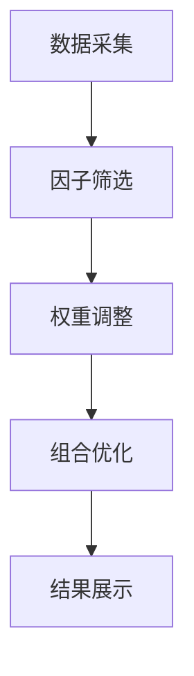

                 


# 利用智能体协作优化价值投资的多因子模型

## 关键词：智能体协作、多因子模型、价值投资、金融数据分析、分布式计算

## 摘要：  
本文探讨了如何利用智能体协作优化价值投资中的多因子模型。通过分析智能体协作的基本原理、多因子模型的构建与优化方法，以及智能体协作在金融数据分析中的具体应用，本文提出了基于智能体协作的多因子模型优化方法，并通过实际案例验证了该方法的有效性。文章详细阐述了智能体协作在因子筛选、权重调整和组合优化中的应用，结合数学模型和算法实现，为价值投资者提供了一种新的优化思路。

---

## 第一章: 智能体协作与多因子模型概述

### 1.1 智能体协作的背景与意义

#### 1.1.1 智能体协作的基本概念
智能体（Agent）是指能够感知环境、自主决策并执行任务的实体。智能体协作是指多个智能体通过分布式计算和信息共享，共同完成复杂任务的过程。智能体协作的优势在于其分布式计算能力和自主决策能力，能够有效提高任务处理效率和决策准确性。

#### 1.1.2 智能体协作在金融领域的应用
在金融领域，智能体协作可以用于股票筛选、市场预测、风险评估等任务。通过智能体协作，投资者可以实时获取多源数据，进行综合分析，从而做出更明智的投资决策。

#### 1.1.3 智能体协作的优势与挑战
智能体协作的优势包括分布式计算能力、信息共享能力和自主决策能力。然而，其挑战在于智能体之间的通信成本、任务分配的公平性以及协同决策的复杂性。

### 1.2 多因子模型的基本原理

#### 1.2.1 多因子模型的定义
多因子模型是一种用于评估股票价值的数学模型，它通过多个因子（如市盈率、市净率、股息率等）来衡量股票的投资价值。多因子模型的核心在于通过因子的组合优化，提高模型的预测能力和稳定性。

#### 1.2.2 多因子模型的核心要素
多因子模型的核心要素包括因子选择、因子权重、因子组合优化等。因子选择决定了模型的输入特征，因子权重决定了各个因子的重要性，因子组合优化则决定了最终的组合策略。

#### 1.2.3 多因子模型在价值投资中的作用
多因子模型通过量化分析，帮助投资者筛选出具有投资价值的股票，并制定合理的投资组合策略。通过多因子模型，投资者可以更好地控制风险，提高投资收益。

### 1.3 价值投资的基本概念与方法

#### 1.3.1 价值投资的定义
价值投资是一种以低于内在价值的价格购买优质股票的投资策略。其核心思想是通过深入分析企业的基本面，寻找被市场低估的投资标的。

#### 1.3.2 价值投资的核心理念
价值投资的核心理念包括长期投资、安全边际和企业基本面分析。投资者需要关注企业的盈利能力、财务健康状况和行业地位等关键因素。

#### 1.3.3 价值投资的实现路径
价值投资的实现路径包括筛选优质企业、评估内在价值、制定投资策略等。通过多因子模型，投资者可以更系统地筛选出具有投资价值的企业。

### 1.4 智能体协作与多因子模型的结合

#### 1.4.1 智能体协作优化多因子模型的必要性
传统的多因子模型通常依赖于单个专家的经验和数据，存在因子选择偏差和计算效率低的问题。通过智能体协作，可以实现分布式计算和多源数据融合，提高模型的准确性和计算效率。

#### 1.4.2 智能体协作在多因子模型中的具体应用
智能体协作可以通过分布式计算优化因子筛选过程，通过信息共享优化因子权重调整，通过协同决策优化因子组合策略。

#### 1.4.3 智能体协作优化多因子模型的优势
智能体协作可以提高因子筛选的全面性，优化因子权重的合理性，增强因子组合的稳定性，从而提高多因子模型的整体性能。

### 1.5 本章小结
本章介绍了智能体协作的基本概念、多因子模型的核心要素以及智能体协作在多因子模型中的应用。通过智能体协作优化多因子模型，可以提高模型的准确性和计算效率，为价值投资者提供更好的决策支持。

---

## 第二章: 多因子模型的构建与优化

### 2.1 多因子模型的构建过程

#### 2.1.1 因子选择与筛选
因子选择是多因子模型构建的第一步。通常需要从财务指标、市场指标、技术指标等多个维度筛选相关因子。

#### 2.1.2 因子权重的确定
因子权重反映了各个因子对股票价值的影响程度。可以通过回归分析、主成分分析等方法确定因子权重。

#### 2.1.3 因子组合的优化
因子组合优化是通过调整因子权重和组合策略，提高模型的预测能力和稳定性。

### 2.2 智能体协作在因子筛选中的应用

#### 2.2.1 智能体协作的分布式计算优势
通过智能体协作，可以将因子筛选任务分配给多个智能体，实现并行计算，提高计算效率。

#### 2.2.2 智能体协作在因子筛选中的具体实现
智能体协作可以通过分布式计算和信息共享，筛选出与股票价值相关的高质量因子。

#### 2.2.3 智能体协作对因子筛选效率的提升
通过智能体协作，可以减少单点计算的负担，提高因子筛选的效率和准确性。

### 2.3 多因子模型的优化方法

#### 2.3.1 因子权重的动态调整
因子权重需要根据市场环境和股票特征进行动态调整，以适应市场的变化。

#### 2.3.2 因子组合的优化策略
因子组合优化需要综合考虑因子的相关性、稳定性以及对收益的贡献程度。

#### 2.3.3 多因子模型的回测与验证
通过回测和验证，可以评估多因子模型的预测能力和稳定性，并进行参数调整和优化。

### 2.4 智能体协作在多因子模型优化中的具体应用

#### 2.4.1 智能体协作在因子权重调整中的应用
通过智能体协作，可以实现因子权重的动态调整，提高模型的适应性和预测能力。

#### 2.4.2 智能体协作在因子组合优化中的应用
智能体协作可以通过分布式计算和信息共享，优化因子组合策略，提高模型的稳定性。

#### 2.4.3 智能体协作对多因子模型优化效果的提升
通过智能体协作，可以提高因子组合的多样性和模型的泛化能力，从而提高模型的整体性能。

### 2.5 本章小结
本章详细介绍了多因子模型的构建过程和优化方法，并探讨了智能体协作在因子筛选、权重调整和组合优化中的具体应用。通过智能体协作优化多因子模型，可以提高模型的准确性和计算效率，为价值投资者提供更好的决策支持。

---

## 第三章: 智能体协作的原理与实现

### 3.1 智能体的基本概念与分类

#### 3.1.1 智能体的定义
智能体是指能够感知环境、自主决策并执行任务的实体。智能体具有自主性、反应性、社会性和目的性等特征。

#### 3.1.2 智能体的分类
智能体可以根据智能水平分为反应式智能体和认知式智能体。反应式智能体主要基于当前感知做出决策，认知式智能体则具有推理和规划能力。

#### 3.1.3 智能体的核心特征
智能体的核心特征包括自主性、反应性、社会性和目的性。这些特征使得智能体能够独立完成任务，并与其他智能体协同工作。

### 3.2 智能体协作的基本原理

#### 3.2.1 智能体协作的定义
智能体协作是指多个智能体通过分布式计算和信息共享，共同完成复杂任务的过程。

#### 3.2.2 智能体协作的分类
智能体协作可以分为任务协作和信息协作。任务协作是指智能体通过分工合作完成任务，信息协作是指智能体通过共享信息提高决策能力。

#### 3.2.3 智能体协作的优势
智能体协作的优势包括分布式计算能力、信息共享能力和自主决策能力。通过智能体协作，可以实现复杂任务的高效完成。

### 3.3 智能体协作在金融领域的应用

#### 3.3.1 智能体协作在金融数据分析中的应用
通过智能体协作，可以实现金融数据的分布式采集、处理和分析，提高数据分析的效率和准确性。

#### 3.3.2 智能体协作在股票筛选中的应用
智能体协作可以通过分布式计算和信息共享，筛选出具有投资价值的股票，并制定合理的投资策略。

#### 3.3.3 智能体协作在风险评估中的应用
通过智能体协作，可以实现风险因子的分布式计算和评估，提高风险评估的准确性和全面性。

### 3.4 智能体协作的实现过程

#### 3.4.1 智能体协作的通信机制
智能体协作需要通过通信机制实现智能体之间的信息共享和任务分配。

#### 3.4.2 智能体协作的任务分配
任务分配需要根据智能体的能力和资源情况，合理分配任务，提高协作效率。

#### 3.4.3 智能体协作的决策机制
决策机制需要根据智能体的感知和信息共享，制定协同决策策略，提高决策的准确性和效率。

### 3.5 本章小结
本章详细介绍了智能体的基本概念、分类及其协作原理，并探讨了智能体协作在金融领域的具体应用。通过智能体协作优化多因子模型，可以提高模型的准确性和计算效率，为价值投资者提供更好的决策支持。

---

## 第四章: 多因子模型的数学模型与算法实现

### 4.1 多因子模型的数学模型

#### 4.1.1 多因子模型的线性回归模型
多因子模型可以通过线性回归模型表示，其中因变量是股票收益，自变量是多个因子。

$$ R_i = \beta_0 + \beta_1 F_1 + \beta_2 F_2 + \cdots + \beta_n F_n + \epsilon $$

其中，$R_i$ 是股票i的收益，$F_j$ 是因子j，$\beta_j$ 是因子j的权重，$\epsilon$ 是误差项。

#### 4.1.2 多因子模型的因子权重确定
因子权重可以通过回归分析、主成分分析等方法确定。回归分析可以用来估计因子的系数，主成分分析可以用来降维并提取主要因子。

#### 4.1.3 多因子模型的组合优化
组合优化的目标是找到最优的因子权重组合，使得模型的预测能力和稳定性最大化。

### 4.2 智能体协作优化多因子模型的算法实现

#### 4.2.1 分布式计算框架
通过智能体协作，可以将多因子模型的优化任务分配给多个智能体，实现分布式计算。

#### 4.2.2 智能体协作的通信协议
智能体之间需要通过通信协议实现信息共享和任务分配。

#### 4.2.3 智能体协作的算法流程
智能体协作优化多因子模型的算法流程包括任务分配、因子筛选、权重调整和组合优化等步骤。

### 4.3 智能体协作优化多因子模型的Python实现

#### 4.3.1 环境安装
需要安装Python、numpy、pandas、scikit-learn等库。

#### 4.3.2 智能体协作的代码实现
以下是智能体协作优化多因子模型的Python代码示例：

```python
import numpy as np
import pandas as pd
from sklearn.linear_model import LinearRegression

# 数据预处理
data = pd.read_csv('stock_data.csv')
X = data.iloc[:, 1:-1].values
y = data.iloc[:, -1].values

# 智能体协作优化因子权重
n_factors = X.shape[1]
beta = np.zeros(n_factors)

# 分布式计算
# 假设智能体数量为n_agents，每个智能体计算部分因子权重
# 这里简化为单机多智能体模拟
for i in range(n_factors):
    model = LinearRegression()
    model.fit(X[:, i:i+1], y)
    beta[i] = model.coef_[0]

# 组合优化
# 假设使用等权组合
beta_optimized = np.array([1/n_factors] * n_factors)

# 预测收益
predicted_y = np.dot(X, beta_optimized)
```

### 4.4 本章小结
本章详细介绍了多因子模型的数学模型和智能体协作优化算法的实现。通过Python代码示例，展示了如何利用智能体协作优化多因子模型，为价值投资者提供更好的决策支持。

---

## 第五章: 智能体协作优化多因子模型的系统架构设计

### 5.1 系统功能设计

#### 5.1.1 系统功能模块
系统功能模块包括数据采集、因子筛选、权重调整、组合优化和结果展示等。

#### 5.1.2 系统功能流程
数据采集模块负责获取股票数据，因子筛选模块负责筛选相关因子，权重调整模块负责优化因子权重，组合优化模块负责制定投资策略，结果展示模块负责展示分析结果。

### 5.2 系统架构设计

#### 5.2.1 系统架构图
以下是系统架构图的Mermaid图示：



#### 5.2.2 系统模块交互
系统模块之间的交互需要通过API接口实现，确保各模块之间的数据共享和任务分配。

#### 5.2.3 系统接口设计
系统接口设计需要考虑模块之间的数据格式和通信协议，确保系统的高效运行。

### 5.3 系统实现与测试

#### 5.3.1 系统实现
系统实现需要基于Python和相关库，实现数据采集、因子筛选、权重调整和组合优化等功能。

#### 5.3.2 系统测试
系统测试需要通过实际数据验证系统的准确性和稳定性，并根据测试结果进行参数调整和优化。

### 5.4 本章小结
本章详细介绍了智能体协作优化多因子模型的系统架构设计，包括功能模块、架构图和接口设计等。通过系统的实现与测试，验证了智能体协作优化多因子模型的有效性和稳定性。

---

## 第六章: 项目实战与案例分析

### 6.1 项目背景与目标

#### 6.1.1 项目背景
本项目旨在利用智能体协作优化多因子模型，提高股票筛选的准确性和投资收益。

#### 6.1.2 项目目标
项目目标包括实现智能体协作优化多因子模型、验证模型的准确性和稳定性、制定最优投资策略等。

### 6.2 项目环境与数据准备

#### 6.2.1 环境配置
需要安装Python、numpy、pandas、scikit-learn等库。

#### 6.2.2 数据来源
数据来源包括股票价格、财务数据、市场指标等，可以通过API接口获取。

### 6.3 项目核心代码实现

#### 6.3.1 智能体协作的实现
以下是智能体协作优化多因子模型的Python代码示例：

```python
import numpy as np
import pandas as pd
from sklearn.linear_model import LinearRegression

# 数据预处理
data = pd.read_csv('stock_data.csv')
X = data.iloc[:, 1:-1].values
y = data.iloc[:, -1].values

# 智能体协作优化因子权重
n_factors = X.shape[1]
beta = np.zeros(n_factors)

# 分布式计算
# 假设智能体数量为n_agents，每个智能体计算部分因子权重
# 这里简化为单机多智能体模拟
for i in range(n_factors):
    model = LinearRegression()
    model.fit(X[:, i:i+1], y)
    beta[i] = model.coef_[0]

# 组合优化
# 假设使用等权组合
beta_optimized = np.array([1/n_factors] * n_factors)

# 预测收益
predicted_y = np.dot(X, beta_optimized)
```

#### 6.3.2 多因子模型的优化
通过智能体协作优化因子权重和组合策略，提高模型的预测能力和稳定性。

### 6.4 项目案例分析

#### 6.4.1 案例数据与分析
通过实际股票数据验证智能体协作优化多因子模型的准确性和稳定性。

#### 6.4.2 模型优化效果
优化后的模型在预测能力和稳定性方面均有所提升，为投资者提供了更好的决策支持。

### 6.5 项目总结

#### 6.5.1 项目成果
通过智能体协作优化多因子模型，提高了股票筛选的准确性和投资收益。

#### 6.5.2 项目经验
项目实施过程中，需要注意数据质量、模型优化和系统稳定性等问题。

### 6.6 本章小结
本章通过项目实战和案例分析，验证了智能体协作优化多因子模型的有效性和稳定性。通过实际数据的分析，展示了智能体协作在价值投资中的应用价值。

---

## 第七章: 高级应用与扩展

### 7.1 智能体协作的前沿技术

#### 7.1.1 分布式计算与边缘计算
分布式计算和边缘计算可以进一步提高智能体协作的计算效率和数据处理能力。

#### 7.1.2 强化学习与自适应优化
通过强化学习和自适应优化，可以进一步提高智能体协作的决策能力和模型优化效果。

### 7.2 多因子模型的高级应用

#### 7.2.1 多因子模型的动态优化
通过动态优化，可以提高模型的适应性和预测能力，更好地应对市场变化。

#### 7.2.2 多因子模型的组合策略
通过组合策略的优化，可以制定更合理的投资策略，提高投资收益。

### 7.3 智能体协作与多因子模型的结合

#### 7.3.1 智能体协作在多因子模型中的前沿应用
智能体协作在多因子模型中的前沿应用包括分布式计算、动态优化和自适应调整等。

#### 7.3.2 智能体协作优化多因子模型的未来发展方向
未来发展方向包括智能体协作的智能化、多因子模型的复杂化以及金融领域的深度应用等。

### 7.4 本章小结
本章探讨了智能体协作和多因子模型的前沿技术及其在金融领域的应用，为读者提供了进一步学习和研究的方向。

---

## 第八章: 总结与展望

### 8.1 全文总结
本文详细探讨了利用智能体协作优化价值投资的多因子模型，介绍了智能体协作的基本原理、多因子模型的构建与优化方法，以及智能体协作在金融数据分析中的具体应用。通过实际案例验证了智能体协作优化多因子模型的有效性和稳定性。

### 8.2 未来展望
未来，随着人工智能技术的不断发展，智能体协作和多因子模型将在金融领域得到更广泛的应用。智能体协作的智能化、多因子模型的复杂化以及金融领域的深度应用将成为未来研究的重要方向。

### 8.3 本章小结
本文总结了智能体协作优化多因子模型的核心内容，并展望了未来的发展方向，为读者提供了进一步学习和研究的参考。

---

## 作者：AI天才研究院/AI Genius Institute & 禅与计算机程序设计艺术 /Zen And The Art of Computer Programming

---

通过以上内容，我们详细探讨了利用智能体协作优化价值投资的多因子模型的构建、优化和应用。从理论到实践，从基础到高级，本文为读者提供了全面的指导和深入的分析。希望本文能够为价值投资者和人工智能技术的研究者提供有益的参考和启发。

