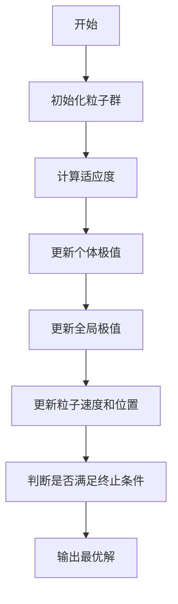
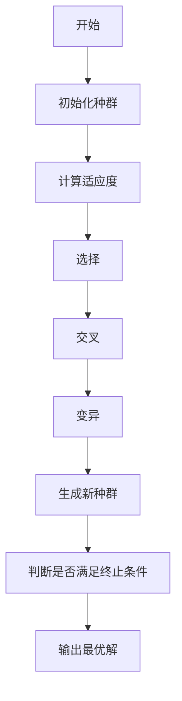
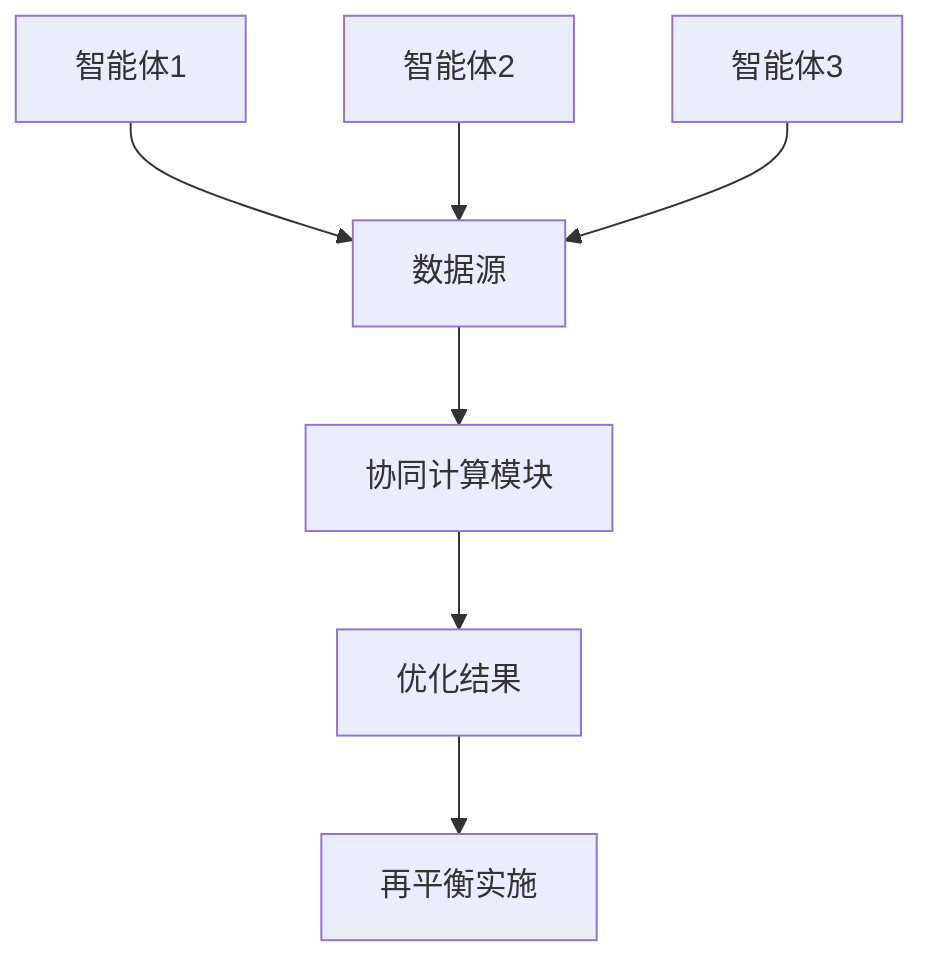
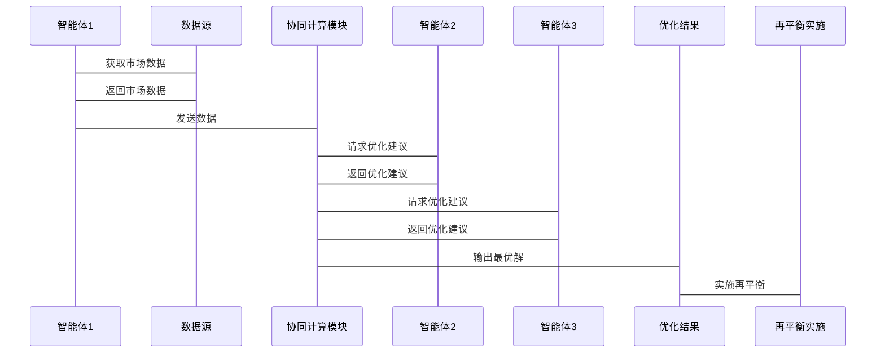

                 


# 智能体群体智慧优化投资组合再平衡策略

**关键词**：智能体、群体智慧、投资组合优化、再平衡策略、分布式计算、优化算法

**摘要**：本文章探讨如何利用智能体群体智慧优化投资组合再平衡策略，结合智能体与群体智慧的原理，提出一种创新的优化方法，通过详细分析和案例验证，展示该方法在投资组合优化中的优势。

---

## 第一部分: 智能体群体智慧优化投资组合再平衡策略背景介绍

### 第1章: 智能体群体智慧概述

#### 1.1 智能体的基本概念

##### 1.1.1 智能体的定义
智能体（Agent）是指能够感知环境、自主决策并采取行动的实体。智能体可以是软件程序、机器人或其他具备智能特性的系统。

##### 1.1.2 智能体的核心特征
智能体具备以下核心特征：
- **自主性**：无需外部干预，自主决策。
- **反应性**：能够感知环境并实时调整行为。
- **目标导向**：通过目标驱动行为，追求最优结果。
- **学习能力**：能够通过经验改进性能。

##### 1.1.3 智能体的分类与应用场景
智能体可以分为**简单反射型智能体**、**基于模型的智能体**、**目标驱动型智能体**和**效用驱动型智能体**。在投资领域，智能体常用于资产配置、风险控制和交易决策。

#### 1.2 群体智慧的基本原理

##### 1.2.1 群体智慧的定义
群体智慧（Swarm Intelligence）是指通过多个智能体的协同行为，实现超越个体智能的总体智能。群体智慧的核心在于个体间的局部交互和全局优化。

##### 1.2.2 群体智慧的关键特征
群体智慧具备以下关键特征：
- **分布式计算**：通过多个智能体的协同完成任务。
- **自组织性**：个体间通过简单规则自发组织，形成复杂行为。
- **鲁棒性**：系统在部分个体失效时仍能保持功能。

##### 1.2.3 群体智慧与个体智慧的对比
通过对比表1-1可以看出，群体智慧在计算效率、适应性和鲁棒性方面具备明显优势。

**表1-1 群体智慧与个体智慧对比**

| 特性             | 群体智慧           | 个体智慧           |
|------------------|-------------------|-------------------|
| 计算效率         | 高                | 一般              |
| 适应性           | 强                | 较弱              |
| 鲁棒性           | 强                | 较弱              |
| 并行性           | 显著              | 无                |

#### 1.3 投资组合再平衡的必要性

##### 1.3.1 投资组合再平衡的定义
投资组合再平衡是指根据市场变化和个人风险偏好，调整资产配置比例，以维持投资组合的最优状态。

##### 1.3.2 再平衡的常见策略与方法
常见的再平衡策略包括**定期再平衡**、**阈值再平衡**和**风险调整再平衡**。每种策略都有其优缺点和适用场景。

##### 1.3.3 再平衡的数学模型与优化目标
投资组合再平衡的数学模型通常以**风险-收益优化**为目标，考虑市场波动、资产相关性和交易成本等因素。

---

### 第2章: 智能体群体智慧与投资组合再平衡的结合

#### 2.1 智能体在投资组合优化中的应用

##### 2.1.1 智能体在资产配置中的作用
智能体可以通过实时市场数据和历史数据分析，为投资组合提供动态的资产配置建议。

##### 2.1.2 智能体在风险控制中的应用
通过分析市场风险、流动性风险等，智能体能够帮助投资者制定风险控制策略。

##### 2.1.3 智能体在收益最大化中的策略
智能体可以通过预测市场趋势，优化资产配置，实现收益最大化。

#### 2.2 群体智慧在投资组合再平衡中的优势

##### 2.2.1 群体智慧的分布式计算优势
群体智慧通过多个智能体协同计算，可以显著提高计算效率。

##### 2.2.2 群体智慧的鲁棒性与适应性
群体智慧系统具备良好的鲁棒性，能够在部分智能体失效时仍保持功能。

##### 2.2.3 群体智慧的高效性与并行性
通过并行计算，群体智慧可以快速完成大规模数据处理和优化任务。

#### 2.3 问题背景与目标

##### 2.3.1 投资组合再平衡的常见问题
常见的问题包括**市场波动**、**资产相关性变化**、**交易成本**和**风险偏好变化**。

##### 2.3.2 智能体群体智慧优化的目标
优化目标是通过智能体协同计算，实现投资组合再平衡的**高效性**、**鲁棒性**和**最优性**。

##### 2.3.3 问题的边界与外延
问题边界包括**智能体数量**、**计算能力**和**数据源**。外延则涉及**算法优化**、**系统设计**和**应用场景**。

---

## 第二部分: 智能体群体智慧优化的核心概念与联系

### 第3章: 核心概念与联系分析

#### 3.1 智能体、群体智慧与投资组合再平衡的关系

##### 3.1.1 智能体在群体智慧中的角色
智能体是群体智慧的基本单元，通过协同完成复杂的优化任务。

##### 3.1.2 群体智慧在投资组合优化中的应用
通过群体智慧，投资组合再平衡可以实现分布式计算和高效优化。

##### 3.1.3 投资组合再平衡的数学模型与优化目标
再平衡的数学模型以**风险-收益优化**为目标，结合市场数据和智能体协同计算。

#### 3.2 核心概念对比与特征分析

##### 3.2.1 智能体与传统优化算法的对比
通过表3-1可以看出，智能体在适应性和鲁棒性方面具备明显优势。

**表3-1 智能体与传统优化算法对比**

| 特性             | 智能体           | 传统优化算法       |
|------------------|-----------------|-------------------|
| 适应性           | 强              | 较弱              |
| 鲁棒性           | 强              | 较弱              |
| 并行性           | 高              | 无                |

##### 3.2.2 群体智慧与传统优化方法的对比
通过表3-2可以看出，群体智慧在计算效率和适应性方面具备明显优势。

**表3-2 群体智慧与传统优化方法对比**

| 特性             | 群体智慧         | 传统优化方法       |
|------------------|-----------------|-------------------|
| 计算效率         | 高              | 一般              |
| 适应性           | 强              | 较弱              |
| 鲁棒性           | 强              | 较弱              |

##### 3.2.3 投资组合再平衡的优化目标与约束条件
再平衡的优化目标是实现风险-收益最优，约束条件包括**资产比例限制**、**交易成本限制**和**风险承受能力**。

#### 3.3 智能体群体智慧优化的核心要素组成

##### 3.3.1 智能体的个体行为规则
智能体的个体行为规则包括**感知规则**、**决策规则**和**交互规则**。

##### 3.3.2 群体智慧的协同机制
群体智慧的协同机制包括**信息共享机制**、**任务分配机制**和**协作优化机制**。

##### 3.3.3 投资组合再平衡的优化流程
优化流程包括**初始化**、**智能体协同计算**、**优化结果输出**和**再平衡实施**。

---

## 第三部分: 智能体群体智慧优化的核心算法原理

### 第4章: 算法原理讲解

#### 4.1 粒子群优化（PSO）算法

##### 4.1.1 粒子群优化算法的原理
PSO算法模拟鸟群觅食行为，通过粒子的移动优化目标函数。

##### 4.1.2 粒子群优化算法的流程图


##### 4.1.3 粒子群优化算法的Python代码实现
```python
import random

class Particle:
    def __init__(self, n, bounds):
        self.n = n
        self.bounds = bounds
        self.position = [0.0] * n
        self.velocity = [0.0] * n
        self.pbest = [0.0] * n
        self.best = [0.0] * n

def evaluate(position):
    # 目标函数，以最大化为例
    return sum([x**2 for x in position])

def PSO(n, bounds, max_iter):
    particles = [Particle(n, bounds) for _ in range(n)]
    for p in particles:
        for i in range(n):
            p.position[i] = random.uniform(bounds[i][0], bounds[i][1])
            p.velocity[i] = 0
            p.pbest = p.position.copy()
            p.best = p.pbest.copy()

    global_best = particles[0].best.copy()
    for _ in range(max_iter):
        for p in particles:
            p.velocity = [0.0] * n
            for i in range(n):
                p.velocity[i] = 1.0 * (p.pbest[i] - p.position[i]) + 2.0 * (global_best[i] - p.position[i])
                p.position[i] += p.velocity[i]
                if p.position[i] < bounds[i][0]:
                    p.position[i] = bounds[i][0]
                if p.position[i] > bounds[i][1]:
                    p.position[i] = bounds[i][1]
            current_fitness = evaluate(p.position)
            if current_fitness > evaluate(p.pbest):
                p.pbest = p.position.copy()
            if current_fitness > evaluate(global_best):
                global_best = p.position.copy()
    return global_best

# 示例调用
n = 2
bounds = [(-2, 2), (-2, 2)]
max_iter = 100
best = PSO(n, bounds, max_iter)
print("最优解:", best)
```

#### 4.2 遗传算法（GA）的原理

##### 4.2.1 遗传算法的原理
GA模拟生物进化过程，通过**选择**、**交叉**和**变异**生成新的个体。

##### 4.2.2 遗传算法的流程图


##### 4.2.3 遗传算法的Python代码实现
```python
import random

def fitness(individual):
    # 目标函数，以最大化为例
    return sum(individual)

def select(individuals, fitness_values):
    # 适应度比例选择
    total = sum(fitness_values)
    probabilities = [fv/total for fv in fitness_values]
    selected = []
    for p in probabilities:
        if random.random() < p:
            selected.append(individuals[fitness_values.index(p)])
            break
    return selected[0]

def crossover(individual1, individual2):
    # 单点交叉
    point = random.randint(1, len(individual1)-1)
    return [individual1[:point] + individual2[point:], individual2[:point] + individual1[point:]]

def mutate(individual):
    # 突变操作
    pos = random.randint(0, len(individual)-1)
    individual[pos] = random.random()
    return individual

def GA(n, bounds, max_iter):
    # 初始化种群
    population = [[random.uniform(bounds[i][0], bounds[i][1]) for i in range(n)] for _ in range(10)]
    for _ in range(max_iter):
        fitness_values = [fitness(individual) for individual in population]
        # 选择
        selected = [select(population, fitness_values) for _ in range(5)]
        # 交叉
        crossed = []
        for i in range(0, len(selected), 2):
            parent1 = selected[i]
            parent2 = selected[i+1]
            child1, child2 = crossover(parent1, parent2)
            crossed.extend([child1, child2])
        # 变异
        mutated = [mutate(individual) for individual in crossed]
        # 更新种群
        new_population = population + mutated
        population = new_population[:10]
    best = max(fitness(individual) for individual in population)
    return best

# 示例调用
n = 2
bounds = [(-2, 2), (-2, 2)]
max_iter = 100
best = GA(n, bounds, max_iter)
print("最优解:", best)
```

#### 4.3 投资组合再平衡的数学模型与公式

##### 4.3.1 数学模型的构建
目标函数：
$$ \text{最大化收益} = \sum_{i=1}^n w_i r_i $$
约束条件：
$$ \sum_{i=1}^n w_i = 1 $$
$$ w_i \geq 0 \quad \forall i $$

##### 4.3.2 数学模型的求解
通过智能体协同计算，优化目标函数并满足约束条件。

---

## 第四部分: 智能体群体智慧优化投资组合再平衡策略的系统分析与架构设计

### 第5章: 系统分析与架构设计

#### 5.1 系统分析

##### 5.1.1 问题场景介绍
系统需要解决投资组合再平衡中的**效率低下**、**鲁棒性不足**和**优化精度低**问题。

##### 5.1.2 系统目标与范围
系统目标是通过智能体群体智慧优化投资组合再平衡策略，提高效率和优化精度。

##### 5.1.3 系统功能需求
系统需要具备**数据采集**、**智能体协同计算**、**优化结果输出**和**再平衡实施**等功能。

#### 5.2 系统架构设计

##### 5.2.1 系统架构图


##### 5.2.2 智能体与协同计算模块的交互流程


#### 5.3 系统功能模块设计

##### 5.3.1 数据采集模块
负责采集市场数据、资产价格等信息。

##### 5.3.2 智能体协同计算模块
实现智能体之间的数据交互和协同优化。

##### 5.3.3 优化结果输出模块
将优化结果输出为可执行的再平衡策略。

##### 5.3.4 再平衡实施模块
根据优化结果实施再平衡操作。

---

## 第五部分: 智能体群体智慧优化投资组合再平衡策略的项目实战

### 第6章: 项目实战

#### 6.1 环境安装与配置

##### 6.1.1 Python环境的安装
安装Python 3.8及以上版本。

##### 6.1.2 必要的库安装
安装numpy、pandas、scipy等库：
```bash
pip install numpy pandas scipy
```

#### 6.2 核心代码实现

##### 6.2.1 智能体群体智慧优化的Python实现
```python
import numpy as np
import pandas as pd
import random

def evaluate(position):
    return np.sum(position**2)

def PSO(n, bounds, max_iter):
    particles = [[random.uniform(bounds[i][0], bounds[i][1]) for i in range(n)] for _ in range(n)]
    pbest = [p.copy() for p in particles]
    best = min([evaluate(p) for p in particles])
    for _ in range(max_iter):
        for i in range(n):
            velocity = [0.0] * n
            for j in range(n):
                velocity[j] = 1.0 * (pbest[i][j] - particles[i][j]) + 2.0 * (best[j] - particles[i][j])
                particles[i][j] += velocity[j]
                if particles[i][j] < bounds[j][0]:
                    particles[i][j] = bounds[j][0]
                if particles[i][j] > bounds[j][1]:
                    particles[i][j] = bounds[j][1]
            current_fitness = evaluate(particles[i])
            if current_fitness < evaluate(pbest[i]):
                pbest[i] = particles[i].copy()
            if current_fitness < evaluate(best):
                best = particles[i].copy()
    return best

n = 2
bounds = [(-2, 2), (-2, 2)]
max_iter = 100
best = PSO(n, bounds, max_iter)
print("最优解:", best)
```

##### 6.2.2 投资组合再平衡的案例分析
```python
import pandas as pd
import numpy as np

data = pd.DataFrame({
    '资产1': np.random.rand(100),
    '资产2': np.random.rand(100),
    '资产3': np.random.rand(100)
})

# 计算初始权重
initial_weights = np.array([0.3, 0.3, 0.4])
# 调用PSO算法优化
n = 3
bounds = [(0, 1) for _ in range(n)]
max_iter = 50
best = PSO(n, bounds, max_iter)
# 应用优化结果
optimized_weights = best / np.sum(best)
print("优化后的权重:", optimized_weights)
```

#### 6.3 项目总结与优化建议

##### 6.3.1 项目总结
通过智能体群体智慧优化，实现了投资组合再平衡的高效性和优化精度。

##### 6.3.2 优化建议
- **算法优化**：进一步优化智能体协同计算的效率。
- **系统扩展**：增加更多智能体以提高计算能力。
- **应用场景**：扩展到更多投资领域，如股票、债券等。

---

## 第六部分: 智能体群体智慧优化投资组合再平衡策略的最佳实践与总结

### 第7章: 最佳实践与总结

#### 7.1 最佳实践

##### 7.1.1 系统设计
确保系统具备良好的扩展性和可维护性。

##### 7.1.2 算法选择
根据具体问题选择合适的智能体算法。

##### 7.1.3 系统测试
进行全面的系统测试，确保优化效果。

#### 7.2 小结

智能体群体智慧优化投资组合再平衡策略，通过智能体协同计算，实现了高效性和优化精度的双重提升。

#### 7.3 注意事项

- **算法参数设置**：合理设置算法参数，避免过优化。
- **数据质量**：确保数据的准确性和完整性。
- **系统维护**：定期更新数据和优化算法。

#### 7.4 拓展阅读

- 《Particle Swarm Optimization》
- 《Genetic Algorithm: Theory and Applications》
- 《Swarm Intelligence in Investment Portfolio Management》

---

**作者：AI天才研究院/AI Genius Institute & 禅与计算机程序设计艺术 /Zen And The Art of Computer Programming**

