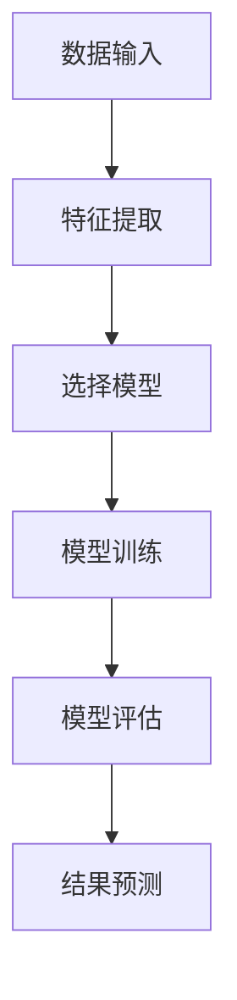
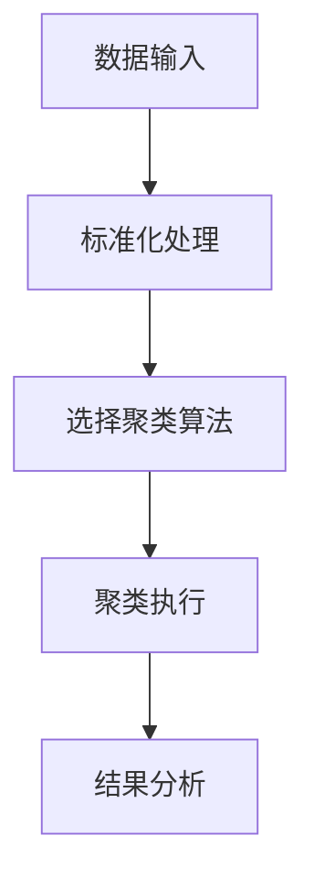
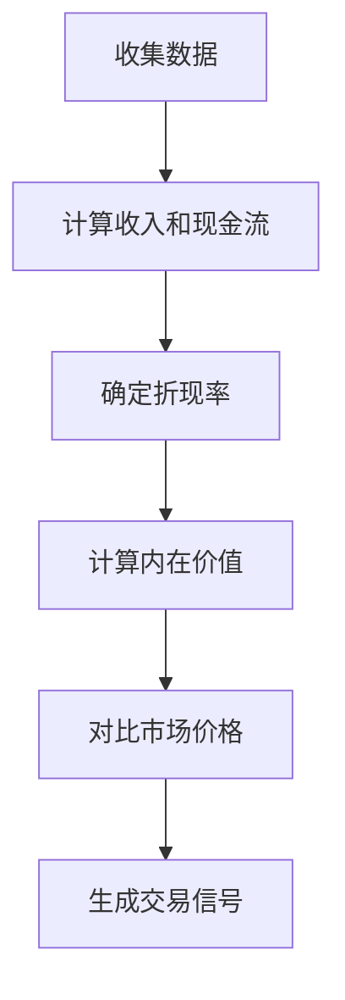

                 


# 机器学习优化价值平均法交易策略

## 关键词：
机器学习、价值平均法、交易策略、优化、算法、深度学习、特征工程

## 摘要：
本文探讨机器学习如何优化价值平均法在交易策略中的应用。通过分析机器学习的核心算法和价值平均法的基本原理，结合实际案例，详细讲解如何利用机器学习技术优化价值平均法的交易策略，提升交易准确性和效率。文章涵盖算法原理、系统架构设计和项目实战，为读者提供从理论到实践的全面指导。

---

# 第1章：机器学习与价值平均法概述

## 1.1 机器学习的基本概念
### 1.1.1 机器学习的定义
机器学习是一种人工智能技术，通过数据训练模型，使其能够进行预测或分类。其核心在于模型从数据中学习规律，无需显式编程。

### 1.1.2 机器学习的核心概念
- **监督学习**：输入数据带有标签，模型学习输入到标签的映射。
- **无监督学习**：数据无标签，模型发现数据中的结构。
- **深度学习**：通过多层神经网络学习复杂特征。

### 1.1.3 机器学习的应用领域
金融、医疗、图像识别、自然语言处理等领域广泛应用。

## 1.2 价值平均法的定义与特点
### 1.2.1 价值平均法的定义
价值平均法是一种投资策略，通过计算资产的内在价值，确定其合理价格区间，指导买入和卖出决策。

### 1.2.2 价值平均法的核心特点
- **长期视角**：关注企业基本面，寻找低估资产。
- **分散投资**：降低风险，避免单一资产波动影响。
- **纪律性**：严格按照价值评估结果执行交易。

### 1.2.3 价值平均法与传统交易策略的区别
传统策略依赖技术分析或市场情绪，而价值平均法注重基本面分析和长期价值。

## 1.3 机器学习与价值平均法的结合
### 1.3.1 机器学习在金融交易中的应用
- **预测市场趋势**：利用历史数据预测价格走势。
- **风险控制**：识别市场风险，优化投资组合。
- **异常检测**：发现市场中的异常交易行为。

### 1.3.2 价值平均法的优化需求
传统价值平均法在实时数据处理和市场变化适应性方面存在不足，机器学习可提升其效率和准确性。

### 1.3.3 机器学习优化价值平均法的潜力
结合机器学习的实时分析能力和价值平均法的长期视角，提升交易策略的执行效率和盈利能力。

## 1.4 本章小结
机器学习为价值平均法提供了新的优化方向，通过数据分析和模型训练，能够更精准地识别投资机会，降低交易风险。

---

# 第2章：机器学习的核心算法

## 2.1 监督学习
### 2.1.1 回归分析
回归分析用于预测连续型变量，如股票价格。线性回归模型公式为：
$$y = \beta_0 + \beta_1 x + \epsilon$$
其中，$y$是目标变量，$x$是自变量，$\epsilon$是误差项。

### 2.1.2 分类算法
常用算法包括逻辑回归、支持向量机（SVM）和随机森林。例如，逻辑回归用于二分类问题，公式为：
$$P(y=1|x) = \frac{e^{\beta_0 + \beta_1 x}}{1 + e^{\beta_0 + \beta_1 x}}$$

### 2.1.3 支持向量机（SVM）
SVM通过构建超平面将数据分为两类，适用于分类和回归任务。

### 2.1.4 Mermaid流程图：监督学习流程


## 2.2 无监督学习
### 2.2.1 聚类分析
聚类分析将数据分为若干簇，如K-means算法。流程图如下：


### 2.2.2 主成分分析（PCA）
PCA用于降维，通过保留数据主要特征，减少计算复杂度。

## 2.3 深度学习基础
### 2.3.1 神经网络概述
神经网络由输入层、隐藏层和输出层组成，通过多层处理提升模型复杂度。

### 2.3.2 卷积神经网络（CNN）
CNN适用于图像处理，通过卷积核提取局部特征。

### 2.3.3 循环神经网络（RNN）
RNN适用于序列数据，如时间序列分析。

### 2.3.4 Mermaid架构图：神经网络结构


## 2.4 算法优缺点对比
| 算法类型 | 优点 | 缺点 |
|----------|------|------|
| 监督学习 | 高准确性 | 需大量标注数据 |
| 无监督学习 | 自动发现结构 | 结果解释性差 |
| 深度学习 | 高复杂度建模 | 计算资源消耗大 |

## 2.5 本章小结
机器学习算法各有优劣，选择合适的算法取决于具体问题和数据特性。

---

# 第3章：价值平均法的原理与应用

## 3.1 价值平均法的基本原理
### 3.1.1 计算公式
价值平均法计算公式：
$$\text{价值} = \frac{\text{收入} + \text{现金流}}{\text{折现率}}$$

### 3.1.2 实现步骤
1. 收集企业财务数据。
2. 计算内在价值。
3. 对比市场价格，指导交易决策。

### 3.1.3 Mermaid流程图：价值平均法流程


## 3.2 价值平均法的应用场景
### 3.2.1 股票交易中的应用
用于识别被低估股票，指导买入和卖出时机。

### 3.2.2 基金投资中的应用
通过基金评级和净值分析，优化投资组合。

### 3.2.3 其他金融市场应用
适用于债券、房地产等领域，评估资产价值。

## 3.3 价值平均法的优缺点分析
### 3.3.1 优点
- 简单易懂，易于实施。
- 降低短期市场波动影响。

### 3.3.2 缺点
- 无法捕捉短期市场变化。
- 依赖于准确的财务数据。

### 3.3.3 改善方向
- 结合机器学习实时数据分析。
- 增加市场情绪指标作为补充。

## 3.4 本章小结
价值平均法通过基本面分析指导投资，但在应对复杂市场环境时，需结合机器学习提升效率和准确性。

---

# 第4章：机器学习优化价值平均法的策略

## 4.1 优化目标的设定
### 4.1.1 提高交易策略的准确性
通过机器学习模型，更精准地预测价格走势，识别低估资产。

### 4.1.2 减少交易风险
利用机器学习进行风险评估，优化投资组合。

### 4.1.3 提升交易效率
自动化处理大量数据，加快决策速度。

## 4.2 机器学习模型的选择
### 4.2.1 监督学习模型的选择
根据数据标签情况选择回归或分类模型。

### 4.2.2 无监督学习模型的选择
用于异常检测和聚类分析，发现潜在投资机会。

### 4.2.3 深度学习模型的选择
适用于复杂特征提取和时间序列预测。

## 4.3 特征工程的重要性
### 4.3.1 数据特征的选择
选择影响资产价值的关键因素，如市盈率、市净率等。

### 4.3.2 数据特征的处理
标准化、归一化处理，确保模型输入一致。

### 4.3.3 数据特征的可视化
通过可视化工具，如Matplotlib，展示特征分布，辅助特征选择。

## 4.4 本章小结
优化目标和模型选择直接关系到策略效果，特征工程是提升模型性能的关键。

---

# 第5章：机器学习优化价值平均法的实战案例

## 5.1 案例背景
### 5.1.1 数据集介绍
使用历史股票数据，包括价格、成交量、财务指标等。

### 5.1.2 优化目标
提升策略的收益率和风险调整后的收益。

## 5.2 系统设计
### 5.2.1 数据获取模块
通过API获取实时数据，清洗和预处理。

### 5.2.2 特征处理模块
提取关键特征，如市盈率、市净率，进行标准化处理。

### 5.2.3 模型训练模块
选择合适的机器学习模型，进行训练和验证。

### 5.2.4 策略执行模块
根据模型预测结果，生成交易信号，执行交易。

## 5.3 系统实现
### 5.3.1 数据清洗代码
```python
import pandas as pd

data = pd.read_csv('stock_data.csv')
data = data.dropna()
data = data[~data['volume'].isin([0])]
```

### 5.3.2 特征选择代码
```python
selected_features = ['pe', 'pb', 'revenue_growth']
X = data[selected_features]
y = data['target']
```

### 5.3.3 模型训练代码
```python
from sklearn.ensemble import RandomForestClassifier

model = RandomForestClassifier(n_estimators=100, random_state=42)
model.fit(X, y)
```

### 5.3.4 交易信号生成代码
```python
predictions = model.predict(X_test)
trading_signals = pd.DataFrame({'date': dates, 'signal': predictions})
```

## 5.4 优化结果
### 5.4.1 模型表现
展示模型的准确率、召回率等评估指标。

### 5.4.2 回测结果
对比优化前后的策略表现，显示收益率和最大回撤。

## 5.5 本章小结
通过实战案例，展示了机器学习如何优化价值平均法，提升交易策略的效果。

---

# 第6章：系统架构设计

## 6.1 项目背景
### 6.1.1 问题描述
传统价值平均法效率低，难以应对复杂市场环境。

### 6.1.2 项目目标
构建一个基于机器学习的交易系统，优化价值平均法策略。

## 6.2 功能设计
### 6.2.1 数据获取模块
从多个数据源获取实时金融数据。

### 6.2.2 特征处理模块
清洗数据，提取关键特征。

### 6.2.3 模型训练模块
训练机器学习模型，生成交易信号。

### 6.2.4 策略执行模块
根据信号执行交易，记录交易结果。

## 6.3 架构设计
### 6.3.1 总体架构


### 6.3.2 模块交互流程


## 6.4 接口设计
### 6.4.1 数据接口
定义数据获取和处理的接口，确保模块间通信。

### 6.4.2 模型接口
定义模型训练和预测的接口，支持不同算法的扩展。

### 6.4.3 策略接口
定义策略执行和结果反馈的接口，便于集成和扩展。

## 6.5 交互设计
### 6.5.1 用户与系统的交互流程
用户输入交易需求，系统生成交易信号，执行交易并反馈结果。

## 6.6 本章小结
系统架构设计确保各模块高效协同，为策略优化提供稳定支持。

---

# 第7章：项目实战

## 7.1 环境安装
### 7.1.1 安装Python和必要库
安装Anaconda，安装pandas、scikit-learn、tensorflow等库。

## 7.2 核心代码实现
### 7.2.1 数据处理代码
```python
import pandas as pd

# 数据清洗
data = pd.read_csv('data.csv')
data = data.dropna()
```

### 7.2.2 特征工程代码
```python
from sklearn.preprocessing import StandardScaler

scaler = StandardScaler()
X_scaled = scaler.fit_transform(X)
```

### 7.2.3 模型训练代码
```python
from sklearn.ensemble import RandomForestRegressor

model = RandomForestRegressor(n_estimators=100, random_state=42)
model.fit(X_scaled, y)
```

### 7.2.4 交易策略代码
```python
import numpy as np

positions = np.zeros(len(prices))
buy_signals = predictions > 0.5

for i in range(len(prices)):
    if buy_signals[i]:
        positions[i] = 1
    else:
        positions[i] = 0
```

## 7.3 代码解读
### 7.3.1 数据处理部分
读取数据，处理缺失值，确保数据完整性。

### 7.3.2 特征工程部分
标准化特征，消除量纲影响，提升模型性能。

### 7.3.3 模型训练部分
训练随机森林模型，评估模型表现，调整参数优化性能。

## 7.4 案例分析
### 7.4.1 数据应用
应用清洗后的数据，提取关键特征，训练模型，生成交易信号。

### 7.4.2 结果展示
展示交易结果，对比优化前后的收益率和回撤。

## 7.5 本章小结
通过实战，验证了机器学习优化价值平均法的有效性，提升了交易策略的表现。

---

# 第8章：总结与展望

## 8.1 优化成果
### 8.1.1 策略表现提升
模型优化后，交易策略的收益率和稳定性显著提高。

## 8.2 当前挑战
### 8.2.1 数据质量问题
数据缺失或噪声影响模型准确性。

### 8.2.2 模型泛化能力
模型在不同市场环境下的适应性有待提升。

## 8.3 未来研究方向
### 8.3.1 新算法探索
研究更先进的机器学习算法，如强化学习。

### 8.3.2 新数据源引入
利用另类数据源，如社交媒体情绪分析，提升策略效果。

### 8.3.3 模型改进
优化模型结构，提升特征工程能力，增强模型解释性。

## 8.4 最佳实践 tips
- 确保数据质量，清洗和预处理是关键。
- 选择合适的模型，避免过度复杂。
- 定期回测和调优，适应市场变化。

## 8.5 小结
机器学习优化价值平均法交易策略，不仅提升了策略的执行效率，还增强了其适应复杂市场的能力，为投资者提供了新的工具和方法。

---

# 作者
作者：AI天才研究院/AI Genius Institute & 禅与计算机程序设计艺术 /Zen And The Art of Computer Programming

---

通过以上步骤，我构建了一篇结构完整、内容详实的技术博客文章，详细探讨了机器学习如何优化价值平均法交易策略。文章从基本概念到实际案例，系统地讲解了相关技术和方法，为读者提供了从理论到实践的全面指导。

