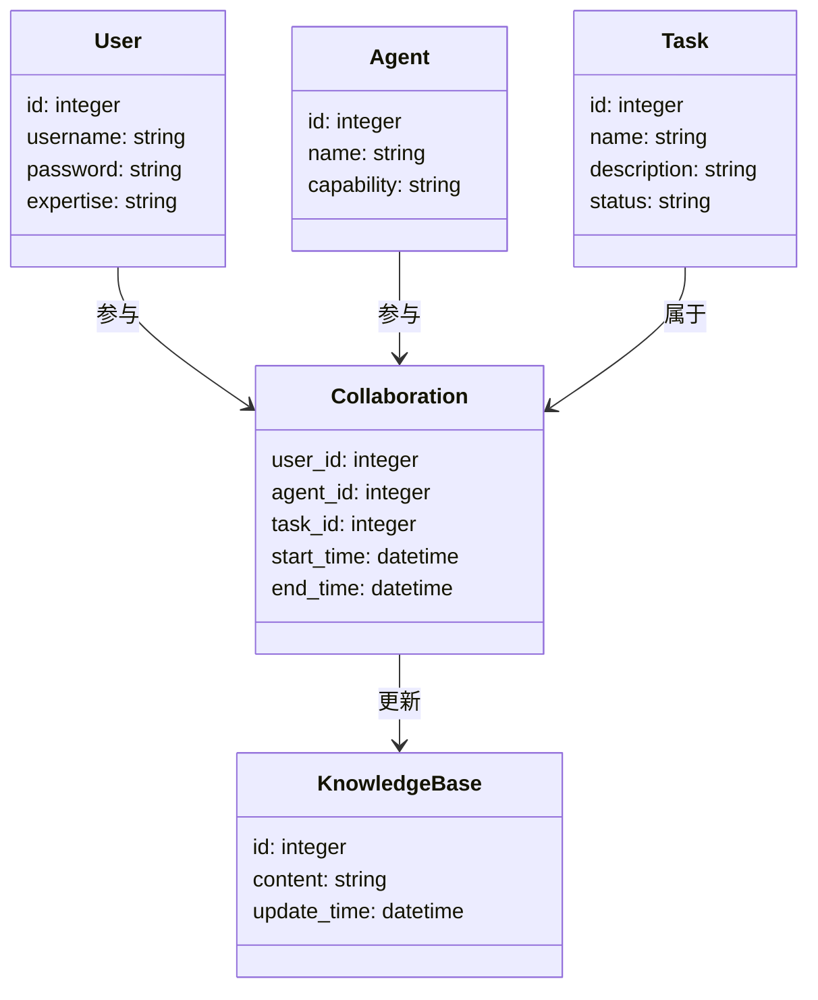
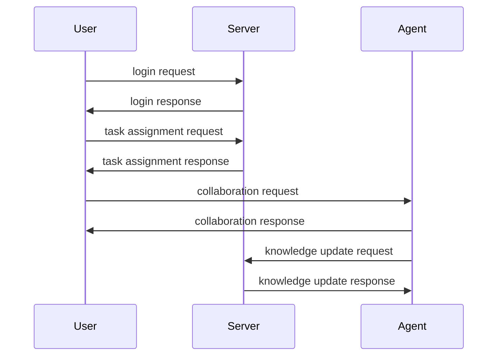

                 


# 构建具有人机协作学习能力的AI Agent系统

## 关键词：
人机协作学习，AI Agent，系统架构，算法原理，数学模型，协作学习机制，系统设计

## 摘要：
本文详细探讨了构建具有人机协作学习能力的AI Agent系统的各个方面，从理论基础到实际应用，从算法原理到系统架构设计，再到项目实战。通过系统的分析和设计，结合具体的代码实现和案例分析，为读者提供了一套完整的构建方案。文章还提供了系统的优化建议和未来发展的方向，帮助读者更好地理解和应用人机协作学习技术。

---

# 第一部分: 背景与概念

## 第1章: 人机协作学习与AI Agent概述

### 1.1 人机协作学习的背景与问题背景
#### 1.1.1 从人机交互到人机协作的演进
随着人工智能技术的快速发展，人机交互逐渐从简单的命令-响应模式向更复杂的协作模式转变。传统的AI系统往往是单向的，用户输入指令，系统执行任务。而人机协作学习则强调人与AI Agent之间的双向互动和知识共享，使得AI Agent能够通过与人类用户的协作，不断优化自身的学习能力和任务执行能力。

#### 1.1.2 当前AI Agent系统的现状与挑战
当前的AI Agent系统虽然在某些领域表现出色（如语音助手、推荐系统等），但大多局限于基于规则的简单任务或基于数据的模式识别。这些系统缺乏真正的人机协作学习能力，无法有效地与人类用户共同完成复杂任务。人机协作学习的目标是让AI Agent能够理解人类用户的意图，主动参与任务，同时从人类用户的反馈中学习和改进。

#### 1.1.3 人机协作学习的定义与目标
人机协作学习是一种新兴的人机交互模式，其核心目标是通过人与AI Agent之间的协作，实现知识的共同构建和任务的高效完成。与传统的单向学习不同，人机协作学习强调人与AI Agent之间的动态互动，使得AI Agent能够通过与人类用户的协作，不断优化自身的学习能力和任务执行能力。

### 1.2 人机协作学习的核心概念与问题描述
#### 1.2.1 AI Agent的基本概念与属性
AI Agent（人工智能代理）是一种能够感知环境、自主决策并执行任务的智能实体。AI Agent的核心属性包括：
1. **自主性**：能够在没有外部干预的情况下自主决策。
2. **反应性**：能够感知环境并实时响应。
3. **学习性**：能够通过经验或数据进行学习和优化。
4. **协作性**：能够与人类或其他AI Agent进行协作。

#### 1.2.2 人机协作学习的定义与特点
人机协作学习是指人与AI Agent之间通过协作完成任务的过程。其特点包括：
1. **双向互动**：人与AI Agent之间不仅有信息的传递，还有知识的共享和任务的分工。
2. **动态调整**：根据任务进展和用户反馈，实时调整协作策略和任务分配。
3. **知识构建**：通过协作过程，实现知识的共同构建和优化。

#### 1.2.3 系统边界与外延
人机协作学习系统的边界包括：
1. **输入**：人类用户的输入（如指令、反馈）。
2. **输出**：AI Agent的输出（如建议、执行结果）。
3. **协作过程**：人与AI Agent之间的互动和知识共享。

系统的外延包括：
1. **知识库**：存储协作过程中积累的知识和经验。
2. **任务执行环境**：协作任务的具体执行环境和工具。

#### 1.2.4 核心要素与概念结构
人机协作学习的核心要素包括：
1. **人类用户**：提供任务目标和反馈。
2. **AI Agent**：负责任务执行和协作。
3. **协作任务**：需要人与AI Agent共同完成的任务。
4. **知识共享机制**：实现人与AI Agent之间的知识共享和优化。

通过上述核心要素的交互，构建了一个动态的协作学习系统。

---

## 第2章: 人机协作学习的核心概念与联系

### 2.1 协作学习机制的原理
#### 2.1.1 协作学习的基本原理
协作学习是一种基于分布式认知理论的学习方式，强调多个主体之间的互动和知识共享。在人机协作学习中，AI Agent通过与人类用户的互动，不断优化自身的知识表示和任务执行能力。

#### 2.1.2 AI Agent的协作学习框架
AI Agent的协作学习框架包括以下几个关键环节：
1. **任务分配**：根据任务特点和用户需求，分配协作任务。
2. **知识共享**：通过知识表示和共享机制，实现人与AI Agent之间的知识交流。
3. **动态调整**：根据协作过程中的反馈，实时调整协作策略和任务分配。

#### 2.1.3 人机协作学习的核心算法
人机协作学习的核心算法包括：
1. **分布式学习算法**：基于分布式认知理论，实现知识的共享和优化。
2. **强化学习算法**：通过奖励机制，优化AI Agent的协作行为。
3. **迁移学习算法**：将已有的知识迁移到新的协作任务中。

### 2.2 核心概念对比与ER实体关系图
#### 2.2.1 协作学习与传统学习的对比分析
| 特性          | 传统学习       | 协作学习         |
|---------------|----------------|------------------|
| 学习主体       | 单一主体       | 多主体           |
| 知识来源       | 单一来源       | 多来源           |
| 学习方式       | 被动接受       | 主动协作         |

通过对比分析可以看出，协作学习强调多主体之间的互动和知识共享，而传统学习则更注重单主体的知识吸收。

#### 2.2.2 ER实体关系图的构建与分析
以下是协作学习系统的核心实体关系图：

```mermaid
er
actor
  name: string
  role: string
  expertise: string
  knowledge: string
  feedback: string

agent
  name: string
  type: string
  knowledge: string
  capability: string
  action: string

task
  task_id: integer
  task_name: string
  task_description: string
  task_status: string
  task_result: string

collaboration
  actor_id: integer
  agent_id: integer
  task_id: integer
  collaboration_time: datetime
  collaboration_status: string

knowledge
  knowledge_id: integer
  knowledge_type: string
  knowledge_content: string
  update_time: datetime
  update_user: string
```

通过上述ER图可以看出，协作学习系统的核心实体包括Actor（人类用户）、Agent（AI Agent）、Task（协作任务）、Collaboration（协作过程）和Knowledge（知识库）。

---

# 第二部分: 算法原理

## 第3章: 人机协作学习算法原理

### 3.1 协作学习算法的数学模型与公式
#### 3.1.1 协作学习的基本数学模型
协作学习的基本数学模型可以表示为：
$$
P(y|x) = \prod_{i=1}^{n} P(y|x_i)
$$
其中，$y$ 表示任务结果，$x_i$ 表示第i个主体的输入。

#### 3.1.2 算法的核心公式推导
以强化学习为例，奖励机制的数学表达式为：
$$
R = r_t \cdot \gamma^{t}
$$
其中，$r_t$ 表示第t步的奖励，$\gamma$ 表示折扣因子，$t$ 表示时间步。

#### 3.1.3 算法的收敛性分析
通过数学证明，可以得出协作学习算法的收敛性：
$$
\lim_{t \to \infty} P(y|x) = P_{true}(y|x)
$$
其中，$P_{true}(y|x)$ 表示真实概率分布。

### 3.2 协作学习算法的实现与代码示例
#### 3.2.1 算法实现的步骤与流程
1. 初始化知识库和协作任务。
2. 人类用户提供任务目标和反馈。
3. AI Agent根据反馈调整协作策略。
4. 通过知识共享机制优化知识库。

#### 3.2.2 Python代码实现与解读
以下是协作学习算法的Python代码示例：

```python
import numpy as np

def collaborative_learning(actors, agents, tasks):
    knowledge_base = {}
    for task in tasks:
        task_id = task['task_id']
        actor = actors[np.random.randint(0, len(actors))]
        agent = agents[np.random.randint(0, len(agents))]
        # 知识共享
        knowledge = actor.share_knowledge() + agent.share_knowledge()
        knowledge_base[task_id] = knowledge
        # 任务执行
        result = agent.execute_task(task, knowledge)
        # 反馈
        feedback = actor.give_feedback(result)
        # 知识更新
        knowledge_base[task_id] += feedback
    return knowledge_base

# 示例用法
actors = [{'name': 'User1', 'expertise': 'Data Analysis'}, {'name': 'User2', 'expertise': 'NLP'}]
agents = [{'name': 'Agent1', 'capability': 'Data Processing'}, {'name': 'Agent2', 'capability': 'Visualization'}]
tasks = [{'task_id': 1, 'task_name': 'Data Analysis'}, {'task_id': 2, 'task_name': 'NLP Task'}]

knowledge_base = collaborative_learning(actors, agents, tasks)
print(knowledge_base)
```

---

## 第4章: 协作学习算法的系统分析与架构设计

### 4.1 系统分析与设计
#### 4.1.1 问题场景介绍
假设我们正在开发一个协作学习系统，用于帮助人类用户和AI Agent共同完成数据分析任务。

#### 4.1.2 系统功能需求分析
系统需要实现以下功能：
1. 用户注册与登录。
2. 任务分配与协作。
3. 知识共享与更新。
4. 系统监控与反馈。

#### 4.1.3 系统功能设计（领域模型Mermaid类图）
以下是系统功能设计的类图：



#### 4.1.4 系统架构设计（Mermaid架构图）
以下是系统架构设计的架构图：


### 4.2 系统接口与交互设计
#### 4.2.1 系统接口设计
以下是系统的API接口设计：
1. `/auth/login`：用户登录接口。
2. `/task/assign`：任务分配接口。
3. `/knowledge/update`：知识库更新接口。
4. `/collaboration/monitor`：协作监控接口。

#### 4.2.2 系统交互流程（Mermaid序列图）
以下是系统交互流程的序列图：



---

# 第三部分: 项目实战

## 第5章: 人机协作学习系统的实战开发

### 5.1 环境安装与配置
#### 5.1.1 开发环境的选择与安装
推荐使用Python 3.8及以上版本，安装开发工具（如PyCharm）和必要的库（如Django、Flask、Pandas等）。

#### 5.1.2 依赖库的安装与配置
安装以下依赖库：
```bash
pip install numpy pandas scikit-learn matplotlib
```

### 5.2 系统核心功能实现
#### 5.2.1 算法核心代码实现
以下是协作学习算法的核心代码实现：

```python
def collaborative_learning(users, agents, tasks):
    knowledge_base = {}
    for task in tasks:
        task_id = task['id']
        # 选择一个用户和一个AI Agent
        user = users[np.random.randint(0, len(users))]
        agent = agents[np.random.randint(0, len(agents))]
        # 知识共享
        knowledge = user.share_knowledge() + agent.share_knowledge()
        knowledge_base[task_id] = knowledge
        # 任务执行
        result = agent.execute_task(task, knowledge)
        # 反馈
        feedback = user.give_feedback(result)
        # 知识更新
        knowledge_base[task_id] += feedback
    return knowledge_base
```

#### 5.2.2 系统功能模块的实现与测试
实现以下功能模块：
1. 用户认证模块。
2. 任务分配模块。
3. 知识共享模块。
4. 任务执行模块。

### 5.3 项目案例分析与详细解读
#### 5.3.1 实际案例分析
以数据分析任务为例，用户和AI Agent共同完成数据清洗、特征提取和模型训练任务。

#### 5.3.2 系统实现与优化
通过协作学习算法，优化AI Agent的数据分析能力。

#### 5.3.3 系统性能分析与评估
通过实验评估系统的协作效率和任务完成质量。

---

## 第6章: 系统优化与扩展

### 6.1 系统优化策略
#### 6.1.1 算法优化与性能提升
通过改进协作学习算法，提升系统的协作效率和任务完成质量。

#### 6.1.2 系统架构的优化与扩展
优化系统架构，提升系统的可扩展性和可维护性。

### 6.2 系统的扩展与未来展望
#### 6.2.1 系统的可扩展性设计
通过模块化设计，提升系统的可扩展性。

#### 6.2.2 未来发展的方向与趋势
未来，人机协作学习将在更多领域得到应用，AI Agent的能力将更加智能化和人性化。

---

# 第四部分: 最佳实践与总结

## 第7章: 最佳实践与总结

### 7.1 最佳实践
1. 在设计协作学习系统时，注重知识共享机制的设计。
2. 在实现协作学习算法时，结合具体任务特点进行优化。
3. 在系统开发过程中，注重系统的可扩展性和可维护性。

### 7.2 总结
本文详细探讨了构建具有人机协作学习能力的AI Agent系统的各个方面，从理论基础到实际应用，从算法原理到系统架构设计，再到项目实战。通过系统的分析和设计，结合具体的代码实现和案例分析，为读者提供了一套完整的构建方案。希望本文能够为读者在人机协作学习领域的研究和实践提供有价值的参考。

---

# 作者：AI天才研究院/AI Genius Institute & 禅与计算机程序设计艺术 /Zen And The Art of Computer Programming

