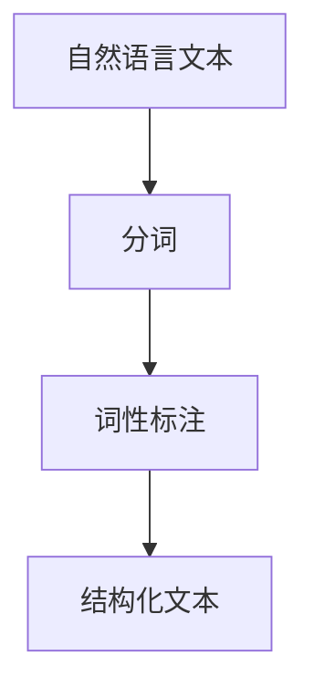
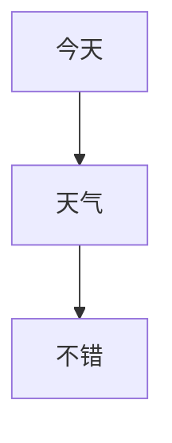
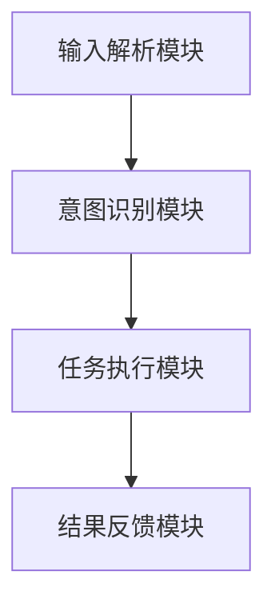
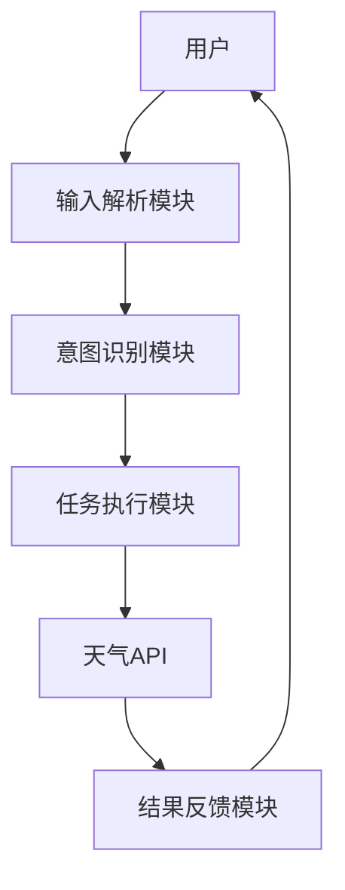

                 


# 构建具有自然语言理解能力的AI Agent

## 关键词
自然语言理解、AI Agent、深度学习、自然语言处理、文本挖掘、机器学习

## 摘要
本文详细探讨了构建具有自然语言理解能力的AI Agent的各个方面，从基础概念到系统架构设计，再到项目实战，为读者提供了一套完整的解决方案。文章首先介绍了自然语言理解（NLU）和AI Agent的基本概念及其重要性，然后深入讲解了NLU的核心技术，包括词法分析、句法分析、实体识别和情感分析等。接着，从算法原理的角度分析了词嵌入、语言模型和文本表示等关键组件。在系统架构部分，详细设计了AI Agent的系统功能、架构、接口和交互流程。最后，通过项目实战展示了如何将理论应用于实际开发，包括环境配置、核心代码实现和案例分析。本文旨在为开发者和研究人员提供一份全面的技术指南，帮助他们更好地理解和实现具有自然语言理解能力的AI Agent。

---

# 第一部分: 自然语言理解与AI Agent基础

# 第1章: 自然语言理解与AI Agent概述

## 1.1 自然语言理解的背景与意义

### 1.1.1 自然语言理解的定义与目标
自然语言理解（Natural Language Understanding, NLU）是人工智能领域的重要研究方向，旨在使计算机能够理解人类的自然语言输入（如文本或语音）。NLU的目标是让计算机能够像人类一样理解和解析语言的含义，从而实现人与计算机之间的自然交互。

### 1.1.2 自然语言理解的核心技术
自然语言理解的核心技术包括：
1. **词法分析**：对文本进行分词、词性标注等预处理。
2. **句法分析**：分析句子的语法结构，如依存关系和语法树。
3. **实体识别**：识别文本中的实体（如人名、地名、组织名等）。
4. **情感分析**：判断文本的情感倾向（如正面、负面或中性）。
5. **意图识别**：理解用户输入的意图，如“预订酒店”或“查询天气”。

### 1.1.3 自然语言理解在AI Agent中的作用
AI Agent需要通过自然语言理解技术来解析用户的输入，从而执行相应的任务。例如，当用户说“今天北京的天气怎么样？”，AI Agent需要通过NLU技术理解用户的需求，并调用天气API获取信息，最终返回结果。

---

## 1.2 AI Agent的定义与特点

### 1.2.1 AI Agent的基本概念
AI Agent是一种智能代理，能够感知环境、理解用户需求，并执行相应的操作。AI Agent可以是软件程序，也可以是硬件设备，其核心能力包括感知、推理、决策和执行。

### 1.2.2 AI Agent的核心能力
1. **感知能力**：通过传感器或输入接口获取环境信息。
2. **推理能力**：基于感知信息进行逻辑推理。
3. **决策能力**：根据推理结果做出决策。
4. **执行能力**：通过执行器或输出接口完成任务。

### 1.2.3 自然语言理解在AI Agent中的应用
AI Agent的自然语言理解能力使其能够与用户进行自然交互。例如，智能音箱可以通过理解用户的语音指令，执行播放音乐、设置闹钟等任务。

---

## 1.3 自然语言理解与AI Agent的结合

### 1.3.1 自然语言理解技术的演进
自然语言理解技术经历了从基于规则的简单模型到基于深度学习的复杂模型的演进。早期的NLU技术主要依赖手动编写规则，而现代技术则广泛采用神经网络和深度学习方法。

### 1.3.2 AI Agent的自然语言交互需求
AI Agent需要支持多种语言交互方式，包括文本输入、语音输入等。通过自然语言交互，用户可以以更直观的方式与AI Agent进行互动。

### 1.3.3 自然语言理解在AI Agent中的实现路径
1. **输入解析**：将用户的输入（如文本或语音）转换为结构化的信息。
2. **意图识别**：识别用户的意图，并调用相应的服务。
3. **结果反馈**：将执行结果反馈给用户，确保用户需求得到满足。

---

## 1.4 本章小结
本章介绍了自然语言理解（NLU）和AI Agent的基本概念，并探讨了NLU在AI Agent中的作用。通过理解用户的自然语言输入，AI Agent能够更高效地执行任务，为用户带来更好的交互体验。

---

# 第二部分: 自然语言理解的核心技术

# 第2章: 自然语言处理基础

## 2.1 词法分析

### 2.1.1 什么是词法分析
词法分析是自然语言处理的第一步，旨在将连续的文本分割成有意义的词汇单位（如单词、符号等），并为每个词汇单位标注词性（如名词、动词、形容词等）。

### 2.1.2 分词技术
分词技术是将连续的字符分割成独立的词语。例如，将“今天天气不错”分割成“今天”、“天气”、“不错”。

### 2.1.3 词性标注
词性标注是对每个词语进行词性分类的过程。例如，将“今天”标注为名词，将“天气”标注为名词。



---

## 2.2 句法分析

### 2.2.1 句法分析的定义
句法分析是对句子的语法结构进行分析，以确定词语之间的关系。

### 2.2.2 依存句法分析
依存句法分析是将句子中的词语与其父节点连接起来，形成依存关系树。例如，“今天天气不错”可以表示为“天气”是主语，“不错”是谓语。



### 2.2.3 语法树构建
语法树是一种树形结构，用于表示句子的语法结构。例如，“今天天气不错”可以表示为一个根节点“句子”，下有两个子节点“今天天气”和“不错”。

---

## 2.3 实体识别

### 2.3.1 实体识别的定义
实体识别（Named Entity Recognition,NER）是识别文本中的命名实体（如人名、地名、组织名等）的过程。

### 2.3.2 常见实体类型
常见的实体类型包括：
- 人名（PER）
- 地名（LOC）
- 组织名（ORG）
- 时间（TIME）
- 数量（NUM）

### 2.3.3 实体识别算法
实体识别的常见算法包括基于规则的算法和基于深度学习的算法。例如，使用CRF（条件随机场）模型进行实体识别。

---

## 2.4 情感分析

### 2.4.1 情感分析的定义
情感分析是判断文本的情感倾向（如正面、负面或中性）。

### 2.4.2 基于词袋模型的情感分析
词袋模型是一种简单的文本表示方法，将文本表示为词汇的集合。例如，“这部电影很精彩”可以表示为{电影, 很, 精彩}。

### 2.4.3 基于深度学习的情感分析
基于深度学习的情感分析模型（如LSTM和Transformer）可以更准确地捕捉文本的情感倾向。

---

## 2.5 本章小结
本章介绍了自然语言处理中的核心技术，包括词法分析、句法分析、实体识别和情感分析。这些技术为构建具有自然语言理解能力的AI Agent奠定了基础。

---

# 第三部分: AI Agent的自然语言理解实现

# 第3章: 自然语言理解的算法原理

## 3.1 词嵌入

### 3.1.1 什么是词嵌入
词嵌入是一种将词语映射为低维向量的方法。例如，将“猫”映射为一个低维向量。

### 3.1.2 常见的词嵌入方法
常见的词嵌入方法包括Word2Vec、GloVe和FastText。

### 3.1.3 词嵌入的训练过程
词嵌入的训练过程通常基于大量的语料库，通过无监督学习方法（如Skip-Gram）训练词向量。

---

## 3.2 语言模型

### 3.2.1 语言模型的定义
语言模型是一种用于预测下一个词的概率模型。

### 3.2.2 基于n-gram的语言模型
n-gram语言模型是一种基于短语的简单语言模型。例如，使用bigram模型预测下一个词。

### 3.2.3 基于深度学习的语言模型
基于深度学习的语言模型（如Transformer）可以捕捉更复杂的语言模式。

---

## 3.3 文本表示

### 3.3.1 文本表示的定义
文本表示是将文本转换为向量表示的过程。

### 3.3.2 基于词嵌入的文本表示
基于词嵌入的文本表示方法将文本表示为词向量的加权和。

### 3.3.3 基于上下文的文本表示
基于上下文的文本表示方法（如BERT）可以捕捉到词语的上下文信息。

---

## 3.4 自然语言推理

### 3.4.1 自然语言推理的定义
自然语言推理是判断文本之间的逻辑关系（如矛盾、中立、蕴含）。

### 3.4.2 基于规则的自然语言推理
基于规则的自然语言推理方法依赖于预定义的规则。

### 3.4.3 基于深度学习的自然语言推理
基于深度学习的自然语言推理模型（如BERT）可以自动学习推理规则。

---

## 3.5 本章小结
本章介绍了自然语言理解中的核心技术，包括词嵌入、语言模型、文本表示和自然语言推理。这些技术为AI Agent的自然语言理解能力提供了技术支持。

---

# 第四部分: AI Agent的系统架构与设计

# 第4章: AI Agent的系统架构

## 4.1 系统功能设计

### 4.1.1 用户需求分析
用户需求分析是设计AI Agent系统功能的第一步。例如，用户可能需要一个能够理解自然语言指令的智能助手。

### 4.1.2 系统功能模块划分
AI Agent的系统功能模块通常包括：
1. **输入解析模块**：解析用户的输入（如文本或语音）。
2. **意图识别模块**：识别用户的意图。
3. **任务执行模块**：根据意图执行相应的任务。
4. **结果反馈模块**：将执行结果反馈给用户。

### 4.1.3 功能模块之间的关系
功能模块之间的关系可以通过领域模型类图表示。



---

## 4.2 系统架构设计

### 4.2.1 分层架构设计
分层架构将系统划分为多个层次，包括输入层、处理层和输出层。

### 4.2.2 微服务架构设计
微服务架构将系统功能分解为多个独立的服务，每个服务负责特定的功能。

### 4.2.3 混合架构设计
混合架构结合了分层架构和微服务架构的特点，适用于复杂系统。

---

## 4.3 系统接口设计

### 4.3.1 API接口设计
API接口设计是系统设计的重要部分。例如，AI Agent可以通过RESTful API调用天气API。

### 4.3.2 接口调用流程
接口调用流程可以通过序列图表示。



---

## 4.4 系统交互设计

### 4.4.1 交互流程设计
交互流程设计是系统设计的重要部分。例如，用户输入“今天北京的天气怎么样？”，系统执行天气查询并返回结果。

### 4.4.2 交互界面设计
交互界面设计需要考虑用户体验，确保用户能够方便地与AI Agent进行交互。

### 4.4.3 交互体验优化
交互体验优化可以通过减少响应时间、增加反馈机制等方式实现。

---

## 4.5 本章小结
本章介绍了AI Agent的系统架构与设计，包括功能设计、架构设计、接口设计和交互设计。这些设计为AI Agent的实现提供了框架支持。

---

# 第五部分: 项目实战与优化

# 第5章: 项目实战

## 5.1 环境安装与配置

### 5.1.1 安装Python
需要安装Python 3.6或更高版本。

### 5.1.2 安装必要的库
需要安装以下库：
- `numpy`
- `pandas`
- `scikit-learn`
- `tensorflow`

### 5.1.3 安装环境配置
安装环境可以通过虚拟环境管理工具（如venv）进行配置。

---

## 5.2 系统核心实现

### 5.2.1 输入解析模块
输入解析模块的实现代码如下：

```python
def parse_input(text):
    # 分词
    words = text.split()
    return words
```

### 5.2.2 意图识别模块
意图识别模块的实现代码如下：

```python
from sklearn.feature_extraction.text import TfidfVectorizer
from sklearn.naive_bayes import MultinomialNB

# 训练数据
X_train = ["今天天气不错", "明天我要去北京"]
y_train = ["查询天气", "查询位置"]

# 模型训练
vectorizer = TfidfVectorizer()
X_vec = vectorizer.fit_transform(X_train)
model = MultinomialNB().fit(X_vec, y_train)

# 意图识别
def recognize_intent(text):
    X_test = vectorizer.transform([text])
    y_pred = model.predict(X_test)
    return y_pred[0]
```

### 5.2.3 任务执行模块
任务执行模块的实现代码如下：

```python
def execute_task(intent):
    if intent == "查询天气":
        # 调用天气API
        pass
    elif intent == "查询位置":
        # 调用位置API
        pass
```

### 5.2.4 结果反馈模块
结果反馈模块的实现代码如下：

```python
def feedback_result(result):
    print(result)
```

---

## 5.3 项目小结

### 5.3.1 项目总结
通过本项目，我们实现了一个简单的AI Agent系统，能够理解用户的自然语言指令并执行相应的任务。

### 5.3.2 注意事项
在实际应用中，需要考虑系统的扩展性、鲁棒性和可维护性。

### 5.3.3 拓展阅读
读者可以进一步学习自然语言处理和深度学习的相关知识，以提高AI Agent的性能和功能。

---

# 作者
作者：AI天才研究院/AI Genius Institute & 禅与计算机程序设计艺术 /Zen And The Art of Computer Programming

