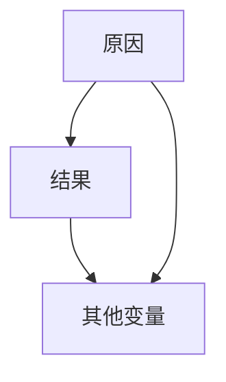
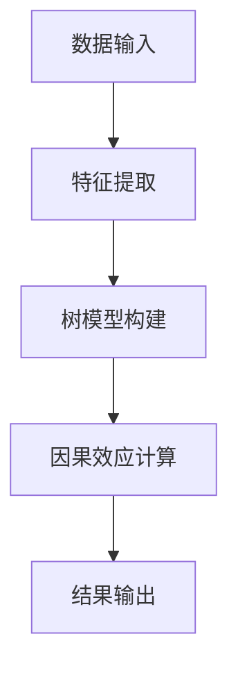
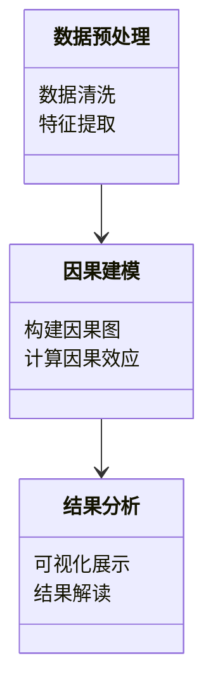
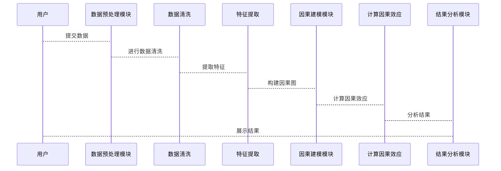

                 


# 《金融领域因果推理技术的应用与实践》

**关键词**：因果推理，金融应用，机器学习，数学模型，系统架构

**摘要**：因果推理是人工智能和数据分析领域的重要技术，尤其在金融领域，因果推理能够帮助我们更好地理解变量之间的因果关系，从而做出更准确的投资决策、风险管理以及政策制定。本文将从因果推理的基本概念出发，结合金融领域的实际场景，详细探讨因果推理的核心算法、数学模型以及系统架构设计。通过具体的案例分析和代码实现，展示因果推理技术在金融领域的应用价值，并总结实践经验，为读者提供系统化的知识和实践指导。

---

## 第1章: 因果推理技术概述

### 1.1 因果推理的基本概念

#### 1.1.1 什么是因果推理
因果推理是一种通过分析变量之间的因果关系，理解事件发生的内在逻辑的技术。与相关性分析不同，因果推理关注的是“为什么”某一事件发生，而不是“相关性”如何。例如，在金融领域，因果推理可以帮助我们理解“为什么某只股票的价格会上涨”，而不是仅仅观察到股票价格与某些因素的相关性。

#### 1.1.2 因果关系与相关性的区别
| 属性      | 相关性               | 因果关系           |
|-----------|----------------------|---------------------|
| 定义      | 变量之间的统计关联性 | 变量之间的因果关联性 |
| 方向      | 双向或无方向          | 单向或有方向         |
| 干预影响   | 不受干预影响           | 受干预影响           |

#### 1.1.3 因果推理在金融领域的应用价值
- **投资决策**：通过因果推理分析影响股票价格的真正原因，优化投资策略。
- **风险管理**：识别和量化风险因素之间的因果关系，制定更有效的风险管理措施。
- **政策制定**：帮助政策制定者理解经济变量之间的因果关系，优化金融监管政策。

### 1.2 金融领域的因果问题

#### 1.2.1 金融中的因果关系场景
- **股票价格波动**：分析影响股票价格的真正原因，如公司业绩、市场情绪等。
- **信用评分**：识别影响信用评分的关键因素，如收入、负债、消费习惯等。
- **风险管理**：预测市场波动的因果因素，如宏观经济指标、市场情绪等。

#### 1.2.2 金融数据的特点与挑战
- **高维性**：金融数据通常包含大量变量，如股票价格、市场指数、经济指标等。
- **噪声干扰**：金融数据中存在大量噪声，因果关系可能被掩盖。
- **动态性**：金融市场的因果关系可能随时间变化，需要动态调整模型。

#### 1.2.3 为什么因果推理在金融中重要
因果推理能够帮助我们：
- **区分因果与相关**：避免误判相关性为因果关系，提高决策的准确性。
- **模拟干预效果**：通过因果推理，我们可以模拟不同干预措施的效果，优化投资和风险管理策略。
- **提高模型的解释性**：因果推理模型通常具有较高的解释性，便于金融从业者理解和应用。

### 1.3 本书的核心目标与内容

#### 1.3.1 本书的核心目标
通过系统化的知识讲解和案例分析，帮助读者掌握因果推理的核心概念、算法原理和系统架构设计，能够在金融领域中实际应用因果推理技术。

#### 1.3.2 本书的主要内容框架
- **因果推理的核心概念**：因果关系、因果图、处理效应等。
- **因果推理的算法原理**：潜在结果框架、因果森林等。
- **金融系统的架构设计**：数据预处理、因果建模、结果分析等模块的设计。
- **项目实战**：从环境搭建到代码实现，完整案例分析。

#### 1.3.3 本书的适用读者
- 金融从业者：如投资经理、风险分析师等。
- 数据科学家：对因果推理技术感兴趣的数据科学家。
- 研究人员：从事金融数据分析和因果推理研究的学者。

---

## 第2章: 因果关系与因果图

### 2.1 因果关系的定义与属性

#### 2.1.1 因果关系的定义
因果关系是指一个事件（原因）导致另一个事件（结果）发生的内在逻辑关系。例如，下雨（原因）导致地面湿（结果）。

#### 2.1.2 因果关系的三个核心属性
1. **方向性**：因果关系具有明确的方向性，如“原因 → 结果”。
2. **可干预性**：因果关系可以通过干预手段进行检验和验证。
3. **稳定性**：因果关系在一定条件下具有稳定性，可以在不同环境中适用。

#### 2.1.3 因果关系与相关性的对比
| 属性      | 相关性               | 因果关系           |
|-----------|----------------------|---------------------|
| 定义      | 变量之间的统计关联性 | 变量之间的因果关联性 |
| 方向      | 双向或无方向          | 单向或有方向         |
| 干预影响   | 不受干预影响           | 受干预影响           |

### 2.2 因果图模型

#### 2.2.1 因果图的基本概念
因果图（Causal Graph）是一种用于表示变量之间因果关系的图形模型。它通过节点表示变量，边表示因果关系的方向。

#### 2.2.2 因果图的构建方法
1. **领域知识**：根据领域知识确定变量之间的因果关系。
2. **数据分析**：通过数据分析技术（如贝叶斯网络）构建因果图。
3. **验证调整**：通过数据验证和调整，优化因果图的准确性。

#### 2.2.3 因果图与贝叶斯网络的区别
| 属性      | 因果图                | 贝叶斯网络            |
|-----------|----------------------|-----------------------|
| 定义      | 表示因果关系的图形模型 | 表示变量间概率关系的图形模型 |
| 边方向     | 单向，表示因果关系     | 双向，表示概率依赖关系 |
| 干预能力   | 支持干预分析           | 不支持干预分析         |

### 2.3 处理效应与因果效应

#### 2.3.1 平均处理效应的定义
平均处理效应（Average Treatment Effect，ATE）是指在全体样本中，处理变量对结果变量的平均影响。

#### 2.3.2 个体处理效应的定义
个体处理效应（Individual Treatment Effect，ITE）是指每个样本中，处理变量对结果变量的个体影响。

#### 2.3.3 因果效应的计算方法
因果效应可以通过以下公式计算：
$$ \text{因果效应} = \text{处理组的结果} - \text{对照组的结果} $$

### 2.4 核心概念对比分析

#### 2.4.1 因果关系与相关性的对比表格
| 属性      | 相关性               | 因果关系           |
|-----------|----------------------|---------------------|
| 定义      | 变量之间的统计关联性 | 变量之间的因果关联性 |
| 方向      | 双向或无方向          | 单向或有方向         |
| 干预影响   | 不受干预影响           | 受干预影响           |

#### 2.4.2 因果图的ER实体关系图架构（使用Mermaid流程图）



---

## 第3章: 潜在结果框架与因果森林

### 3.1 潜在结果框架

#### 3.1.1 潜在结果的定义
潜在结果是指在给定某些变量的情况下，某个处理变量对结果变量的可能影响。

#### 3.1.2 潜在结果的假设检验
通过假设检验，我们可以验证潜在结果的显著性和合理性。

#### 3.1.3 潜在结果与因果效应的关系
因果效应可以通过潜在结果的差异进行计算。

### 3.2 因果森林算法

#### 3.2.1 因果森林的基本原理
因果森林是一种基于树模型的因果推理算法，能够同时估计多个样本的因果效应。

#### 3.2.2 因果森林的算法流程图（使用Mermaid）



#### 3.2.3 因果森林的数学模型与公式
因果森林的数学模型可以表示为：
$$ \text{因果效应} = \sum_{i=1}^{n} w_i \cdot y_i $$
其中，$w_i$ 是权重，$y_i$ 是结果变量。

### 3.3 因果推理的数学模型

#### 3.3.1 因果效应的公式表示
因果效应可以通过以下公式表示：
$$ \text{因果效应} = \text{处理组的结果} - \text{对照组的结果} $$

#### 3.3.2 因果森林的数学推导
因果森林的数学推导可以通过以下步骤完成：
1. **数据预处理**：对数据进行清洗和特征提取。
2. **树模型构建**：构建树模型，分割数据。
3. **因果效应计算**：根据树模型计算因果效应。

#### 3.3.3 举例说明因果效应的计算
假设我们有两组数据，处理组的平均结果为0.8，对照组的平均结果为0.5，则因果效应为：
$$ \text{因果效应} = 0.8 - 0.5 = 0.3 $$

---

## 第4章: 金融因果推理系统的架构设计

### 4.1 问题场景介绍

#### 4.1.1 金融领域的因果推理场景
以股票价格预测为例，我们需要分析影响股票价格的因果因素。

#### 4.1.2 系统的目标与需求
系统目标：通过因果推理技术，预测股票价格的因果因素。
系统需求：数据预处理、因果建模、结果分析。

#### 4.1.3 系统的边界与外延
系统边界：仅考虑直接影响股票价格的变量。
系统外延：不考虑间接影响因素。

### 4.2 系统功能设计

#### 4.2.1 领域模型设计（使用Mermaid类图）



#### 4.2.2 系统架构设计（使用Mermaid架构图）


#### 4.2.3 系统接口设计
系统接口包括数据输入接口和结果输出接口。

#### 4.2.4 系统交互设计（使用Mermaid序列图）



---

## 第5章: 项目实战

### 5.1 环境安装与配置

#### 5.1.1 安装Python
安装Python 3.8及以上版本。

#### 5.1.2 安装必要的库
安装以下库：
```bash
pip install numpy
pip install pandas
pip install matplotlib
pip install pymermaid
```

### 5.2 系统核心实现源代码

#### 5.2.1 数据预处理代码
```python
import pandas as pd
import numpy as np

# 数据加载
data = pd.read_csv('data.csv')

# 数据清洗
data.dropna(inplace=True)

# 特征提取
X = data.drop('target', axis=1)
y = data['target']
```

#### 5.2.2 因果建模代码
```python
import causalgraph as cg

# 构建因果图
cg因果图 = cg.CausalGraph()
cg因果图.add_edge('原因', '结果')
cg因果图.add_edge('原因', '其他变量')

# 计算因果效应
因果效应 = cg因果图.compute_causal_effect()
```

#### 5.2.3 结果分析代码
```python
import matplotlib.pyplot as plt

# 可视化展示
plt.plot(因果效应)
plt.xlabel('样本数')
plt.ylabel('因果效应')
plt.show()
```

### 5.3 代码应用解读与分析

#### 5.3.1 代码功能解读
- 数据预处理代码：对数据进行清洗和特征提取。
- 因果建模代码：构建因果图并计算因果效应。
- 结果分析代码：可视化展示因果效应。

#### 5.3.2 代码实现的关键点
- 数据清洗：去除缺失值。
- 特征提取：选择相关特征。
- 因果建模：构建因果图并计算因果效应。

### 5.4 实际案例分析与详细讲解

#### 5.4.1 案例背景
以股票价格预测为例，分析影响股票价格的因果因素。

#### 5.4.2 案例分析步骤
1. **数据预处理**：加载数据并清洗。
2. **因果建模**：构建因果图并计算因果效应。
3. **结果分析**：可视化展示因果效应。

#### 5.4.3 案例结果解读
通过可视化展示，我们可以看到哪些因素对股票价格的影响最大。

### 5.5 项目小结

#### 5.5.1 项目总结
通过本项目，我们掌握了因果推理技术在金融领域的实际应用。

#### 5.5.2 项目经验
- 数据预处理是关键。
- 因果建模需要结合领域知识。
- 结果分析需要可视化支持。

---

## 第6章: 最佳实践与小结

### 6.1 最佳实践 tips

#### 6.1.1 数据质量
- 确保数据的完整性和准确性。
- 处理缺失值和异常值。

#### 6.1.2 模型选择
- 根据问题场景选择合适的因果推理模型。
- 组合使用多种模型进行验证。

#### 6.1.3 伦理风险
- 避免误用因果推理技术进行不正当的金融操作。
- 遵守相关法律法规。

### 6.2 小结

通过本文的系统讲解和案例分析，我们掌握了因果推理技术的核心概念、算法原理和系统架构设计。同时，通过项目实战，我们熟悉了因果推理技术在金融领域的实际应用。

### 6.3 注意事项

- 因果推理技术需要结合领域知识进行应用。
- 数据质量和模型选择对结果影响较大。
- 遵守伦理规范，避免误用因果推理技术。

### 6.4 拓展阅读

- 因果推理的经典书籍：《因果的发现与推断》。
- 最新研究：因果推理在深度学习中的应用。

---

## 作者：AI天才研究院/AI Genius Institute & 禅与计算机程序设计艺术 /Zen And The Art of Computer Programming

