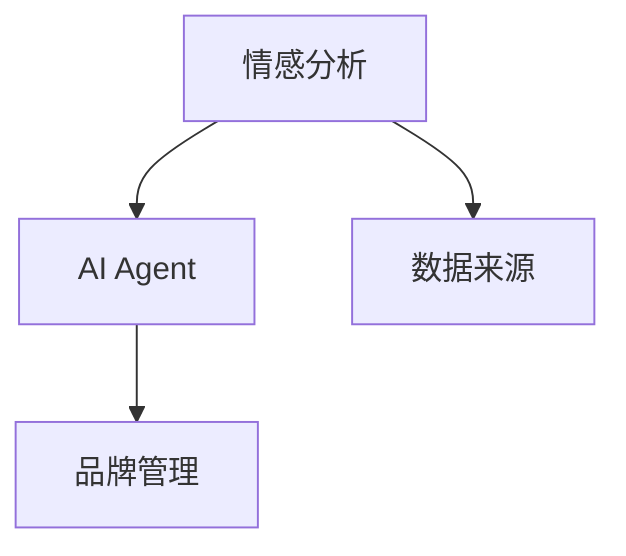
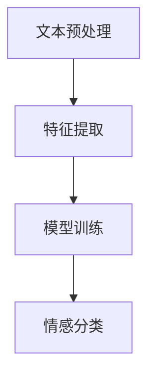
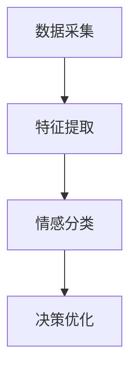

                 


# AI Agent在企业品牌情感分析与管理中的深度应用

> 关键词：AI Agent，情感分析，企业品牌管理，自然语言处理，深度学习，文本挖掘

> 摘要：本文深入探讨了AI Agent在企业品牌情感分析与管理中的应用，从核心概念、算法原理、系统架构到项目实战，系统地分析了AI Agent如何通过情感分析技术帮助企业实现品牌管理的智能化和高效化。文章结合实际案例和详细的技术实现，为读者提供了全面的技术指导和实践参考。

---

## 第1章: AI Agent与情感分析的背景介绍

### 1.1 问题背景

#### 1.1.1 企业品牌管理的挑战
在当今竞争激烈的市场环境中，企业品牌管理面临着诸多挑战。首先，品牌声誉的维护变得越来越复杂，消费者通过各种渠道（如社交媒体、评论平台）表达对品牌的看法，这些海量数据需要及时处理和分析。其次，品牌管理需要实时洞察消费者情感，以便快速响应市场变化。然而，传统的情感分析方法往往依赖人工操作，效率低下，且难以处理复杂的情感语境。

#### 1.1.2 情感分析在品牌管理中的作用
情感分析通过自然语言处理技术，自动识别文本中的情感倾向，帮助企业了解消费者对品牌的情感态度。这种分析可以帮助企业在产品开发、市场推广、客户服务等方面做出更精准的决策。例如，通过分析社交媒体上的用户评论，企业可以识别出用户对产品的满意度，从而优化产品设计或调整市场策略。

#### 1.1.3 AI Agent的引入与价值
AI Agent（人工智能代理）是一种能够自主感知环境、执行任务并做出决策的智能系统。将AI Agent引入情感分析领域，可以实现情感数据的实时采集、分析和响应，显著提升品牌管理的效率和精准度。AI Agent不仅能够自动化处理海量数据，还能根据分析结果主动采取行动，例如自动回复用户的负面评论或调整营销策略。

### 1.2 问题描述

#### 1.2.1 传统情感分析的局限性
传统的情感分析方法主要依赖预训练的情感词典或基于统计的特征提取方法，这些方法在处理复杂语境和情感细微变化时显得力不从心。例如， sarcasm（讽刺）或Irony（反讽）等情感表达常常被传统方法误判。

#### 1.2.2 企业品牌管理中的情感分析需求
企业品牌管理需要对来自多个渠道的用户反馈进行实时分析，包括社交媒体、电商平台评论、新闻媒体等。这些数据不仅数量庞大，而且内容多样，传统的静态情感词典难以满足动态变化的语境需求。

#### 1.2.3 AI Agent在情感分析中的应用场景
AI Agent可以在企业品牌管理的多个环节中应用情感分析技术，例如：
1. **实时监测**：实时监测品牌相关的社交媒体数据，识别潜在的声誉风险。
2. **舆情预警**：根据情感分析结果，预警负面舆情，帮助企业在危机发生前采取措施。
3. **个性化回复**：根据用户的情感倾向，自动生成个性化的回复，提升用户体验。

### 1.3 问题解决

#### 1.3.1 AI Agent的核心优势
AI Agent的核心优势在于其自主性和智能性。它能够通过自然语言处理技术理解文本内容，并根据分析结果做出决策。例如，当AI Agent检测到负面评论时，它可以自动触发通知机制，提醒相关部门处理。

#### 1.3.2 情感分析的深度应用
深度应用情感分析技术，企业可以实现对用户情感的精准识别和分类。例如，使用深度学习模型（如LSTM或Transformer）对文本进行语义理解，捕捉更复杂的情感信息。

#### 1.3.3 企业品牌管理的智能化转型
通过AI Agent和情感分析技术的结合，企业可以实现品牌管理的智能化转型。这种转型不仅提高了效率，还能够通过数据驱动的决策，提升品牌竞争力。

### 1.4 边界与外延

#### 1.4.1 情感分析的边界
情感分析的边界主要体现在数据质量和模型能力上。例如，模型对特定领域的情感理解可能存在局限，需要通过领域适应或模型微调来提升性能。

#### 1.4.2 AI Agent的应用边界
AI Agent的应用边界主要体现在其智能性和决策能力上。目前，AI Agent更多是辅助决策，而非完全替代人类决策。在涉及伦理和法律的复杂场景中，仍需要人类的干预。

#### 1.4.3 企业品牌管理的外延
企业品牌管理的外延不仅包括情感分析，还包括市场调研、竞争对手分析、消费者行为分析等多个方面。AI Agent可以在这些领域中发挥重要作用，帮助企业管理者做出更全面的决策。

### 1.5 核心概念与结构

#### 1.5.1 核心概念的定义
- **情感分析**：通过自然语言处理技术，识别文本中的情感倾向。
- **AI Agent**：能够自主感知环境、执行任务并做出决策的智能系统。

#### 1.5.2 核心要素的组成
- 数据来源：社交媒体、电商平台、新闻媒体等。
- 数据处理：文本预处理、特征提取、情感分类。
- 决策机制：基于情感分析结果，触发相应的行动或通知。

#### 1.5.3 概念结构与联系
通过Mermaid图展示情感分析和AI Agent之间的关系：



---

## 第2章: AI Agent的核心原理

### 2.1 AI Agent的基本原理

#### 2.1.1 AI Agent的定义与特点
- **定义**：AI Agent是一种能够感知环境、自主决策并执行任务的智能系统。
- **特点**：
  - 自主性：能够在没有人类干预的情况下执行任务。
  - 反应性：能够根据环境变化实时调整行为。
  - 智能性：具备理解和处理复杂信息的能力。

#### 2.1.2 AI Agent的分类与应用场景
- **分类**：
  - **简单反射型**：基于预定义规则做出反应。
  - **基于模型的反应型**：基于内部模型理解和预测环境。
  - **目标驱动型**：根据目标采取行动。
  - **实用驱动型**：基于效用函数优化决策。
- **应用场景**：
  - 客户服务：自动回复用户咨询。
  - 市场监测：实时监测市场动态。
  - 个性化推荐：根据用户行为推荐相关内容。

#### 2.1.3 AI Agent的决策机制
- **决策机制**：
  - 感知环境：通过传感器或数据源获取信息。
  - 分析信息：使用算法处理信息，生成决策。
  - 执行行动：根据决策结果采取行动。

### 2.2 情感分析的核心原理

#### 2.2.1 情感分析的基本概念
- **情感倾向**：文本中表达的情感，通常分为正面、负面和中性。
- **情感强度**：情感表达的程度，例如“非常喜欢”比“喜欢”强度更高。

#### 2.2.2 情感分析的主要方法
- **基于规则的方法**：使用情感词典和规则进行情感分类。
- **统计方法**：基于TF-IDF和机器学习算法（如SVM、随机森林）进行分类。
- **深度学习方法**：使用神经网络（如LSTM、Transformer）进行语义理解。

#### 2.2.3 情感分析的挑战与解决方案
- **挑战**：
  - 处理复杂语境，如讽刺、反语。
  - 处理领域特定的词汇和术语。
- **解决方案**：
  - 使用预训练语言模型（如BERT）进行领域适应。
  - 结合上下文信息进行情感分类。

### 2.3 AI Agent与情感分析的结合

#### 2.3.1 AI Agent在情感分析中的角色
- **数据采集**：AI Agent从多个数据源采集相关文本数据。
- **情感分类**：使用深度学习模型对文本进行情感分类。
- **决策支持**：根据情感分析结果，生成相应的决策或行动。

#### 2.3.2 情感分析数据的处理流程
- **数据清洗**：去除噪声数据，如停用词、特殊符号。
- **特征提取**：提取文本特征，如TF-IDF、词嵌入。
- **模型训练**：使用训练数据训练情感分类模型。
- **结果输出**：输出情感分类结果，如正面、负面或中性。

#### 2.3.3 AI Agent与情感分析的协同工作
- **协同流程**：
  1. AI Agent采集品牌相关的文本数据。
  2. 情感分析模型对文本进行分类。
  3. AI Agent根据分类结果采取相应行动，如发送通知或调整策略。

---

## 第3章: 情感分析的算法原理

### 3.1 情感分析的常用算法

#### 3.1.1 词袋模型
- **定义**：词袋模型是一种文本表示方法，将文本表示为词的集合，不考虑词的顺序。
- **优缺点**：
  - 优点：简单易实现。
  - 缺点：无法捕捉语义信息，无法区分同义词和反义词。

#### 3.1.2 TF-IDF特征提取
- **定义**：TF-IDF是一种统计方法，用于评估一个词在文本中的重要性。
- **计算公式**：
  $$ TF-IDF(t, d) = TF(t, d) \times \log\left(\frac{N}{DF(t)}\right) $$
  其中，\( TF(t, d) \) 是词 \( t \) 在文档 \( d \) 中的词频，\( DF(t) \) 是词 \( t \) 的文档频率，\( N \) 是文档总数。

#### 3.1.3 情感分类算法
- **SVM**：支持向量机，适用于小规模数据集。
  $$ \text{优化目标}：\min_{w, b, \xi} \frac{1}{2}||w||^2 + C\sum_{i=1}^n \xi_i $$
  $$ \text{约束条件}：y_i(w \cdot x_i + b) \geq 1 - \xi_i $$
- **随机森林**：基于决策树的集成方法，适用于特征较多的数据集。
- **神经网络**：如LSTM、Transformer，适用于长文本和复杂语义分析。

#### 3.1.4 情感分类流程
通过Mermaid图展示情感分类流程：



---

## 第4章: AI Agent在品牌管理中的应用

### 4.1 数据采集与处理

#### 4.1.1 数据源
- **社交媒体**：如Twitter、Facebook、Instagram等。
- **电商平台**：如亚马逊、淘宝、京东等。
- **新闻媒体**：如报纸、新闻网站等。

#### 4.1.2 数据清洗
- **去重**：去除重复数据。
- **去噪声**：去除无关内容，如停用词、特殊符号。

#### 4.1.3 数据存储
- **数据库**：如MySQL、MongoDB。
- **数据仓库**：如Hadoop、AWS S3。

### 4.2 特征提取与情感分类

#### 4.2.1 特征提取
- **文本向量化**：如Word2Vec、GloVe。
- **TF-IDF**：如前所述。

#### 4.2.2 情感分类
- **模型选择**：根据数据规模和复杂度选择合适的模型。
- **模型训练**：使用训练数据训练情感分类模型。

### 4.3 决策优化与反馈

#### 4.3.1 决策优化
- **情感分析结果**：如正面、负面、中性。
- **行动策略**：如调整广告策略、优化产品设计。

#### 4.3.2 反馈机制
- **用户反馈**：根据用户行为调整模型。
- **模型优化**：持续优化模型性能。

---

## 第5章: 系统架构设计

### 5.1 系统功能设计

#### 5.1.1 功能模块
- **数据采集模块**：采集品牌相关数据。
- **特征提取模块**：提取文本特征。
- **情感分类模块**：进行情感分类。
- **决策优化模块**：生成决策或行动。

#### 5.1.2 功能流程
通过Mermaid图展示功能流程：



### 5.2 系统架构设计

#### 5.2.1 架构设计
- **前端**：用户界面，展示情感分析结果。
- **后端**：处理数据采集、特征提取、情感分类。
- **数据库**：存储数据和结果。

#### 5.2.2 模块划分
- **数据采集模块**：负责数据的采集和预处理。
- **特征提取模块**：负责文本特征的提取。
- **情感分类模块**：负责情感分类。
- **决策优化模块**：负责生成决策或行动。

---

## 第6章: 项目实战

### 6.1 环境搭建

#### 6.1.1 安装Python
- 使用Anaconda安装Python 3.8以上版本。

#### 6.1.2 安装依赖库
- 使用pip安装以下库：
  - `numpy`
  - `pandas`
  - `scikit-learn`
  - `tensorflow`

### 6.2 核心代码实现

#### 6.2.1 数据预处理
```python
import pandas as pd
import numpy as np

# 加载数据
data = pd.read_csv('reviews.csv')

# 数据清洗
data = data.dropna()
data['text'] = data['text'].str.lower()
data['text'] = data['text'].str.replace(r'[^\w\s]', '')
```

#### 6.2.2 特征提取
```python
from sklearn.feature_extraction.text import TfidfVectorizer

vectorizer = TfidfVectorizer(max_features=5000)
X = vectorizer.fit_transform(data['text'])
```

#### 6.2.3 模型训练
```python
from sklearn.svm import SVC
from sklearn.metrics import accuracy_score

model = SVC(C=1.0, gamma=0.001)
model.fit(X, data['sentiment'])
```

#### 6.2.4 模型预测
```python
test_data = pd.read_csv('test_reviews.csv')
test_X = vectorizer.transform(test_data['text'])
y_pred = model.predict(test_X)
print(accuracy_score(test_data['sentiment'], y_pred))
```

### 6.3 代码解读与分析

#### 6.3.1 数据预处理
- 将文本转换为小写。
- 去除特殊字符和停用词。

#### 6.3.2 特征提取
- 使用TF-IDF提取文本特征，保留前5000个特征。

#### 6.3.3 模型训练
- 使用支持向量机（SVM）进行情感分类，调整参数C和gamma以优化模型性能。

#### 6.3.4 模型预测
- 使用测试数据验证模型性能，计算准确率。

### 6.4 案例分析

#### 6.4.1 案例背景
假设我们有一家电商平台，希望通过情感分析了解用户对产品的评价。

#### 6.4.2 数据准备
加载用户评论数据，进行预处理和特征提取。

#### 6.4.3 模型训练与预测
使用训练好的模型对测试数据进行预测，输出情感分类结果。

#### 6.4.4 结果分析
分析模型预测结果，计算准确率、召回率等指标，评估模型性能。

---

## 第7章: 最佳实践与未来展望

### 7.1 最佳实践

#### 7.1.1 数据质量
- 确保数据的准确性和完整性。
- 处理噪声数据，提升模型性能。

#### 7.1.2 模型优化
- 使用预训练语言模型（如BERT）提升语义理解能力。
- 根据领域特点进行模型微调。

#### 7.1.3 系统集成
- 将情感分析系统集成到企业现有的IT系统中。
- 实现与其他系统的数据共享和协同工作。

### 7.2 小结
本文系统地探讨了AI Agent在企业品牌情感分析与管理中的应用，从背景介绍、核心原理到系统架构和项目实战，全面分析了AI Agent如何通过情感分析技术帮助企业实现品牌管理的智能化和高效化。

### 7.3 注意事项

#### 7.3.1 数据隐私
- 遵守数据隐私法规，保护用户隐私。
- 在数据采集和处理过程中，避免泄露个人信息。

#### 7.3.2 模型局限性
- 情感分析模型可能无法处理复杂语境，如讽刺和反语。
- 需要根据具体场景调整模型参数和策略。

#### 7.3.3 系统维护
- 定期更新模型，适应数据变化和领域特点。
- 监控系统性能，及时优化和调整。

### 7.4 拓展阅读

#### 7.4.1 深度学习在情感分析中的应用
- 阅读相关论文，了解最新的深度学习方法。
- 实践使用预训练语言模型进行情感分类。

#### 7.4.2 AI Agent的其他应用
- 探索AI Agent在其他领域的应用，如金融、医疗等。

---

## 作者

**作者**：AI天才研究院/AI Genius Institute & 禅与计算机程序设计艺术 /Zen And The Art of Computer Programming

---

以上是《AI Agent在企业品牌情感分析与管理中的深度应用》的完整目录和部分章节内容。文章详细探讨了AI Agent在情感分析中的核心原理、系统架构和项目实战，结合实际案例和技术实现，为读者提供了全面的技术指导和实践参考。

