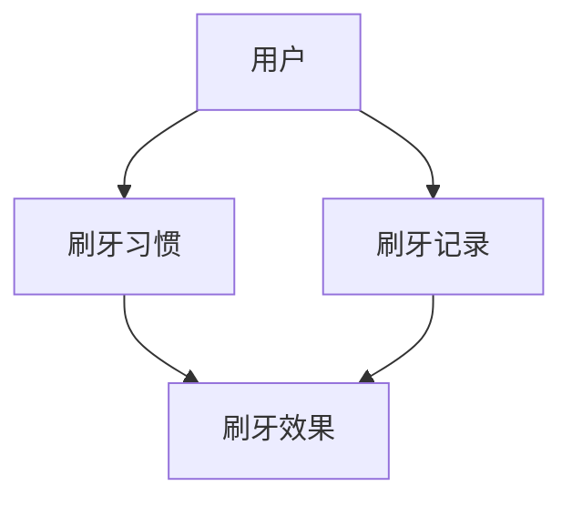
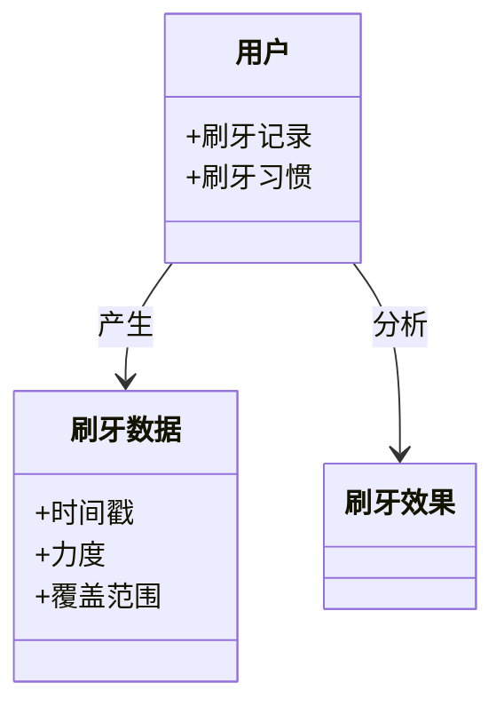
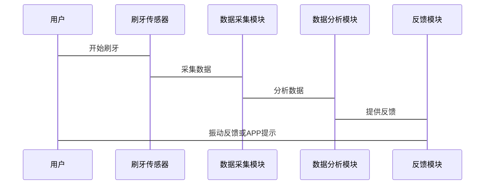

                 


# AI Agent在智能牙刷中的刷牙效果分析

## 关键词：AI Agent、智能牙刷、刷牙效果、数据采集、算法优化、系统架构

## 摘要：本文深入分析AI Agent在智能牙刷中的应用，探讨其如何通过数据采集、算法优化和系统架构设计提升刷牙效果。文章从背景介绍、核心概念、算法原理、系统架构到项目实战，全面解析AI Agent在智能牙刷中的实现与效果，并展望未来的发展方向。

---

# 第1章: AI Agent与智能牙刷的背景介绍

## 1.1 问题背景

### 1.1.1 刷牙效果的重要性
良好的刷牙习惯是维护口腔健康的基础。有效的刷牙可以清除牙菌斑、预防龋齿和牙周病。然而，许多用户由于缺乏正确的刷牙方法或不够耐心，往往无法达到最佳的刷牙效果。

### 1.1.2 传统刷牙方式的局限性
传统刷牙方式依赖用户的主观判断，存在以下问题：
- 用户可能无法掌握正确的刷牙时间（建议2-3分钟）。
- 刷牙力度过猛可能导致牙龈出血，力度过轻则无法有效清除牙菌斑。
- 用户可能忽略某些牙区，导致清洁不彻底。

### 1.1.3 AI技术在口腔健康领域的潜力
AI技术可以通过数据采集、分析和反馈，帮助用户优化刷牙习惯。AI Agent（人工智能代理）能够实时监测用户的刷牙行为，提供个性化建议，从而提升刷牙效果。

---

## 1.2 问题描述

### 1.2.1 刷牙效果的定义与衡量标准
刷牙效果的衡量标准包括：
1. 刷牙时间是否足够（2-3分钟）。
2. 刷牙力度是否适中。
3. 是否覆盖所有牙区。
4. 是否有效清除牙菌斑。

### 1.2.2 用户刷牙习惯的多样性
不同用户有不同的刷牙习惯，例如：
- 部分用户可能偏爱横向刷牙，而正确的刷牙方法是纵向刷牙。
- 部分用户可能在某些牙区停留时间过短。

### 1.2.3 AI Agent在优化刷牙效果中的作用
AI Agent能够通过以下方式优化刷牙效果：
1. 实时监测用户的刷牙时间、力度和覆盖范围。
2. 提供个性化反馈，纠正不良习惯。
3. 根据用户的数据，优化刷牙策略。

---

## 1.3 问题解决

### 1.3.1 AI Agent的核心功能
AI Agent在智能牙刷中的核心功能包括：
1. 数据采集：通过传感器采集刷牙时间、力度、频率等数据。
2. 数据分析：分析用户的刷牙习惯，识别问题。
3. 个性化反馈：通过振动或APP提示，指导用户改进刷牙方法。

### 1.3.2 数据采集与分析的实现方式
数据采集主要通过牙刷内置的传感器完成，包括加速度传感器和压力传感器。AI Agent通过分析这些数据，判断用户的刷牙效果。

### 1.3.3 刷牙效果的反馈与优化机制
AI Agent会根据分析结果，提供实时反馈或后续建议。例如：
- 当用户刷牙时间不足时，AI Agent会提醒延长刷牙时间。
- 当用户用力过猛时，AI Agent会提示调整力度。

---

## 1.4 边界与外延

### 1.4.1 AI Agent的功能边界
AI Agent的功能主要集中在刷牙效果的分析与优化，不涉及其他口腔健康问题（如牙齿矫正、牙龈出血的医疗建议）。

### 1.4.2 与其他智能设备的协同工作
AI Agent可以与其他智能设备（如智能镜子、口腔健康APP）协同工作，提供更全面的口腔健康服务。

### 1.4.3 刷牙效果分析的适用范围
AI Agent的刷牙效果分析适用于所有智能牙刷用户，但需要用户配合使用。

---

## 1.5 概念结构与核心要素

### 1.5.1 AI Agent的组成要素
1. 数据采集模块：包括传感器和数据传输模块。
2. 数据分析模块：包括算法和数据处理模块。
3. 反馈模块：包括振动反馈和APP提示。

### 1.5.2 刷牙效果分析的关键指标
1. 刷牙时间。
2. 刷牙力度。
3. 刷牙覆盖范围。

### 1.5.3 系统与用户交互的核心流程
1. 用户刷牙时，传感器采集数据。
2. 数据传输到AI Agent进行分析。
3. AI Agent根据分析结果，提供反馈或建议。

---

## 1.6 本章小结
本章介绍了AI Agent在智能牙刷中的背景与概念，分析了传统刷牙方式的局限性，以及AI技术在优化刷牙效果中的潜力。接下来将深入探讨AI Agent的核心概念与联系。

---

# 第2章: AI Agent的核心概念与联系

## 2.1 核心概念原理

### 2.1.1 AI Agent的基本原理
AI Agent通过传感器采集数据，利用算法分析数据，提供反馈或建议。其核心在于数据的采集、分析与反馈。

### 2.1.2 智能牙刷的数据采集机制
智能牙刷通过加速度传感器和压力传感器采集刷牙时间、力度和频率。

### 2.1.3 刷牙效果的分析算法
AI Agent利用机器学习算法（如随机森林、支持向量机）分析用户的刷牙数据，判断刷牙效果。

---

## 2.2 核心概念属性特征对比

### 2.2.1 不同AI Agent算法的对比分析
| 算法类型       | 优点                          | 缺点                          |
|----------------|-------------------------------|-------------------------------|
| 线性回归       | 简单，计算速度快               | 非线性关系表现较差             |
| 支持向量机     | 分类能力强                   | 对数据预处理要求较高           |
| 随机森林       | 鲁棒性强，适合小样本数据       | 解释性较差                   |

### 2.2.2 刷牙效果分析指标的对比
| 指标           | 重要性 | 实现难度 |
|----------------|--------|----------|
| 刷牙时间       | 高     | 中       |
| 刷牙力度       | 高     | 高       |
| 刷牙覆盖范围   | 中     | 中       |

### 2.2.3 数据采集方式的优劣势分析
- **优点**：实时采集，数据准确。
- **缺点**：传感器精度有限，可能影响分析结果。

---

## 2.3 ER实体关系图



---

## 2.4 本章小结
本章通过对比分析不同AI算法和数据采集方式，明确了AI Agent的核心概念与联系。接下来将详细介绍AI Agent的算法原理与实现。

---

# 第3章: AI Agent的算法原理与实现

## 3.1 算法原理

### 3.1.1 刷牙效果分析算法的数学模型

$$
\text{刷牙效果评分} = \alpha \times \text{刷牙时间} + \beta \times \text{刷牙力度} + \gamma \times \text{刷牙覆盖范围}
$$

其中，$\alpha$、$\beta$、$\gamma$为权重系数，需通过训练数据优化。

### 3.1.2 算法实现步骤

1. 数据预处理：清洗和归一化数据。
2. 特征提取：提取刷牙时间、力度、覆盖范围等特征。
3. 模型训练：使用随机森林算法训练模型。
4. 模型优化：通过交叉验证调整模型参数。
5. 模型部署：将模型部署到智能牙刷中。

---

## 3.2 算法实现的具体步骤

### 3.2.1 数据预处理

```python
import pandas as pd
from sklearn.preprocessing import StandardScaler

# 读取数据
data = pd.read_csv('brushing_data.csv')

# 删除缺失值
data.dropna(inplace=True)

# 标准化处理
scaler = StandardScaler()
data_scaled = scaler.fit_transform(data)
```

### 3.2.2 特征提取与模型训练

```python
from sklearn.ensemble import RandomForestRegressor
from sklearn.metrics import mean_squared_error

# 特征提取
X = data_scaled[:, :-1]
y = data_scaled[:, -1]

# 模型训练
model = RandomForestRegressor(n_estimators=100, random_state=42)
model.fit(X, y)

# 模型评估
y_pred = model.predict(X)
print(mean_squared_error(y, y_pred))
```

---

## 3.3 算法优化

### 3.3.1 算法调优
通过网格搜索优化随机森林的参数。

```python
from sklearn.model_selection import GridSearchCV

# 参数搜索空间
param_grid = {
    'n_estimators': [100, 200],
    'max_depth': [None, 10, 20],
    'min_samples_split': [2, 5]
}

# 网格搜索
grid_search = GridSearchCV(model, param_grid, cv=5)
grid_search.fit(X, y)

# 输出最优参数
print(grid_search.best_params_)
```

### 3.3.2 模型部署
将优化后的模型部署到智能牙刷中，实时分析用户的刷牙数据。

---

## 3.4 本章小结
本章详细介绍了AI Agent在智能牙刷中的算法原理与实现，包括数据预处理、特征提取、模型训练与优化。接下来将探讨系统的架构设计与实现。

---

# 第4章: 系统分析与架构设计

## 4.1 系统功能设计

### 4.1.1 系统功能模块
1. 数据采集模块：采集刷牙时间、力度等数据。
2. 数据分析模块：分析用户的刷牙习惯。
3. 反馈模块：提供实时反馈或后续建议。

### 4.1.2 领域模型设计



---

## 4.2 系统架构设计

### 4.2.1 系统架构图

```mermaid
container 智能牙刷系统 {
    component 数据采集模块 {
        +传感器
    }
    component 数据分析模块 {
        +算法
    }
    component 反馈模块 {
        +振动反馈
        +APP提示
    }
}
```

### 4.2.2 系统接口设计
- **输入接口**：传感器数据。
- **输出接口**：振动反馈、APP提示。

---

## 4.3 系统交互设计

### 4.3.1 系统交互流程



---

## 4.4 本章小结
本章通过系统分析与架构设计，明确了智能牙刷系统的功能模块与交互流程。接下来将通过项目实战，展示AI Agent在智能牙刷中的具体实现。

---

# 第5章: 项目实战

## 5.1 环境安装

```bash
# 安装依赖
pip install pandas scikit-learn mermaid4jupyter
```

---

## 5.2 系统核心实现

### 5.2.1 数据采集模块实现

```python
import numpy as np

# 模拟传感器数据
def generate_data(samples=100):
    time = np.random.uniform(1, 3, samples)
    force = np.random.uniform(1, 5, samples)
    coverage = np.random.uniform(0.5, 1, samples)
    return np.column_stack((time, force, coverage))
```

### 5.2.2 数据分析模块实现

```python
from sklearn.ensemble import RandomForestRegressor

# 生成数据
data = generate_data()

# 训练模型
model = RandomForestRegressor()
model.fit(data[:, :2], data[:, 2])
```

---

## 5.3 代码应用解读与分析

### 5.3.1 代码功能解读
- `generate_data`函数用于生成模拟的刷牙数据。
- ` RandomForestRegressor`用于训练模型，预测刷牙覆盖范围。

### 5.3.2 代码优化建议
- 增加数据样本量，提升模型泛化能力。
- 使用交叉验证，避免过拟合。

---

## 5.4 实际案例分析

### 5.4.1 案例背景
某用户刷牙时间不足2分钟，力度过轻。

### 5.4.2 案例分析
AI Agent分析后，建议用户延长刷牙时间，并加大力度。

---

## 5.5 本章小结
本章通过项目实战，展示了AI Agent在智能牙刷中的具体实现。通过代码实现和案例分析，验证了AI Agent在优化刷牙效果中的有效性。

---

# 第6章: 总结与展望

## 6.1 本章总结
本文详细探讨了AI Agent在智能牙刷中的应用，从背景介绍、核心概念、算法原理到系统架构与项目实战，全面分析了AI Agent在优化刷牙效果中的潜力与实现方法。

## 6.2 未来展望
未来，AI Agent在智能牙刷中的应用将更加智能化与个性化。例如：
- 基于用户口腔健康数据，提供定制化刷牙建议。
- 结合其他智能设备，提供更全面的口腔健康管理服务。

## 6.3 注意事项
- 数据隐私保护：用户的刷牙数据可能包含敏感信息，需加强数据加密与隐私保护。
- 模型优化：需要持续优化算法，提升刷牙效果分析的准确性。

## 6.4 拓展阅读
- 《机器学习实战》
- 《人工智能：一种现代的方法》
- 《智能系统设计与实现》

---

# 作者
作者：AI天才研究院/AI Genius Institute  
作者：禅与计算机程序设计艺术/Zen And The Art of Computer Programming

