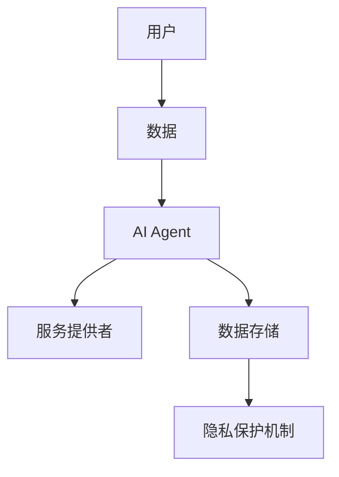
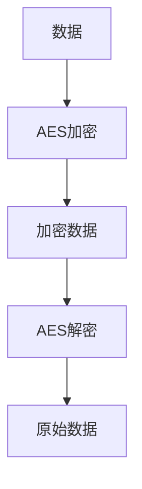
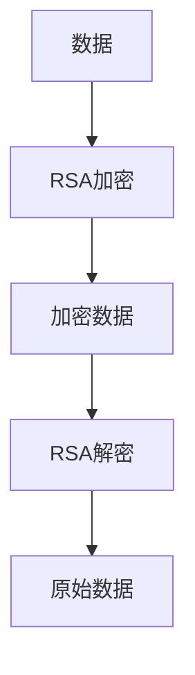
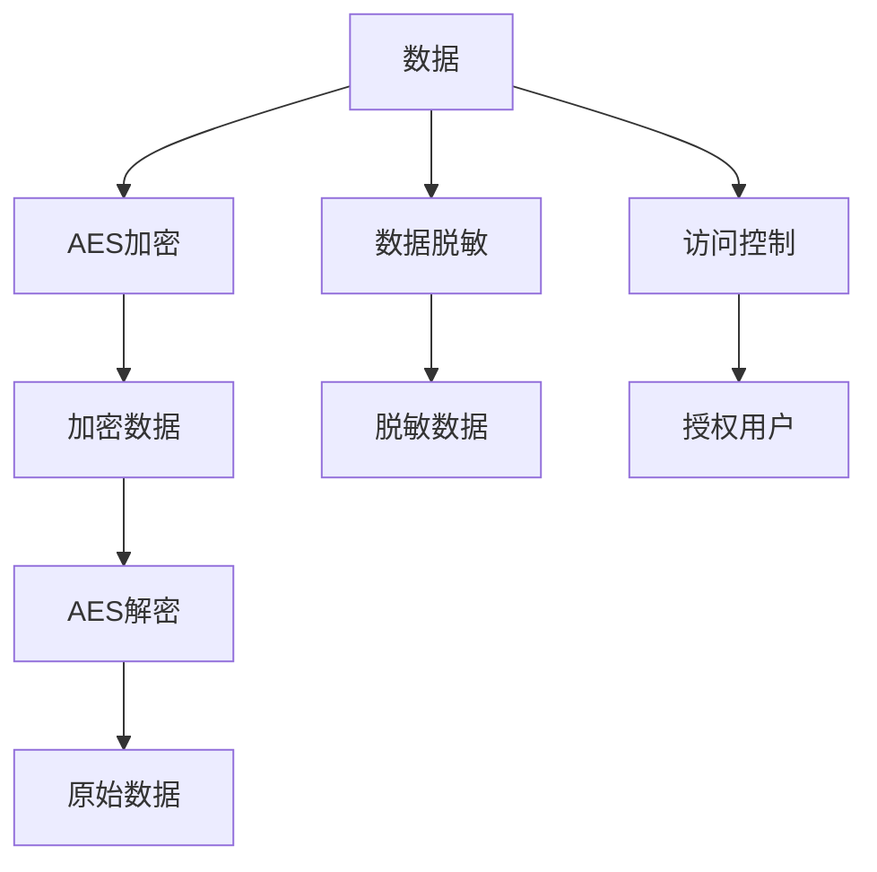
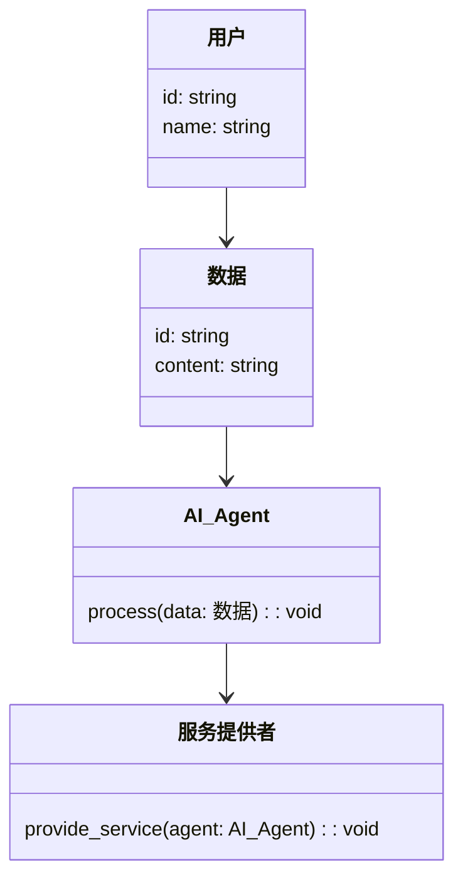
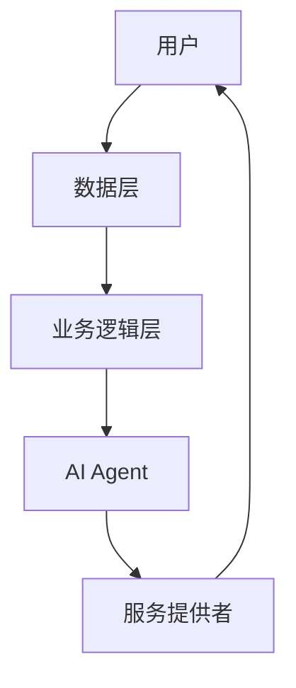
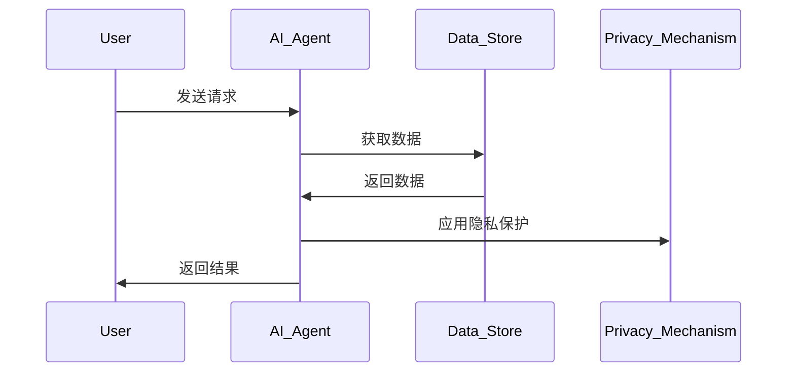

                 


# AI Agent的隐私保护机制：在智能与安全间寻找平衡

> **关键词**：AI Agent、隐私保护、数据安全、人工智能、安全架构

> **摘要**：本文深入探讨了AI Agent在智能应用中的隐私保护机制，分析了隐私保护与数据利用之间的平衡点。通过系统性地介绍隐私保护的核心概念、算法原理、系统架构和实际案例，本文为构建安全可靠的AI Agent提供了理论依据和实践指导。

---

## 第1章: AI Agent与隐私保护概述

### 1.1 AI Agent的基本概念

#### 1.1.1 AI Agent的定义与特点
- **定义**：AI Agent（智能体）是指能够感知环境、自主决策并执行任务的智能实体，通常通过传感器、数据处理和执行机构实现功能。
- **特点**：
  - **自主性**：无需外部干预，自主完成任务。
  - **反应性**：能够实时感知环境并做出反应。
  - **目标导向**：基于目标驱动行为。
  - **学习能力**：通过数据和经验不断优化性能。

#### 1.1.2 AI Agent的分类与应用场景
- **分类**：
  - **简单反射型Agent**：基于预设规则响应输入。
  - **基于模型的反射型Agent**：利用内部模型理解和决策。
  - **目标驱动型Agent**：基于目标优化行为。
  - **效用驱动型Agent**：通过最大化效用来决策。
- **应用场景**：
  - **智能家居**：控制家电、管理能源。
  - **医疗健康**：辅助诊断、个性化治疗建议。
  - **自动驾驶**：实时感知环境、做出驾驶决策。
  - **金融投资**：分析市场数据、优化投资组合。

#### 1.1.3 AI Agent与传统程序的主要区别
- **自主性**：AI Agent具备自主决策能力，传统程序依赖外部指令。
- **学习能力**：AI Agent能够通过数据学习和优化，传统程序依赖固定逻辑。
- **环境适应性**：AI Agent能够动态适应环境变化，传统程序难以实时调整。

---

### 1.2 隐私保护的重要性

#### 1.2.1 数字化时代隐私保护的核心问题
- **数据收集**：AI Agent需要收集大量数据以实现功能，这可能导致隐私泄露。
- **数据滥用**：数据可能被恶意利用，引发身份盗窃或其他安全问题。
- **数据共享**：在多系统协作中，数据共享可能引发隐私风险。

#### 1.2.2 AI Agent对隐私的潜在威胁
- **数据泄露**：未经授权的访问可能导致用户隐私数据泄露。
- **数据滥用**：收集的数据可能被用于未经授权的目的。
- **数据关联性**：通过分析数据，可能推断出用户的敏感信息。

#### 1.2.3 隐私保护与数据安全的关系
- **隐私保护**：防止未经授权的访问和数据泄露。
- **数据安全**：确保数据在存储和传输过程中的完整性、机密性和可用性。
- **关联性**：隐私保护是数据安全的重要组成部分，数据安全是隐私保护的基础保障。

---

### 1.3 AI Agent隐私保护的必要性

#### 1.3.1 用户隐私权的保护需求
- **用户信任**：只有保护用户隐私，才能赢得用户的信任。
- **合规要求**：遵守相关法律法规，如GDPR（通用数据保护条例）。
- **社会责任**：企业有责任保护用户隐私，避免数据滥用。

#### 1.3.2 法律法规对隐私保护的要求
- **GDPR**：要求数据处理者必须明确告知用户数据使用方式，并获得用户的同意。
- **CCPA**：加州消费者隐私法案，赋予消费者对其数据的更多控制权。
- **数据保护法**：各国制定的法律，规范数据收集、处理和共享行为。

#### 1.3.3 企业社会责任与隐私保护
- **企业声誉**：数据泄露事件可能导致企业声誉受损。
- **法律责任**：违反隐私保护法规可能面临罚款和诉讼。
- **用户信任**：隐私保护是用户信任的重要基础。

---

### 1.4 本章小结
本章从AI Agent的基本概念出发，分析了隐私保护的重要性，并探讨了AI Agent隐私保护的必要性。理解这些内容，有助于后续章节深入探讨隐私保护的核心机制和技术实现。

---

## 第2章: AI Agent隐私保护的核心概念与联系

### 2.1 隐私保护机制的原理

#### 2.1.1 数据加密的基本原理
- **对称加密**：使用相同的密钥进行加密和解密，速度快，适用于大规模数据加密。
- **非对称加密**：使用公钥和私钥进行加密和解密，适合安全通信和数字签名。
- **哈希函数**：将数据映射为固定长度的哈希值，用于数据完整性校验和不可逆加密。

#### 2.1.2 数据脱敏的核心机制
- **数据替换**：将敏感数据替换为虚拟值，如将真实姓名替换为“用户1”。
- **数据遮蔽**：隐藏部分敏感信息，如将电话号码中的部分数字替换为星号。
- **数据泛化**：将具体数据转化为更一般化的信息，如将具体地址泛化为“北京市”。

#### 2.1.3 数据访问控制的实现方式
- **基于角色的访问控制（RBAC）**：根据用户角色分配访问权限。
- **基于属性的访问控制（ABAC）**：根据用户属性（如位置、时间）动态调整访问权限。
- **基于策略的访问控制（PBAC）**：根据预定义的策略控制数据访问。

---

### 2.2 核心概念对比分析

#### 2.2.1 数据加密与数据脱敏的对比
| 对比维度 | 数据加密 | 数据脱敏 |
|----------|----------|----------|
| 目标 | 保护数据机密性 | 隐藏敏感信息 |
| 实现方式 | 使用加密算法 | 替换、遮蔽或泛化数据 |
| 适用场景 | 数据存储和传输 | 数据展示和共享 |

#### 2.2.2 数据访问控制与数据匿名化的区别
- **数据访问控制**：控制谁可以访问数据，侧重于权限管理。
- **数据匿名化**：隐藏数据中的个人身份信息，侧重于数据本身的安全性。

#### 2.2.3 数据共享与数据隐私保护的平衡
- **数据共享**：在保证隐私的前提下，最大化数据的共享价值。
- **隐私保护**：通过技术手段确保数据在共享过程中的隐私安全。

---

### 2.3 ER实体关系图架构



---

### 2.4 本章小结
本章从核心概念出发，分析了数据加密、数据脱敏和数据访问控制的原理，并通过对比分析和实体关系图，展示了AI Agent隐私保护机制的内在联系。

---

## 第3章: AI Agent隐私保护的算法原理

### 3.1 数据加密算法

#### 3.1.1 对称加密算法的工作原理
- **AES加密**：高级加密标准，广泛应用于数据加密。
- **工作流程**：
  1. 数据被划分为固定长度的块。
  2. 每个块通过密钥进行加密。
  3. 加密后的数据通过传输或存储。
  4. 接收方使用相同密钥解密数据。



---

#### 3.1.2 非对称加密算法的实现方式
- **RSA算法**：基于大整数分解的公钥加密算法。
- **工作流程**：
  1. 用户使用公钥加密数据。
  2. 接收方使用私钥解密数据。
  3. 数据传输过程中的安全性得到保障。



---

#### 3.1.3 哈希函数在隐私保护中的应用
- **SHA-256哈希函数**：广泛应用于数据完整性校验和不可逆加密。
- **应用**：
  - 数据签名：确保数据未被篡改。
  - 密码存储：将用户密码哈希存储，防止明文泄露。

---

### 3.2 数据脱敏算法

#### 3.2.1 数据替换的基本原理
- **实现方式**：将敏感字段替换为虚拟值，如将姓名替换为“用户1”。
- **代码示例**：
  ```python
  def data_masking(data, field):
      masked_data = data.copy()
      masked_data[field] = f" anonymized_{field}"
      return masked_data
  ```

---

#### 3.2.2 数据遮蔽的核心机制
- **实现方式**：隐藏敏感数据的部分信息，如将电话号码中的中间四位替换为星号。
- **代码示例**：
  ```python
  def mask_phone_number(phone):
      return phone[:3] + "****" + phone[7:]
  ```

---

#### 3.2.3 数据泛化的方法与实现
- **实现方式**：将具体数据转化为更一般化的信息，如将具体地址泛化为“北京市”。
- **代码示例**：
  ```python
  def generalize_location(location):
      return location.split()[0]
  ```

---

### 3.3 数据访问控制算法

#### 3.3.1 基于角色的访问控制（RBAC）模型
- **实现方式**：根据用户角色分配访问权限，如普通用户只能查看数据，管理员可以修改数据。
- **代码示例**：
  ```python
  def access_control(user_role, action):
      allowed_actions = {
          "普通用户": ["查看"],
          "管理员": ["查看", "修改"]
      }
      return action in allowed_actions[user_role]
  ```

---

#### 3.3.2 基于属性的访问控制（ABAC）模型
- **实现方式**：根据用户属性动态调整访问权限，如根据地理位置限制数据访问。
- **代码示例**：
  ```python
  def access_control(user_attribute, action):
      allowed_locations = ["北京", "上海"]
      return user_attribute["location"] in allowed_locations and action == "查看"
  ```

---

#### 3.3.3 基于策略的访问控制（PBAC）模型
- **实现方式**：根据预定义策略控制数据访问，如策略规定只有特定用户才能访问敏感数据。
- **代码示例**：
  ```python
  def access_control(user_id, data_id):
      allowed_users = {1, 2, 3}
      return user_id in allowed_users and data_id in allowed_data
  ```

---

### 3.4 算法流程图



---

### 3.5 本章小结
本章详细讲解了AI Agent隐私保护中的数据加密、数据脱敏和数据访问控制算法的原理和实现方式，为后续章节的系统设计奠定了基础。

---

## 第4章: AI Agent隐私保护的系统架构设计

### 4.1 问题场景介绍
- **场景描述**：AI Agent需要在保护用户隐私的前提下，高效地处理和分析数据。
- **挑战**：如何在保证隐私的同时，实现数据的高效利用。

---

### 4.2 系统功能设计

#### 4.2.1 领域模型设计
- **核心实体**：用户、数据、AI Agent、服务提供者。
- **关系**：
  - 用户向AI Agent提交请求。
  - AI Agent处理数据并返回结果。
  - 数据存储在安全的数据存储系统中。



---

#### 4.2.2 系统架构设计
- **分层架构**：
  - **数据层**：负责数据的存储和管理。
  - **业务逻辑层**：实现AI Agent的核心功能。
  - **用户交互层**：处理用户请求和返回结果。



---

#### 4.2.3 接口设计
- **数据接口**：
  - 数据获取接口：`GET /data?id=123`
  - 数据存储接口：`POST /data`
- **AI Agent接口**：
  - 请求处理接口：`POST /process`
  - 结果返回接口：`GET /result`

---

#### 4.2.4 交互流程设计
- **流程步骤**：
  1. 用户向AI Agent发送请求。
  2. AI Agent接收请求并进行数据处理。
  3. 数据处理过程中，系统自动应用隐私保护机制。
  4. 处理结果返回给用户。



---

### 4.3 本章小结
本章通过系统架构设计，展示了AI Agent隐私保护机制的实现方式，为后续章节的项目实战奠定了基础。

---

## 第5章: AI Agent隐私保护的项目实战

### 5.1 环境安装
- **Python环境**：安装Python 3.8及以上版本。
- **依赖库安装**：
  ```bash
  pip install aes-cipher
  pip install rsa
  pip install pandas
  ```

---

### 5.2 系统核心实现源代码

#### 5.2.1 数据加密模块
```python
from aes_ciphers import AESCipher

class DataEncryptor:
    def __init__(self, key):
        self.key = key
        self.aes = AESCipher(key)

    def encrypt(self, data):
        return self.aes.encrypt(data)

    def decrypt(self, encrypted_data):
        return self.aes.decrypt(encrypted_data)
```

---

#### 5.2.2 数据脱敏模块
```python
class DataMasker:
    def mask_phone_number(self, phone):
        return phone[:3] + "****" + phone[7:]

    def generalize_location(self, location):
        return location.split()[0]
```

---

#### 5.2.3 数据访问控制模块
```python
class AccessController:
    def __init__(self, role):
        self.role = role

    def can_access(self, action):
        allowed_actions = {
            "普通用户": ["查看"],
            "管理员": ["查看", "修改"]
        }
        return action in allowed_actions[self.role]
```

---

### 5.3 代码应用解读与分析
- **数据加密模块**：使用AES加密算法，确保数据在传输过程中的安全性。
- **数据脱敏模块**：通过数据替换和遮蔽，保护用户隐私。
- **数据访问控制模块**：根据用户角色和属性，动态调整数据访问权限。

---

### 5.4 实际案例分析
- **案例描述**：一个AI Agent需要处理用户的医疗数据，必须确保数据的安全性和隐私性。
- **实现步骤**：
  1. 用户提交医疗数据请求。
  2. 数据经过AES加密传输。
  3. 数据到达AI Agent后，进行脱敏处理（如隐藏患者姓名）。
  4. 数据访问控制模块确保只有授权用户才能查看数据。
  5. 处理结果返回给用户。

---

### 5.5 本章小结
本章通过实际案例，展示了AI Agent隐私保护机制的实现过程，为读者提供了可操作的参考。

---

## 第6章: 最佳实践与注意事项

### 6.1 最佳实践
- **数据最小化原则**：只收集实现功能所需的最少数据。
- **隐私保护技术结合**：结合多种技术手段（如加密、脱敏、访问控制）实现多层次保护。
- **定期安全审计**：定期检查系统漏洞，确保隐私保护机制的有效性。

---

### 6.2 小结
AI Agent的隐私保护机制需要综合运用多种技术手段，同时遵循最佳实践，确保智能与安全的平衡。

---

### 6.3 注意事项
- **合规性**：确保系统设计符合相关法律法规要求。
- **用户教育**：提高用户的隐私保护意识。
- **系统维护**：定期更新系统，修复潜在漏洞。

---

### 6.4 拓展阅读
- **推荐书籍**：《数据隐私保护：理论与实践》。
- **推荐文章**：《AI与数据隐私：未来的挑战与机遇》。

---

## 作者：AI天才研究院 & 禅与计算机程序设计艺术

