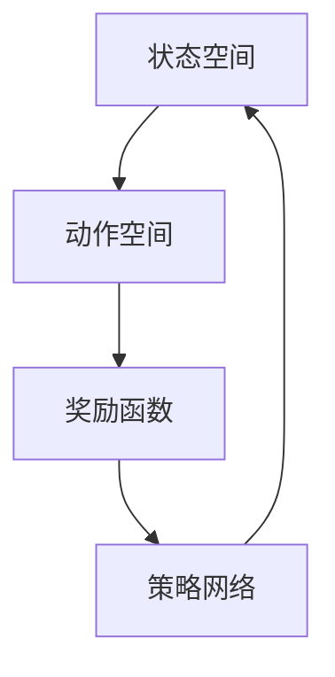
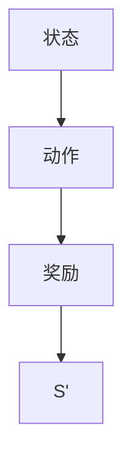
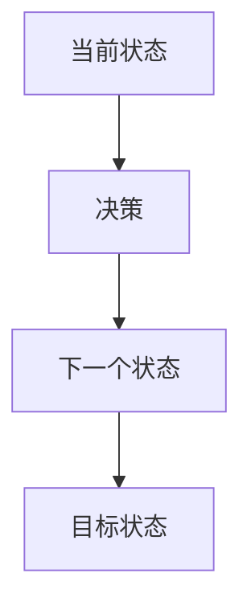
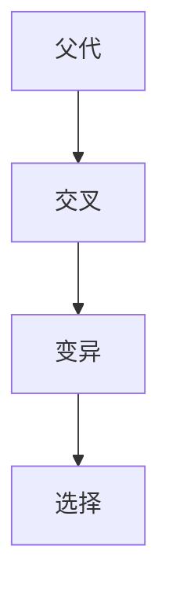
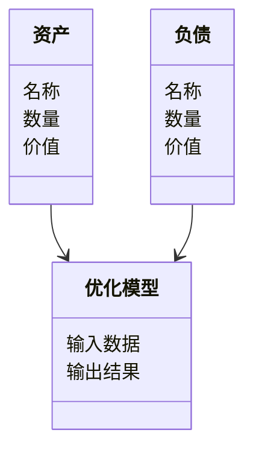
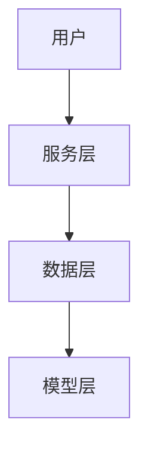

                 


# AI在资产负债匹配动态优化中的应用

> 关键词：AI, 资产负债匹配优化, 强化学习, 动态规划, 金融优化

> 摘要：本文深入探讨了人工智能技术在资产负债匹配动态优化中的应用，分析了AI技术如何通过强化学习、动态规划等算法提升资产负债匹配的效率与准确性。文章结合实际案例和系统设计，详细阐述了AI在金融优化中的优势与挑战，为读者提供了从理论到实践的全面指导。

---

# 目录

1. [背景与问题](#背景与问题)
2. [核心概念与联系](#核心概念与联系)
3. [AI在资产负债匹配优化中的算法原理](#AI在资产负债匹配优化中的算法原理)
4. [系统分析与架构设计](#系统分析与架构设计)
5. [项目实战](#项目实战)
6. [最佳实践与未来展望](#最佳实践与未来展望)

---

## 1. 背景与问题

### 1.1 资产负债匹配优化的定义与目标

#### 1.1.1 资产负债匹配优化的定义
资产负债匹配优化是指在金融领域中，通过调整资产和负债的结构和规模，使其在时间、金额和风险上达到最优匹配的过程。这一过程旨在降低企业的财务风险，提高资金使用效率，并确保企业能够应对不同市场条件下的财务需求。

#### 1.1.2 资产负债匹配优化的目标
- **风险最小化**：通过优化资产负债结构，降低企业因市场波动带来的财务风险。
- **收益最大化**：在风险可控的前提下，实现资产回报的最大化。
- **流动性管理**：确保企业在需要时能够快速调整资产负债结构，满足资金需求。

#### 1.1.3 资产负债匹配优化的边界与外延
- **边界**：资产负债匹配优化通常在一定的市场假设和企业战略目标下进行，例如固定利率环境或特定的资本充足率要求。
- **外延**：资产负债匹配优化可以扩展到企业整体财务战略的制定，例如资本结构优化和风险管理。

### 1.2 AI在金融领域的应用背景

#### 1.2.1 人工智能在金融行业的应用现状
人工智能技术在金融领域的应用日益广泛，包括股票交易、信用评估、风险控制、客户画像等多个方面。AI技术的引入显著提高了金融决策的效率和准确性。

#### 1.2.2 资产负债匹配优化的痛点与难点
- **复杂性**：资产负债匹配优化涉及多个变量的调整，且变量之间存在复杂的非线性关系。
- **实时性**：金融市场变化迅速，要求优化模型能够实时调整以应对市场波动。
- **数据量**：优化过程需要处理大量的历史数据和实时数据，对计算能力要求较高。

#### 1.2.3 AI技术如何解决资产负债匹配优化问题
AI技术，尤其是强化学习和动态规划，能够通过建模和优化算法，帮助企业在复杂的金融市场环境中找到最优的资产负债匹配方案。

---

## 2. 核心概念与联系

### 2.1 资产负债匹配优化的核心概念

#### 2.1.1 资产负债匹配优化的数学模型
资产负债匹配优化可以表示为一个优化问题，其目标函数和约束条件如下：

$$
\text{目标函数：} \quad \min \sum_{t=1}^{T} |A_t - L_t|
$$

$$
\text{约束条件：} \quad A_t + L_t \leq C, \quad \forall t
$$

其中，\( A_t \) 表示第 \( t \) 期的资产规模，\( L_t \) 表示第 \( t \) 期的负债规模，\( C \) 表示企业的资本规模。

#### 2.1.2 资产负债匹配优化的关键要素
- **资产池**：企业拥有的各类资产，包括现金、债券、股票等。
- **负债池**：企业需要偿还的各类负债，包括短期负债和长期负债。
- **市场环境**：包括利率、汇率、市场波动等外部因素。

#### 2.1.3 资产负债匹配优化的约束条件
- **资本充足率**：企业必须满足一定的资本充足率要求。
- **流动性要求**：企业必须保证一定的流动性以应对突发事件。

### 2.2 AI在资产负债匹配优化中的应用原理

#### 2.2.1 AI算法在金融优化中的应用原理
AI算法，尤其是强化学习和遗传算法，能够通过不断迭代和优化，找到最优的资产负债匹配方案。

#### 2.2.2 资产负债匹配优化的AI模型架构
以下是一个基于强化学习的资产负债匹配优化模型架构图：



#### 2.2.3 资产负债匹配优化的AI模型训练流程
1. 确定状态空间和动作空间。
2. 设计奖励函数，用于评估每个动作的好坏。
3. 构建策略网络，用于生成动作。
4. 通过强化学习算法（如Q-learning）优化模型。

### 2.3 资产负债匹配优化与AI技术的关系

#### 2.3.1 资产负债匹配优化与AI技术的协同作用
AI技术通过建模和优化算法，帮助企业在复杂的金融市场环境中找到最优的资产负债匹配方案。

#### 2.3.2 AI技术对资产负债匹配优化的提升作用
- **提高效率**：AI技术能够快速处理大量数据，显著提高优化效率。
- **增强准确性**：通过机器学习算法，AI能够发现人类难以察觉的模式，提高优化结果的准确性。

#### 2.3.3 资产负债匹配优化对AI技术的反向推动
- **推动算法创新**：资产负债匹配优化的问题特点推动了新的AI算法的开发。
- **促进技术落地**：通过实际应用，促进了AI技术在金融领域的落地。

---

## 3. AI在资产负债匹配优化中的算法原理

### 3.1 强化学习在资产负债匹配优化中的应用

#### 3.1.1 强化学习的基本原理
强化学习是一种通过试错方式学习策略的方法。智能体通过与环境交互，学习如何采取最优动作以获得最大奖励。

#### 3.1.2 强化学习在资产负债匹配优化中的应用流程
以下是一个强化学习在资产负债匹配优化中的应用流程图：



#### 3.1.3 强化学习在资产负债匹配优化中的数学模型
强化学习的目标是通过优化策略函数 \( \pi \)，使得预期奖励最大化：

$$
\max_{\pi} \mathbb{E}[R]
$$

### 3.2 动态规划在资产负债匹配优化中的应用

#### 3.2.1 动态规划的基本原理
动态规划是一种通过分解问题并存储子问题的解来优化复杂问题的方法。

#### 3.2.2 动态规划在资产负债匹配优化中的应用流程
动态规划在资产负债匹配优化中的应用流程图如下：



#### 3.2.3 动态规划在资产负债匹配优化中的数学模型
动态规划的目标是找到从当前状态到目标状态的最优路径：

$$
\min_{u} \sum_{t=1}^{T} f(S_t, u_t)
$$

其中，\( S_t \) 表示第 \( t \) 时刻的状态，\( u_t \) 表示第 \( t \) 时刻的控制变量。

### 3.3 遗传算法在资产负债匹配优化中的应用

#### 3.3.1 遗传算法的基本原理
遗传算法是一种基于生物进化原理的优化算法，通过选择、交叉和变异操作生成新的解。

#### 3.3.2 遗传算法在资产负债匹配优化中的应用流程
遗传算法在资产负债匹配优化中的应用流程图如下：



#### 3.3.3 遗传算法在资产负债匹配优化中的数学模型
遗传算法的目标是找到最优的资产负债组合，使其满足约束条件并最大化收益：

$$
\max_{x} \sum_{i=1}^{n} r_i x_i
$$

其中，\( r_i \) 表示第 \( i \) 种资产的收益率，\( x_i \) 表示第 \( i \) 种资产的投资比例。

---

## 4. 系统分析与架构设计

### 4.1 问题场景介绍

#### 4.1.1 资产负债匹配优化的系统目标
- **实时优化**：根据市场变化实时调整资产负债结构。
- **风险控制**：通过优化模型降低企业的财务风险。

#### 4.1.2 系统功能需求
- **数据输入**：读取资产和负债数据。
- **模型计算**：运行优化算法生成最优匹配方案。
- **结果输出**：显示优化结果并提供可视化报告。

#### 4.1.3 系统性能要求
- **响应时间**：优化过程应在较短时间内完成。
- **处理能力**：能够处理大规模数据。

### 4.2 系统功能设计

#### 4.2.1 领域模型类图
以下是一个领域模型类图：



#### 4.2.2 系统架构设计
以下是一个系统架构设计图：



#### 4.2.3 接口设计与交互流程
1. 用户输入资产和负债数据。
2. 服务层将数据传递给模型层。
3. 模型层运行优化算法生成结果。
4. 结果返回给用户。

---

## 5. 项目实战

### 5.1 环境安装

#### 5.1.1 安装Python环境
```bash
python --version
pip install numpy
pip install matplotlib
pip install scikit-learn
```

#### 5.1.2 安装强化学习库
```bash
pip install gym
pip install tensorflow
pip install keras
```

### 5.2 系统核心实现源代码

#### 5.2.1 强化学习模型实现
```python
import gym
import numpy as np
import tensorflow as tf

class DQN:
    def __init__(self, state_space, action_space):
        self.state_space = state_space
        self.action_space = action_space
        self.model = self.build_model()
    
    def build_model(self):
        model = tf.keras.Sequential([
            tf.keras.layers.Dense(64, activation='relu', input_dim=self.state_space),
            tf.keras.layers.Dense(self.action_space, activation='linear')
        ])
        return model
    
    def get_action(self, state):
        prediction = self.model.predict(np.array([state]))
        return np.argmax(prediction[0])
    
    def train(self, experiences):
        states = np.array([exp[0] for exp in experiences])
        actions = np.array([exp[1] for exp in experiences])
        rewards = np.array([exp[2] for exp in experiences])
        next_states = np.array([exp[3] for exp in experiences])
        
        targets = self.model.predict(states)
        next_predictions = self.model.predict(next_states)
        targets[0][actions] = rewards + 0.95 * np.max(next_predictions, axis=1)
        
        self.model.fit(states, targets, epochs=1, verbose=0)
```

#### 5.2.2 动态规划模型实现
```python
import numpy as np

def dynamic_programming_optimization(initial_state, transition_function, reward_function, goal_state):
    value = {initial_state: 0}
    while True:
        new_value = {}
        for state in value:
            for action in possible_actions:
                next_state = transition_function(state, action)
                reward = reward_function(state, action)
                new_value[next_state] = max(new_value.get(next_state, -float('inf')), value[state] + reward)
        if new_value == value:
            break
        value = new_value
    return value[goal_state]
```

### 5.3 代码应用解读与分析

#### 5.3.1 强化学习模型解读
- **DQN类**：定义了深度Q网络模型，用于强化学习。
- **get_action方法**：根据当前状态生成动作。
- **train方法**：通过经验回放更新模型。

#### 5.3.2 动态规划模型解读
- **dynamic_programming_optimization函数**：通过动态规划算法求解最优价值函数。
- **transition_function**：定义状态转移函数。
- **reward_function**：定义奖励函数。

### 5.4 实际案例分析

#### 5.4.1 案例背景
假设我们有一个企业，其资产和负债规模需要在不同市场环境下进行优化匹配。

#### 5.4.2 数据准备
```python
assets = [100, 200, 300]
debts = [150, 250, 350]
market_rates = [0.05, 0.06, 0.07]
```

#### 5.4.3 模型训练与应用
```python
env = gym.make('CustomAssetLiabilityEnv')
model = DQN(env.observation_space.shape[0], env.action_space.n)
for _ in range(1000):
    state = env.reset()
    done = False
    while not done:
        action = model.get_action(state)
        next_state, reward, done, info = env.step(action)
        model.train([(state, action, reward, next_state)])
```

### 5.5 项目小结

#### 5.5.1 项目成果
通过强化学习模型，企业实现了资产负债匹配优化，降低了财务风险，提高了资金使用效率。

#### 5.5.2 项目经验
- **数据质量**：数据的准确性和完整性对模型性能影响显著。
- **模型选择**：根据具体问题选择合适的AI算法。

---

## 6. 最佳实践与未来展望

### 6.1 小结

#### 6.1.1 核心要点总结
- AI技术能够显著提升资产负债匹配优化的效率和准确性。
- 强化学习和动态规划是实现优化的重要算法。

#### 6.1.2 经验分享
- 在实际应用中，建议根据具体情况选择合适的算法。
- 数据预处理和特征工程是提升模型性能的关键步骤。

### 6.2 注意事项

#### 6.2.1 技术风险
- **模型过拟合**：避免在训练过程中过拟合数据。
- **算法收敛性**：确保算法能够收敛到最优解。

#### 6.2.2 应用风险
- **市场风险**：模型假设可能与实际情况不符。
- **操作风险**：系统故障可能导致优化失败。

### 6.3 未来展望

#### 6.3.1 技术发展
- **更复杂的算法**：如深度强化学习和元学习。
- **多目标优化**：在多个目标之间寻找平衡点。

#### 6.3.2 应用拓展
- **实时优化**：进一步提升优化的实时性。
- **个性化服务**：为不同企业定制化优化方案。

### 6.4 拓展阅读

#### 6.4.1 推荐书籍
- 《强化学习：理论与算法》
- 《金融工程中的优化方法》

#### 6.4.2 推荐论文
- "Deep Reinforcement Learning for Financial Portfolio Optimization"
- "Dynamic Programming Approach to Asset Liability Management"

---

## 作者：AI天才研究院/AI Genius Institute & 禅与计算机程序设计艺术 /Zen And The Art of Computer Programming

---

以上就是《AI在资产负债匹配动态优化中的应用》的完整目录和内容框架。

