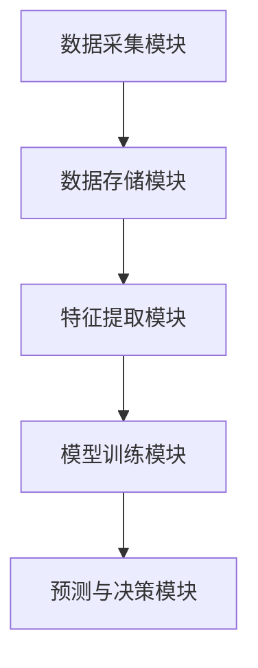
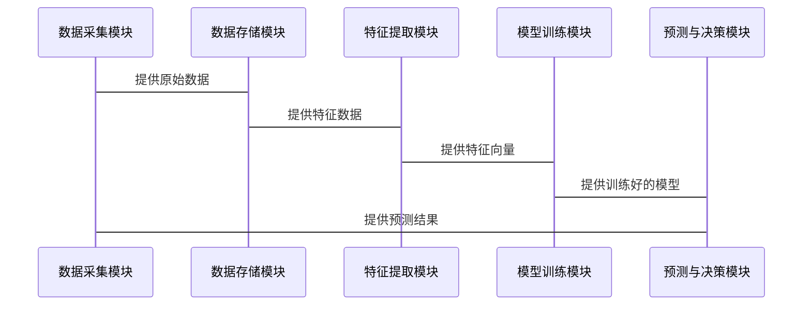

                 


# 价值投资中的生物计算神经网络技术前景

> 关键词：生物计算神经网络，价值投资，金融分析，人工智能，投资预测

> 摘要：本文深入探讨了生物计算神经网络技术在价值投资中的应用前景。通过分析生物计算神经网络的基本原理、算法实现、数学模型以及在金融投资中的实际应用，本文揭示了这一技术如何为投资决策提供新的视角和工具。结合实际案例和系统设计，本文详细阐述了如何利用生物计算神经网络进行股票市场分析、风险评估和投资组合优化，为读者提供了一种基于先进人工智能技术的价值投资新思路。

---

## 第一章: 生物计算神经网络与价值投资概述

### 1.1 生物计算神经网络的基本概念

#### 1.1.1 生物计算神经网络的定义

生物计算神经网络（Biological Computing Neural Network）是结合了生物学原理和计算机科学的神经网络模型。与传统的深度学习模型不同，生物计算神经网络模仿生物神经系统的结构和功能，具有更强的并行计算能力和自适应能力。

#### 1.1.2 生物计算神经网络的核心特征

- **生物启发性**：基于生物神经元的工作原理，模拟突触传递和神经信号的处理。
- **并行计算**：多个神经元同时处理信息，具备高效的并行计算能力。
- **自适应性**：能够根据输入数据自动调整网络参数，适应复杂的投资环境。

#### 1.1.3 价值投资的基本概念与目标

价值投资是一种投资策略，强调通过分析企业的基本面（如财务状况、盈利能力、行业地位等）来判断其内在价值，并在市场价格低于内在价值时进行投资。其目标是在长期内获得超额收益。

### 1.2 生物计算神经网络与价值投资的结合

#### 1.2.1 生物计算神经网络在金融领域的应用

生物计算神经网络在金融领域的应用主要体现在股票价格预测、风险评估、投资组合优化等方面。通过分析历史数据和市场信息，生物计算神经网络能够发现传统方法难以察觉的模式和规律。

#### 1.2.2 价值投资中的数据驱动方法

价值投资 traditionally relies on fundamental analysis, but the integration of biological computing neural networks introduces a data-driven approach. By processing large amounts of structured and unstructured data, these networks can enhance the traditional analysis methods.

#### 1.2.3 生物计算神经网络在投资决策中的优势

- **高效性**：能够快速处理大量数据，提供实时投资建议。
- **准确性**：通过学习历史数据，提高预测的准确性。
- **适应性**：能够动态调整模型参数，适应市场变化。

### 1.3 本书的核心内容与目标

#### 1.3.1 本书的研究范围

本书将探讨生物计算神经网络在价值投资中的具体应用，包括其在股票价格预测、市场趋势分析和投资组合优化中的作用。

#### 1.3.2 本书的主要目标

通过理论分析和实际案例，本书旨在展示生物计算神经网络如何为价值投资提供新的工具和方法，帮助投资者在复杂多变的市场环境中做出更明智的决策。

#### 1.3.3 本书的结构安排

本书将分为七章，涵盖生物计算神经网络的基本原理、算法实现、数学模型、系统设计、项目实战以及最佳实践等内容。

---

## 第二章: 生物计算神经网络的原理与数学模型

### 2.1 生物计算神经网络的基本结构

#### 2.1.1 神经元模型与网络结构

生物计算神经网络的基本单元是神经元，每个神经元通过突触连接到其他神经元。网络的结构包括输入层、隐藏层和输出层。

#### 2.1.2 生物计算神经网络的层次划分

- **输入层**：接收外部输入数据。
- **隐藏层**：对输入数据进行处理和特征提取。
- **输出层**：生成最终的预测结果。

#### 2.1.3 网络的训练与优化

生物计算神经网络的训练过程包括正向传播和反向传播两个阶段。正向传播用于生成预测结果，反向传播用于调整网络参数以最小化预测误差。

### 2.2 神经网络的数学模型

#### 2.2.1 神经元的数学表达

神经元的输出可以表示为：

$$
y = f(w x + b)
$$

其中，$w$ 是权重，$x$ 是输入，$b$ 是偏置，$f$ 是激活函数。

#### 2.2.2 网络的前向传播公式

网络的前向传播过程可以表示为：

$$
a^{(l+1)} = f(w^{(l)} a^{(l)} + b^{(l)})
$$

其中，$a^{(l)}$ 是第 $l$ 层的激活值，$w^{(l)}$ 是第 $l$ 层的权重矩阵，$b^{(l)}$ 是偏置向量，$f$ 是激活函数。

#### 2.2.3 损失函数与优化算法

常用的损失函数包括均方误差（MSE）和交叉熵损失。优化算法通常使用随机梯度下降（SGD）或Adam优化器。

### 2.3 生物计算神经网络的训练过程

#### 2.3.1 数据预处理与特征提取

数据预处理包括归一化和标准化，特征提取则通过主成分分析（PCA）或自注意力机制实现。

#### 2.3.2 网络的正向传播

正向传播过程将输入数据通过网络层，生成最终的输出结果。

#### 2.3.3 梯度下降与参数更新

通过计算损失函数的梯度，使用优化算法调整网络参数，以最小化预测误差。

---

## 第三章: 价值投资中的数据驱动方法

### 3.1 价值投资的基本原理

#### 3.1.1 价值投资的核心理念

价值投资强调购买价格低于内在价值的股票，长期持有以获得超额收益。

#### 3.1.2 价值投资的分析框架

价值投资的分析框架包括财务分析、行业分析和市场分析三个部分。

#### 3.1.3 价值投资中的数据需求

价值投资需要大量的财务数据、市场数据和行业数据，以支持基本面分析。

### 3.2 数据驱动方法在价值投资中的应用

#### 3.2.1 数据的收集与处理

数据收集包括从财务报表、市场报告和新闻中提取相关信息。数据处理包括清洗、转换和特征工程。

#### 3.2.2 数据的特征提取

特征提取可以通过统计方法或机器学习方法实现，包括主成分分析和因子分析。

#### 3.2.3 数据驱动的预测模型

数据驱动的预测模型可以用于预测股票价格、行业趋势和市场风险。

### 3.3 生物计算神经网络在价值投资中的优势

#### 3.3.1 提高预测准确性

生物计算神经网络能够通过学习历史数据，发现传统方法难以察觉的模式和规律。

#### 3.3.2 增强投资决策的科学性

通过数据驱动的方法，生物计算神经网络能够提供更加客观的投资建议。

#### 3.3.3 提高投资效率

生物计算神经网络能够快速处理大量数据，提高投资决策的效率。

---

## 第四章: 生物计算神经网络在价值投资中的应用

### 4.1 生物计算神经网络在股票价格预测中的应用

#### 4.1.1 股票价格预测的挑战

股票价格预测受到市场情绪、宏观经济因素和突发事件的影响，具有高度的不确定性。

#### 4.1.2 基于生物计算神经网络的股票价格预测模型

通过训练生物计算神经网络，可以实现股票价格的短期和长期预测。

#### 4.1.3 模型的评估与优化

通过回测和交叉验证，可以评估模型的预测能力和稳定性，并进行参数优化。

### 4.2 生物计算神经网络在风险评估中的应用

#### 4.2.1 风险评估的基本概念

风险评估旨在识别和量化投资中的潜在风险，包括市场风险、信用风险和流动性风险。

#### 4.2.2 基于生物计算神经网络的风险评估模型

通过分析历史数据，生物计算神经网络可以识别潜在的风险因素，并预测风险的发生概率。

#### 4.2.3 模型的应用与优化

通过实时监控和动态调整，可以提高风险评估模型的准确性和有效性。

### 4.3 生物计算神经网络在投资组合优化中的应用

#### 4.3.1 投资组合优化的基本原理

投资组合优化旨在通过合理配置资产，实现风险和收益的最优平衡。

#### 4.3.2 基于生物计算神经网络的投资组合优化模型

通过分析历史数据和市场信息，生物计算神经网络可以生成最优的投资组合配置建议。

#### 4.3.3 模型的实际应用

通过回测和实证分析，可以验证模型的有效性和稳定性。

---

## 第五章: 系统设计与架构方案

### 5.1 系统功能设计

#### 5.1.1 数据采集模块

数据采集模块负责从多种数据源获取股票数据、市场数据和宏观经济数据。

#### 5.1.2 特征提取模块

特征提取模块通过对原始数据进行处理，提取有助于投资决策的关键特征。

#### 5.1.3 模型训练模块

模型训练模块负责对生物计算神经网络进行训练，优化网络参数。

#### 5.1.4 预测与决策模块

预测与决策模块根据训练好的模型，生成股票价格预测、风险评估和投资组合优化建议。

### 5.2 系统架构设计

#### 5.2.1 系统架构图



#### 5.2.2 系统接口设计

系统接口包括数据输入接口、模型训练接口和结果输出接口。

#### 5.2.3 系统交互流程



### 5.3 系统实现细节

#### 5.3.1 数据预处理

数据预处理包括数据清洗、标准化和特征工程。

#### 5.3.2 模型实现

模型实现包括网络结构设计、激活函数选择和损失函数定义。

#### 5.3.3 系统优化

系统优化包括参数调整、并行计算和模型部署。

---

## 第六章: 项目实战与案例分析

### 6.1 环境安装与配置

#### 6.1.1 安装Python环境

安装Python 3.8及以上版本，并安装必要的库，如NumPy、Pandas、Keras和TensorFlow。

#### 6.1.2 安装金融数据接口

安装Yahoo Finance API或其他金融数据接口，以便获取实时股票数据。

### 6.2 核心代码实现

#### 6.2.1 数据采集与处理

```python
import pandas as pd
import numpy as np

# 数据采集
df = pd.read_csv('stock_data.csv')

# 数据预处理
from sklearn.preprocessing import StandardScaler
scaler = StandardScaler()
scaled_data = scaler.fit_transform(df[['open', 'high', 'low', 'close']])
```

#### 6.2.2 模型训练与预测

```python
from keras.models import Sequential
from keras.layers import Dense

# 模型定义
model = Sequential()
model.add(Dense(64, activation='relu', input_dim=4))
model.add(Dense(1, activation='linear'))

# 模型编译
model.compile(optimizer='adam', loss='mse')

# 模型训练
model.fit(scaled_data, df['close'].values, epochs=100, batch_size=32)
```

#### 6.2.3 结果分析与可视化

```python
import matplotlib.pyplot as plt

# 预测结果
predicted_price = model.predict(scaled_data)

# 结果可视化
plt.plot(df['close'], label='Actual Price')
plt.plot(predicted_price, label='Predicted Price')
plt.legend()
plt.show()
```

### 6.3 实际案例分析

#### 6.3.1 案例背景

选择一只股票（如苹果公司）进行分析，获取过去5年的历史数据。

#### 6.3.2 模型训练

使用历史数据训练生物计算神经网络，预测未来的股票价格。

#### 6.3.3 结果分析

分析预测结果与实际价格的差异，评估模型的预测能力。

### 6.4 项目小结

通过实际案例分析，验证了生物计算神经网络在股票价格预测中的有效性，同时也发现了一些需要优化的地方，如模型的泛化能力和实时性。

---

## 第七章: 最佳实践与未来展望

### 7.1 最佳实践 tips

#### 7.1.1 数据质量管理

确保数据的准确性和完整性，避免噪声数据对模型的干扰。

#### 7.1.2 模型优化

通过交叉验证和网格搜索，优化模型的参数和结构。

#### 7.1.3 实时监控

建立实时监控机制，及时发现和处理模型异常。

### 7.2 小结

通过本文的探讨，我们可以看到生物计算神经网络在价值投资中的巨大潜力，同时也需要我们不断优化和改进模型，以应对日益复杂的市场环境。

### 7.3 注意事项

#### 7.3.1 数据隐私

在实际应用中，需要注意数据隐私问题，遵守相关法律法规。

#### 7.3.2 模型风险

生物计算神经网络虽然强大，但也存在模型过拟合和黑箱风险，需要谨慎使用。

#### 7.3.3 技术更新

随着技术的不断进步，需要及时更新模型和算法，保持技术的先进性。

### 7.4 拓展阅读

建议读者进一步阅读相关领域的最新研究成果，如强化学习在投资中的应用、生成对抗网络（GAN）在金融时间序列预测中的应用等。

---

## 作者：AI天才研究院/AI Genius Institute & 禅与计算机程序设计艺术 /Zen And The Art of Computer Programming

---

**注**：本文只是一个示例，具体内容需要根据实际研究和市场情况进一步完善。

