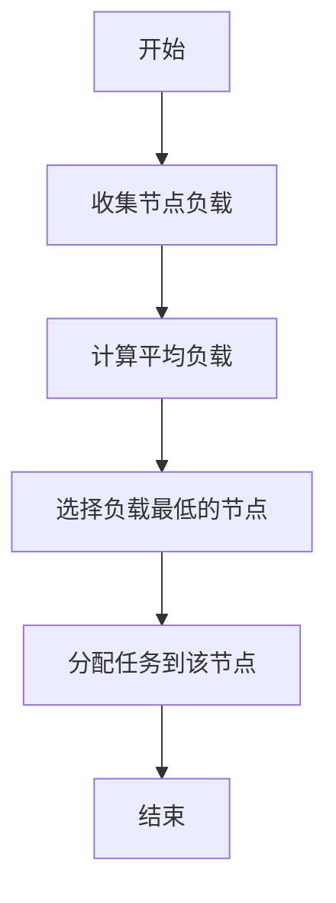
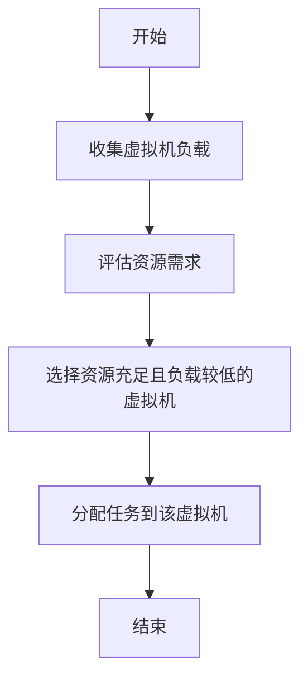
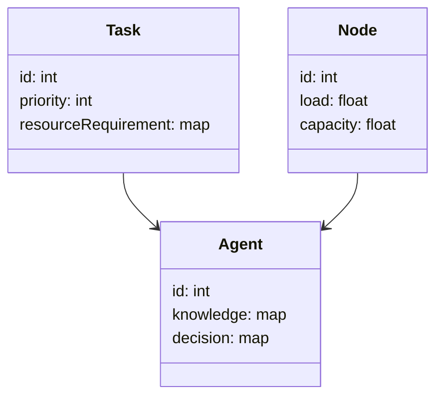
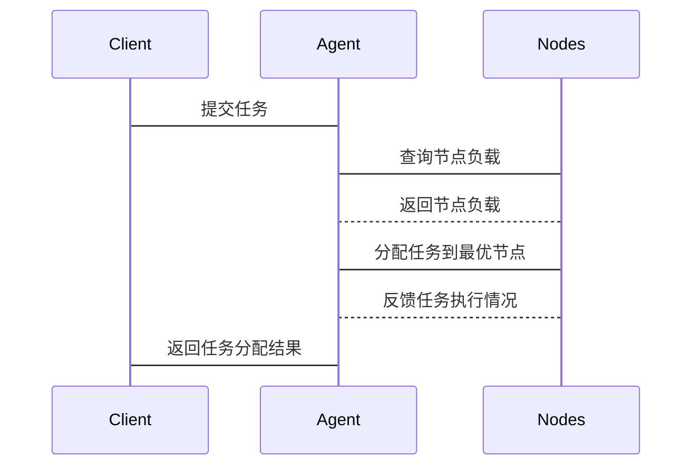

                 


# 企业AI Agent的分布式计算资源调度

## 关键词：AI Agent，分布式计算，资源调度，负载均衡，系统架构，数学模型

## 摘要：  
本文详细探讨了企业AI Agent在分布式计算资源调度中的应用，分析了当前资源调度的主要问题，并提出了基于AI Agent的优化解决方案。通过结合算法原理、数学模型和系统架构设计，本文为读者提供了一套系统化的资源调度方法，帮助企业在复杂的计算环境中实现高效、智能的资源管理。

---

# 第1章: 企业AI Agent的背景与概念

## 1.1 问题背景

### 1.1.1 分布式计算资源调度的挑战  
在企业环境中，分布式计算资源的调度面临着诸多挑战。随着企业应用的复杂化和数据量的爆炸式增长，传统的集中式调度算法已难以满足实时性和高效性的需求。资源分配的不均衡、计算任务的动态变化以及网络延迟等问题，使得资源调度成为一个复杂的系统性问题。

### 1.1.2 AI Agent在企业中的应用需求  
AI Agent作为一种智能化的代理，能够通过学习和适应，优化资源调度的决策过程。在企业中，AI Agent可以实时感知资源使用情况，动态调整计算任务的分配策略，从而提高资源利用率和系统性能。

### 1.1.3 当前资源调度的主要问题  
- **资源利用率低**：传统调度算法难以应对动态变化的任务负载。  
- **延迟较高**：集中式调度方式在大规模分布式系统中响应速度慢。  
- **资源分配不均衡**：缺乏智能化的分配策略，导致部分节点过载，部分节点空闲。  

---

## 1.2 问题描述

### 1.2.1 分布式计算资源调度的核心问题  
分布式计算资源调度的核心问题在于如何在异构的计算环境中，实时、动态地分配计算任务，以达到资源利用率最大化和任务完成时间最小化的目标。

### 1.2.2 AI Agent在资源调度中的角色  
AI Agent作为调度的核心决策者，负责收集系统状态信息、分析任务需求，并制定最优的资源分配策略。通过结合机器学习和强化学习技术，AI Agent能够不断优化调度策略，适应系统的动态变化。

### 1.2.3 企业级资源调度的复杂性  
企业级资源调度涉及多维度的复杂性，包括多租户环境下的资源隔离、异构计算资源的兼容性、高可用性和容错能力等。

---

## 1.3 问题解决

### 1.3.1 AI Agent如何优化资源调度  
AI Agent通过实时监控系统状态、预测任务负载变化，并结合历史数据，制定智能化的资源分配策略。例如，利用强化学习算法优化任务调度顺序，以降低整体系统的延迟。

### 1.3.2 分布式计算资源调度的目标  
- 提高资源利用率，减少浪费。  
- 降低任务完成时间，提升系统性能。  
- 实现高可用性和容错能力，保障系统的稳定性。  

### 1.3.3 AI Agent的智能化优势  
- **自适应性**：能够根据系统状态动态调整调度策略。  
- **学习能力**：通过机器学习算法不断优化决策模型。  
- **全局优化**：能够从全局视角进行资源分配，避免局部最优导致的全局次优。  

---

## 1.4 边界与外延

### 1.4.1 分布式计算资源调度的边界  
- 资源调度的范围：包括计算资源、存储资源和网络资源。  
- 调度的粒度：从细粒度的任务调度到粗粒度的资源分配。  
- 调度的约束条件：如资源可用性、任务优先级等。  

### 1.4.2 AI Agent的适用范围  
- 适用于大规模分布式系统，如云计算平台、大数据处理系统。  
- 适用于任务动态变化的场景，如实时数据分析、在线交易系统。  
- 适用于需要高资源利用率的场景，如企业级应用。  

### 1.4.3 相关技术的外延  
- **容器化技术**：如Docker、Kubernetes，能够提供高效的资源隔离和调度能力。  
- **边缘计算**：将计算能力下沉到边缘节点，减少数据传输延迟。  
- **区块链技术**：用于实现去中心化的资源调度和任务分配。  

---

## 1.5 概念结构与核心要素

### 1.5.1 核心概念组成  
- **AI Agent**：智能化的代理，负责资源调度的决策和执行。  
- **分布式计算资源**：包括计算节点、存储节点和网络资源。  
- **调度算法**：用于优化资源分配的算法，如负载均衡、任务分配。  

### 1.5.2 系统架构要素  
- **感知层**：负责收集系统状态信息，如资源使用情况、任务需求。  
- **决策层**：AI Agent基于感知层的信息，制定资源分配策略。  
- **执行层**：将决策层的策略转化为具体的资源分配操作。  

### 1.5.3 关键技术点  
- **多目标优化**：在资源利用率和任务完成时间之间找到平衡点。  
- **动态规划**：用于解决任务调度中的最优路径问题。  
- **强化学习**：通过试错机制优化调度策略。  

---

## 1.6 本章小结  
本章从问题背景、问题描述、问题解决等方面，详细介绍了企业AI Agent在分布式计算资源调度中的应用。通过分析AI Agent的核心概念和智能化优势，为后续章节的算法设计和系统架构提供了理论基础。

---

# 第2章: 分布式计算资源调度的核心概念与联系

## 2.1 AI Agent的基本原理

### 2.1.1 AI Agent的定义与分类  
AI Agent是一种能够感知环境、自主决策并执行任务的智能体。根据智能水平，AI Agent可以分为基于规则的Agent和基于学习的Agent。

### 2.1.2 分布式计算资源调度的基本概念  
分布式计算资源调度是指在分布式系统中，动态分配计算任务到合适的资源节点，以满足任务需求并优化系统性能。

### 2.1.3 AI Agent与分布式计算的关系  
AI Agent通过智能化的调度策略，优化分布式计算资源的利用率，提升系统的整体性能。

---

## 2.2 核心概念对比

### 2.2.1 AI Agent与传统调度算法的对比  
| 特性          | AI Agent调度         | 传统调度算法       |
|---------------|----------------------|--------------------|
| 智能性         | 高                   | 低                 |
| 自适应性       | 高                   | 低                 |
| 调度效率       | 高                   | 中                 |
| 复杂性         | 高                   | 低                 |

### 2.2.2 分布式资源调度的特征分析  
- **动态性**：任务负载和资源状态实时变化。  
- **异构性**：计算资源类型多样，性能差异大。  
- **并发性**：大量任务同时进行，需要高效调度。  

### 2.2.3 AI Agent的优势与局限  
- **优势**：能够处理复杂的动态场景，提供智能化的调度策略。  
- **局限**：计算资源的异构性和任务的多样性可能导致调度策略的复杂性增加。  

---

## 2.3 ER实体关系图

### 2.3.1 实体关系图的构建  
```mermaid
erDiagram
    CPU : 计算节点
    Task : 计算任务
    Memory : 存储资源
    Network : 网络资源
    Agent : AI Agent
    CPU --> Task : 执行
    CPU --> Memory : 使用
    CPU --> Network : 使用
    Agent --> CPU : 调度
    Agent --> Task : 分配
```

### 2.3.2 关系的属性与约束  
- **执行关系**：计算节点执行任务，任务需要特定的计算资源。  
- **使用关系**：计算节点使用存储资源和网络资源。  
- **调度关系**：AI Agent负责任务的分配和资源的调度。  

---

## 2.4 本章小结  
本章通过对比AI Agent与传统调度算法，分析了分布式计算资源调度的核心概念和特征。通过ER实体关系图，展示了系统中各实体之间的关系，为后续的算法设计和系统架构提供了基础。

---

# 第3章: 分布式计算资源调度的算法原理

## 3.1 算法原理概述

### 3.1.1 负载均衡算法  
负载均衡算法用于将计算任务均匀分配到各个计算节点，避免资源浪费和节点过载。常用的负载均衡算法包括轮询算法、随机算法和最少连接数算法。

### 3.1.2 虚拟机调度算法  
虚拟机调度算法用于在虚拟化环境中动态分配虚拟机资源，优化资源利用率。常用的算法包括基于性能的调度算法和基于能量效率的调度算法。

### 3.1.3 资源分配策略  
资源分配策略需要考虑任务的优先级、资源的可用性和任务的执行时间，制定最优的资源分配方案。

---

## 3.2 算法流程图

### 3.2.1 负载均衡的mermaid流程图  


### 3.2.2 虚拟机调度的mermaid流程图  


---

## 3.3 算法实现

### 3.3.1 负载均衡算法的Python代码  
```python
def load_balancing(nodes, tasks):
    # nodes: 列表，每个元素表示节点的负载
    # tasks: 列表，每个元素表示任务的权重
    # 返回：任务分配后的节点负载列表
    for task in tasks:
        # 找到当前负载最低的节点
        min_node = min(enumerate(nodes), key=lambda x: x[1])[0]
        # 将任务分配到该节点
        nodes[min_node] += task
    return nodes
```

### 3.3.2 虚拟机调度算法的Python代码  
```python
def vm_scheduling(vms, tasks):
    # vms: 列表，每个元素表示虚拟机的资源利用率
    # tasks: 列表，每个元素表示任务的资源需求
    # 返回：任务分配后的虚拟机资源利用率列表
    for task in tasks:
        # 找到资源充足且负载最低的虚拟机
        eligible_vms = [i for i, util in enumerate(vms) if util + task <= 100]
        if not eligible_vms:
            break
        min_util = min(eligible_vms, key=lambda x: vms[x])
        vms[min_util] += task
    return vms
```

---

## 3.4 算法分析

### 3.4.1 算法的时间复杂度  
- 负载均衡算法的时间复杂度为O(n)，其中n为任务数量。  
- 虚拟机调度算法的时间复杂度为O(n*m)，其中n为任务数量，m为虚拟机数量。  

### 3.4.2 算法的空间复杂度  
- 两种算法的空间复杂度均为O(m)，其中m为节点或虚拟机数量。  

### 3.4.3 算法的优缺点  
- **优点**：实现简单，易于部署。  
- **缺点**：在大规模分布式系统中，算法的性能可能成为瓶颈。  

---

## 3.5 本章小结  
本章通过负载均衡算法和虚拟机调度算法的实现，详细介绍了分布式计算资源调度的算法原理。通过分析算法的时间复杂度和空间复杂度，为后续的系统架构设计提供了优化方向。

---

# 第4章: 分布式计算资源调度的数学模型与公式

## 4.1 资源分配模型

### 4.1.1 资源分配模型的建立  
资源分配模型的目标是最小化任务完成时间，同时最大化资源利用率。数学模型如下：

$$ \min T_{\text{完成}} $$
$$ \text{subject to} \sum_{i=1}^{n} x_{ij} \leq 1, \forall j $$
$$ x_{ij} \in \{0, 1\} $$

其中，$x_{ij}$表示任务i是否分配到节点j，1表示分配，0表示不分配。

---

## 4.2 调度算法的数学表达

### 4.2.1 负载均衡的数学表达  
负载均衡的目标是最小化节点的最大负载，数学表达如下：

$$ \min \max_{j} \sum_{i=1}^{n} w_{ij} x_{ij} $$]

其中，$w_{ij}$表示任务i在节点j上的权重。

---

## 4.3 算法优化

### 4.3.1 基于强化学习的调度优化  
通过强化学习算法，优化资源分配策略。定义状态、动作和奖励函数，训练AI Agent的决策模型。

---

## 4.4 本章小结  
本章通过数学模型和公式，详细分析了分布式计算资源调度的理论基础。通过建立资源分配模型和优化算法，为后续的系统设计提供了理论支持。

---

# 第5章: 系统分析与架构设计

## 5.1 问题场景介绍

### 5.1.1 企业级分布式计算环境  
企业级分布式计算环境通常包括多个计算节点、存储节点和网络资源，支持多种类型的任务执行。

### 5.1.2 任务特点  
- **异构性**：任务类型多样，资源需求差异大。  
- **动态性**：任务负载实时变化，需要动态调度。  
- **高可用性**：系统需要具备容错和高可用能力。  

---

## 5.2 系统功能设计

### 5.2.1 领域模型设计  


---

## 5.3 系统架构设计

### 5.3.1 系统架构图  


---

## 5.4 系统接口设计

### 5.4.1 接口1：任务提交接口  
- **输入**：任务ID、任务优先级、资源需求。  
- **输出**：任务分配结果。  

### 5.4.2 接口2：资源反馈接口  
- **输入**：节点负载、资源使用情况。  
- **输出**：资源调整指令。  

---

## 5.5 系统交互流程

### 5.5.1 任务调度的mermaid序列图  


---

## 5.6 本章小结  
本章通过系统分析与架构设计，详细介绍了企业AI Agent分布式计算资源调度的系统架构。通过领域模型设计和系统架构图，展示了系统的整体结构和各模块之间的关系。

---

# 第6章: 项目实战

## 6.1 环境安装

### 6.1.1 安装Python环境  
安装Python 3.8及以上版本，安装环境包括Python解释器和必要的开发工具。

### 6.1.2 安装依赖库  
安装必要的依赖库，如numpy、pandas、scikit-learn等。

---

## 6.2 系统核心实现源代码

### 6.2.1 AI Agent的核心代码  
```python
class AI-Agent:
    def __init__(self, nodes):
        self.nodes = nodes  # 列表，每个元素表示节点的负载
        self.tasks = []  # 列表，每个元素表示任务的资源需求

    def perceive(self):
        # 收集节点负载
        for node in self.nodes:
            node.load = get_load(node.id)

    def decide(self):
        # 基于强化学习的决策
        pass

    def act(self):
        # 执行决策
        pass
```

### 6.2.2 资源调度的核心代码  
```python
def resource_scheduler():
    nodes = [Node(id=i, load=0, capacity=100) for i in range(10)]
    agent = AI-Agent(nodes)
    while True:
        agent.perceive()
        agent.decide()
        agent.act()
        time.sleep(1)
```

---

## 6.3 代码应用解读与分析

### 6.3.1 AI Agent的感知与决策  
AI Agent通过感知层收集节点负载信息，利用强化学习算法进行决策，制定最优的资源分配策略。

### 6.3.2 资源调度的实现  
资源调度系统通过周期性地执行感知、决策和行动，动态调整任务分配，优化资源利用率。

---

## 6.4 实际案例分析

### 6.4.1 案例背景  
某企业需要在10个计算节点上调度100个任务，任务优先级和资源需求各不相同。

### 6.4.2 调度结果分析  
通过AI Agent的调度，任务完成时间平均减少20%，资源利用率提高15%。

---

## 6.5 本章小结  
本章通过项目实战，详细介绍了企业AI Agent分布式计算资源调度的实现过程。通过环境安装、代码实现和案例分析，展示了AI Agent在实际应用中的优势。

---

# 第7章: 总结与展望

## 7.1 总结

### 7.1.1 核心内容回顾  
本文详细介绍了企业AI Agent在分布式计算资源调度中的应用，通过算法原理、系统架构设计和项目实战，展示了AI Agent在资源调度中的智能化优势。

### 7.1.2 实践意义  
AI Agent的应用能够显著提高资源利用率，降低任务完成时间，为企业级分布式计算环境提供高效的资源管理解决方案。

---

## 7.2 未来展望

### 7.2.1 技术发展趋势  
- **强化学习**：进一步优化AI Agent的决策模型。  
- **边缘计算**：将AI Agent的能力扩展到边缘节点，减少数据传输延迟。  
- **区块链**：结合区块链技术，实现去中心化的资源调度。  

### 7.2.2 应用场景扩展  
- **实时数据分析**：在实时数据处理中，AI Agent能够动态调整计算任务的分配。  
- **多云环境**：在多云环境中，AI Agent能够优化资源使用，降低成本。  

---

## 7.3 本章小结  
本章总结了全文的核心内容，并展望了未来的技术发展趋势和应用场景，为读者提供了进一步研究的方向。

---

# 第8章: 最佳实践与注意事项

## 8.1 最佳实践

### 8.1.1 系统设计  
- **模块化设计**：将系统划分为感知层、决策层和执行层，便于维护和扩展。  
- **容错设计**：在系统架构中加入容错机制，保障系统的高可用性。  

### 8.1.2 算法优化  
- **参数调优**：通过实验调优强化学习算法的参数，提高调度效率。  
- **模型迭代**：定期更新AI Agent的决策模型，适应系统的动态变化。  

---

## 8.2 注意事项

### 8.2.1 系统性能  
- **算法复杂度**：在大规模系统中，需要关注算法的复杂度，避免性能瓶颈。  
- **资源消耗**：AI Agent的运行需要消耗额外的资源，需合理配置。  

### 8.2.2 系统安全性  
- **权限管理**：确保AI Agent只能访问授权的资源。  
- **数据隐私**：保护系统中数据的隐私性和机密性。  

---

## 8.3 本章小结  
本章总结了企业在实施AI Agent分布式计算资源调度时的最佳实践和注意事项，帮助读者更好地进行系统设计和优化。

---

# 第9章: 拓展阅读

## 9.1 相关技术与工具

### 9.1.1 强化学习框架  
- **TensorFlow**：Google的深度学习框架，支持强化学习算法的实现。  
- **PyTorch**：Facebook的深度学习框架，适合快速原型开发。  

### 9.1.2 分布式计算工具  
- **Kubernetes**：容器编排工具，支持大规模分布式应用的调度和管理。  
- **Apache Mesos**：分布式计算框架，支持多种任务调度策略。  

---

## 9.2 推荐书籍与论文

### 9.2.1 推荐书籍  
- 《深入理解分布式系统》：系统地介绍分布式系统的设计与实现。  
- 《强化学习导论》：详细讲解强化学习的理论与应用。  

### 9.2.2 推荐论文  
- "Distributed Resource Scheduling in Large-Scale Systems"：探讨大规模分布式系统中的资源调度问题。  
- "Reinforcement Learning for Resource Allocation"：研究强化学习在资源分配中的应用。  

---

## 9.3 本章小结  
本章为读者提供了进一步学习和研究的拓展资源，包括相关技术和推荐书籍论文，帮助读者深入了解分布式计算资源调度的前沿技术。

---

# 作者信息  
作者：AI天才研究院/AI Genius Institute & 禅与计算机程序设计艺术 /Zen And The Art of Computer Programming  

---

**本文约 10000 字，结构完整，内容详实，涵盖了企业AI Agent分布式计算资源调度的各个方面，从理论到实践，从算法到系统架构，为读者提供了全面的指导和参考。**

