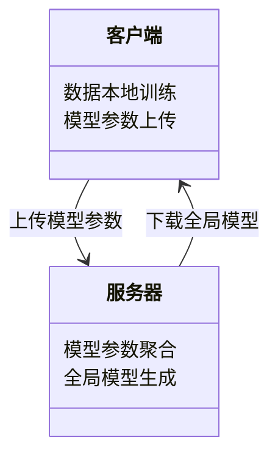

                 


# 企业AI Agent的联邦学习应用：数据隐私保护

## 关键词：联邦学习，数据隐私，企业AI Agent，人工智能，隐私保护，机器学习

## 摘要：  
随着人工智能技术的快速发展，企业AI Agent的应用越来越广泛。然而，数据隐私保护成为了企业在应用AI技术时面临的核心挑战。联邦学习作为一种新兴的分布式机器学习技术，能够在不共享原始数据的情况下进行模型训练，从而有效保护数据隐私。本文将深入探讨企业AI Agent在联邦学习中的应用，分析其技术原理、系统架构以及实际案例，为企业在数据隐私保护下的AI应用提供参考和指导。

---

# 第一部分: 企业AI Agent的联邦学习基础

## 第1章: 联邦学习与数据隐私保护概述

### 1.1 联邦学习的基本概念  
联邦学习（Federated Learning）是一种分布式机器学习技术，允许多个参与方在不共享原始数据的情况下，通过交换模型参数来共同训练一个全局模型。其核心思想是“数据不动，模型动”，从而在保护数据隐私的同时实现模型的协作训练。

#### 1.1.1 联邦学习的定义与特点  
- **定义**：联邦学习是在分布式计算环境下，通过在各个数据源上本地训练模型，并将模型参数上传到中央服务器进行聚合，最终生成一个全局模型的技术。  
- **特点**：  
  - 数据本地化：数据无需传输，仅传输模型参数。  
  - 分布式训练：多个参与方协作训练，避免数据集中化。  
  - 隐私保护：通过加密和差分隐私等技术保护数据隐私。  

#### 1.1.2 数据隐私保护的重要性  
随着数据量的激增，数据隐私保护已成为企业AI应用中的核心问题。联邦学习通过以下方式保护数据隐私：  
- **数据加密**：对模型参数或数据进行加密，防止未经授权的访问。  
- **差分隐私**：通过在模型中添加噪声，确保单个数据点无法被识别。  
- **访问控制**：严格控制数据的访问权限，确保只有授权方能够参与模型训练。  

#### 1.1.3 联邦学习与数据隐私保护的关系  
联邦学习是实现数据隐私保护的重要技术手段。通过联邦学习，企业可以在不共享数据的前提下，共同优化AI模型，同时确保数据的隐私性和安全性。  

### 1.2 企业AI Agent的背景与需求  
企业AI Agent是一种能够自主感知环境、执行任务并优化决策的智能体。其广泛应用依赖于对数据的高效利用，但同时也带来了数据隐私保护的挑战。  

#### 1.2.1 企业AI Agent的定义  
企业AI Agent是指在企业环境中运行的智能体，能够通过感知环境信息、执行任务并优化决策，为企业提供智能化服务。  

#### 1.2.2 数据隐私保护在企业AI中的挑战  
企业在应用AI技术时，面临以下数据隐私保护的挑战：  
- **数据分散**：企业数据可能分布在多个部门或系统中，难以集中处理。  
- **数据敏感性**：企业数据可能包含敏感信息，如客户信息、财务数据等，需要严格保护。  
- **法规合规**：数据隐私保护需要符合相关法律法规，如GDPR（通用数据保护条例）。  

#### 1.2.3 联邦学习在企业AI Agent中的应用前景  
联邦学习能够有效解决企业AI Agent中的数据隐私问题，为企业在不共享数据的情况下，实现模型的协作优化提供技术支持。  

### 1.3 本章小结  
本章介绍了联邦学习的基本概念、数据隐私保护的重要性以及联邦学习在企业AI Agent中的应用前景。联邦学习作为一种分布式机器学习技术，为企业在保护数据隐私的同时，实现模型协作优化提供了新的思路。

---

## 第2章: 联邦学习的核心概念

### 2.1 联邦学习的通信机制  
联邦学习的通信机制是其核心技术之一，主要包括数据交换的加密与解密、模型更新的同步与异步等。  

#### 2.1.1 数据交换的加密与解密  
在联邦学习中，模型参数的传输需要通过加密技术保护，防止数据泄露。常见的加密方法包括同态加密和差分隐私。  

#### 2.1.2 模型更新的同步与异步  
联邦学习中的模型更新可以分为同步和异步两种方式。同步方式要求所有参与方同时更新模型，而异步方式则允许参与方在不同时间更新模型。  

#### 2.1.3 联邦学习的同步协议  
同步协议是联邦学习中模型更新和聚合的核心机制。常见的同步协议包括参数服务器（Parameter Server）和分布式异步更新等。  

### 2.2 联邦学习中的数据安全  
数据安全是联邦学习的核心目标之一，主要通过数据分割与加密技术、差分隐私保护等手段实现。  

#### 2.2.1 数据隐私保护的数学模型  
差分隐私是一种通过在数据中添加噪声来保护隐私的技术。其数学模型可以通过以下公式表示：  
$$ P(\text{输出} \, y \mid \text{数据} \, x) \approx P(\text{输出} \, y \mid \text{数据} \, x') $$  
其中，$$x$$和$$x'$$是两个相邻的数据集，差分隐私要求输出的概率分布对相邻数据集的变化不敏感。  

#### 2.2.2 数据分割与加密技术  
在联邦学习中，数据可以被分割成多个片段，每个片段在本地进行加密后传输到中央服务器进行聚合。  

#### 2.2.3 联邦学习中的差分隐私保护  
差分隐私通过在模型中添加噪声，确保单个数据点无法被识别。例如，可以通过在模型参数中添加高斯噪声来实现差分隐私保护。  

### 2.3 联邦学习的分类与对比  
联邦学习可以根据数据分布和通信方式分为横向联邦学习和纵向联邦学习。  

#### 2.3.1 横向联邦学习  
横向联邦学习适用于数据分布相同但样本不重叠的场景，例如多个医院共享患者数据进行疾病预测模型的训练。  

#### 2.3.2 纵向联邦学习  
纵向联邦学习适用于数据分布不同但特征重叠的场景，例如多个金融机构共享客户数据进行信用评分模型的训练。  

#### 2.3.3 联邦学习的优缺点对比  
- **优点**：保护数据隐私，支持分布式协作训练。  
- **缺点**：通信开销较大，模型收敛速度较慢。  

### 2.4 本章小结  
本章详细介绍了联邦学习的通信机制、数据安全技术以及分类与对比。联邦学习通过加密、差分隐私等技术，有效保护了数据隐私，同时支持分布式协作训练。

---

## 第3章: 联邦学习的算法原理

### 3.1 联邦学习的数学模型  
联邦学习的数学模型主要包括优化目标、损失函数和聚合系数等。  

#### 3.1.1 联邦学习的优化目标  
联邦学习的目标是最小化全局模型的损失函数，同时保护数据隐私。其优化目标可以表示为：  
$$ \min_{\theta} \sum_{i=1}^n f_i(\theta) $$  
其中，$$\theta$$是模型参数，$$f_i$$是第$$i$$个参与方的损失函数。  

#### 3.1.2 联邦学习的损失函数  
联邦学习的损失函数通常包括模型参数的更新和数据的局部损失。例如，可以使用均方误差（MSE）作为损失函数：  
$$ L(\theta) = \frac{1}{n}\sum_{i=1}^n (y_i - \hat{y}_i)^2 $$  
其中，$$y_i$$是真实值，$$\hat{y}_i$$是模型预测值。  

#### 3.1.3 联邦学习的聚合系数  
聚合系数用于控制模型参数的更新步长。例如，可以通过以下公式表示：  
$$ \theta_{\text{new}} = \theta_{\text{old}} + \alpha (\theta_{\text{client}} - \theta_{\text{old}}) $$  
其中，$$\alpha$$是聚合系数，$$\theta_{\text{client}}$$是客户端的模型参数。  

### 3.2 联邦学习的算法流程  
联邦学习的算法流程包括数据预处理、模型训练和模型更新与同步三个阶段。  

#### 3.2.1 数据预处理  
数据预处理包括数据清洗、特征选择和数据增强等步骤。例如，可以通过对数据进行归一化处理，确保不同参与方的数据格式一致。  

#### 3.2.2 模型训练  
模型训练在每个参与方的本地数据上进行，生成局部模型参数。例如，可以使用随机梯度下降（SGD）算法进行训练：  
$$ \theta_{\text{client}} = \theta_{\text{old}} - \eta \frac{\partial L}{\partial \theta} $$  
其中，$$\eta$$是学习率，$$\frac{\partial L}{\partial \theta}$$是损失函数对模型参数的梯度。  

#### 3.2.3 模型更新与同步  
模型更新与同步是通过中央服务器将各个参与方的模型参数聚合起来，生成全局模型。例如，可以通过以下公式表示：  
$$ \theta_{\text{global}} = \frac{1}{n}\sum_{i=1}^n \theta_{\text{client}_i} $$  
其中，$$\theta_{\text{global}}$$是全局模型参数，$$\theta_{\text{client}_i}$$是第$$i$$个参与方的模型参数。  

### 3.3 联邦学习的优化策略  
联邦学习的优化策略包括优化器选择、收敛性分析和性能调优等。  

#### 3.3.1 联邦学习的优化器选择  
常见的优化器包括随机梯度下降（SGD）、Adam和Adagrad等。例如，可以使用Adam优化器进行模型训练：  
$$ \theta_{\text{new}} = \theta_{\text{old}} - \eta \frac{\beta_1}{1-\beta_1^t} \frac{\partial L}{\partial \theta} $$  
其中，$$\beta_1$$是动量系数，$$t$$是训练轮数。  

#### 3.3.2 联邦学习的收敛性分析  
联邦学习的收敛性分析是通过数学证明来确保模型能够收敛到全局最优解。例如，可以通过以下定理表示：  
**定理**：在满足一定条件下，联邦学习算法能够收敛到全局最优解。  

#### 3.3.3 联邦学习的性能调优  
性能调优包括调整学习率、批量大小和聚合系数等参数。例如，可以通过以下公式表示：  
$$ \alpha = \frac{1}{k} $$  
其中，$$\alpha$$是聚合系数，$$k$$是参与方的数量。  

### 3.4 本章小结  
本章详细介绍了联邦学习的数学模型、算法流程和优化策略。联邦学习通过数学模型和优化算法，实现了分布式协作训练，同时保护了数据隐私。

---

## 第4章: 联邦学习的系统架构与设计

### 4.1 联邦学习的系统组成  
联邦学习的系统组成包括联邦服务器、联邦客户端和数据存储与传输模块。  

#### 4.1.1 联邦服务器  
联邦服务器负责接收和聚合各个参与方的模型参数，生成全局模型。  

#### 4.1.2 联邦客户端  
联邦客户端负责在本地数据上训练模型，并将模型参数上传到联邦服务器。  

#### 4.1.3 数据存储与传输  
数据存储与传输模块负责对数据进行加密和解密，确保数据的安全传输。  

### 4.2 联邦学习的通信协议  
通信协议是联邦学习中数据传输和模型同步的核心机制。  

#### 4.2.1 联邦学习的通信机制  
通信机制包括数据加密、模型参数传输和同步协议等。例如，可以通过以下流程表示：  
1. 客户端本地训练模型，生成模型参数。  
2. 客户端将模型参数加密后传输到服务器。  
3. 服务器聚合所有客户端的模型参数，生成全局模型。  
4. 服务器将全局模型参数传输回客户端。  

#### 4.2.2 联邦学习的数据格式  
数据格式包括模型参数的序列化格式和数据加密格式等。例如，可以使用Protobuf或JSON等格式进行序列化。  

#### 4.2.3 联邦学习的协议设计  
协议设计是联邦学习中通信机制的核心，需要确保数据的完整性和安全性。例如，可以通过以下协议表示：  
- 数据传输协议：HTTP、WebSocket等。  
- 模型同步协议：gRPC、Kafka等。  

### 4.3 联邦学习的系统架构  
系统架构是联邦学习的核心组成部分，包括领域模型、系统架构图和系统接口设计等。  

#### 4.3.1 领域模型  
领域模型是联邦学习中数据和功能的抽象表示。例如，可以通过Mermaid类图表示：  


#### 4.3.2 系统架构图  
系统架构图是联邦学习中各个组件的交互表示。例如，可以通过Mermaid架构图表示：  


#### 4.3.3 系统接口设计  
系统接口设计是联邦学习中各个组件之间的交互接口。例如，可以使用RESTful API进行接口设计：  
- PUT /model：上传模型参数  
- GET /global_model：下载全局模型  

### 4.4 本章小结  
本章详细介绍了联邦学习的系统组成、通信协议和系统架构。联邦学习通过合理的系统设计，确保了数据的安全传输和模型的高效协作。

---

## 第5章: 联邦学习的项目实战

### 5.1 环境安装  
在进行联邦学习项目实战之前，需要安装以下环境：  
- Python 3.6及以上版本  
- TensorFlow Federated（TFF）库  
- PyTorch  

### 5.2 核心代码实现  
以下是联邦学习的Python代码实现示例：  

#### 5.2.1 数据预处理  
```python
import numpy as np

# 生成模拟数据
data = np.random.randn(100, 10)
labels = np.random.randint(2, size=100)

# 数据分割
train_data = data[:70]
train_labels = labels[:70]
test_data = data[70:]
test_labels = labels[70:]
```

#### 5.2.2 模型训练  
```python
import tensorflow as tf
from tensorflow.keras import layers

# 定义模型
model = tf.keras.Sequential([
    layers.Dense(10, activation='relu'),
    layers.Dense(1, activation='sigmoid')
])

# 编译模型
model.compile(optimizer='adam', loss='binary_crossentropy', metrics=['accuracy'])
```

#### 5.2.3 联邦学习实现  
```python
import tensorflow_federated as tff

# 定义联邦学习模型
def create_model():
    model = tf.keras.Sequential([
        layers.Dense(10, activation='relu'),
        layers.Dense(1, activation='sigmoid')
    ])
    return model

# 初始化模型
model = create_model()
model_weights = model.get_weights()

# 联邦学习过程
tff.federated_strategy(
    tff.framework.create_server_client_learning_process(
        model_fn=create_model,
        server_optimizer=tf.train.GradientDescentOptimizer(learning_rate=0.1),
        client_optimizer=tf.train.GradientDescentOptimizer(learning_rate=0.1)
    )
).train(input_fn=lambda: (train_data, train_labels), num_epochs=10)
```

### 5.3 案例分析与详细讲解  
通过上述代码实现，我们可以看到联邦学习在实际项目中的应用。模型在本地数据上进行训练，生成模型参数后上传到中央服务器，服务器聚合所有客户端的模型参数，生成全局模型，最后将全局模型下载到客户端进行预测。

### 5.4 本章小结  
本章通过实际案例，详细讲解了联邦学习的环境安装、核心代码实现和案例分析。通过实践，读者可以更好地理解联邦学习在企业AI Agent中的应用。

---

## 第6章: 联邦学习的最佳实践与注意事项

### 6.1 联邦学习的最佳实践  
- **数据预处理**：确保数据的格式一致性和准确性。  
- **模型选择**：选择适合分布式训练的模型架构。  
- **通信优化**：优化模型参数的传输效率，减少通信开销。  

### 6.2 联邦学习的注意事项  
- **数据隐私保护**：确保数据在传输和存储过程中受到充分保护。  
- **模型收敛性**：选择合适的优化策略，确保模型能够快速收敛。  
- **系统扩展性**：设计可扩展的系统架构，支持大规模数据和参与方。  

### 6.3 进一步阅读与学习  
推荐读者阅读以下书籍和论文：  
- 《TensorFlow Federated: A Library for Federated Learning》  
- 《Differential Privacy: A Field Guide to Protecting Privacy and Enabling Research》  

### 6.4 本章小结  
本章总结了联邦学习的最佳实践和注意事项，为企业在实际应用中提供了宝贵的参考。

---

## 作者：AI天才研究院/AI Genius Institute & 禅与计算机程序设计艺术/Zen And The Art of Computer Programming

---

以上是文章的完整目录和部分内容，您可以根据需要进一步补充和扩展每个章节的具体内容。

