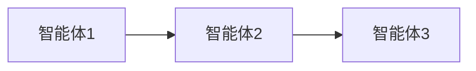
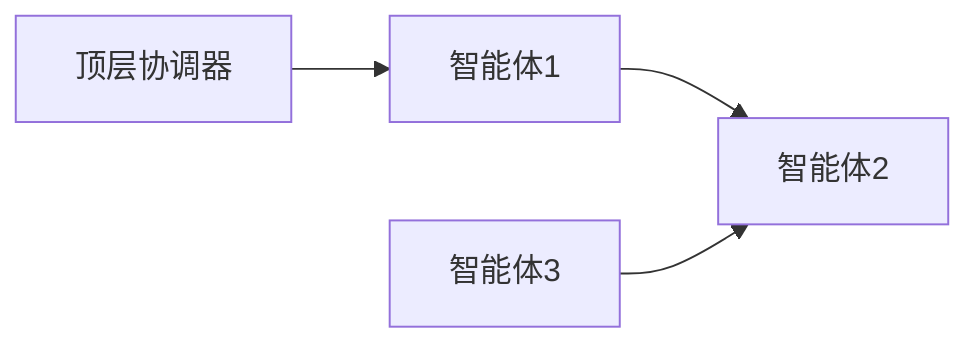
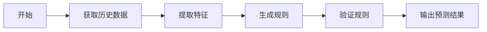
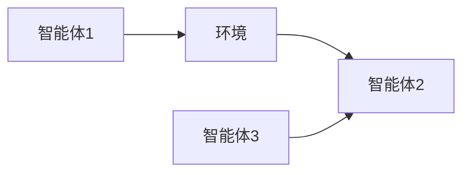
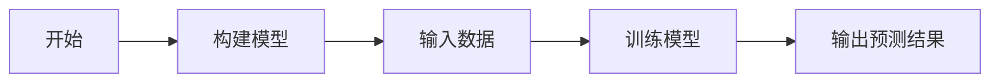
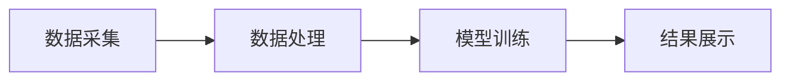
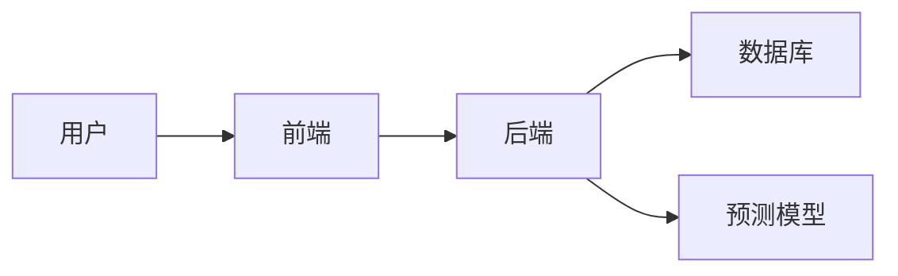
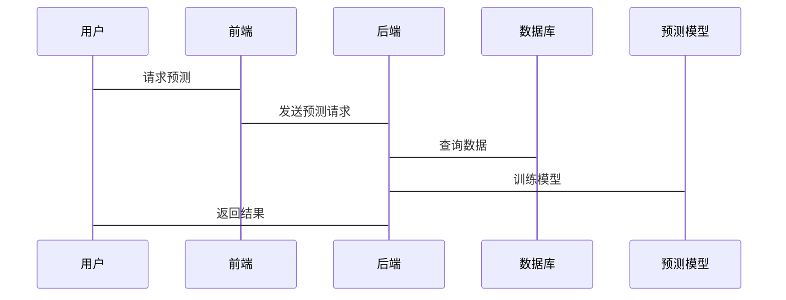

                 


# 多智能体系统在技术趋势预测中的应用：把握创新机遇

> 关键词：多智能体系统、技术趋势预测、人工智能、分布式计算、强化学习、系统架构

> 摘要：随着技术的快速发展，预测未来的技术趋势变得越来越重要。多智能体系统作为一种新兴的技术，以其分布式计算、协作学习和自适应能力，为技术趋势预测提供了新的可能性。本文将深入探讨多智能体系统的核心概念、算法原理、系统架构及其在技术趋势预测中的应用案例，帮助读者把握创新机遇。

---

# 第一部分: 多智能体系统与技术趋势预测的背景

# 第1章: 多智能体系统概述

## 1.1 多智能体系统的定义与特点

### 1.1.1 多智能体系统的定义

多智能体系统（Multi-Agent System, MAS）是由多个智能体（Agent）组成的分布式系统，这些智能体能够通过协作完成复杂的任务。每个智能体都有一定的自主性、目标和决策能力，能够与其他智能体或环境进行交互。

$$
\text{多智能体系统} = \{\text{智能体} \} \cup \{\text{交互规则}\} \cup \{\text{协作机制}\}
$$

### 1.1.2 多智能体系统的核心特点

| 特性 | 描述 |
|------|------|
| 分布式 | 智能体独立运行，通过通信协作完成任务 |
| 自主性 | 智能体能够自主决策，无需外部干预 |
| 社会性 | 智能体之间通过通信和协作实现目标 |
| 多样性 | 智能体可以有不同的目标、能力和知识 |

### 1.1.3 多智能体系统与传统单智能体系统的区别

| 对比维度 | 多智能体系统 | 单智能体系统 |
|----------|--------------|---------------|
| 系统复杂度 | 高 | 低 |
| 协作性 | 高 | 低 |
| 并行性 | 高 | 低 |
| 可扩展性 | 高 | 低 |

## 1.2 技术趋势预测的重要性

### 1.2.1 技术趋势预测的定义

技术趋势预测是指通过分析当前技术发展、市场动态和用户需求，预测未来技术发展方向和潜在机会。

### 1.2.2 技术趋势预测的挑战与意义

#### 挑战：
1. **不确定性**：技术发展受到多种因素影响，难以准确预测。
2. **数据量大**：需要处理海量数据，包括文本、代码、专利等。
3. **动态变化**：技术趋势会随时间和环境变化而调整。

#### 意义：
1. **商业价值**：帮助企业提前布局，抓住市场机遇。
2. **研发指导**：为技术创新提供方向。
3. **风险控制**：降低技术投资风险。

## 1.3 多智能体系统在技术趋势预测中的优势

### 1.3.1 多智能体系统的分布式计算能力

多智能体系统通过分布式计算，能够并行处理大量数据，提高预测效率。

### 1.3.2 多智能体系统的协作与自适应能力

智能体之间可以协作学习，自适应地调整预测模型，提高预测精度。

### 1.3.3 多智能体系统在复杂环境中的应用潜力

多智能体系统能够处理复杂的环境和不确定性，适用于技术趋势预测的动态场景。

## 1.4 本章小结

本章介绍了多智能体系统的定义、特点及其在技术趋势预测中的优势。多智能体系统的分布式计算和协作能力，使其在复杂环境中具有独特的优势，为技术趋势预测提供了新的思路。

---

# 第二部分: 多智能体系统的核心概念与技术联系

# 第2章: 多智能体系统的原理与架构

## 2.1 多智能体系统的原理

### 2.1.1 多智能体系统的组成要素

$$
\text{智能体} = \{\text{目标} \} \cup \{\text{知识} \} \cup \{\text{能力} \}
$$

### 2.1.2 多智能体系统的通信机制

智能体之间的通信可以通过以下方式实现：

1. **直接通信**：智能体之间直接交换信息。
2. **间接通信**：通过中间媒介传递信息。
3. **发布-订阅模式**：智能体发布信息，其他智能体订阅。

### 2.1.3 多智能体系统的协作算法

#### 协作算法步骤：

1. **任务分配**：根据智能体的能力分配任务。
2. **信息共享**：智能体之间共享信息和知识。
3. **协作决策**：基于共享信息，共同制定决策。

## 2.2 多智能体系统的架构设计

### 2.2.1 分层架构


### 2.2.2 分布式架构



### 2.2.3 混合架构



## 2.3 多智能体系统与其他技术的关系

### 2.3.1 多智能体系统与人工智能的关系

人工智能为多智能体系统提供智能决策能力，而多智能体系统为人工智能提供分布式协作环境。

### 2.3.2 多智能体系统与大数据技术的关系

大数据技术为多智能体系统提供海量数据支持，而多智能体系统为大数据分析提供分布式计算能力。

### 2.3.3 多智能体系统与分布式系统的关系

多智能体系统是一种特殊的分布式系统，但具有更强的智能性和协作性。

## 2.4 本章小结

本章介绍了多智能体系统的原理和架构，并探讨了其与其他技术的关系。多智能体系统的架构设计和协作机制，为技术趋势预测提供了理论基础。

---

# 第三部分: 多智能体系统在技术趋势预测中的算法原理

# 第3章: 多智能体系统的预测算法

## 3.1 基于规则的多智能体预测算法

### 3.1.1 基于规则的预测算法概述

基于规则的预测算法通过预定义的规则，对技术趋势进行预测。规则通常基于历史数据和专家经验。

### 3.1.2 基于规则的算法实现步骤



### 3.1.3 基于规则的算法优缺点分析

| 优点 | 缺点 |
|------|------|
| 简单易懂 | 需要大量人工规则 |
| 高效 | 难以处理复杂场景 |

## 3.2 基于强化学习的多智能体预测算法

### 3.2.1 强化学习的基本原理

强化学习通过智能体与环境的交互，学习最优策略。

$$
Q(s, a) = r + \gamma \max_{a'} Q(s', a')
$$

其中：
- \( Q(s, a) \)：状态 \( s \) 下动作 \( a \) 的价值
- \( r \)：奖励
- \( \gamma \)：折扣因子
- \( s' \)：下一个状态

### 3.2.2 多智能体强化学习的实现方法



### 3.2.3 多智能体强化学习的应用案例

案例：预测人工智能领域的技术趋势。

1. **任务分配**：智能体1负责收集数据，智能体2负责分析数据，智能体3负责预测趋势。
2. **协作学习**：智能体之间共享知识，优化预测模型。

## 3.3 基于模型的多智能体预测算法

### 3.3.1 基于模型的预测算法概述

基于模型的预测算法通过构建模型，模拟技术发展趋势。

### 3.3.2 基于模型的算法实现步骤



### 3.3.3 基于模型的算法优缺点分析

| 优点 | 缺点 |
|------|------|
| 预测精度高 | 计算复杂度高 |
| 适用于复杂场景 | 需要大量数据支持 |

## 3.4 本章小结

本章介绍了三种多智能体系统的预测算法，包括基于规则、强化学习和模型的预测方法。每种算法都有其优缺点，适用于不同的场景。

---

# 第四部分: 系统分析与架构设计

# 第4章: 技术趋势预测的场景分析

## 4.1 技术趋势预测的场景介绍

### 4.1.1 技术趋势预测的目标

预测技术发展趋势，帮助企业制定技术战略。

### 4.1.2 技术趋势预测的场景

1. **行业趋势分析**：预测某个行业的技术发展方向。
2. **技术热点挖掘**：发现当前技术热点。
3. **技术风险评估**：评估技术发展的潜在风险。

## 4.2 系统功能设计

### 4.2.1 系统功能模块

1. **数据采集模块**：采集技术相关的数据。
2. **数据处理模块**：清洗和预处理数据。
3. **预测模型模块**：构建和训练预测模型。
4. **结果展示模块**：可视化预测结果。

### 4.2.2 系统功能流程



## 4.3 系统架构设计

### 4.3.1 系统架构图



### 4.3.2 系统接口设计

1. **API接口**：提供数据接口和预测接口。
2. **交互接口**：用户与系统交互的界面。

### 4.3.3 系统交互序列图



## 4.4 本章小结

本章分析了技术趋势预测的场景，并设计了系统的功能和架构。系统的功能模块和架构设计，为后续的实现提供了基础。

---

# 第五部分: 项目实战

# 第5章: 项目实战：基于多智能体系统的技术趋势预测

## 5.1 项目背景与目标

### 5.1.1 项目背景

随着技术的快速发展，预测技术趋势变得越来越重要。

### 5.1.2 项目目标

构建一个基于多智能体系统的技术趋势预测系统，帮助企业把握创新机遇。

## 5.2 项目环境与工具

### 5.2.1 环境配置

1. **操作系统**：Linux
2. **编程语言**：Python
3. **框架与库**：TensorFlow、Keras、Flask
4. **工具**：Jupyter Notebook、Git

### 5.2.2 工具安装

```bash
pip install tensorflow keras flask jupyter-notebook
```

## 5.3 核心代码实现

### 5.3.1 数据采集模块

```python
import requests

def fetch_data(url):
    response = requests.get(url)
    return response.text
```

### 5.3.2 数据处理模块

```python
import pandas as pd

def preprocess_data(data):
    df = pd.DataFrame(data)
    df.dropna(inplace=True)
    return df
```

### 5.3.3 预测模型模块

```python
import tensorflow as tf
from tensorflow.keras import layers

def build_model(input_shape):
    model = tf.keras.Sequential()
    model.add(layers.Dense(64, activation='relu', input_shape=input_shape))
    model.add(layers.Dense(1, activation='sigmoid'))
    model.compile(optimizer='adam', loss='binary_crossentropy', metrics=['accuracy'])
    return model
```

### 5.3.4 结果展示模块

```python
import matplotlib.pyplot as plt

def plot_results(y_true, y_pred):
    plt.scatter(y_true, y_pred)
    plt.xlabel('真实值')
    plt.ylabel('预测值')
    plt.show()
```

## 5.4 项目实现与分析

### 5.4.1 项目实现步骤

1. **数据采集**：从指定URL获取数据。
2. **数据处理**：清洗和预处理数据。
3. **模型训练**：构建和训练预测模型。
4. **结果展示**：可视化预测结果。

### 5.4.2 项目分析与优化

1. **模型优化**：尝试不同的模型结构和超参数。
2. **性能评估**：计算模型的准确率、召回率等指标。
3. **结果解释**：分析预测结果的原因和潜在因素。

## 5.5 本章小结

本章通过一个实际项目，展示了基于多智能体系统的技术趋势预测的实现过程。从数据采集到结果展示，详细介绍了每个模块的实现方法，并对项目进行了分析和优化。

---

# 第六部分: 最佳实践与小结

# 第6章: 最佳实践与小结

## 6.1 最佳实践

### 6.1.1 系统设计建议

1. **模块化设计**：将系统划分为独立的模块，便于维护和扩展。
2. **分布式部署**：利用分布式计算能力，提高系统性能。
3. **数据安全**：确保数据的安全性和隐私性。

### 6.1.2 算法优化建议

1. **模型调优**：尝试不同的模型结构和优化方法。
2. **数据增强**：通过数据增强提高模型的泛化能力。
3. **在线学习**：实现在线学习，实时更新模型。

## 6.2 项目总结

### 6.2.1 项目成果

构建了一个基于多智能体系统的技术趋势预测系统，能够准确预测技术发展趋势。

### 6.2.2 项目经验

1. **技术积累**：掌握多智能体系统的核心技术和算法。
2. **团队协作**：团队合作是项目成功的关键。
3. **持续优化**：技术趋势预测需要持续优化和更新。

## 6.3 未来研究方向

### 6.3.1 技术趋势预测的自动化

实现技术趋势预测的自动化，减少人工干预。

### 6.3.2 多智能体系统的可解释性

提高多智能体系统的可解释性，增强用户信任。

### 6.3.3 多模态数据融合

探索多模态数据的融合，提高预测精度。

## 6.4 注意事项

### 6.4.1 数据质量

确保数据的准确性和完整性，避免噪声数据影响预测结果。

### 6.4.2 模型泛化能力

通过数据增强和模型调优，提高模型的泛化能力。

### 6.4.3 系统安全性

确保系统的安全性，防止数据泄露和攻击。

## 6.5 拓展阅读

### 6.5.1 推荐书籍

1. 《多智能体系统：理论与应用》
2. 《强化学习：理论与实践》
3. 《分布式系统：概念与设计》

### 6.5.2 推荐博客与文章

1. 多智能体系统的最新研究进展
2. 强化学习在技术趋势预测中的应用
3. 分布式系统的实践案例

## 6.6 本章小结

本章总结了项目成果和经验，并提出了未来研究方向和注意事项。多智能体系统在技术趋势预测中的应用前景广阔，但仍需进一步研究和优化。

---

# 结语

技术趋势预测是企业把握创新机遇的重要手段，而多智能体系统以其分布式计算和协作能力，为技术趋势预测提供了新的思路。通过本文的深入探讨，读者可以全面了解多智能体系统的核心概念、算法原理和系统架构，并通过实际项目案例掌握其实现方法。未来，随着技术的不断发展，多智能体系统在技术趋势预测中的应用将更加广泛和深入。

---

作者：AI天才研究院/AI Genius Institute & 禅与计算机程序设计艺术 /Zen And The Art of Computer Programming

