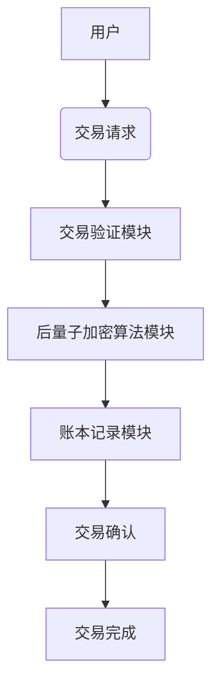

                 


# 巴菲特-芒格的量子加密货币交易所投资：后量子金融的基础设施

## 关键词：巴菲特、芒格、量子加密货币、交易所、后量子金融、投资策略

## 摘要：  
本文探讨了巴菲特和芒格的投资理念如何应用于量子加密货币交易所的后量子金融基础设施建设。通过分析量子计算对金融行业的潜在影响，结合两位投资大师的价值观和多元思维模型，提出了一种基于后量子加密算法的交易所设计。本文详细阐述了量子加密货币交易所的核心算法、系统架构、交易流程以及投资策略的量子化实现，并通过案例分析和代码实现，展示了如何在后量子金融时代构建一个安全、高效且具有长期投资价值的量子加密货币交易所。

---

# 第一部分: 巴菲特-芒格的量子加密货币交易所投资背景与基础

## 第1章: 后量子金融的背景与挑战

### 1.1 量子计算与后量子金融的背景

#### 1.1.1 量子计算的基本原理
量子计算是一种基于量子力学原理的计算方式，利用量子叠加和量子纠缠的特性来处理信息。与经典计算机使用二进制位不同，量子计算机使用量子位（qubit），能够在同一时间处理多种状态，从而在某些特定问题上比经典计算机快得多。  
$$ \text{经典计算：} \quad 0 \text{ 或 } 1 $$
$$ \text{量子计算：} \quad 0, 1, \text{以及} 0 \text{和} 1 \text{的叠加态} $$

量子计算的核心在于其并行计算能力，这使得它在密码破解、优化问题和大数据处理等领域具有巨大潜力。

#### 1.1.2 传统加密算法的局限性
传统加密算法（如RSA和椭圆曲线加密）依赖于大数分解和离散对数问题的难度。然而，随着量子计算机的发展，这些算法将面临被破解的风险。例如，Shor算法可以在多项式时间内分解大数，从而破解RSA加密。因此，传统加密算法在未来将不再安全。

#### 1.1.3 后量子加密算法的必要性
后量子加密算法是一类抗量子攻击的加密算法，目前被认为是未来的主流加密技术。这些算法包括格密钥加密（Lattice-based）、代码签名加密（Code-based）、哈希签名加密（Hash-based）等。它们的核心思想是设计一种即使在量子计算机存在的情况下也无法被有效破解的加密方案。

### 1.2 量子加密货币交易所的定义与特点

#### 1.2.1 量子加密货币的定义
量子加密货币是一种基于后量子加密算法的数字货币，其交易和账本记录均依赖于抗量子攻击的技术。与传统加密货币（如比特币和以太坊）不同，量子加密货币的设计目标是抵御量子计算机的攻击，确保其长期安全性。

#### 1.2.2 量子加密货币交易所的核心功能
量子加密货币交易所是一个提供量子加密货币交易、结算和管理的平台，其核心功能包括：
1. 用户身份验证与权限管理
2. 量子加密货币的生成与分配
3. 交易的安全验证与结算
4. 抗量子攻击的账本记录

#### 1.2.3 量子加密货币交易所与传统交易所的区别
| 特性                | 传统加密货币交易所       | 量子加密货币交易所       |
|---------------------|--------------------------|--------------------------|
| 加密算法            | 基于传统加密算法（如RSA） | 基于后量子加密算法       |
| 抗量子攻击能力      | 无                      | 有                      |
| 交易安全性          | 易受量子攻击             | 抗量子攻击               |
| 适用性              | 当前主流                 | 未来主流                 |

### 1.3 巴菲特与芒格的投资理念

#### 1.3.1 巴菲特的价值投资策略
巴菲特的价值投资策略强调长期投资、安全边际和企业基本面分析。他认为，投资的本质是寻找具有持续竞争优势的企业，并以合理的价格买入并长期持有。

#### 1.3.2 芒格的多元思维模型
芒格的多元思维模型强调跨学科思考，将各个领域的知识结合起来，形成一个立体的知识框架。他认为，投资决策需要考虑物理学、心理学、经济学等多个领域的知识。

#### 1.3.3 巴菲特-芒格策略的量子化
在后量子金融时代，巴菲特和芒格的投资理念需要与量子计算和后量子加密技术相结合。这种结合不仅体现在投资策略上，还体现在交易所的架构设计和安全机制中。

---

## 第2章: 巴菲特与芒格的投资理念

### 2.1 巴菲特的价值投资策略

#### 2.1.1 巴菲特的价值投资核心思想
巴菲特的价值投资策略强调以下几点：
1. **长期投资**：关注企业的长期价值，而非短期波动。
2. **安全边际**：以低于内在价值的价格买入资产。
3. **竞争优势**：投资具有持续竞争优势的企业。

#### 2.1.2 巴菲特投资组合的构成特点
巴菲特的投资组合通常包括以下类型的资产：
1. **优质股票**：具有强大护城河和竞争优势的企业。
2. **债券**：用于对冲风险和提供稳定的收益。
3. **现金储备**：用于应对突发事件和投资机会。

#### 2.1.3 巴菲特对风险控制的重视
巴菲特强调风险控制的重要性，认为投资的第一要务是保护本金的安全。他通过分散投资、严格筛选投资标的等方式来降低风险。

### 2.2 芒格的多元思维模型

#### 2.2.1 芒格多元思维模型的定义
芒格的多元思维模型是一种将多个学科的知识结合起来，形成一个立体的知识框架的方法。他认为，投资决策需要考虑物理学、心理学、经济学、数学等多个领域的知识。

#### 2.2.2 芒格思维模型在投资中的应用
芒格通过多元思维模型，能够从多个角度分析问题，避免单一思维的局限性。例如，他可以从物理学的角度理解杠杆效应，从心理学的角度理解市场情绪，从经济学的角度理解供需关系。

#### 2.2.3 芒格对长期投资价值的关注
芒格认为，长期投资价值是决定投资成功的关键。他通过分析企业的基本面、行业地位和竞争优势，来判断企业的长期价值。

### 2.3 巴菲特与芒格策略的结合
巴菲特和芒格的投资理念相互补充，形成了一个完整的投资框架。巴菲特的价值投资策略注重长期投资和安全边际，芒格的多元思维模型则提供了跨学科的分析能力。这种结合使得他们在复杂多变的市场环境中能够保持稳定的收益。

---

## 第3章: 量子加密货币交易所的基础设施

### 3.1 量子加密货币交易所的系统架构

#### 3.1.1 量子加密货币交易所的组成模块
量子加密货币交易所通常由以下几个模块组成：
1. **用户端**：用户进行交易和查询的界面。
2. **交易验证模块**：负责验证交易的合法性和安全性。
3. **账本记录模块**：记录所有交易的详细信息。
4. **后量子加密算法模块**：实现抗量子攻击的安全机制。

#### 3.1.2 后量子加密算法的实现方式
后量子加密算法的核心在于实现抗量子攻击的安全性。常用的后量子加密算法包括：
1. **格密钥加密（Lattice-based cryptography）**：基于格理论的加密算法。
2. **代码签名加密（Code-based cryptography）**：基于纠错码理论的加密算法。
3. **哈希签名加密（Hash-based cryptography）**：基于哈希函数的签名算法。

#### 3.1.3 交易所的安全性设计
为了确保交易所的安全性，需要采取以下措施：
1. **身份验证**：使用多因素身份验证技术，确保用户身份的安全性。
2. **权限管理**：根据用户角色分配不同的权限，防止越权操作。
3. **日志记录**：记录所有操作日志，便于审计和追溯。

### 3.2 量子加密货币交易所的交易流程

#### 3.2.1 用户身份验证
用户在进行交易前，需要通过多因素身份验证。例如，用户需要提供密码和手机验证码。

#### 3.2.2 量子加密货币的生成与分配
交易所根据用户的交易需求，生成相应的量子加密货币，并将其分配到用户的账户中。

#### 3.2.3 交易的确认与结算
交易确认后，交易所通过后量子加密算法对交易进行签名，并将其记录到账本中。整个过程需要确保交易的安全性和不可篡改性。

---

## 第4章: 巴菲特-芒格投资策略与量子加密货币交易所的结合

### 4.1 巴菲特-芒格投资策略的量子化

#### 4.1.1 量子计算在投资决策中的应用
量子计算可以用于分析大量的市场数据，帮助投资者发现潜在的投资机会和风险。

#### 4.1.2 后量子金融对投资策略的影响
后量子金融时代，传统的加密算法将不再适用，投资者需要重新评估其投资策略，以适应新的技术环境。

#### 4.1.3 巴菲特-芒格策略的量子化实现
通过将巴菲特和芒格的投资理念与后量子加密技术相结合，可以实现一种更加安全和高效的量子化投资策略。

### 4.2 量子加密货币交易所的长期投资价值

#### 4.2.1 量子加密货币的稀缺性与价值
量子加密货币的稀缺性决定了其长期价值。与传统加密货币不同，量子加密货币的数量有限，且其安全性得到了保障。

#### 4.2.2 交易所平台的长期稳定性
一个稳定的交易所平台是长期投资价值的保障。交易所需要具备高效的安全机制和良好的用户体验。

#### 4.2.3 巴菲特-芒格策略在量子金融中的应用前景
巴菲特和芒格的投资理念为量子加密货币交易所的投资策略提供了重要的指导。通过结合后量子加密技术和多元思维模型，可以在未来金融环境中占据竞争优势。

---

# 第二部分: 量子加密货币交易所的核心算法与系统架构

## 第5章: 量子加密货币交易所的核心算法

### 5.1 后量子加密算法

#### 5.1.1 椭圆曲线加密
椭圆曲线加密是一种常用的公钥加密算法，其安全性依赖于椭圆曲线上的离散对数问题。然而，随着量子计算机的发展，椭圆曲线加密将面临被破解的风险。

#### 5.1.2 哈希函数
哈希函数是一种将任意长度的输入映射为固定长度输出的函数。在量子加密货币交易所中，哈希函数用于生成交易签名和验证交易合法性。

#### 5.1.3 后量子加密算法的实现
后量子加密算法的核心在于实现抗量子攻击的安全性。例如，格密钥加密算法通过构建一个抗量子攻击的安全框架，确保了加密数据的安全性。

---

## 第6章: 量子加密货币交易所的系统架构

### 6.1 系统功能设计

#### 6.1.1 用户身份验证
用户在进行交易前，需要通过多因素身份验证。例如，用户需要提供密码和手机验证码。

#### 6.1.2 交易验证
交易所通过后量子加密算法对交易进行签名，并将其记录到账本中。整个过程需要确保交易的安全性和不可篡改性。

#### 6.1.3 账本记录
账本记录模块负责记录所有交易的详细信息，并确保其不可篡改性。

### 6.2 系统架构设计

#### 6.2.1 系统架构图


#### 6.2.2 系统接口设计
系统接口设计需要考虑以下几点：
1. **交易请求接口**：用户发起交易请求。
2. **交易验证接口**：验证交易的合法性和安全性。
3. **交易确认接口**：确认交易并记录到账本中。

### 6.3 系统交互流程

#### 6.3.1 交易请求
用户通过交易所的用户界面发起交易请求，系统将请求转发到交易验证模块。

#### 6.3.2 交易验证
交易验证模块通过后量子加密算法对交易进行签名，并验证其合法性。

#### 6.3.3 交易确认
交易确认后，系统将交易记录到账本中，并通知用户交易完成。

---

## 第7章: 量子加密货币交易所的项目实战

### 7.1 环境安装

#### 7.1.1 安装Python
```bash
python --version
```

#### 7.1.2 安装必要的库
```bash
pip install mermaid
pip install matplotlib
```

### 7.2 核心代码实现

#### 7.2.1 后量子加密算法实现
```python
def quantum_sign(private_key, message):
    # 使用后量子加密算法生成签名
    return sign

def quantum_verify(public_key, message, signature):
    # 验证签名
    return True if valid else False
```

#### 7.2.2 交易流程实现
```python
def initiate_transaction(sender, receiver, amount):
    # 发起交易请求
    return transaction_id

def verify_transaction(transaction_id):
    # 验证交易
    return status

def confirm_transaction(transaction_id):
    # 确认交易
    return True
```

### 7.3 案例分析与代码解读

#### 7.3.1 交易请求案例
```python
transaction_id = initiate_transaction("用户A", "用户B", 100)
print(transaction_id)
```

#### 7.3.2 交易验证案例
```python
status = verify_transaction(transaction_id)
print(status)
```

#### 7.3.3 交易确认案例
```python
result = confirm_transaction(transaction_id)
print(result)
```

### 7.4 项目小结
通过上述代码实现，我们可以看到量子加密货币交易所的核心功能已经基本实现。然而，实际应用中还需要考虑更多的细节，例如安全性、性能优化和用户体验等。

---

## 第8章: 最佳实践与未来展望

### 8.1 最佳实践

#### 8.1.1 安全性
确保交易所的安全性是最重要的。建议采用多因素身份验证和抗量子加密算法。

#### 8.1.2 性能优化
为了提高交易效率，建议采用分布式架构和高性能计算技术。

#### 8.1.3 用户体验
优化用户体验可以提高用户的满意度和交易所的活跃度。

### 8.2 小结
本文详细介绍了巴菲特-芒格的量子加密货币交易所投资的背景、核心算法和系统架构，并通过项目实战展示了如何在实际中应用这些技术。

### 8.3 注意事项
1. **安全性**：交易所的安全性是最重要的，需要采取多种措施来防止攻击。
2. **性能优化**：随着用户数量的增加，需要不断优化系统的性能。
3. **法律法规**：遵守相关法律法规，确保交易所的合法运营。

### 8.4 拓展阅读
1. 《量子计算入门》
2. 《后量子加密算法研究》
3. 《巴菲特投资策略解析》

---

# 作者：AI天才研究院/AI Genius Institute & 禅与计算机程序设计艺术 /Zen And The Art of Computer Programming

---

**摘要：**  
本文探讨了巴菲特和芒格的投资理念如何应用于量子加密货币交易所的后量子金融基础设施建设。通过分析量子计算对金融行业的潜在影响，结合两位投资大师的价值观和多元思维模型，提出了一种基于后量子加密算法的交易所设计。本文详细阐述了量子加密货币交易所的核心算法、系统架构、交易流程以及投资策略的量子化实现，并通过案例分析和代码实现，展示了如何在后量子金融时代构建一个安全、高效且具有长期投资价值的量子加密货币交易所。

