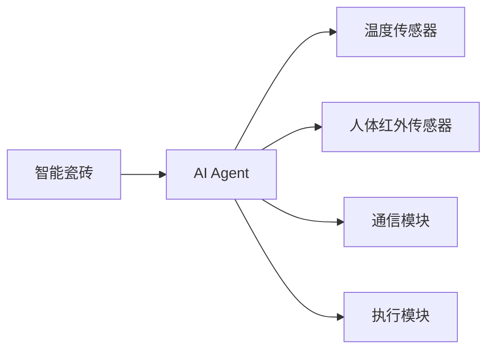
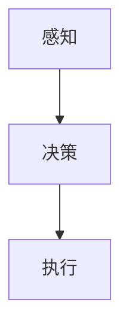
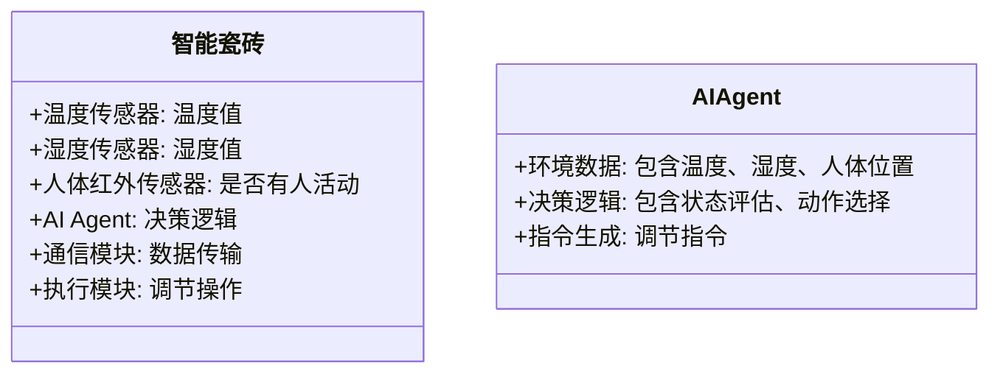
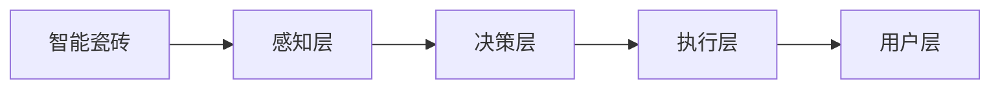
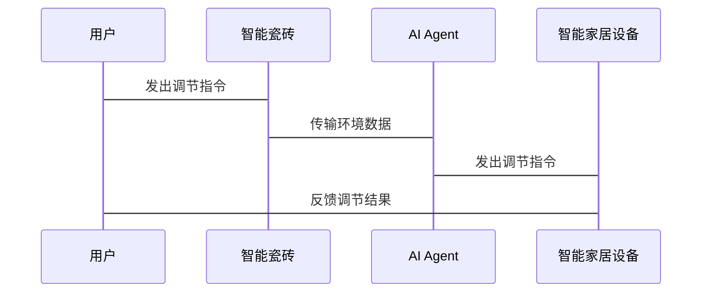

                 


# 智能瓷砖：AI Agent的室内温度调节系统

> 关键词：智能瓷砖，AI Agent，室内温度调节，物联网，智能家居，AI算法

> 摘要：本文探讨了智能瓷砖与AI Agent结合的室内温度调节系统，从系统背景、核心概念、算法原理到系统架构设计、项目实战及最佳实践，全面分析了该系统的实现与应用。通过详细的技术分析和实际案例，展示了如何利用AI Agent实现智能化的室内温度调节，为智能家居的发展提供了新的思路。

---

# 第1章: 智能瓷砖与AI Agent的背景介绍

## 1.1 问题背景与描述

### 1.1.1 室内温度调节的传统方法
传统的室内温度调节主要依赖于恒温器和空调系统。恒温器通过设定目标温度，控制空调的运行，从而实现温度调节。然而，这种方法存在以下问题：
- **局部调节不足**：传统恒温器通常只能调节整个房间的温度，无法实现局部区域的精准控制。
- **能源浪费**：房间内某些区域可能不需要频繁调节，但传统系统会持续运行，导致能源浪费。
- **用户体验差**：用户需要手动调整设置，无法根据个人习惯提供个性化的温度调节。

### 1.1.2 当前存在的问题与挑战
随着智能家居的普及，用户对室内环境的智能化要求越来越高。然而，现有的温度调节系统在以下几个方面存在明显不足：
- **缺乏智能化感知**：传统系统无法实时感知房间内的人体位置、温度分布等信息。
- **决策效率低下**：单纯依赖人工操作或简单的反馈机制，无法实现高效的温度调节。
- **系统集成度低**：传统系统通常需要多个设备协同工作，集成复杂，用户体验较差。

### 1.1.3 智能瓷砖的提出与目标
智能瓷砖是一种新型的智能家居设备，它通过在瓷砖内部集成传感器和AI Agent（智能体），实现对室内环境的精准感知和智能化调节。智能瓷砖的目标是：
- **实现局部精准调节**：通过感知人体位置和环境温度，实现局部区域的精准温度调节。
- **优化能源使用**：通过智能算法，减少不必要的能源消耗。
- **提升用户体验**：为用户提供个性化的温度调节服务，提升居住舒适度。

## 1.2 智能瓷砖与AI Agent的解决方案

### 1.2.1 智能瓷砖的基本概念
智能瓷砖是一种集成传感器、处理器和通信模块的新型瓷砖。每块智能瓷砖可以独立工作，也可以通过网络协同工作，实现对室内环境的感知和调节。

### 1.2.2 AI Agent在温度调节中的作用
AI Agent（智能体）是智能瓷砖的核心，负责接收传感器数据、分析环境信息、制定调节策略并执行操作。AI Agent的主要功能包括：
- **感知环境**：通过内置的温度、湿度、人体红外传感器等，实时感知室内环境信息。
- **分析决策**：基于传感器数据和用户习惯，制定最优的温度调节策略。
- **执行操作**：通过与空调、地暖等设备的联动，执行具体的调节操作。

### 1.2.3 解决方案的边界与外延
智能瓷砖系统不仅包括瓷砖本身，还需要与智能家居系统（如空调、地暖、智能灯等）进行集成。系统的边界包括：
- **内部边界**：智能瓷砖内部的传感器、处理器和通信模块。
- **外部边界**：与智能家居设备、用户终端的交互接口。
- **环境边界**：室内环境中的温度、湿度、人体位置等。

## 1.3 系统的核心概念与组成

### 1.3.1 智能瓷砖的结构与功能
智能瓷砖的结构包括以下几部分：
- **传感器模块**：用于感知环境信息，如温度、湿度、人体红外信号等。
- **处理器模块**：用于数据处理、AI算法运行和决策制定。
- **通信模块**：用于与其他设备、云端平台进行数据交互。
- **执行模块**：用于调节温度，如控制加热或制冷设备。

### 1.3.2 AI Agent的属性与特征
AI Agent具有以下属性和特征：
- **自主性**：能够自主感知环境并做出决策。
- **反应性**：能够实时响应环境变化和用户指令。
- **学习能力**：能够通过机器学习算法不断优化调节策略。
- **协作性**：能够与其他智能瓷砖和智能家居设备协同工作。

### 1.3.3 概念结构与核心要素
智能瓷砖系统的概念结构包括以下几个核心要素：
- **智能瓷砖**：系统的基本单元，负责感知和执行。
- **AI Agent**：系统的智能核心，负责决策和控制。
- **智能家居设备**：系统的执行单元，包括空调、地暖等。
- **用户终端**：系统的交互界面，包括手机APP、语音助手等。

---

# 第2章: AI Agent与智能瓷砖的核心概念

## 2.1 AI Agent的基本原理

### 2.1.1 AI Agent的定义与分类
AI Agent是一种智能体，能够感知环境、自主决策并执行操作。根据功能和应用场景的不同，AI Agent可以分为以下几类：
- **简单反射型智能体**：基于当前感知做出简单反应。
- **基于模型的反射型智能体**：基于环境模型做出决策。
- **目标驱动型智能体**：基于目标和规划进行决策。
- **实用驱动型智能体**：基于效用函数进行优化决策。

### 2.1.2 AI Agent的感知、决策与执行机制
AI Agent的核心机制包括：
- **感知**：通过传感器获取环境信息。
- **决策**：基于感知信息和历史数据，制定调节策略。
- **执行**：通过执行模块或与其他设备联动，实现温度调节。

### 2.1.3 AI Agent的特征对比表格
以下是对不同AI Agent类型的关键特征对比：

| 特征               | 简单反射型 | 基于模型的反射型 | 目标驱动型 | 实用驱动型 |
|--------------------|------------|------------------|------------|------------|
| 决策依据           | 当前感知    | 环境模型          | 目标规划    | 效用函数    |
| 复杂性             | 低          | 中                | 高          | 高          |
| 应用场景           | 简单任务    | 中等复杂任务      | 复杂任务    | 优化任务    |

## 2.2 智能瓷砖的结构与功能

### 2.2.1 智能瓷砖的物理结构
智能瓷砖的物理结构包括：
- **瓷砖本体**：包括瓷砖的外观设计和安装位置。
- **传感器模块**：嵌入瓷砖内部的温度、湿度、人体红外传感器等。
- **处理器模块**：用于数据处理和AI算法运行。
- **通信模块**：用于与其他设备和云端平台的数据交互。
- **执行模块**：用于调节温度，如加热或制冷。

### 2.2.2 智能瓷砖的功能
智能瓷砖的主要功能包括：
- **环境感知**：实时感知室内温度、湿度、人体位置等信息。
- **数据处理**：对感知数据进行分析和处理，生成环境画像。
- **决策制定**：基于环境数据和用户需求，制定温度调节策略。
- **指令执行**：通过与其他设备的联动，执行具体的调节操作。
- **用户交互**：通过手机APP、语音助手等方式，与用户进行交互。

### 2.2.3 AI Agent的集成方式
AI Agent在智能瓷砖中的集成方式包括：
- **本地集成**：AI Agent运行在瓷砖内部的处理器上。
- **云端协同**：AI Agent部分功能运行在云端，通过通信模块与瓷砖交互。
- **边缘计算**：AI Agent在瓷砖内部进行边缘计算，减少对云端的依赖。

## 2.3 AI Agent与智能瓷砖的实体关系



---

# 第3章: AI Agent的算法原理

## 3.1 算法流程

### 3.1.1 感知阶段
AI Agent通过内置传感器感知环境信息，包括：
- **温度传感器**：获取室温数据。
- **湿度传感器**：获取湿度数据。
- **人体红外传感器**：检测人体位置和活动。

### 3.1.2 决策阶段
AI Agent基于感知数据和历史信息，制定温度调节策略。主要步骤包括：
1. **环境评估**：根据当前环境数据，评估室内舒适度。
2. **需求分析**：分析用户需求和习惯，生成个性化调节方案。
3. **策略制定**：结合环境评估和需求分析，制定最优的调节策略。

### 3.1.3 执行阶段
AI Agent根据决策结果，通过通信模块和执行模块，实现温度调节。具体步骤包括：
1. **指令生成**：生成调节指令，如“开启加热”、“关闭制冷”等。
2. **指令执行**：通过通信模块，向空调、地暖等设备发送指令。
3. **反馈接收**：接收设备的反馈信息，评估调节效果。

## 3.2 算法实现

### 3.2.1 算法流程图


### 3.2.2 算法代码实现
以下是一个简单的AI Agent算法实现示例：

```python
class AI-Agent:
    def __init__(self):
        self.temperature = 25  # 默认温度
        self.humidity = 50     # 默认湿度
        self.motion = False    # 是否有人活动

    def perceive(self):
        # 获取传感器数据
        self.temperature = get_temperature()
        self.humidity = get_humidity()
        self.motion = detect_motion()

    def decide(self):
        # 根据感知数据制定策略
        if self.motion:
            # 如果有人活动，调整温度
            if self.temperature < 24:
                return "increase_temp"
            elif self.temperature > 26:
                return "decrease_temp"
            else:
                return "no_change"
        else:
            # 如果无人活动，保持当前温度
            return "no_change"

    def act(self, action):
        # 执行操作
        if action == "increase_temp":
            increase_heating()
        elif action == "decrease_temp":
            decrease_heating()
```

## 3.3 数学模型与公式

### 3.3.1 状态评估公式
$$ V(s) = \max_{a} Q(s, a) $$
其中，$s$ 表示当前状态，$a$ 表示动作，$Q(s, a)$ 表示状态-动作对的评估值。

### 3.3.2 动作选择公式
$$ a = \arg\max Q(s, a) $$
表示在当前状态下，选择评估值最大的动作进行执行。

---

# 第4章: 系统分析与架构设计

## 4.1 项目背景与需求分析

### 4.1.1 项目背景
随着智能家居的普及，用户对室内环境的智能化要求越来越高。传统的温度调节系统存在局部调节不足、能源浪费、用户体验差等问题。智能瓷砖通过AI Agent实现精准的局部调节，优化能源使用，提升用户体验。

### 4.1.2 系统需求
系统需求包括：
- **环境感知需求**：实时感知室内温度、湿度、人体位置等信息。
- **智能调节需求**：根据环境数据和用户需求，制定最优的调节策略。
- **人机交互需求**：通过手机APP、语音助手等方式，与用户进行交互。
- **设备联动需求**：与其他智能家居设备（如空调、地暖）进行联动，实现协同调节。

## 4.2 系统功能设计

### 4.2.1 系统功能模块
系统功能模块包括：
- **环境感知模块**：负责采集室内环境数据。
- **AI决策模块**：负责分析数据并制定调节策略。
- **设备联动模块**：负责与其他设备进行交互，执行调节操作。
- **用户交互模块**：负责与用户进行信息交互。

### 4.2.2 系统功能流程
系统功能流程包括：
1. **感知数据采集**：智能瓷砖通过传感器采集环境数据。
2. **数据传输**：通过通信模块将数据传输到AI Agent。
3. **决策制定**：AI Agent分析数据，制定调节策略。
4. **指令执行**：通过设备联动模块，执行具体的调节操作。
5. **反馈接收**：接收设备反馈信息，评估调节效果。

### 4.2.3 领域模型
以下是一个简单的领域模型类图：



## 4.3 系统架构设计

### 4.3.1 系统架构设计
系统架构设计采用分层架构，包括：
- **感知层**：由智能瓷砖和传感器组成，负责数据采集。
- **决策层**：由AI Agent组成，负责数据分析和决策制定。
- **执行层**：由智能家居设备组成，负责执行调节操作。
- **用户层**：由用户终端组成，负责与用户交互。

### 4.3.2 系统架构图
以下是一个简单的系统架构图：



## 4.4 系统接口设计

### 4.4.1 系统接口
系统接口包括：
- **智能瓷砖与AI Agent接口**：用于数据传输和指令控制。
- **AI Agent与智能家居设备接口**：用于决策指令的发送。
- **用户终端与系统接口**：用于用户与系统的交互。

### 4.4.2 交互流程
交互流程包括：
1. **用户操作**：用户通过手机APP或语音助手发出指令。
2. **数据传输**：智能瓷砖采集环境数据并传输到AI Agent。
3. **决策制定**：AI Agent分析数据，制定调节策略。
4. **指令执行**：AI Agent通过通信模块向设备发送指令。
5. **反馈接收**：系统接收设备反馈，评估调节效果。

## 4.5 系统交互设计

### 4.5.1 系统交互流程
以下是一个系统的交互流程：



---

# 第5章: 项目实战

## 5.1 环境安装与配置

### 5.1.1 系统环境
系统环境包括：
- **硬件设备**：智能瓷砖、传感器、智能家居设备。
- **软件环境**：Python、机器学习框架（如TensorFlow、PyTorch）、通信协议（如MQTT、HTTP）。

### 5.1.2 工具安装
安装必要的工具和库：
```bash
pip install numpy
pip install pandas
pip install tensorflow
pip install mqtt-client
```

## 5.2 系统核心实现

### 5.2.1 智能瓷砖的核心代码
以下是智能瓷砖的核心代码实现：

```python
class SmartTile:
    def __init__(self, tile_id):
        self.tile_id = tile_id
        self.temperature = 25
        self.humidity = 50
        self.motion = False
        self.agent = AIAgent()

    def感知环境(self):
        self.temperature = get_temperature()
        self.humidity = get_humidity()
        self.motion = detect_motion()

    def 获取指令(self):
        if self.motion:
            return self.agent.决策(self.temperature, self.humidity)
        else:
            return "no_change"

    def 执行指令(self, instruction):
        if instruction == "increase_temp":
            increase_heating()
        elif instruction == "decrease_temp":
            decrease_heating()
```

### 5.2.2 AI Agent的核心代码
以下是AI Agent的核心代码实现：

```python
class AIAgent:
    def __init__(self):
        self.preferences = {}  # 用户偏好设置
        self.prefs = {}       # 用户习惯数据

    def 决策(self, temperature, humidity):
        # 根据当前环境数据和用户偏好，制定调节策略
        if temperature < 24 or humidity > 60:
            return "increase_temp"
        elif temperature > 26 or humidity < 40:
            return "decrease_temp"
        else:
            return "no_change"
```

## 5.3 实际案例分析

### 5.3.1 案例背景
假设用户在家中安装了智能瓷砖，目标是实现精准的温度调节。

### 5.3.2 案例分析
1. **环境感知**：智能瓷砖感知到室温为25℃，湿度为55%，并且检测到有人活动。
2. **决策制定**：AI Agent分析数据，根据用户偏好（如喜欢较高的室内温度），决定开启加热。
3. **指令执行**：智能瓷砖通过通信模块向空调发送“increase_temp”指令，空调开始加热。
4. **反馈接收**：空调反馈加热成功，系统评估调节效果。

### 5.3.3 代码解读
以下是对上述案例的代码解读：

```python
# 初始化智能瓷砖
tile = SmartTile(1)
tile.感知环境()  # 感知环境数据
instruction = tile.获取指令()  # 获取调节指令
tile.执行指令(instruction)  # 执行调节操作
```

---

# 第6章: 最佳实践

## 6.1 本章小结
智能瓷砖与AI Agent的结合，为室内温度调节提供了新的思路。通过智能化的感知、决策和执行，系统能够实现精准的温度调节，优化能源使用，提升用户体验。

## 6.2 注意事项
在实际应用中，需要注意以下几点：
- **数据隐私**：智能瓷砖需要采集大量环境数据和用户信息，需注意数据隐私和安全。
- **系统稳定性**：智能瓷砖和AI Agent需要保证系统的稳定运行，避免因设备故障或网络问题导致调节失败。
- **用户体验**：系统需要提供良好的用户交互界面，确保用户能够方便地使用和管理系统。

## 6.3 未来的发展方向
未来，智能瓷砖与AI Agent的结合将更加紧密，系统将朝着以下几个方向发展：
- **更智能化**：通过强化学习等技术，进一步优化调节策略。
- **更环保**：通过更高效的能源管理和调节算法，减少能源浪费。
- **更人性化**：提供更加个性化的服务，满足不同用户的需求。

## 6.4 拓展阅读
以下是一些推荐阅读资料：
- 《人工智能：一种现代的方法》
- 《机器学习实战》
- 《物联网技术与应用》
- 《智能家居系统设计与实现》

---

# 作者：AI天才研究院/AI Genius Institute & 禅与计算机程序设计艺术/Zen And The Art of Computer Programming

---

以上是《智能瓷砖：AI Agent的室内温度调节系统》的技术博客文章的完整内容，涵盖从背景介绍到系统设计、项目实战及最佳实践的各个方面。通过详细的技术分析和实际案例，展示了如何利用AI Agent实现智能化的室内温度调节，为智能家居的发展提供了新的思路。

