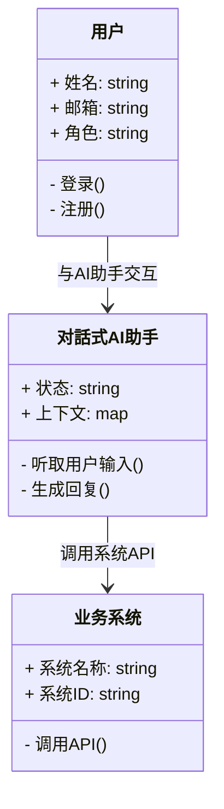
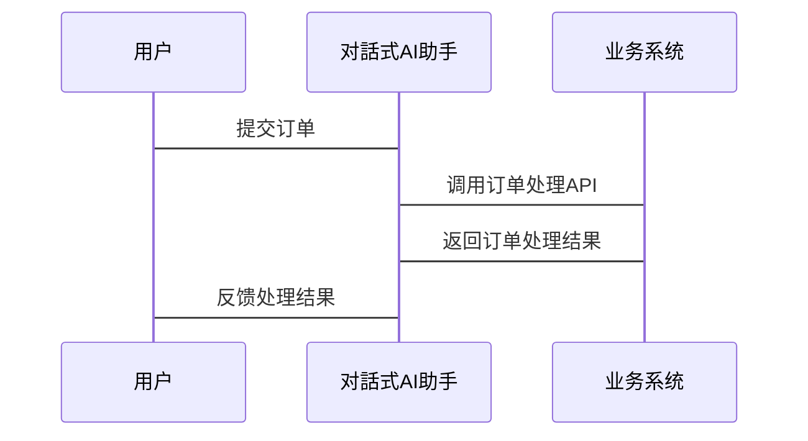

                 


# 构建企业级对话式AI助手：跨部门业务流程自动化与协同

## 关键词：对话式AI助手、跨部门协作、业务流程自动化、自然语言处理（NLP）、机器学习

## 摘要：企业级对话式AI助手是一种结合自然语言处理和机器学习技术，能够跨部门协同工作，自动处理业务流程的智能系统。本文将从背景、核心概念、算法原理、系统架构、项目实战等方面详细阐述构建企业级对话式AI助手的全过程，帮助读者理解如何利用AI技术提升企业效率。

---

## 第一部分: 企业级对话式AI助手概述

### 第1章: 问题背景与目标

#### 1.1 问题背景
##### 1.1.1 企业数字化转型的挑战
在数字化转型的浪潮中，企业面临业务流程复杂、信息孤岛、协作效率低下的问题。传统的业务流程依赖人工操作，效率低下且容易出错。此外，各部门之间的信息分散，难以实现高效协同。

##### 1.1.2 对話式AI助手的出现与需求
随着自然语言处理（NLP）和机器学习技术的快速发展，对话式AI助手逐渐成为企业数字化转型的重要工具。企业希望通过AI助手实现自动化、智能化的业务处理，提升效率和用户体验。

##### 1.1.3 跨部门协作与业务流程自动化的痛点
跨部门协作中，信息传递不畅、责任不清是常见问题。业务流程自动化虽然能提高效率，但如何实现跨部门的无缝协作仍是一个难题。对话式AI助手可以通过统一的交互界面，连接各部门系统，实现自动化处理。

#### 1.2 问题描述
##### 1.2.1 传统业务流程中的效率瓶颈
传统业务流程依赖人工操作，容易出错且效率低下。例如，订单处理、客户咨询等流程需要多个部门协作，耗时长且容易出错。

##### 1.2.2 跨部门协作中的信息孤岛问题
各部门之间数据分散，信息传递不畅，导致协作效率低下。例如，销售部门需要与客户沟通，但客户的信息可能分散在CRM系统中，其他部门难以快速获取。

##### 1.2.3 人工干预的高昂成本与低效性
人工处理业务流程不仅成本高，而且容易出错。例如，客服人员需要手动查询客户信息、处理订单，效率低下且容易出错。

#### 1.3 问题解决目标
##### 1.3.1 自动化处理跨部门业务流程
通过对话式AI助手，实现业务流程的自动化处理，减少人工干预。

##### 1.3.2 提供统一的对话式交互界面
用户可以通过对话式界面与系统交互，实现跨部门协作。

##### 1.3.3 实现智能化决策支持
AI助手通过分析数据，提供智能化的决策支持，帮助企业在复杂场景中做出最优决策。

### 第2章: 核心概念与系统架构

#### 2.1 对話式AI助手的核心要素
##### 2.1.1 自然语言处理（NLP）
NLP技术用于理解和生成自然语言，是对话式AI助手的核心。例如，分词、句法分析、实体识别等技术帮助系统理解用户输入。

##### 2.1.2 业务规则引擎
业务规则引擎用于定义和执行业务规则，确保AI助手的行为符合企业需求。例如，订单处理规则、权限管理等。

##### 2.1.3 跨部门协同机制
通过API或其他接口，AI助手可以调用不同部门的系统，实现跨部门协作。例如，AI助手可以调用CRM系统获取客户信息，调用财务系统处理订单。

#### 2.2 系统架构分析
##### 2.2.1 分层架构设计
系统分为数据层、业务逻辑层和用户界面层。数据层存储数据，业务逻辑层处理逻辑，用户界面层与用户交互。

##### 2.2.2 微服务架构实现
采用微服务架构，每个服务负责特定功能，例如NLP服务、规则引擎服务、协同服务等。这使得系统更灵活，易于扩展。

##### 2.2.3 可扩展性与高可用性设计
系统设计需考虑可扩展性和高可用性。例如，采用负载均衡、分布式系统等技术，确保系统在高并发场景下仍能正常运行。

## 第3章: 对話式AI助手的实现原理

### 3.1 自然语言处理模型
#### 3.1.1 预训练语言模型（如BERT、GPT）
预训练模型通过大量数据训练，具有强大的上下文理解和生成能力。例如，BERT可以用于问答系统，GPT可以用于对话生成。

#### 3.1.2 模型的微调与适配
根据企业需求，对预训练模型进行微调，使其适应特定场景。例如，针对企业内部的术语和流程进行优化。

#### 3.1.3 对話上下文的管理
系统需要管理对话上下文，确保每次交互都能保持连贯。例如，记录用户的历史对话，以便后续回复。

### 3.2 业务规则引擎
#### 3.2.1 规则定义与配置
规则引擎需要定义具体的业务规则，例如“当用户提到订单问题时，调用客服系统”。

#### 3.2.2 规则的动态加载与更新
规则可以根据企业需求动态加载或更新，确保系统灵活性。

#### 3.2.3 规则执行与结果反馈
规则引擎执行规则后，将结果反馈给对话式AI助手，用于生成回复。

### 3.3 跨部门协同机制
#### 3.3.1 事件驱动的协同模式
通过事件驱动的方式，AI助手可以触发其他系统执行特定操作。例如，当用户提交订单时，触发订单处理系统。

#### 3.3.2 任务分发与跟踪
AI助手可以将任务分发给不同部门，跟踪任务进度，并在完成后反馈给用户。

#### 3.3.3 协同过程中的异常处理
在协同过程中，可能会出现异常情况，例如系统故障或数据错误。AI助手需要能够识别异常并采取相应的措施，例如通知相关人员或暂停流程。

---

## 第二部分: 对話式AI助手的算法与数学模型

### 第4章: 自然语言处理算法

#### 4.1 模型训练流程
##### 4.1.1 数据预处理
数据清洗、分词、标注等预处理步骤是训练模型的基础。

##### 4.1.2 模型训练
使用训练数据训练模型，调整模型参数以优化性能。

##### 4.1.3 模型评估与优化
通过评估指标（如准确率、召回率）评估模型性能，并进行优化。

#### 4.2 基于Transformer的模型
##### 4.2.1 Transformer架构
Transformer由编码器和解码器组成，广泛应用于NLP任务。

##### 4.2.2 自注意力机制
自注意力机制允许模型关注输入中的不同位置，提升上下文理解能力。

##### 4.2.3 前向网络结构
前向网络用于生成回复，基于编码器的输出生成自然语言文本。

### 第5章: 对話生成的数学模型

#### 5.1 基于生成对抗网络（GAN）的对话生成
##### 5.1.1 GAN的基本原理
GAN由生成器和判别器组成，生成器生成对话，判别器判断对话是否真实。

##### 5.1.2 对話生成中的GAN应用
通过GAN生成多样化的对话，提升对话的自然度和多样性。

##### 5.1.3 模型训练与优化
通过对抗训练优化模型，提升生成对话的质量。

#### 5.2 基于强化学习的对话生成
##### 5.2.1 强化学习的基本原理
强化学习通过奖励机制，优化模型的生成策略。

##### 5.2.2 对話生成中的奖励函数设计
奖励函数用于评估生成对话的质量，例如基于多样性和相关性。

##### 5.2.3 模型训练与调优
通过训练和调优，提升模型的对话生成能力。

### 第6章: 对話上下文管理的数学模型

#### 6.1 基于序列建模的上下文表示
##### 6.1.1 LSTM网络
LSTM通过记忆单元处理序列数据，适合处理对话上下文。

##### 6.1.2 GRU网络
GRU是LSTM的简化版本，计算效率更高。

##### 6.1.3 深度平均网络（DAN）
DAN通过多层感知机模型处理对话上下文。

#### 6.2 对話上下文的相似性度量
##### 6.2.1 余弦相似度
衡量两个向量在空间中的相似程度。

##### 6.2.2 欧氏距离
衡量两个向量之间的距离。

##### 6.2.3 编辑距离
衡量两个字符串之间的差异程度。

---

## 第三部分: 系统分析与架构设计方案

### 第7章: 系统分析与架构设计

#### 7.1 问题场景介绍
##### 7.1.1 某企业需要构建一个对话式AI助手，支持跨部门协作和业务流程自动化。

#### 7.2 项目介绍
##### 7.2.1 项目目标
构建一个支持跨部门协作的对话式AI助手，实现业务流程自动化。

##### 7.2.2 项目范围
包括需求分析、系统设计、开发、测试和部署。

#### 7.3 系统功能设计
##### 7.3.1 领域模型（Mermaid类图）


##### 7.3.2 系统架构设计（Mermaid架构图）


#### 7.4 系统接口设计
##### 7.4.1 API接口定义
```json
{
    "intent": "order Inquiry",
    "entities": {
        "customerID": "12345",
        "orderID": "67890"
    }
}
```

##### 7.4.2 API调用流程


---

## 第四部分: 项目实战

### 第8章: 项目实战

#### 8.1 环境安装
##### 8.1.1 安装Python
```bash
python --version
```

##### 8.1.2 安装必要的库
```bash
pip install transformers torch
```

#### 8.2 核心代码实现
##### 8.2.1 对話式AI助手的实现
```python
from transformers import AutoTokenizer, AutoModelForSeq2Seq
import torch

class DialogAssistant:
    def __init__(self):
        self.tokenizer = AutoTokenizer.from_pretrained("facebook/bart-large")
        self.model = AutoModelForSeq2Seq.from_pretrained("facebook/bart-large")

    def generate_response(self, input_text):
        inputs = self.tokenizer(input_text, return_tensors="pt")
        outputs = self.model.generate(inputs.input_ids, max_length=100)
        response = self.tokenizer.decode(outputs[0], skip_special_tokens=True)
        return response
```

##### 8.2.2 业务规则引擎的实现
```python
class RuleEngine:
    def __init__(self):
        self.rules = {}

    def add_rule(self, condition, action):
        self.rules[condition] = action

    def execute_rule(self, condition):
        if condition in self.rules:
            return self.rules[condition]
        else:
            return None
```

#### 8.3 案例分析与详细讲解
##### 8.3.1 案例背景
某企业希望实现订单处理的自动化，用户可以通过对话式AI助手提交订单，AI助手调用订单处理系统完成订单处理。

##### 8.3.2 实现步骤
1. 用户与AI助手对话，提交订单信息。
2. AI助手解析订单信息，调用订单处理系统。
3. 订单处理系统处理订单，返回结果。
4. AI助手将结果反馈给用户。

##### 8.3.3 代码实现
```python
# 对話式AI助手处理用户输入
input_text = "我想要下单，产品ID是123，数量是5"
response = dialog_assistant.generate_response(input_text)
print(response)  # 输出：您已成功下单，订单号为123456。

# 调用订单处理系统
order_engine = RuleEngine()
order_engine.add_rule("product_id=123 and quantity=5", "process_order")
order_engine.execute_rule("product_id=123 and quantity=5")  # 返回订单处理结果
```

---

## 第五部分: 最佳实践与小结

### 第9章: 最佳实践

#### 9.1 小结
对话式AI助手的构建需要结合自然语言处理、业务规则引擎和微服务架构，实现跨部门协作和业务流程自动化。

#### 9.2 注意事项
- 数据安全和隐私保护是重要考虑因素。
- 系统的可扩展性和高可用性设计需要充分考虑。
- 对話式AI助手的训练数据需要多样化，确保模型的泛化能力。

#### 9.3 拓展阅读
- 《自然语言处理实战》
- 《微服务设计模式》
- 《机器学习实战》

---

## 作者：AI天才研究院/AI Genius Institute & 禅与计算机程序设计艺术 /Zen And The Art of Computer Programming

