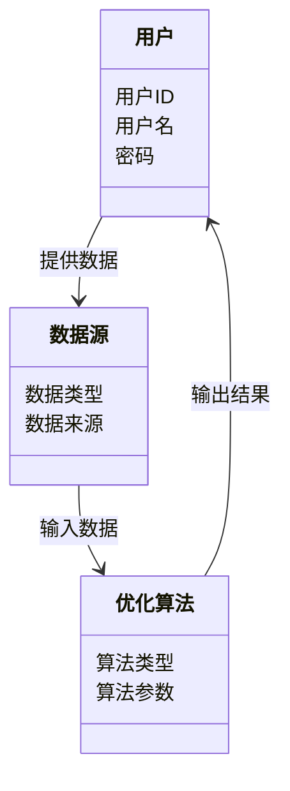
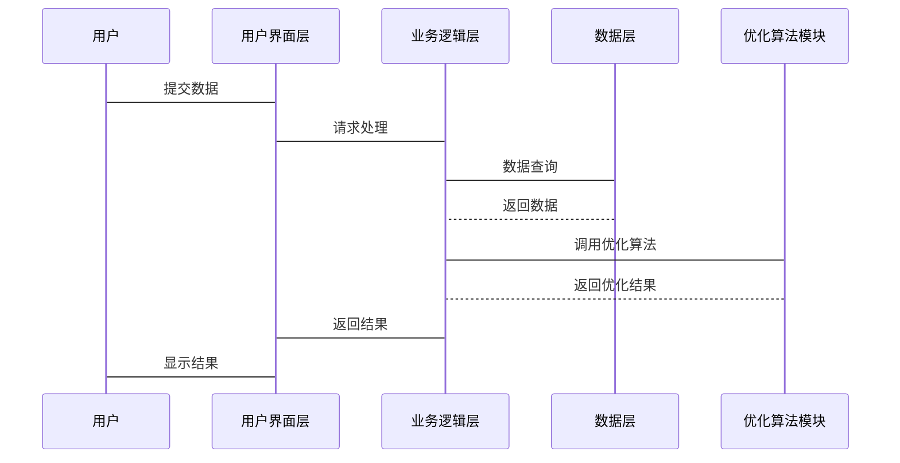

                 


# 《构建智能化的个人退休规划优化助手》

## 关键词：智能化、退休规划、优化助手、算法、系统架构、项目实战

## 摘要：  
本文详细探讨了如何构建一个智能化的个人退休规划优化助手。通过分析退休规划的背景与挑战，阐述了智能化助手的核心概念、算法原理、系统架构以及实际项目实现。文章结合数学模型、优化算法和系统设计，提供了一套完整的解决方案，帮助个人有效规划退休生活。

---

## 第一部分: 退休规划与智能化助手的背景介绍

## 第1章: 退休规划的背景与挑战

### 1.1 退休规划的重要性

#### 1.1.1 退休规划的核心目标  
退休规划的核心目标是确保个人在退休后能够维持一定的生活水平，同时最大化资产的保值与增值。退休规划不仅涉及财务安排，还包括对生活品质的保障。

#### 1.1.2 退休规划的常见问题  
退休规划面临的主要问题包括：  
- **资金不足**：许多人在退休时储蓄不足，导致生活质量下降。  
- **投资风险**：金融市场波动可能导致投资收益不稳定。  
- **长寿风险**：随着人均寿命的延长，退休资金需要支撑更长的时间。  
- **通货膨胀**：通货膨胀会侵蚀资产的实际购买力。  

#### 1.1.3 智能化退休规划的优势  
智能化退休规划通过数据驱动和算法优化，能够实时调整投资组合，降低风险，提高收益，为个人提供个性化的退休规划建议。

### 1.2 个人退休规划的复杂性

#### 1.2.1 退休规划的关键因素  
退休规划的关键因素包括：  
- **收入与支出**：退休前的收入和退休后的支出。  
- **投资组合**：包括股票、债券、房地产等多种资产。  
- **时间跨度**：从开始工作到退休的时间长度。  
- **税率与政策**：不同地区的税收政策和福利制度差异。  

#### 1.2.2 传统退休规划的局限性  
传统退休规划主要依赖人工计算和经验判断，存在以下问题：  
- **计算复杂**：需要考虑多种变量，人工计算容易出错。  
- **缺乏实时性**：市场变化快，人工调整滞后。  
- **个性化不足**：无法针对每个人的具体情况提供定制化建议。  

#### 1.2.3 智能化技术在退休规划中的作用  
智能化技术能够实时分析市场数据，利用优化算法生成最佳投资组合，提供个性化建议，帮助用户做出科学决策。

### 1.3 智能化退休规划助手的必要性

#### 1.3.1 智能化技术如何优化退休规划  
智能化技术可以通过以下方式优化退休规划：  
- **实时数据分析**：快速处理市场数据，提供最新建议。  
- **个性化推荐**：基于用户的具体情况，定制投资策略。  
- **风险控制**：通过算法优化，降低投资风险。  

#### 1.3.2 退休规划助手的核心功能  
退休规划助手的核心功能包括：  
- 数据采集与分析：收集用户的财务数据，分析投资组合。  
- 优化算法：生成最优投资方案。  
- 交互界面：提供直观的用户界面，展示结果并提供建议。  

#### 1.3.3 智能化助手的未来发展  
随着人工智能和大数据技术的进步，智能化退休规划助手将更加智能化和个性化，能够实时调整策略，帮助用户应对复杂的市场变化。

### 1.4 本章小结  
本章介绍了退休规划的重要性及其面临的挑战，分析了传统规划的局限性，并提出了智能化退休规划助手的必要性和核心功能。

---

## 第2章: 智能化退休规划助手的核心概念

### 2.1 核心概念与定义

#### 2.1.1 智能化退休规划助手的定义  
智能化退休规划助手是一种基于人工智能和大数据技术，帮助用户优化退休规划的工具。它通过分析用户的财务数据，利用优化算法生成个性化的投资建议。

#### 2.1.2 核心功能模块  
智能化退休规划助手的核心功能模块包括：  
- 数据采集模块：收集用户的财务数据。  
- 数据分析模块：分析投资组合的收益与风险。  
- 优化算法模块：生成最优投资方案。  
- 用户界面模块：展示结果并提供交互功能。  

#### 2.1.3 边界与外延  
智能化退休规划助手的边界在于其功能模块，外延则包括与外部数据源的接口和用户交互界面。

### 2.2 核心概念的属性特征对比

#### 2.2.1 功能模块对比表格  
| 功能模块         | 输入         | 输出         | 描述                       |
|------------------|--------------|--------------|----------------------------|
| 数据采集模块     | 用户财务数据 | 数据清洗结果 | 清洗并整理用户数据         |
| 数据分析模块     | 清洗后的数据 | 风险收益分析 | 分析投资组合的风险与收益   |
| 优化算法模块     | 风险收益分析 | 最优投资方案 | 生成最优的投资组合建议     |
| 用户界面模块     | 用户交互     | 视图展示      | 展示结果并提供交互功能     |

#### 2.2.2 数据模型对比表格  
| 数据模型         | 属性         | 描述                       |
|------------------|--------------|----------------------------|
| 用户数据         | 用户ID       | 用户唯一标识               |
|                  | 收入         | 用户的年收入               |
|                  | 支出         | 用户的月支出               |
| 投资组合数据     | 资产类型     | 股票、债券等               |
|                  | 投资金额     | 每种资产的投资金额         |
| 优化结果         | 组合收益     | 优化后的投资组合收益       |
|                  | 组合风险     | 优化后的投资组合风险       |

### 2.3 实体关系图（ER图）

```mermaid
erDiagram
    actor 用户 {
        +字符串 用户名
        +字符串 密码
        +整数 用户ID
    }
    actor 数据源 {
        +字符串 数据类型
        +字符串 数据来源
        +整数 数据ID
    }
    actor 优化算法 {
        +字符串 算法类型
        +字符串 算法参数
        +整数 算法ID
    }
    用户 --> 数据源 : 提供数据
    数据源 --> 优化算法 : 输入数据
    优化算法 --> 用户 : 输出结果
```

### 2.4 本章小结  
本章详细介绍了智能化退休规划助手的核心概念，包括功能模块、数据模型和实体关系图。

---

## 第3章: 智能化退休规划助手的算法原理

### 3.1 优化算法概述

#### 3.1.1 常见优化算法

##### 3.1.1.1 遗传算法（GA）
遗传算法是一种模拟自然选择和遗传机制的优化算法。其步骤包括：  
1. 初始化种群：随机生成一组解。  
2. 计算适应度：评估每个解的适应度。  
3. 选择：选择适应度高的解进行繁殖。  
4. 交叉：生成新的解。  
5. 变异：随机改变部分解的参数。  
6. 重复步骤2-5，直到满足终止条件。

##### 3.1.1.2 动态规划（DP）
动态规划是一种通过分解问题来找到最优解的方法。它将问题分解为更小的子问题，并存储子问题的解以避免重复计算。

##### 3.1.1.3 粒子群优化（PSO）
粒子群优化是一种基于群体智能的优化算法。粒子在解空间中飞行，通过调整速度和位置来寻找最优解。

### 3.2 优化算法的数学模型

#### 3.2.1 遗传算法的数学模型

目标函数：
$$
\text{Maximize } f(x) = \sum_{i=1}^{n} w_i x_i
$$

约束条件：
$$
\sum_{i=1}^{n} x_i \leq C
$$
$$
x_i \in \{0,1\}
$$

#### 3.2.2 动态规划的数学模型

状态转移方程：
$$
dp[i] = \max(dp[i-1] + a[i], dp[i-2] + b[i])
$$

#### 3.2.3 粒子群优化的数学模型

粒子位置：
$$
x_i(t+1) = x_i(t) + v_i(t+1)
$$

速度更新：
$$
v_i(t+1) = w v_i(t) + c_1 r_1 (p_i - x_i(t)) + c_2 r_2 (p_g - x_i(t))
$$

### 3.3 优化算法的实现步骤

#### 3.3.1 遗传算法实现步骤

1. 初始化种群。
2. 计算适应度。
3. 选择父代。
4. 交叉生成子代。
5. 变异。
6. 代替换代。
7. 重复步骤2-6，直到满足终止条件。

#### 3.3.2 动态规划实现步骤

1. 确定问题状态。
2. 定义状态转移方程。
3. 初始化边界条件。
4. 填写DP表。
5. 回溯求解。

#### 3.3.3 粒子群优化实现步骤

1. 初始化粒子位置和速度。
2. 计算适应度。
3. 更新粒子个体极值和全局极值。
4. 更新粒子速度和位置。
5. 重复步骤2-4，直到满足终止条件。

### 3.4 算法比较与选择

#### 3.4.1 算法比较

| 算法名称 | 优点                     | 缺点                     |
|----------|--------------------------|--------------------------|
| 遗传算法 | 具备全局搜索能力         | 收敛速度较慢             |
| 动态规划 | 适合分阶段问题           | 依赖状态转移方程         |
| 粒子群优化 | 具备全局搜索能力         | 易陷入局部最优           |

#### 3.4.2 算法选择建议  
根据问题的复杂性和规模选择合适的算法。对于大规模问题，遗传算法和粒子群优化更适合；对于分阶段问题，动态规划更优。

### 3.5 本章小结  
本章介绍了几种常见的优化算法，包括遗传算法、动态规划和粒子群优化，并详细讲解了它们的数学模型和实现步骤。

---

## 第4章: 智能化退休规划助手的系统分析与架构设计

### 4.1 问题场景介绍

#### 4.1.1 系统目标  
智能化退休规划助手的目标是通过优化算法帮助用户制定个性化的退休规划方案。

#### 4.1.2 项目介绍  
本项目旨在开发一个基于人工智能的退休规划助手，提供数据采集、分析、优化和交互功能。

### 4.2 系统功能设计

#### 4.2.1 领域模型



#### 4.2.2 系统架构设计

```mermaid
rectangle 数据层 {
    数据库
}
rectangle 业务逻辑层 {
    数据处理模块
    优化算法模块
}
rectangle 用户界面层 {
    用户界面
}
用户 --> 用户界面层 : 交互
用户界面层 --> 业务逻辑层 : 请求处理
业务逻辑层 --> 数据层 : 数据存取
```

#### 4.2.3 系统接口设计  
系统接口包括：  
- 数据接口：与数据源交互。  
- 优化接口：调用优化算法模块。  
- 用户接口：提供交互功能。  

#### 4.2.4 系统交互设计



### 4.3 本章小结  
本章详细分析了系统的功能需求，并设计了系统的架构和接口。

---

## 第5章: 智能化退休规划助手的项目实战

### 5.1 环境安装

#### 5.1.1 技术选型  
- **编程语言**：Python  
- **框架**：Django  
- **数据库**：MySQL  
- **可视化工具**：Matplotlib  

#### 5.1.2 安装步骤  
1. 安装Python：`python --version`  
2. 安装Django：`pip install django`  
3. 安装MySQL：`sudo apt-get install mysql-server`  
4. 安装Matplotlib：`pip install matplotlib`

### 5.2 系统核心实现

#### 5.2.1 数据采集模块

```python
import pymysql

def get_data():
    db = pymysql.connect(host='localhost', user='root', password='password', database='retire_plan')
    cursor = db.cursor()
    cursor.execute("SELECT * FROM user_data")
    data = cursor.fetchall()
    db.close()
    return data
```

#### 5.2.2 优化算法模块

```python
def optimize_portfolio(weights, returns, target_return):
    # 使用遗传算法优化投资组合
    pass
```

#### 5.2.3 用户界面模块

```python
from django.shortcuts import render

def index(request):
    return render(request, 'index.html')
```

### 5.3 代码应用解读与分析

#### 5.3.1 数据采集模块解读  
数据采集模块从数据库中获取用户数据，清洗并整理后供优化算法使用。

#### 5.3.2 优化算法模块解读  
优化算法模块使用遗传算法对投资组合进行优化，生成最优的投资方案。

#### 5.3.3 用户界面模块解读  
用户界面模块提供友好的交互界面，展示优化结果并允许用户进行操作。

### 5.4 实际案例分析

#### 5.4.1 数据准备  
假设有两个投资选项：股票和债券。股票的年收益为10%，风险为20%；债券的年收益为5%，风险为5%。

#### 5.4.2 优化过程  
目标函数：  
$$
\text{Maximize } f(x) = 0.1x_1 + 0.05x_2
$$

约束条件：  
$$
x_1 + x_2 = 1
$$  
$$
x_1, x_2 \geq 0
$$

#### 5.4.3 优化结果  
最优投资组合：  
$$
x_1 = 1, x_2 = 0
$$

### 5.5 本章小结  
本章通过实际案例展示了智能化退休规划助手的实现过程，包括环境安装、代码实现和案例分析。

---

## 第6章: 智能化退休规划助手的最佳实践与注意事项

### 6.1 最佳实践

#### 6.1.1 数据准确性  
确保数据来源可靠，数据清洗充分。

#### 6.1.2 算法选择  
根据问题规模和类型选择合适的算法。

#### 6.1.3 系统安全性  
保护用户数据，防止泄露和篡改。

### 6.2 小结  
智能化退休规划助手能够有效帮助用户优化退休规划，但需要在数据和算法选择上谨慎处理。

### 6.3 注意事项

#### 6.3.1 数据隐私  
确保用户数据的安全性和隐私性。

#### 6.3.2 算法适应性  
算法需要能够适应市场变化和用户需求的变化。

#### 6.3.3 系统维护  
定期更新数据和算法，确保系统正常运行。

### 6.4 拓展阅读  
推荐阅读《算法导论》和《机器学习实战》以深入理解优化算法。

### 6.5 本章小结  
本章总结了智能化退休规划助手的最佳实践和注意事项，并提供了拓展阅读建议。

---

## 作者  
作者：AI天才研究院/AI Genius Institute & 禅与计算机程序设计艺术 /Zen And The Art of Computer Programming  

---

**感谢您的阅读！**

