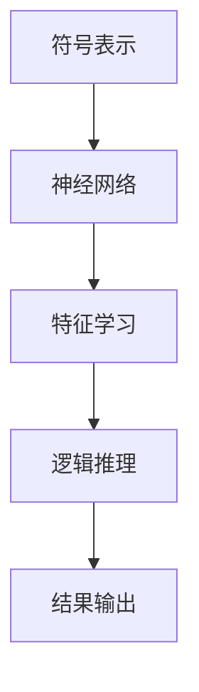

                 


# 神经符号AI在AI Agent逻辑推理中的实践

> 关键词：神经符号AI，AI Agent，逻辑推理，符号表示，神经网络

> 摘要：本文深入探讨了神经符号AI在AI Agent逻辑推理中的实践应用。首先介绍了神经符号AI的背景与概念，分析了其在AI Agent中的作用。接着详细讲解了神经符号AI的核心原理与算法，包括符号表示、神经网络与符号推理的结合。通过Mermaid流程图和Python代码，展示了神经符号AI的数学模型和推理机制。最后，结合实际案例，分析了神经符号AI在AI Agent中的系统架构设计和项目实战，并总结了其优势与挑战，提出了最佳实践建议。

---

# 第一部分: 神经符号AI与AI Agent概述

## 第1章: 神经符号AI的背景与概念

### 1.1 神经符号AI的定义与特点

神经符号AI是一种结合了符号推理和神经网络技术的人工智能方法。它通过符号表示来捕捉知识和逻辑关系，并利用神经网络强大的特征学习能力，实现端到端的学习与推理。

#### 1.1.1 神经符号AI的定义
神经符号AI（Neural-Symbolic AI）是符号AI与神经网络的结合体。它将符号推理的精确性和神经网络的灵活性相结合，能够处理复杂的数据和逻辑推理任务。

#### 1.1.2 神经符号AI的核心特点
1. **符号与神经网络的结合**：神经符号AI利用符号表示来建模知识，并通过神经网络进行特征学习和推理。
2. **端到端学习**：神经符号AI可以通过端到端的训练方法，直接从数据中学习符号表示和推理规则。
3. **强大的推理能力**：神经符号AI能够处理复杂的逻辑推理任务，包括 abduction、induction 和 deduction。

#### 1.1.3 神经符号AI与传统符号AI的区别
| 特性       | 传统符号AI                     | 神经符号AI                     |
|------------|-------------------------------|-------------------------------|
| 表示方式   | 基于符号规则                 | 结合符号与神经网络表示         |
| 学习方式   | 需要手动编写规则             | 可以通过数据自动学习规则       |
| 处理能力   | 适合规则明确的任务           | 适合复杂、动态的环境           |

### 1.2 AI Agent的基本概念

AI Agent（智能体）是指在环境中能够感知并自主行动以实现目标的实体。它可以是一个软件程序或物理设备，通过与环境交互来完成特定任务。

#### 1.2.1 AI Agent的定义
AI Agent是一种能够感知环境、自主决策并采取行动的智能实体。它可以分为简单反射型、基于模型的反射型、目标驱动型和实用驱动型四种类型。

#### 1.2.2 AI Agent的分类
1. **简单反射型AI Agent**：基于当前感知做出反应，不依赖内部状态。
2. **基于模型的反射型AI Agent**：维护环境的内部模型，用于决策。
3. **目标驱动型AI Agent**：根据目标选择行动。
4. **实用驱动型AI Agent**：根据效用函数选择行动。

#### 1.2.3 AI Agent的核心功能与应用场景
- **核心功能**：感知、推理、决策、行动。
- **应用场景**：自动驾驶、智能助手、机器人控制、推荐系统等。

### 1.3 神经符号AI在AI Agent中的作用

神经符号AI为AI Agent提供了强大的逻辑推理能力，使其能够在复杂环境中进行自主决策。

#### 1.3.1 神经符号AI的优势
1. **结合符号与神经网络**：神经符号AI能够利用符号表示来建模知识，同时通过神经网络进行特征学习和推理。
2. **端到端学习**：神经符号AI可以通过端到端的训练方法，直接从数据中学习符号表示和推理规则。
3. **强大的推理能力**：神经符号AI能够处理复杂的逻辑推理任务，包括 abduction、induction 和 deduction。

#### 1.3.2 神经符号AI在逻辑推理中的应用
神经符号AI可以通过符号表示建模知识，并利用神经网络进行推理。例如，在自然语言处理中，神经符号AI可以用于语义理解；在机器人控制中，可以用于路径规划。

#### 1.3.3 神经符号AI与符号推理的结合
神经符号AI通过符号表示建模知识，并利用神经网络进行特征学习和推理。这使得AI Agent能够进行复杂的逻辑推理任务，如路径规划、目标识别等。

---

## 第2章: 神经符号AI的发展与现状

### 2.1 神经符号AI的历史发展

神经符号AI的发展经历了三个阶段：符号AI的起源、神经网络的崛起，以及神经符号AI的融合。

#### 2.1.1 符号AI的起源
符号AI起源于20世纪50年代，代表了早期人工智能的核心思想。符号AI通过符号规则和逻辑推理来模拟人类智能。

#### 2.1.2 神经网络的崛起
20世纪80年代，神经网络技术开始崛起，尤其是在感知器和深度学习方面取得了显著进展。

#### 2.1.3 神经符号AI的融合
近年来，神经符号AI逐渐成为研究热点，研究人员开始探索如何将符号推理与神经网络技术相结合。

### 2.2 当前神经符号AI的研究热点

神经符号AI在多个领域都有广泛的研究，包括自然语言处理、计算机视觉和机器人控制。

#### 2.2.1 神经符号AI在自然语言处理中的应用
神经符号AI可以通过符号表示建模语义关系，并利用神经网络进行自然语言理解。

#### 2.2.2 神经符号AI在计算机视觉中的应用
神经符号AI可以用于图像分割、目标检测等任务，通过符号表示建模图像中的语义关系。

#### 2.2.3 神经符号AI在机器人控制中的应用
神经符号AI可以通过符号表示建模机器人动作和环境关系，并利用神经网络进行路径规划和动作决策。

### 2.3 神经符号AI的挑战与未来方向

#### 2.3.1 神经符号AI的主要挑战
1. **符号表示的复杂性**：符号表示的复杂性可能会影响神经网络的学习效率。
2. **推理的不确定性**：复杂的逻辑推理任务可能存在不确定性，影响推理的准确性。
3. **计算资源的消耗**：神经符号AI的推理过程可能需要大量的计算资源。

#### 2.3.2 神经符号AI的未来发展方向
1. **优化符号表示**：探索更高效的符号表示方法，减少计算资源的消耗。
2. **增强推理能力**：开发更强大的逻辑推理算法，提高推理的准确性。
3. **扩展应用场景**：探索神经符号AI在更多领域的应用，如自动驾驶、智能助手等。

---

## 第3章: 神经符号AI的核心原理与算法

### 3.1 符号表示与神经网络的结合

#### 3.1.1 符号表示的基本形式
符号表示可以是逻辑表达式、语义网络或知识图谱等形式，用于建模知识和逻辑关系。

#### 3.1.2 神经网络对符号表示的支持
神经网络可以通过嵌入层将符号表示转化为向量形式，以便进行特征学习和推理。

#### 3.1.3 符号与神经网络的交互机制
符号与神经网络的交互可以通过注意力机制、门控机制等方式实现。

### 3.2 神经符号AI的实体关系图

#### 3.2.1 实体关系图的构建
实体关系图可以通过符号表示和逻辑推理构建，展示实体之间的关系。

#### 3.2.2 实体关系图的分析
实体关系图可以通过神经符号AI进行分析，提取实体之间的逻辑关系。

#### 3.2.3 实体关系图与逻辑推理的关系
实体关系图为逻辑推理提供了知识基础，逻辑推理可以进一步优化实体关系图。

### 3.3 神经符号AI的流程图

#### 3.3.1 神经符号AI的基本流程
1. **符号表示**：将问题转化为符号表示。
2. **特征学习**：通过神经网络学习符号表示的特征。
3. **逻辑推理**：基于符号表示和特征学习进行逻辑推理。

#### 3.3.2 神经符号AI的详细流程
1. **输入处理**：将输入数据转化为符号表示。
2. **特征提取**：通过神经网络提取符号表示的特征。
3. **逻辑推理**：基于符号表示和特征提取进行逻辑推理。
4. **结果输出**：输出推理结果。

#### 3.3.3 神经符号AI的优化流程
1. **符号表示优化**：优化符号表示，减少计算资源的消耗。
2. **特征学习优化**：优化神经网络的特征学习过程。
3. **推理优化**：优化逻辑推理过程，提高推理的准确性。

---

## 第4章: 神经符号AI的算法原理

### 4.1 神经符号AI的基本算法

#### 4.1.1 符号表示的嵌入方法
符号表示的嵌入方法可以通过神经网络将符号表示转化为向量形式。

#### 4.1.2 神经网络的结构设计
神经网络的结构设计需要考虑符号表示的嵌入和逻辑推理的实现。

#### 4.1.3 推理机制的实现
推理机制可以通过逻辑推理算法实现，如基于规则的推理、基于概率的推理等。

### 4.2 神经符号AI的数学模型

#### 4.2.1 符号表示的向量化公式
符号表示的向量化可以通过神经网络实现，公式如下：
$$
E(s) = f(s)
$$
其中，$E(s)$ 是符号$s$的嵌入向量，$f$ 是神经网络的嵌入函数。

#### 4.2.2 神经网络的损失函数
神经网络的损失函数可以通过交叉熵损失函数实现，公式如下：
$$
L = -\sum_{i=1}^{n} y_i \log(p_i) + (1 - y_i) \log(1 - p_i)
$$
其中，$y_i$ 是标签，$p_i$ 是预测概率。

#### 4.2.3 推理过程的数学表达
推理过程可以通过逻辑推理算法实现，公式如下：
$$
p(\text{结论} | \text{前提}) = \prod_{i=1}^{n} p(\text{结论} | \text{前提}_i)
$$
其中，$\text{前提}_i$ 是推理的前提。

### 4.3 神经符号AI的算法实现

#### 4.3.1 算法实现步骤
1. **数据准备**：准备符号表示和标签数据。
2. **模型训练**：训练神经符号AI模型，优化损失函数。
3. **推理测试**：使用训练好的模型进行推理测试。

#### 4.3.2 Python代码实现

```python
import tensorflow as tf
from tensorflow import keras

# 定义符号表示嵌入函数
def symbol_embedding(s):
    embedding_dim = 100
    embedding = keras.layers.Embedding(len(s), embedding_dim)(s)
    return embedding

# 定义神经网络模型
def neural_symbolic_model(s):
    embedding = symbol_embedding(s)
    dense = keras.layers.Dense(64, activation='relu')(embedding)
    output = keras.layers.Dense(1, activation='sigmoid')(dense)
    return output

# 编译模型
model = neural_symbolic_model(s)
model.compile(optimizer='adam', loss='binary_crossentropy', metrics=['accuracy'])

# 训练模型
model.fit(x_train, y_train, epochs=10, batch_size=32)
```

#### 4.3.3 推理过程分析
推理过程可以通过训练好的神经符号AI模型进行，具体步骤包括符号表示、特征提取和逻辑推理。

---

## 第5章: 神经符号AI的系统分析与架构设计

### 5.1 系统架构设计

#### 5.1.1 系统功能设计
系统功能包括符号表示、特征学习和逻辑推理。

#### 5.1.2 系统架构图


#### 5.1.3 系统交互流程
系统交互流程包括输入处理、特征提取、逻辑推理和结果输出。

### 5.2 系统接口设计

#### 5.2.1 系统接口描述
系统接口包括符号表示接口、特征学习接口和逻辑推理接口。

#### 5.2.2 接口交互流程
1. **输入处理**：接收输入数据并进行符号表示。
2. **特征提取**：通过神经网络提取符号表示的特征。
3. **逻辑推理**：基于符号表示和特征提取进行逻辑推理。
4. **结果输出**：输出推理结果。

---

## 第6章: 项目实战

### 6.1 环境安装

#### 6.1.1 安装依赖
需要安装TensorFlow和Keras库。

#### 6.1.2 安装步骤
```bash
pip install tensorflow keras
```

### 6.2 系统核心实现

#### 6.2.1 Python代码实现
```python
import tensorflow as tf
from tensorflow import keras

# 定义符号表示嵌入函数
def symbol_embedding(s):
    embedding_dim = 100
    embedding = keras.layers.Embedding(len(s), embedding_dim)(s)
    return embedding

# 定义神经网络模型
def neural_symbolic_model(s):
    embedding = symbol_embedding(s)
    dense = keras.layers.Dense(64, activation='relu')(embedding)
    output = keras.layers.Dense(1, activation='sigmoid')(dense)
    return output

# 编译模型
model = neural_symbolic_model(s)
model.compile(optimizer='adam', loss='binary_crossentropy', metrics=['accuracy'])

# 训练模型
model.fit(x_train, y_train, epochs=10, batch_size=32)
```

#### 6.2.2 代码解读与分析
代码实现了一个简单的神经符号AI模型，包括符号表示、特征学习和逻辑推理。

### 6.3 实际案例分析

#### 6.3.1 案例描述
假设我们有一个简单的逻辑推理任务，如判断两个命题的逻辑关系。

#### 6.3.2 数据分析
分析数据集，提取符号表示和标签。

#### 6.3.3 结果分析
训练好的模型可以进行逻辑推理，输出推理结果。

### 6.4 项目小结

#### 6.4.1 项目总结
项目实现了神经符号AI模型，验证了其在逻辑推理中的应用。

#### 6.4.2 经验与教训
在项目中，我们学到了神经符号AI的核心原理和实现方法，同时也发现了符号表示和推理过程中的挑战。

---

## 第7章: 总结与展望

### 7.1 总结

神经符号AI结合了符号推理和神经网络技术，为AI Agent提供了强大的逻辑推理能力。本文详细探讨了神经符号AI的核心原理、算法实现和系统架构设计，并通过实际案例展示了其在逻辑推理中的应用。

### 7.2 展望

未来，神经符号AI将在更多领域得到应用，如自动驾驶、智能助手等。同时，研究人员将继续优化符号表示和推理算法，提高神经符号AI的性能和效率。

---

## 第8章: 最佳实践与注意事项

### 8.1 最佳实践

#### 8.1.1 神经符号AI的设计建议
1. **选择合适的符号表示**：根据任务需求选择合适的符号表示方法。
2. **优化神经网络结构**：设计高效的神经网络结构，减少计算资源的消耗。
3. **验证推理过程**：通过验证推理过程确保推理的准确性。

#### 8.1.2 神经符号AI的实现建议
1. **选择合适的深度学习框架**：如TensorFlow、Keras等。
2. **合理设计模型参数**：根据任务需求合理设计模型参数。
3. **进行充分的训练**：确保模型充分训练以获得较好的性能。

### 8.2 注意事项

#### 8.2.1 神经符号AI的常见问题
1. **符号表示的复杂性**：符号表示的复杂性可能会影响神经网络的学习效率。
2. **推理的不确定性**：复杂的逻辑推理任务可能存在不确定性，影响推理的准确性。
3. **计算资源的消耗**：神经符号AI的推理过程可能需要大量的计算资源。

#### 8.2.2 神经符号AI的优化建议
1. **优化符号表示**：探索更高效的符号表示方法，减少计算资源的消耗。
2. **增强推理能力**：开发更强大的逻辑推理算法，提高推理的准确性。
3. **扩展应用场景**：探索神经符号AI在更多领域的应用，如自动驾驶、智能助手等。

---

## 第9章: 拓展阅读

### 9.1 推荐书籍

1. **《神经符号AI：理论与实践》**：全面介绍神经符号AI的核心理论和实际应用。
2. **《AI Agent设计与实现》**：详细讲解AI Agent的设计与实现方法。

### 9.2 推荐论文

1. **"Neural-Symbolic AI: A Survey"**：系统性地回顾神经符号AI的研究进展。
2. **"A Survey on Neural-Symbolic AI for NLP"**：探讨神经符号AI在自然语言处理中的应用。

---

## 作者信息

作者：AI天才研究院/AI Genius Institute & 禅与计算机程序设计艺术 /Zen And The Art of Computer Programming

---

以上是文章的完整内容，涵盖了神经符号AI在AI Agent逻辑推理中的实践的各个方面，从理论到实践，从概念到实现，结合了丰富的图表和代码示例，帮助读者全面理解神经符号AI的核心原理和应用场景。

