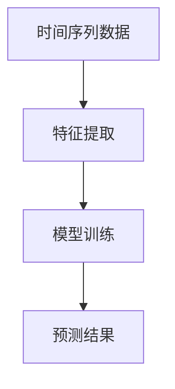
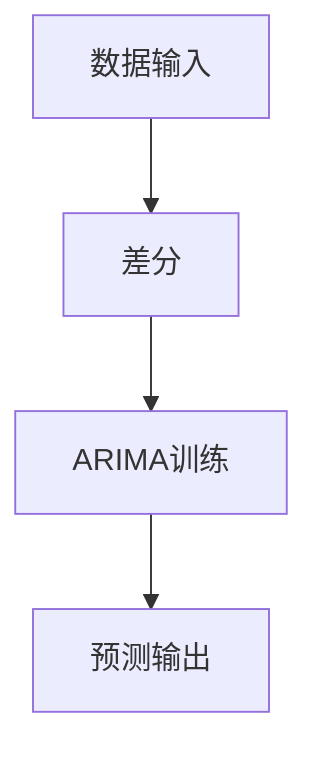
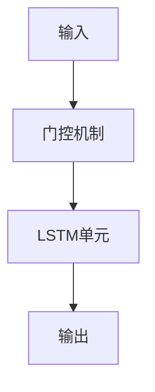
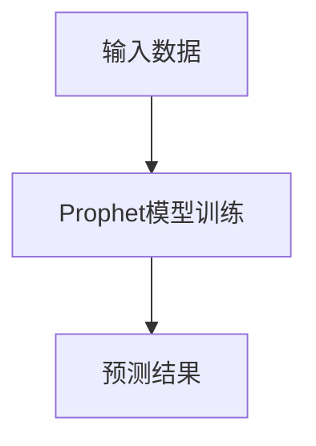
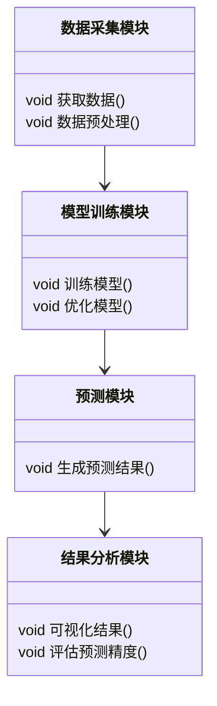
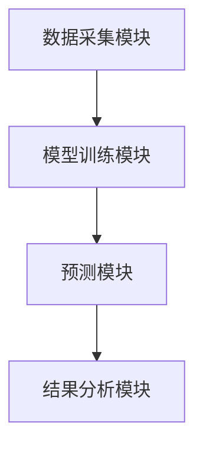
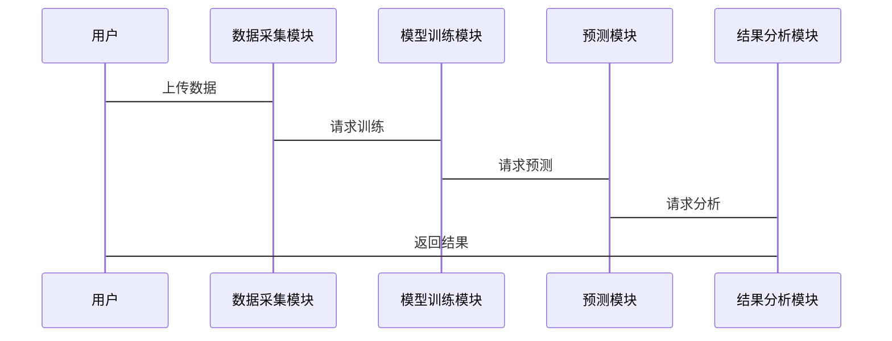

                 


# AI Agent的时序预测：理解和预测时间序列

> **关键词**：AI Agent，时间序列，时序预测，ARIMA模型，LSTM网络，Prophet模型

> **摘要**：本文深入探讨了AI Agent在时间序列预测中的应用，分析了时序预测的基本原理、常见算法及其数学模型，并通过实际案例展示了如何构建和优化时序预测系统。文章内容从背景介绍、核心概念、算法原理、数学模型、系统架构到项目实战，层层递进，旨在帮助读者全面掌握时序预测的核心技术和实践方法。

---

# 第一部分: AI Agent的时序预测基础

## 第1章: 时序预测的背景与概念

### 1.1 时序预测的背景介绍

#### 1.1.1 时序预测的定义与特点
时间序列预测（Time Series Forecasting）是一种通过历史数据预测未来趋势的技术。其特点是数据按时间顺序排列，且具有很强的依赖性。时序预测广泛应用于金融、气象、能源、交通等领域。

#### 1.1.2 时序预测的应用场景
- 金融领域：股票价格预测、汇率波动分析
- 气象领域：天气预报、气候预测
- 能源领域：电力需求预测、负荷预测
- 交通领域：客流量预测、交通拥堵预测

#### 1.1.3 时序预测的挑战与难点
- 数据的非线性：时间序列往往具有复杂的非线性关系
- 数据的稀疏性：某些时间序列数据可能较为稀疏
- 数据的噪声：实际数据中常常存在噪声干扰

### 1.2 AI Agent与时序预测的结合

#### 1.2.1 AI Agent的基本概念
AI Agent（智能体）是一种能够感知环境并采取行动以实现目标的实体。它可以自主决策，具有学习和适应能力。

#### 1.2.2 AI Agent在时序预测中的作用
AI Agent可以通过分析历史数据，识别模式和趋势，从而做出准确的预测。其自主学习和优化能力使其在时序预测中表现出色。

#### 1.2.3 AI Agent与传统时序预测的区别
- 数据驱动 vs. 规则驱动：AI Agent基于数据学习模式，而传统方法依赖于人工设定规则
- 自适应性：AI Agent能够根据环境变化自动调整预测模型
- 复杂性：AI Agent的预测过程涉及多个模块的协同工作，而传统方法相对简单

### 1.3 本章小结
本章介绍了时序预测的基本概念、应用场景及其在AI Agent中的应用。AI Agent的独特优势使其在时序预测领域具有广泛的应用前景。

---

## 第2章: 时序预测的核心概念与联系

### 2.1 时序预测的核心原理

#### 2.1.1 时间序列的分解与特征提取
时间序列可以通过分解为趋势、季节性和随机成分来分析。特征提取是通过统计方法（如均值、方差、自相关系数等）提取有用的信息。

#### 2.1.2 时间序列的平稳性与差分方法
平稳时间序列具有恒定的均值和方差。非平稳序列可以通过差分方法转化为平稳序列。

#### 2.1.3 时间序列的预测模型选择
选择合适的预测模型需要考虑数据的特性、模型的复杂度以及预测精度。

### 2.2 核心概念对比分析

#### 2.2.1 不同时序预测模型的特征对比（表格形式）

| 模型     | 是否需要平稳性 | 需要大量数据 | 计算复杂度 |
|----------|----------------|--------------|------------|
| ARIMA    | 是             | 一般          | 中等        |
| LSTM     | 否             | 一般          | 高          |
| Prophet  | 否             | 一般          | 中等        |

#### 2.2.2 实体关系图（Mermaid流程图）



### 2.3 本章小结
本章通过对比分析，介绍了不同时间序列预测模型的特点及其适用场景，为后续的模型选择提供了依据。

---

## 第3章: 时序预测的算法原理

### 3.1 常见时序预测算法概述

#### 3.1.1 ARIMA模型
ARIMA（自回归积分滑动平均）模型适用于平稳时间序列。其基本假设是数据具有线性趋势和季节性。

#### 3.1.2 LSTM网络
LSTM（长短期记忆网络）是一种基于深度学习的模型，能够捕捉时间序列中的长距离依赖关系。

#### 3.1.3 Prophet模型
Prophet模型是由Facebook开源的时序预测工具，适合非平稳时间序列的预测。

### 3.2 算法原理详细讲解

#### 3.2.1 ARIMA模型的数学公式与流程图（Mermaid）

##### ARIMA模型公式
$$ ARIMA(p, d, q) $$
其中，p为自回归阶数，d为差分阶数，q为滑动平均阶数。

##### ARIMA模型流程图



#### 3.2.2 LSTM网络的数学公式与流程图（Mermaid）

##### LSTM网络公式
$$ f(t) = \sigma(W_f \cdot [h_{t-1}, x_t] + b_f) $$
其中，σ表示sigmoid函数，W_f和b_f是权重矩阵和偏置。

##### LSTM网络流程图



#### 3.2.3 Prophet模型的数学公式与流程图（Mermaid）

##### Prophet模型公式
$$ y(t) = g(t) + \epsilon $$
其中，g(t)是模型的预测函数，ε是误差项。

##### Prophet模型流程图



### 3.3 算法实现与代码示例

#### 3.3.1 ARIMA模型的Python代码实现

```python
from statsmodels.tsa.arima.model import ARIMA

# 数据准备
data = [...]  # 时间序列数据

# 模型训练
model = ARIMA(data, order=(p, d, q))
model_fit = model.fit()

# 预测
forecast = model_fit.forecast(steps=5)
print(forecast)
```

#### 3.3.2 LSTM网络的Python代码实现

```python
import keras
from keras.layers import LSTM, Dense

# 数据准备
X = [...]  # 输入数据
y = [...]  # 标签

# 模型构建
model = keras.Sequential()
model.add(LSTM(units=50, input_shape=(timesteps, features)))
model.add(Dense(1))
model.compile(optimizer='adam', loss='mean_squared_error')

# 模型训练
model.fit(X, y, epochs=100, batch_size=32)
```

#### 3.3.3 Prophet模型的Python代码实现

```python
from fbprophet import Prophet

# 数据准备
df = [...]  # 数据框

# 模型训练
model = Prophet()
model.fit(df)

# 预测
future = model.make_future_dataframe(periods=5)
 forecast = model.predict(future)
print(forecast)
```

### 3.4 本章小结
本章详细讲解了ARIMA、LSTM和Prophet三种时序预测算法的原理和实现方法，并通过代码示例帮助读者理解如何应用这些模型。

---

## 第4章: 时序预测的数学模型与公式

### 4.1 时间序列的数学模型

#### 4.1.1 平稳时间序列的ARIMA模型
ARIMA模型通过自回归和滑动平均的组合实现预测。其数学公式如下：

$$ y_t = \phi_1 y_{t-1} + \phi_2 y_{t-2} + \dots + \phi_p y_{t-p} + \theta_1 e_{t-1} + \dots + \theta_q e_{t-q} + \epsilon_t $$

#### 4.1.2 非平稳时间序列的处理方法
通过差分法将非平稳序列转化为平稳序列：

$$ y_t - y_{t-1} = \phi_1 (y_{t-1} - y_{t-2}) + \dots + \epsilon_t $$

#### 4.1.3 LSTM网络的数学基础
LSTM通过门控机制捕捉长期依赖关系。其核心公式包括输入门、遗忘门和输出门：

$$ i_t = \sigma(W_i x_t + U_i h_{t-1} + b_i) $$
$$ f_t = \sigma(W_f x_t + U_f h_{t-1} + b_f) $$
$$ o_t = \sigma(W_o x_t + U_o h_{t-1} + b_o) $$
$$ h_t = i_t \cdot \tilde{h}_t + f_t \cdot h_{t-1} $$

### 4.2 常见时序预测模型的数学公式

#### 4.2.1 ARIMA模型的公式推导
ARIMA模型通过AR和MA的结合实现预测：

$$ (1 - L^p)X_t = (1 - B^q)Z_t $$

其中，L表示滞后算子，B表示单位根算子。

#### 4.2.2 LSTM网络的公式推导
LSTM的细胞状态更新公式为：

$$ c_t = f_t \cdot c_{t-1} + i_t \cdot \tilde{h}_t $$

其中，$f_t$是遗忘门，$i_t$是输入门，$\tilde{h}_t$是候选隐藏状态。

#### 4.2.3 Prophet模型的公式推导
Prophet模型将时间序列分解为趋势、周期性和噪声：

$$ y(t) = g(t) + s(t) + \epsilon_t $$

其中，$g(t)$是趋势函数，$s(t)$是季节性函数，$\epsilon_t$是误差项。

### 4.3 公式与案例结合讲解

#### 4.3.1 ARIMA模型的案例分析
假设我们有一个销售数据的时间序列，可以通过ARIMA模型预测未来几个月的销售量。

#### 4.3.2 LSTM网络的案例分析
使用LSTM网络预测股票价格波动，可以通过门控机制捕捉价格的长期趋势。

#### 4.3.3 Prophet模型的案例分析
Prophet模型可以用来预测网站流量，通过趋势和季节性函数的结合实现准确预测。

### 4.4 本章小结
本章通过数学公式的推导和实际案例分析，帮助读者深入理解时序预测模型的工作原理。

---

## 第5章: 时序预测系统的分析与架构设计

### 5.1 项目背景与目标

#### 5.1.1 项目背景介绍
随着数据量的增加，传统的时序预测方法逐渐暴露出计算复杂度高、预测精度低的缺点。AI Agent的引入为时序预测提供了新的解决方案。

#### 5.1.2 项目目标设定
构建一个基于AI Agent的时序预测系统，实现对复杂时间序列的高精度预测。

#### 5.1.3 项目范围界定
系统将支持多种预测模型的集成，具备良好的扩展性和可维护性。

### 5.2 系统功能设计

#### 5.2.1 系统功能模块划分
- 数据采集模块：负责数据的获取和预处理
- 模型训练模块：负责模型的训练和优化
- 预测模块：负责生成预测结果
- 结果分析模块：负责结果的可视化和评估

#### 5.2.2 功能模块之间的关系（Mermaid类图）



### 5.3 系统架构设计

#### 5.3.1 系统架构选择
采用微服务架构，各功能模块独立部署，便于扩展和维护。

#### 5.3.2 系统架构图（Mermaid架构图）



### 5.4 系统接口与交互设计

#### 5.4.1 系统接口设计
- 数据接口：提供REST API用于数据的上传和下载
- 模型接口：提供API用于模型的训练和预测

#### 5.4.2 系统交互流程（Mermaid序列图）



### 5.5 本章小结
本章通过系统功能设计和架构设计，展示了如何构建一个高效的时序预测系统。

---

## 第6章: 时序预测的项目实战

### 6.1 环境搭建与数据准备

#### 6.1.1 开发环境安装与配置
- 安装Python和必要的库（如statsmodels、keras、fbprophet）
- 安装Jupyter Notebook用于数据可视化

#### 6.1.2 数据集获取与预处理
从公开数据集（如Kaggle）获取时间序列数据，并进行清洗和标准化处理。

#### 6.1.3 数据可视化与分析
使用Matplotlib或Seaborn库绘制时间序列图，分析数据的分布和趋势。

### 6.2 系统核心功能实现

#### 6.2.1 数据预处理与特征提取
- 去除噪声数据
- 填充缺失值
- 标准化数据

#### 6.2.2 模型训练与优化
选择合适的模型进行训练，并通过交叉验证优化模型参数。

#### 6.2.3 模型预测与结果分析
生成预测结果，并与实际数据进行对比，评估模型的准确度。

### 6.3 代码实现与案例分析

#### 6.3.1 ARIMA模型的实战代码

```python
from statsmodels.tsa.arima.model import ARIMA
import pandas as pd

# 数据准备
data = pd.read_csv('time_series.csv')
data = data['value'].values

# 模型训练
model = ARIMA(data, order=(5, 1, 2))
model_fit = model.fit()

# 预测
forecast = model_fit.forecast(steps=10)
print(forecast)
```

#### 6.3.2 LSTM网络的实战代码

```python
import keras
from keras.layers import LSTM, Dense
import numpy as np

# 数据准备
X_train = np.random.rand(100, 5, 1)
y_train = np.random.rand(100, 1)

# 模型构建
model = keras.Sequential()
model.add(LSTM(units=50, input_shape=(5, 1)))
model.add(Dense(1))
model.compile(optimizer='adam', loss='mean_squared_error')

# 模型训练
model.fit(X_train, y_train, epochs=10, batch_size=32)
```

#### 6.3.3 Prophet模型的实战代码

```python
from fbprophet import Prophet
import pandas as pd

# 数据准备
df = pd.DataFrame({'ds': pd.date_range('2020-01-01', '2020-12-31'), 'y': np.random.rand(365)})
model = Prophet()
model.fit(df)

# 预测
future = model.make_future_dataframe(periods=30)
 forecast = model.predict(future)
print(forecast)
```

### 6.4 案例分析与总结

#### 6.4.1 ARIMA模型案例分析
通过股票价格数据的预测，展示ARIMA模型的预测效果。

#### 6.4.2 LSTM网络案例分析
使用气象数据预测温度变化，展示LSTM网络的长距离依赖捕捉能力。

#### 6.4.3 Prophet模型案例分析
通过网站流量数据预测，展示Prophet模型的易用性和预测精度。

### 6.5 本章小结
本章通过实际项目案例，展示了如何使用不同的时序预测模型进行预测，并对模型的优缺点进行了分析。

---

## 第7章: 总结与展望

### 7.1 本章小结
本文系统地介绍了AI Agent在时间序列预测中的应用，详细讲解了常见时序预测算法的原理和实现方法，并通过实际案例展示了如何构建和优化时序预测系统。

### 7.2 最佳实践 tips
- 在实际项目中，建议根据数据特性选择合适的预测模型
- 数据预处理是模型训练的关键步骤
- 模型的调参和优化可以显著提高预测精度

### 7.3 未来展望
随着AI技术的不断发展，时序预测将更加智能化和自动化。未来的研究方向包括模型的自适应优化、多模态数据的融合以及实时预测能力的提升。

---

**作者：AI天才研究院/AI Genius Institute & 禅与计算机程序设计艺术 /Zen And The Art of Computer Programming**

---

通过本文的系统讲解，读者可以全面掌握AI Agent的时序预测技术，并在实际项目中灵活应用这些知识。

