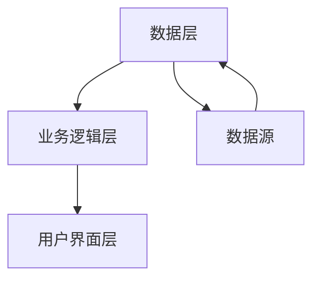

                 


# AI协作分析公司社会责任实践：全面评估企业价值

## 关键词：AI协作分析、公司社会责任、企业价值评估、算法原理、系统架构

## 摘要

在当前全球化和数字化的背景下，企业社会责任（Corporate Social Responsibility, CSR）不仅是企业可持续发展的关键因素，也是企业价值评估的重要组成部分。AI协作分析作为一种新兴的技术手段，能够有效地帮助企业量化和评估其社会责任实践，从而全面评估企业价值。本文将从背景介绍、核心概念、算法原理、系统架构、项目实战、最佳实践等多个方面详细探讨AI协作分析在公司社会责任实践中的应用，为企业提供理论和实践指导。

---

## 目录

1. 背景与概述
2. 核心概念与联系
3. 算法原理
4. 系统分析与架构设计
5. 项目实战
6. 最佳实践与小结
7. 作者信息

---

## 第1章：AI协作分析与公司社会责任概述

### 1.1 AI协作分析的背景与意义

#### 1.1.1 AI技术的发展与协作分析的兴起

近年来，人工智能（AI）技术的快速发展为各个行业带来了革新。AI协作分析作为一种结合了人工智能和数据分析的技术，能够帮助企业更高效地处理复杂问题。协作分析的核心在于通过AI技术将分散的数据整合起来，提取有价值的信息，为企业决策提供支持。

#### 1.1.2 AI在公司社会责任中的作用

公司社会责任（CSR）是指企业在追求经济效益的同时，还需要关注环境保护、员工福利、社会公益等方面。AI协作分析在CSR中的作用主要体现在以下几个方面：

- **数据整合与分析**：AI能够帮助企业整合来自不同来源的CSR相关数据，如环境数据、员工反馈、社会影响等，为企业提供全面的视角。
- **预测与优化**：通过AI算法，企业可以预测不同社会责任实践对企业价值的影响，并优化其CSR策略。
- **实时监控与反馈**：AI技术可以实时监控企业的社会责任表现，及时发现问题并提出改进建议。

#### 1.1.3 协作分析对企业价值的影响

企业价值评估（Enterprise Value, EV）是衡量企业整体价值的重要指标。AI协作分析能够通过整合内外部数据，帮助企业更准确地评估其价值。协作分析不仅考虑了企业的财务表现，还考虑了其社会责任履行情况，从而为企业提供更加全面的价值评估。

---

### 1.2 公司社会责任的定义与维度

#### 1.2.1 社会责任的定义

公司社会责任（CSR）是指企业在经营活动中，除了追求经济效益之外，还应承担起保护环境、维护员工权益、促进社会公益等方面的义务。CSR的核心在于实现企业与社会的和谐发展。

#### 1.2.2 社会责任的维度

社会责任可以从多个维度进行评估，主要包括以下几方面：

- **经济责任**：企业应履行按时支付员工工资、保障供应商权益、遵守税收法规等经济义务。
- **法律责任**：企业应遵守相关法律法规，确保其经营行为合法合规。
- **伦理责任**：企业应遵循商业道德，避免腐败、欺诈等不道德行为。
- **慈善责任**：企业应积极参与社会公益事业，支持弱势群体，促进社会福利。

#### 1.2.3 企业价值评估与社会责任的关系

企业价值评估不仅关注企业的财务表现，还越来越重视其社会责任履行情况。良好的社会责任表现能够提升企业的声誉，增强客户和投资者的信任，从而提升企业价值。

---

### 1.3 企业价值评估的概述

#### 1.3.1 企业价值的定义

企业价值（Enterprise Value, EV）是指企业整体的市场价值，包括股权价值和债权价值。企业价值评估是衡量企业财务健康状况和市场竞争力的重要指标。

#### 1.3.2 传统企业价值评估方法

传统的企业价值评估方法主要包括以下几种：

- **资产基础法**：基于企业的资产价值进行评估。
- **收益法**：基于企业的未来现金流进行评估。
- **市场法**：基于可比企业的市场价值进行评估。

#### 1.3.3 AI协作分析在企业价值评估中的应用

AI协作分析通过整合企业内外部数据，能够更全面地评估企业价值。具体表现在以下几个方面：

- **数据整合**：AI技术能够将企业的财务数据、市场数据、社会责任数据等整合起来，提供更全面的评估依据。
- **预测分析**：通过AI算法，企业可以预测未来的现金流和市场表现，从而更准确地评估其价值。
- **实时更新**：AI协作分析能够实时更新企业数据，确保评估结果的及时性和准确性。

---

## 第2章：AI协作分析的核心概念

### 2.1 AI协作分析的定义与特点

#### 2.1.1 定义

AI协作分析是一种结合人工智能和协作分析的技术，旨在通过AI算法整合分散的数据源，提取有价值的信息，并为企业决策提供支持。

#### 2.1.2 核心特点

- **数据驱动**：AI协作分析依赖于大量数据的输入，通过数据挖掘和机器学习技术进行分析。
- **实时性**：AI协作分析能够实时处理数据，提供实时反馈。
- **智能化**：AI算法能够自动学习和优化，提高分析的准确性和效率。

#### 2.1.3 与传统协作分析的区别

与传统协作分析相比，AI协作分析具有以下优势：

- **效率更高**：AI算法能够快速处理大量数据，提高分析效率。
- **准确性更强**：AI算法能够发现数据中的隐藏模式，提供更准确的分析结果。
- **可扩展性更好**：AI协作分析能够处理不同类型和规模的数据，具有良好的扩展性。

---

### 2.2 公司社会责任评估的核心要素

#### 2.2.1 经济责任评估

经济责任评估主要关注企业在经济方面的社会责任，包括：

- **员工权益**：员工的工资、福利、工作环境等。
- **供应商管理**：确保供应商的合法权益，避免不公平交易。
- **消费者权益**：保护消费者权益，避免虚假宣传和欺诈行为。

#### 2.2.2 法律责任评估

法律责任评估主要关注企业在法律方面的社会责任，包括：

- **合规性**：企业是否遵守相关法律法规。
- **知识产权**：企业是否尊重他人的知识产权，避免侵权行为。
- **合同履行**：企业是否按时履行合同义务，维护商业信用。

#### 2.2.3 伦理责任评估

伦理责任评估主要关注企业在道德方面的社会责任，包括：

- **商业道德**：企业是否遵循商业道德，避免腐败、欺诈等行为。
- **透明度**：企业是否公开其经营信息，增强透明度。
- **公平竞争**：企业是否遵守公平竞争原则，避免不正当竞争。

#### 2.2.4 慈善责任评估

慈善责任评估主要关注企业在社会公益方面的社会责任，包括：

- **公益捐赠**：企业是否积极参与公益捐赠，支持社会公益事业。
- **社区参与**：企业是否积极参与社区建设，促进社区发展。
- **员工志愿者活动**：企业是否鼓励员工参与志愿者活动，提升社会责任感。

---

### 2.3 企业价值评估的维度

#### 2.3.1 财务价值评估

财务价值评估主要关注企业的财务表现，包括：

- **收入与利润**：企业的收入和利润水平。
- **资产与负债**：企业的资产和负债情况。
- **现金流**：企业的现金流情况。

#### 2.3.2 社会价值评估

社会价值评估主要关注企业在社会责任方面的表现，包括：

- **员工满意度**：员工对企业的满意度。
- **社会影响力**：企业在社会中的影响力。
- **环境表现**：企业在环境保护方面的表现。

#### 2.3.3 企业声誉评估

企业声誉评估主要关注企业在市场和公众中的声誉，包括：

- **品牌价值**：企业的品牌价值。
- **客户满意度**：客户的满意度和忠诚度。
- **媒体评价**：企业在媒体中的评价。

---

## 第3章：AI协作分析的算法原理

### 3.1 算法概述

AI协作分析的核心算法包括数据挖掘、机器学习和自然语言处理等技术。这些算法能够从大量数据中提取有价值的信息，帮助企业进行社会责任评估和企业价值评估。

#### 3.1.1 数据挖掘算法

数据挖掘算法用于从大量数据中提取模式和关系。常用的算法包括：

- **聚类分析**：将数据分成不同的类别，识别数据中的潜在模式。
- **分类分析**：根据历史数据对新数据进行分类，预测未来趋势。
- **关联规则挖掘**：发现数据中的关联规则，识别潜在的关联关系。

#### 3.1.2 机器学习算法

机器学习算法用于训练模型，进行预测和分类。常用的算法包括：

- **线性回归**：用于预测连续型变量。
- **支持向量机（SVM）**：用于分类和回归分析。
- **随机森林**：用于分类和回归分析，具有高准确性和鲁棒性。

#### 3.1.3 自然语言处理算法

自然语言处理算法用于处理文本数据，提取有用的信息。常用的算法包括：

- **词袋模型**：将文本表示为词袋，用于文本分类和相似度计算。
- **TF-IDF**：计算文本中关键词的重要性，用于信息提取。
- **情感分析**：分析文本中的情感倾向，用于客户满意度分析。

---

### 3.2 数学模型与公式

#### 3.2.1 协作分析模型

协作分析模型是一种基于机器学习的模型，用于整合多源数据，进行综合分析。模型的核心公式如下：

$$
\text{综合得分} = \sum_{i=1}^{n} w_i \cdot x_i
$$

其中，\( w_i \) 是第 \( i \) 个指标的权重，\( x_i \) 是第 \( i \) 个指标的得分。

#### 3.2.2 企业价值评估模型

企业价值评估模型基于财务数据和社会责任数据，综合评估企业的整体价值。模型公式如下：

$$
\text{企业价值} = \alpha \cdot \text{财务价值} + \beta \cdot \text{社会价值} + \gamma \cdot \text{企业声誉}
$$

其中，\( \alpha \)、\( \beta \)、\( \gamma \) 是各部分的权重系数。

#### 3.2.3 算法实现步骤

1. 数据预处理：清洗数据，去除噪声，标准化数据。
2. 特征提取：提取关键特征，如财务指标、社会责任指标等。
3. 模型训练：使用机器学习算法训练模型，进行参数优化。
4. 模型预测：使用训练好的模型进行预测，评估企业价值。
5. 结果分析：分析预测结果，提出改进建议。

---

### 3.3 算法实现的Python代码示例

```python
import pandas as pd
from sklearn.model_selection import train_test_split
from sklearn.ensemble import RandomForestRegressor
from sklearn.metrics import mean_squared_error

# 数据加载与预处理
data = pd.read_csv('企业数据.csv')
data = data.dropna()
data = (data - data.min()) / (data.max() - data.min())  # 标准化处理

# 特征与目标分离
X = data.drop('企业价值', axis=1)
y = data['企业价值']

# 数据分割
X_train, X_test, y_train, y_test = train_test_split(X, y, test_size=0.2, random_state=42)

# 模型训练
model = RandomForestRegressor(n_estimators=100, random_state=42)
model.fit(X_train, y_train)

# 模型预测
y_pred = model.predict(X_test)

# 模型评估
mse = mean_squared_error(y_test, y_pred)
print(f'均方误差：{mse}')
print(f'预测结果：{y_pred[:5]}')
print(f'真实结果：{y_test[:5].values}')
```

---

## 第4章：系统分析与架构设计

### 4.1 问题场景介绍

在实际应用中，企业需要通过AI协作分析系统来评估其社会责任实践和企业价值。系统需要处理大量数据，包括财务数据、社会责任数据等，并提供实时反馈。

---

### 4.2 系统功能设计

系统功能设计包括以下几个方面：

#### 4.2.1 数据采集模块

- 数据来源：企业内部数据、外部数据源（如公开数据、社交媒体数据）。
- 数据类型：结构化数据（如财务数据）和非结构化数据（如文本数据）。
- 数据清洗：去除噪声数据，确保数据质量。

#### 4.2.2 数据分析模块

- 数据挖掘：使用数据挖掘算法提取数据中的模式和关系。
- 机器学习：使用机器学习算法进行预测和分类。
- 自然语言处理：处理文本数据，提取有用信息。

#### 4.2.3 系统架构设计

系统架构设计采用分层架构，包括数据层、业务逻辑层和用户界面层。



#### 4.2.4 接口设计

- 数据接口：与数据源对接，获取数据。
- API接口：提供RESTful API，供其他系统调用。
- 用户接口：提供友好的用户界面，方便用户操作。

---

## 第5章：项目实战

### 5.1 项目介绍

#### 5.1.1 项目背景

某企业希望利用AI协作分析技术，评估其社会责任实践，提升企业价值。

#### 5.1.2 项目目标

- 整合企业内部数据和社会责任数据。
- 使用AI算法进行分析，评估企业价值。
- 提出改进建议，优化社会责任实践。

---

### 5.2 核心代码实现

#### 5.2.1 环境配置

- Python 3.8+
- Jupyter Notebook
- 安装依赖：`pip install pandas scikit-learn`

#### 5.2.2 数据加载与预处理

```python
import pandas as pd
from sklearn.model_selection import train_test_split
from sklearn.ensemble import RandomForestRegressor
from sklearn.metrics import mean_squared_error

# 数据加载
data = pd.read_csv('企业数据.csv')

# 数据清洗
data = data.dropna()

# 数据标准化
data = (data - data.min()) / (data.max() - data.min())

# 特征与目标分离
X = data.drop('企业价值', axis=1)
y = data['企业价值']
```

#### 5.2.3 模型训练与预测

```python
# 数据分割
X_train, X_test, y_train, y_test = train_test_split(X, y, test_size=0.2, random_state=42)

# 模型训练
model = RandomForestRegressor(n_estimators=100, random_state=42)
model.fit(X_train, y_train)

# 模型预测
y_pred = model.predict(X_test)

# 模型评估
mse = mean_squared_error(y_test, y_pred)
print(f'均方误差：{mse}')
```

#### 5.2.4 案例分析

通过模型预测，企业可以发现其在社会责任方面的不足，并采取相应的改进措施。例如，如果模型预测企业的社会价值较低，企业可以增加公益捐赠，改善员工福利，提升品牌形象。

---

## 第6章：最佳实践与小结

### 6.1 最佳实践

#### 6.1.1 数据质量管理

数据质量是AI协作分析的基础，企业需要确保数据的准确性、完整性和一致性。

#### 6.1.2 模型优化

模型的准确性和鲁棒性直接影响分析结果，企业需要不断优化模型，提高分析效率。

#### 6.1.3 与业务结合

AI协作分析的结果需要与企业实际业务相结合，才能真正发挥其价值。

---

### 6.2 小结

AI协作分析作为一种新兴的技术手段，能够帮助企业更高效地评估其社会责任实践，提升企业价值。通过本文的探讨，我们了解了AI协作分析的核心概念、算法原理和系统架构，并通过实际案例展示了其应用价值。未来，随着AI技术的不断发展，AI协作分析将在公司社会责任实践中发挥越来越重要的作用。

---

## 第7章：作者信息

作者：AI天才研究院/AI Genius Institute & 禅与计算机程序设计艺术/Zen And The Art of Computer Programming

---

以上是《AI协作分析公司社会责任实践：全面评估企业价值》的技术博客文章的详细目录和内容概述。

