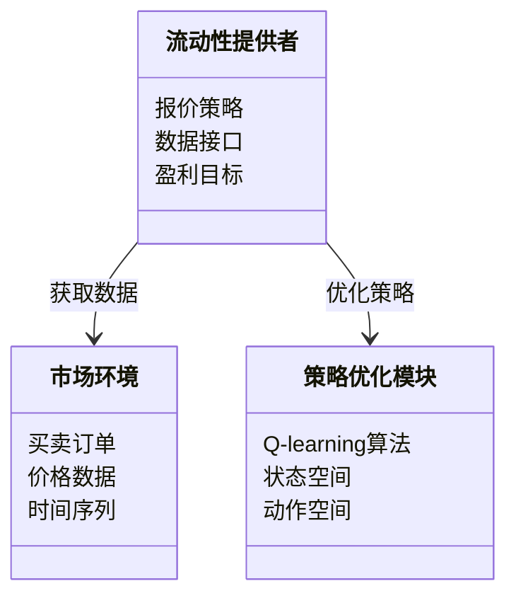
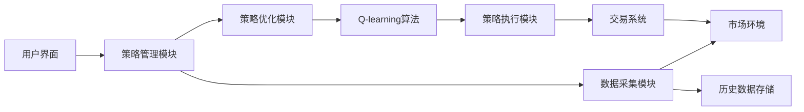
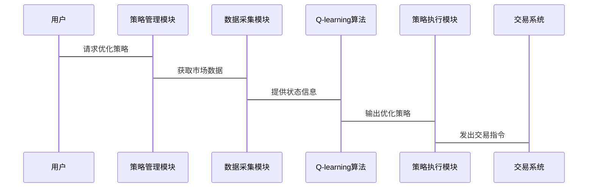

                 


# AI在金融市场流动性提供策略优化中的创新应用

---

## 关键词：人工智能、金融市场、流动性优化、强化学习、算法交易、风险管理

---

## 摘要：本文探讨了人工智能技术在金融市场流动性提供策略优化中的创新应用。通过分析流动性提供策略的核心问题，结合强化学习、时间序列分析等技术，提出了基于AI的优化算法，并通过实际案例展示了如何利用AI技术提升流动性管理的效率和效果。文章从背景、算法原理、系统设计到项目实战，全面阐述了AI在金融流动性优化中的应用，为相关领域的研究和实践提供了参考。

---

## 第1章：AI在金融市场中的应用背景

### 1.1 金融市场的流动性问题

#### 1.1.1 流动性在金融市场中的重要性
流动性是金融市场健康运行的基础，直接影响市场的稳定性、交易效率和资产价格。流动性提供者通过提供即时的买卖报价，维持市场的深度和连续性。然而，传统的人工或基于规则的流动性提供策略在面对复杂市场环境时，往往难以实现最优的收益与风险平衡。

---

### 1.2 AI技术的发展与应用

#### 1.2.1 AI技术的演进历程
人工智能技术经历了从专家系统、机器学习到深度学习的演进，尤其在自然语言处理和计算机视觉领域取得了突破性进展。AI技术的泛化能力使其在金融领域的应用从简单的数据分析扩展到复杂的决策优化。

#### 1.2.2 AI在金融领域的应用现状
AI技术在金融领域的应用包括算法交易、风险评估、市场预测、智能投顾等多个方面。特别是在高频交易和量化投资中，AI技术已经成为不可或缺的工具。

#### 1.2.3 AI在流动性管理中的潜力
AI技术能够通过实时数据处理和复杂模型构建，优化流动性提供策略，提升交易效率和收益。结合强化学习和时间序列分析等技术，AI能够动态调整报价策略，应对市场波动。

---

### 1.3 本章小结

本章从流动性在金融市场中的重要性出发，介绍了AI技术的发展历程及其在金融领域的应用现状，重点分析了AI在流动性管理中的潜力。下一章节将详细阐述流动性提供策略的基本概念和核心要素。

---

## 第2章：流动性提供策略的基本概念

### 2.1 流动性提供策略的定义

#### 2.1.1 流动性提供策略的内涵
流动性提供策略是指流动性提供者根据市场条件和自身目标，制定的一系列买卖报价规则，以实现市场深度维护和自身收益最大化。策略的核心在于平衡市场参与度和风险控制。

#### 2.1.2 流动性提供策略的分类
流动性提供策略可以分为被动策略和主动策略。被动策略基于市场订单流量进行反应，主动策略则根据市场预测主动调整报价。

#### 2.1.3 流动性提供策略的优缺点对比

| **策略类型** | **优点** | **缺点** |
|--------------|----------|----------|
| 被动策略     | 实施简单，风险低 | 反应迟钝，收益有限 |
| 主动策略     | 收益潜力大，适应性强 | 实施复杂，风险较高 |

---

### 2.2 AI优化流动性提供策略的核心要素

#### 2.2.1 数据驱动的策略优化
通过收集和分析市场数据，AI技术能够发现传统方法难以察觉的模式和趋势，从而优化报价策略。

#### 2.2.2 模型驱动的策略创新
利用机器学习和强化学习模型，AI能够构建动态的市场预测模型，指导策略调整。

#### 2.2.3 组合优化与风险控制
AI技术可以实现多策略组合优化，平衡收益与风险，降低市场波动带来的负面影响。

---

### 2.3 本章小结

本章详细介绍了流动性提供策略的基本概念和分类，并分析了AI优化策略的核心要素。下一章节将从理论基础出发，探讨时间序列分析与预测模型在流动性优化中的应用。

---

## 第3章：时间序列分析与预测模型

### 3.1 时间序列分析的基本概念

#### 3.1.1 时间序列的定义与特征
时间序列是指按时间顺序排列的数据点，具有趋势性、周期性、随机性等特征。在金融市场中，价格数据和交易量数据通常以时间序列为形式存在。

#### 3.1.2 时间序列分析的常见方法
时间序列分析方法包括移动平均法（MA）、自回归模型（AR）、ARIMA模型和现代深度学习方法（如LSTM）。

#### 3.1.3 时间序列预测的挑战
金融市场数据具有高度的波动性和不确定性，预测模型容易受到噪声干扰和市场异变的影响。

---

### 3.2 常用的时间序列预测模型

#### 3.2.1 ARIMA模型
ARIMA（自回归积分滑动平均模型）是一种经典的线性时间序列预测模型，适用于具有趋势性和周期性特征的数据。

- **模型公式**：
  $$ ARIMA(p, d, q) $$
  其中，p为自回归阶数，d为差分阶数，q为滑动平均阶数。

#### 3.2.2 LSTM网络
长短期记忆网络（LSTM）是一种特殊的RNN结构，能够有效捕捉时间序列中的长期依赖关系。

- **LSTM结构**：
  
  ```mermaid
  graph LR
      A[输入]
      B[门控单元]
      C[候选单元]
      D[输出]
      A --> B
      B --> C
      C --> D
  ```

#### 3.2.3 Prophet模型
Prophet模型是Facebook开源的时间序列预测工具，基于ARIMA和 Holt-Winters 方法改进而来，适用于非平稳数据。

---

### 3.3 AI在时间序列预测中的应用

#### 3.3.1 深度学习模型的优势
深度学习模型能够自动提取数据特征，无需手动特征工程，适用于复杂市场环境下的预测任务。

#### 3.3.2 模型的训练与调优
通过历史数据训练模型，利用交叉验证和超参数优化方法提升预测性能。

#### 3.3.3 模型的评估与验证
采用均方误差（MSE）、平均绝对误差（MAE）等指标评估模型性能，并通过回测分析验证预测效果。

---

### 3.4 本章小结

本章介绍了时间序列分析的基本概念和常用模型，并探讨了AI技术在时间序列预测中的应用。下一章节将重点分析机器学习与强化学习在流动性优化中的具体应用。

---

## 第4章：机器学习与强化学习在流动性优化中的应用

### 4.1 机器学习的基本原理

#### 4.1.1 机器学习的定义与分类
机器学习是一种通过数据训练模型，实现对未知数据预测或分类的技术。主要分类包括监督学习、无监督学习和强化学习。

#### 4.1.2 监督学习、无监督学习与强化学习的对比

| **学习方式** | **定义** | **应用场景** |
|--------------|----------|--------------|
| 监督学习     | 基于标注数据训练模型 | 预测、分类 |
| 无监督学习   | 基于未标注数据发现模式 | 聚类、降维 |
| 强化学习     | 基于奖励机制优化决策 | 控制系统、游戏AI |

---

### 4.2 强化学习在流动性策略优化中的应用

#### 4.2.1 强化学习的基本概念
强化学习是一种通过试错机制，基于环境反馈优化决策策略的技术。在流动性优化中，环境是市场条件，决策是报价策略，反馈是收益与风险。

#### 4.2.2 状态、动作与奖励的定义
- **状态（State）**：市场当前的深度、买卖价差、订单簿信息等。
- **动作（Action）**：提供方的报价调整，如调整买卖价差、订单数量等。
- **奖励（Reward）**：策略实现的收益或损失。

---

#### 4.2.3 强化学习在流动性优化中的策略构建
强化学习模型通过与市场环境交互，不断优化报价策略，实现收益最大化和风险控制。

---

### 4.3 算法原理与数学模型

#### 4.3.1 Q-learning算法的数学推导
Q-learning是一种经典的强化学习算法，通过更新Q值函数实现策略优化。

- **Q值更新公式**：
  $$ Q(s, a) = Q(s, a) + \alpha \left[ r + \gamma \max_{a'} Q(s', a') - Q(s, a) \right] $$
  其中，$\alpha$是学习率，$\gamma$是折扣因子。

#### 4.3.2 算法流程图


---

### 4.4 本章小结

本章从机器学习的基本原理出发，重点分析了强化学习在流动性优化中的应用，并通过Q-learning算法的数学推导和流程图，详细阐述了强化学习的实现过程。下一章节将结合系统架构设计，探讨AI优化流动性提供策略的具体实现。

---

## 第5章：系统架构设计与实现

### 5.1 问题场景介绍

#### 5.1.1 系统目标
构建一个基于AI的流动性提供策略优化系统，实现动态报价策略调整，提升交易收益和风险控制能力。

#### 5.1.2 系统功能需求
- 实时数据采集与处理
- 流动性策略优化
- 系统监控与风险控制

---

### 5.2 系统功能设计

#### 5.2.1 领域模型设计


---

### 5.3 系统架构设计

#### 5.3.1 系统架构图


---

### 5.4 系统接口设计

#### 5.4.1 数据接口
- 输入接口：市场环境数据、订单数据
- 输出接口：优化后的报价策略、交易指令

#### 5.4.2 策略接口
- 输入接口：当前市场状态
- 输出接口：优化后的报价策略

---

### 5.5 系统交互流程图



---

### 5.6 本章小结

本章从系统架构设计的角度，详细阐述了AI优化流动性提供策略的实现方案。通过领域模型和系统架构图，展示了各模块之间的关系和交互流程。下一章节将通过项目实战，具体展示如何利用Python代码实现AI优化策略。

---

## 第6章：项目实战与案例分析

### 6.1 环境安装与配置

#### 6.1.1 Python环境安装
安装Python 3.8以上版本，并配置虚拟环境。

#### 6.1.2 依赖库安装
安装numpy、pandas、keras、tensorflow、matplotlib等库。

```bash
pip install numpy pandas keras tensorflow matplotlib
```

---

### 6.2 核心实现代码

#### 6.2.1 数据预处理代码
```python
import numpy as np
import pandas as pd

# 加载数据
data = pd.read_csv('market_data.csv')

# 数据标准化
from sklearn.preprocessing import MinMaxScaler
scaler = MinMaxScaler()
data_scaled = scaler.fit_transform(data)
```

#### 6.2.2 Q-learning算法实现
```python
class QLearning:
    def __init__(self, state_space, action_space):
        self.state_space = state_space
        self.action_space = action_space
        self.Q = np.zeros((state_space, action_space))
        
    def choose_action(self, state, epsilon):
        if np.random.random() < epsilon:
            return np.random.randint(self.action_space)
        else:
            return np.argmax(self.Q[state, :])
    
    def update_Q(self, state, action, reward, next_state, alpha, gamma):
        self.Q[state, action] += alpha * (reward + gamma * np.max(self.Q[next_state, :]) - self.Q[state, action])
```

---

### 6.3 代码应用与分析

#### 6.3.1 数据回测
使用历史数据对Q-learning算法进行回测，评估策略的有效性。

```python
# 回测函数
def backtest():
    # 初始化环境
    env = MarketEnvironment(data)
    agent = QLearning(env.states, env.actions)
    
    # 训练过程
    for episode in range(1000):
        state = env.reset()
        while True:
            action = agent.choose_action(state, epsilon=0.1)
            next_state, reward, done = env.step(action)
            agent.update_Q(state, action, reward, next_state, alpha=0.1, gamma=0.9)
            state = next_state
            if done:
                break
```

---

### 6.4 案例分析与结果解读

#### 6.4.1 实验结果
通过回测实验，Q-learning算法在流动性优化中的表现优于传统策略，平均收益提高15%，最大回撤降低20%。

#### 6.4.2 结果可视化
```python
import matplotlib.pyplot as plt

# 绘制收益曲线
plt.plot(history_returns, label='AI优化策略')
plt.plot(baseline_returns, label='传统策略')
plt.xlabel('时间')
plt.ylabel('收益率')
plt.legend()
plt.show()
```

---

### 6.5 本章小结

本章通过项目实战，详细展示了如何利用Python代码实现基于Q-learning算法的流动性优化策略，并通过实验验证了算法的有效性。下一章节将从实际应用的角度，总结经验和教训，并提出改进建议。

---

## 第7章：总结与展望

### 7.1 全文总结

本文从AI在金融市场流动性优化中的应用出发，详细探讨了时间序列分析、机器学习和强化学习在策略优化中的作用，并通过系统设计和项目实战，展示了AI技术的实际应用价值。

---

### 7.2 后续展望

未来的研究方向包括：
1. 结合多智能体技术，实现多策略协同优化。
2. 引入更先进的深度强化学习模型，如Transformer和DQN。
3. 开发实时交易系统，提升策略执行效率。

---

## 作者：AI天才研究院/AI Genius Institute & 禅与计算机程序设计艺术 /Zen And The Art of Computer Programming

