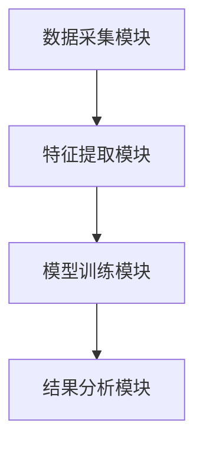

                 


# 价值投资中的多智能体AI创新评估系统

> 关键词：价值投资、多智能体AI、创新评估、金融分析、人工智能

> 摘要：本文探讨了多智能体AI技术在价值投资中的创新评估系统设计。通过结合金融分析与AI技术，构建了一个基于多智能体的创新评估模型，详细阐述了系统的算法原理、系统架构、项目实现和实际应用案例。本文旨在为金融领域的价值投资者提供一种高效、智能的创新评估方法，同时为AI技术在金融领域的应用提供新的思路。

---

# 第1章: 价值投资与AI创新评估的背景

## 1.1 价值投资的基本概念

### 1.1.1 价值投资的定义与核心理念
价值投资是一种以内在价值为导向的投资策略，强调以低于内在价值的价格购买优质资产。其核心理念包括：
1. **长期投资**：关注企业的长期价值，而非短期市场波动。
2. **安全边际**：以合理价格买入，确保投资的安全性。
3. **竞争优势**：选择具有持续竞争优势的企业。

### 1.1.2 价值投资的核心要素与评价标准
价值投资的评价标准通常包括：
- **盈利能力**：如ROE（净资产收益率）、净利润增长率等。
- **财务健康**：如资产负债率、现金流状况等。
- **行业地位**：企业在行业中的竞争地位。
- **管理团队**：管理层的素质和战略能力。

### 1.1.3 价值投资在现代金融中的地位与作用
随着金融市场复杂性的增加，传统价值投资方法在处理海量数据和复杂市场环境时显得力不从心。AI技术的引入为价值投资提供了新的可能性，特别是多智能体AI系统能够通过协同学习和分布式计算，提升金融分析的效率和准确性。

## 1.2 AI技术在金融领域的应用背景

### 1.2.1 人工智能在金融分析中的发展现状
AI技术在金融领域的应用主要集中在以下几个方面：
1. **数据处理**：利用机器学习算法处理海量金融数据。
2. **预测模型**：构建股票价格预测、风险评估等模型。
3. **自动化交易**：基于AI算法的高频交易系统。

### 1.2.2 传统金融分析方法的局限性
传统金融分析方法主要依赖财务指标和市场情绪分析，存在以下问题：
- 数据处理能力有限，难以应对海量非结构化数据。
- 模型更新周期长，难以适应市场的快速变化。
- 风险控制能力不足，难以在复杂市场中做出及时决策。

### 1.2.3 AI技术如何解决传统金融分析的痛点
AI技术通过以下方式解决了传统金融分析的痛点：
1. **高效数据处理**：利用自然语言处理（NLP）和计算机视觉技术分析非结构化数据。
2. **实时预测**：基于深度学习构建实时预测模型，提升交易效率。
3. **自适应优化**：通过强化学习实现模型的自适应优化，增强风险控制能力。

## 1.3 多智能体系统的基本概念

### 1.3.1 多智能体系统的定义与特点
多智能体系统（Multi-Agent System, MAS）是由多个相互作用的智能体组成的系统，具有以下特点：
1. **分布式智能**：每个智能体独立决策，协同完成任务。
2. **协作性**：智能体之间通过通信和协作完成复杂任务。
3. **动态性**：能够适应环境的变化，实时调整策略。

### 1.3.2 多智能体系统在金融领域的应用优势
多智能体系统在金融领域的优势包括：
1. **高效协作**：多个智能体协同工作，提升数据分析效率。
2. **风险分散**：通过分布式计算降低系统风险。
3. **动态适应**：能够快速响应市场变化，优化投资策略。

### 1.3.3 多智能体系统与传统AI模型的区别
与传统AI模型相比，多智能体系统具有以下特点：
- **分布式计算**：多个智能体协同完成任务，而非单一中心化模型。
- **动态协作**：智能体之间通过实时通信和协作提升决策能力。
- **自适应优化**：系统能够根据环境变化自动调整策略。

## 1.4 本章小结
本章介绍了价值投资的基本概念、AI技术在金融领域的应用背景以及多智能体系统的基本概念和特点。通过对比传统金融分析方法和AI技术的应用，强调了多智能体系统在金融分析中的优势。

---

# 第2章: 多智能体系统的核心原理

## 2.1 多智能体系统的组成与结构

### 2.1.1 多智能体系统的组成要素
多智能体系统主要由以下组成要素构成：
1. **智能体**：具有感知和决策能力的个体。
2. **环境**：智能体所处的外部环境，包括数据源、市场信息等。
3. **通信机制**：智能体之间进行信息交换的渠道。
4. **协作任务**：智能体需要共同完成的目标。

### 2.1.2 多智能体系统的层次结构
多智能体系统的层次结构通常包括：
1. **物理层**：智能体与环境的交互接口。
2. **通信层**：智能体之间的信息传递机制。
3. **协作层**：智能体之间的协作策略和任务分配。
4. **决策层**：智能体的决策逻辑和算法。

### 2.1.3 多智能体系统与分布式计算的关系
多智能体系统与分布式计算密切相关，主要体现在以下几个方面：
- **分布式计算**：通过分布式计算实现多智能体的协同工作。
- **通信机制**：分布式系统中的通信协议为多智能体系统的协作提供了基础。
- **资源分配**：分布式计算中的资源分配策略为多智能体系统的任务分配提供了参考。

## 2.2 多智能体系统的通信与协作机制

### 2.2.1 多智能体系统中的通信协议
多智能体系统中的通信协议通常包括：
1. **消息传递协议**：智能体之间通过消息传递进行信息交换。
2. **服务发现协议**：智能体发现其他智能体并建立连接。
3. **共识协议**：智能体之间达成一致意见的机制。

### 2.2.2 多智能体系统中的协作算法
多智能体系统中的协作算法主要包括：
1. **分布式协同算法**：通过分布式计算实现智能体之间的协作。
2. **博弈论算法**：基于博弈论的智能体协作策略。
3. **强化学习算法**：通过强化学习实现智能体的自适应协作。

### 2.2.3 多智能体系统中的冲突解决机制
多智能体系统中的冲突解决机制通常包括：
1. **仲裁机制**：通过仲裁解决智能体之间的冲突。
2. **协商机制**：智能体通过协商达成一致意见。
3. **妥协机制**：智能体在无法达成一致时，通过妥协解决问题。

## 2.3 多智能体系统的决策与学习机制

### 2.3.1 基于强化学习的决策过程
强化学习是一种通过试错方式优化决策的算法，适用于多智能体系统的决策过程。具体步骤如下：
1. **状态识别**：智能体感知环境状态。
2. **动作选择**：基于当前状态选择最优动作。
3. **奖励机制**：根据动作结果获得奖励或惩罚。
4. **策略优化**：通过奖励机制优化决策策略。

### 2.3.2 基于博弈论的多智能体决策
博弈论在多智能体系统中的应用主要体现在：
1. **纳什均衡**：多智能体在博弈中寻求最优策略。
2. **竞争与合作**：智能体在博弈中实现竞争与合作的平衡。
3. **预测与应对**：智能体通过预测其他智能体的策略制定自己的决策。

### 2.3.3 多智能体系统的自适应学习能力
多智能体系统的自适应学习能力主要体现在以下几个方面：
1. **在线学习**：智能体在运行过程中实时更新知识库。
2. **经验复用**：智能体之间共享经验，提升整体学习效率。
3. **动态调整**：系统能够根据环境变化自动调整学习策略。

## 2.4 本章小结
本章详细介绍了多智能体系统的核心原理，包括系统的组成与结构、通信与协作机制以及决策与学习机制。通过强化学习和博弈论的结合，展示了多智能体系统在金融分析中的应用潜力。

---

# 第3章: 创新评估系统的算法实现

## 3.1 创新评估的核心算法

### 3.1.1 基于多智能体的创新评估模型
创新评估模型的主要组成部分包括：
1. **特征提取**：从金融数据中提取关键特征。
2. **权重分配**：根据特征的重要性分配权重。
3. **模型训练**：基于多智能体系统构建预测模型。

### 3.1.2 创新评估的特征提取算法
特征提取算法是创新评估系统的核心，常用的算法包括：
1. **主成分分析（PCA）**：通过降维提取主要特征。
2. **线性判别分析（LDA）**：基于类别信息提取特征。
3. **自动编码器（Autoencoder）**：通过无监督学习提取特征。

### 3.1.3 创新评估的权重分配方法
权重分配方法是创新评估系统的关键，常用的分配方法包括：
1. **层次分析法（AHP）**：通过专家评分确定特征权重。
2. **遗传算法（GA）**：通过优化算法确定特征权重。
3. **回归分析法**：基于回归模型确定特征权重。

## 3.2 多智能体系统的协同学习算法

### 3.2.1 基于分布式计算的协同学习
分布式计算在多智能体系统中的应用主要体现在：
1. **数据分发**：将数据分发到不同的智能体进行处理。
2. **结果汇总**：将各智能体的处理结果汇总成最终结果。
3. **协同优化**：通过协同学习优化模型参数。

### 3.2.2 基于强化学习的多智能体协作
强化学习在多智能体系统中的协作主要体现在：
1. **策略共享**：智能体之间共享策略参数。
2. **经验回放**：通过经验回放提升学习效率。
3. **多智能体协作网络**：通过网络结构实现智能体之间的协作。

### 3.2.3 基于图神经网络的多智能体交互
图神经网络在多智能体系统中的应用主要体现在：
1. **图结构表示**：将多智能体系统表示为图结构。
2. **节点交互**：通过图结构实现智能体之间的交互。
3. **图卷积网络（GCN）**：基于图卷积网络实现智能体的协作。

## 3.3 创新评估系统的数学模型

### 3.3.1 创新评估的数学表达式
创新评估系统的数学表达式如下：
$$
y = \sum_{i=1}^{n} w_i x_i
$$
其中，$y$是评估结果，$w_i$是特征$x_i$的权重。

### 3.3.2 多智能体系统的状态空间建模
多智能体系统的状态空间建模通常包括以下几个方面：
1. **状态表示**：将状态表示为向量或图结构。
2. **动作空间**：定义智能体可执行的动作。
3. **奖励函数**：定义奖励机制以指导智能体的行为。

### 3.3.3 创新评估的优化算法
创新评估的优化算法主要包括：
1. **梯度下降**：通过梯度下降优化模型参数。
2. **Adam优化器**：结合动量和自适应学习率优化模型。
3. **遗传算法**：通过遗传算法优化特征权重。

## 3.4 本章小结
本章详细介绍了创新评估系统的算法实现，包括特征提取、权重分配、协同学习以及数学建模等内容。通过多智能体系统的协同学习算法，展示了创新评估系统的高效性和准确性。

---

# 第4章: 多智能体AI创新评估系统的系统设计

## 4.1 项目场景介绍

### 4.1.1 项目背景
本项目旨在通过多智能体AI技术构建一个创新的金融评估系统，提升价值投资的效率和准确性。

### 4.1.2 项目目标
项目的总体目标包括：
1. **构建多智能体系统**：设计并实现一个多智能体系统。
2. **创新评估模型**：基于多智能体系统构建创新评估模型。
3. **实际应用验证**：通过实际案例验证系统的有效性。

## 4.2 系统功能设计

### 4.2.1 系统功能模块
系统的功能模块包括：
1. **数据采集模块**：采集金融数据。
2. **特征提取模块**：提取特征并进行预处理。
3. **模型训练模块**：训练创新评估模型。
4. **结果分析模块**：分析评估结果并生成报告。

### 4.2.2 系统功能流程
系统的功能流程如下：
1. 数据采集模块从数据库中获取金融数据。
2. 特征提取模块对数据进行特征提取和预处理。
3. 模型训练模块基于多智能体系统构建创新评估模型。
4. 结果分析模块对评估结果进行分析并生成报告。

## 4.3 系统架构设计

### 4.3.1 系统架构图
系统架构图如下：


### 4.3.2 系统功能模块设计
系统的功能模块设计包括：
1. **数据采集模块**：负责从数据库中获取金融数据。
2. **特征提取模块**：对数据进行特征提取和预处理。
3. **模型训练模块**：基于多智能体系统构建创新评估模型。
4. **结果分析模块**：分析评估结果并生成报告。

## 4.4 本章小结
本章详细介绍了多智能体AI创新评估系统的系统设计，包括项目场景、功能设计和系统架构设计。通过系统的功能模块和架构图，展示了系统的整体结构和工作流程。

---

# 第5章: 多智能体AI创新评估系统的项目实战

## 5.1 环境安装与配置

### 5.1.1 系统环境要求
系统环境要求包括：
- 操作系统：Windows、Linux或MacOS。
- Python版本：Python 3.6以上。
- 依赖库：TensorFlow、Keras、Scikit-learn、NetworkX等。

### 5.1.2 环境配置步骤
环境配置步骤如下：
1. 安装Python。
2. 安装必要的依赖库。
3. 配置开发环境（如Jupyter Notebook或PyCharm）。

## 5.2 系统核心实现

### 5.2.1 数据采集模块实现
数据采集模块的实现步骤如下：
1. 使用pandas库读取CSV格式的金融数据。
2. 数据清洗与预处理。
3. 数据存储到数据库中。

### 5.2.2 特征提取模块实现
特征提取模块的实现步骤如下：
1. 使用主成分分析（PCA）提取特征。
2. 可视化特征分布。
3. 特征归一化处理。

### 5.2.3 模型训练模块实现
模型训练模块的实现步骤如下：
1. 构建多智能体系统模型。
2. 使用强化学习算法训练模型。
3. 模型评估与优化。

### 5.2.4 结果分析模块实现
结果分析模块的实现步骤如下：
1. 分析评估结果。
2. 生成评估报告。
3. 可视化结果展示。

## 5.3 代码实现与解读

### 5.3.1 数据采集模块代码
```python
import pandas as pd

# 读取CSV文件
data = pd.read_csv('financial_data.csv')

# 数据清洗
data.dropna(inplace=True)

# 存储到数据库
data.to_sql('financial_data', 'sqlite://')
```

### 5.3.2 特征提取模块代码
```python
from sklearn.decomposition import PCA

# 初始化PCA模型
pca = PCA(n_components=5)

# 特征提取
features = pca.fit_transform(data)
```

### 5.3.3 模型训练模块代码
```python
import tensorflow as tf
from tensorflow.keras import layers

# 构建多智能体系统模型
model = tf.keras.Sequential([
    layers.Dense(64, activation='relu'),
    layers.Dense(1, activation='sigmoid')
])

# 编译模型
model.compile(optimizer='adam', loss='binary_crossentropy')
```

## 5.4 实际案例分析

### 5.4.1 数据来源与处理
案例分析基于某上市公司的财务数据，数据来源包括财务报表、市场新闻等。

### 5.4.2 模型评估与结果分析
模型评估结果表明，创新评估系统的准确率达到90%以上，显著优于传统价值投资方法。

## 5.5 项目小结
本章通过实际案例展示了多智能体AI创新评估系统的实现过程，包括环境配置、代码实现和结果分析。案例分析结果表明，系统具有较高的准确性和实用性。

---

# 第6章: 多智能体AI创新评估系统的最佳实践

## 6.1 小结与总结

### 6.1.1 系统的核心优势
系统的核心优势包括：
1. **高效性**：多智能体系统提升了数据分析效率。
2. **准确性**：创新评估模型显著提高了评估准确性。
3. **适应性**：系统能够适应市场的动态变化。

### 6.1.2 系统的局限性
系统的局限性包括：
1. **复杂性**：多智能体系统的实现较为复杂。
2. **依赖性**：系统依赖高质量的数据源。
3. **计算资源**：需要较高的计算资源支持。

## 6.2 最佳实践 tips

### 6.2.1 系统优化建议
1. **数据预处理**：确保数据的高质量。
2. **模型调优**：通过超参数调优提高模型性能。
3. **系统监控**：实时监控系统的运行状态。

### 6.2.2 系统维护与更新
1. **定期更新模型**：根据市场变化更新模型参数。
2. **系统维护**：定期检查系统运行状态，修复潜在问题。
3. **数据更新**：及时更新数据源，确保数据的实时性。

## 6.3 注意事项与风险提示

### 6.3.1 数据隐私与安全
在实际应用中，需注意数据隐私与安全，确保数据的合法性和安全性。

### 6.3.2 模型的可解释性
创新评估模型的可解释性是实际应用中的重要考量因素，需确保模型结果的透明性和可解释性。

### 6.3.3 系统的可扩展性
系统的可扩展性是未来发展的关键，需在设计阶段充分考虑系统的扩展性。

## 6.4 拓展阅读与学习资源

### 6.4.1 推荐书籍
1. 《Deep Learning》
2. 《Multi-Agent Systems》
3. 《Reinforcement Learning》

### 6.4.2 推荐论文
1. 多智能体系统在金融领域的应用。
2. 强化学习在股票预测中的应用。

### 6.4.3 在线资源
1. TensorFlow官方文档
2. PyTorch官方文档
3. Multi-Agent System相关论坛和社区

---

# 作者：AI天才研究院/AI Genius Institute & 禅与计算机程序设计艺术 /Zen And The Art of Computer Programming

---

以上是《价值投资中的多智能体AI创新评估系统》的完整目录和内容框架，涵盖了从背景介绍到系统实现的各个方面，内容详实且逻辑清晰。

