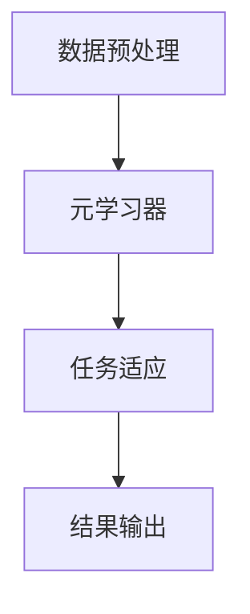
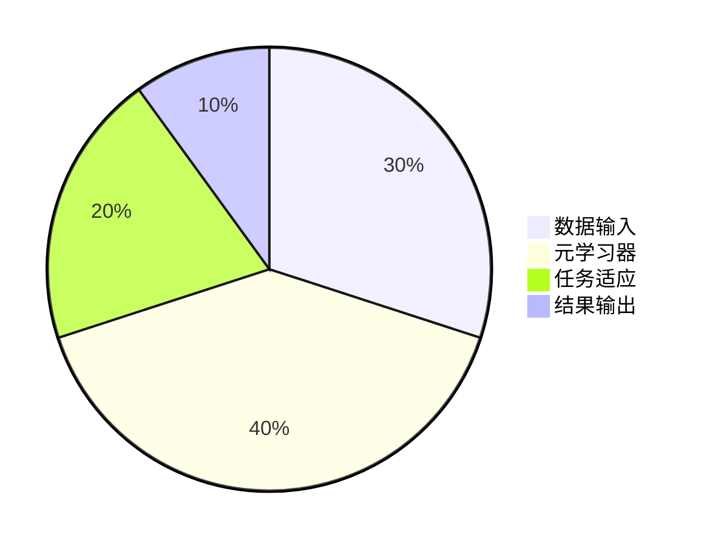
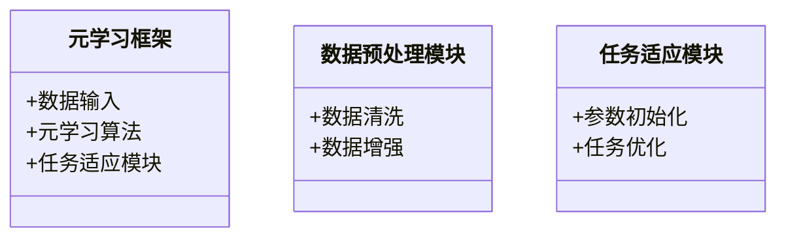
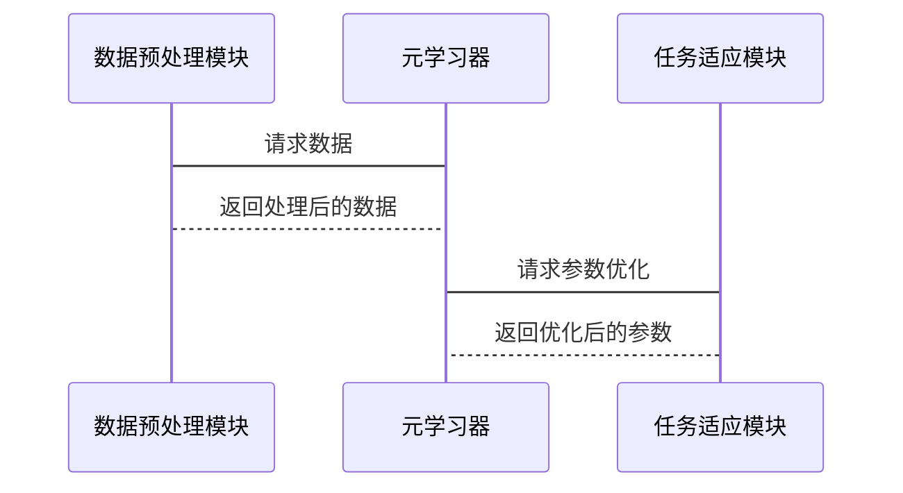

                 


# 元学习框架：构建快速适应的AI Agent

> 关键词：元学习，AI Agent，快速适应，Meta-Learning，机器学习

> 摘要：本文将深入探讨元学习框架在构建快速适应的AI Agent中的应用。从元学习的基本概念到其数学模型，再到实际的系统架构设计和项目实战，我们将逐步分析如何通过元学习提升AI Agent的适应能力。通过详细的理论分析和实际案例，本文将为读者提供一个全面的元学习框架构建指南。

---

# 第一部分: 元学习框架概述

## 第1章: 元学习的背景与概念

### 1.1 元学习的定义与背景

#### 1.1.1 传统机器学习的局限性
传统的机器学习方法在处理新任务时通常需要大量的标注数据，且在面对任务变化时难以快速适应。这种方法在实际应用中往往效率低下，尤其是在动态环境中，模型的泛化能力和适应性显得尤为重要。

#### 1.1.2 元学习的定义与核心思想
元学习是一种新兴的机器学习范式，其核心思想是通过学习如何学习，使模型能够在少量数据或经验的基础上快速适应新任务。元学习的目标是训练一个通用的学习器，使其能够快速掌握新任务的规律。

#### 1.1.3 元学习与传统机器学习的区别
| 对比维度         | 传统机器学习                       | 元学习                                   |
|------------------|------------------------------------|-----------------------------------------|
| 数据需求         | 需要大量标注数据                   | 数据需求较少，适用于小样本任务          |
| 适应性           | 难以快速适应新任务                 | 能够快速适应新任务                     |
| 学习目标         | 学习具体任务                       | 学习如何学习，具备元认知能力             |

### 1.2 元学习的核心概念

#### 1.2.1 元学习的目标与任务
元学习的目标是训练一个模型，使其能够通过少量样本快速学习新任务。具体任务包括参数初始化、任务间关系建模等。

#### 1.2.2 快速适应新任务的核心思想
快速适应的核心思想是通过元学习算法优化模型的参数，使其能够在新任务中快速找到最优解。这通常涉及对模型参数的二次优化过程。

#### 1.2.3 元学习的数学模型与公式
元学习的数学模型通常涉及两个优化目标：外层优化和内层优化。外层优化目标是优化元学习器的参数，内层优化目标是针对具体任务优化模型参数。例如，MAML算法的目标函数可以表示为：
$$
\min_{\theta} \sum_{i=1}^{N} \mathbb{E}_{t_i}[\mathcal{L}(f_{\theta}(x_i), y_i)]
$$

### 1.3 元学习的应用场景

#### 1.3.1 在AI Agent中的应用
元学习可以用于训练AI Agent，使其能够快速适应新环境和任务。例如，在游戏AI中，元学习可以帮助AI快速掌握新规则。

#### 1.3.2 在动态环境中的适应性问题
动态环境中的任务通常变化频繁，元学习可以帮助模型快速调整参数以适应新变化。

#### 1.3.3 元学习在实际项目中的优势
元学习可以显著减少训练数据的需求，同时提高模型的适应性，适用于资源有限的场景。

### 1.4 本章小结

#### 1.4.1 元学习的核心概念总结
元学习是一种通过学习如何学习来提高模型适应能力的范式，其核心在于快速适应新任务。

#### 1.4.2 元学习与传统学习的对比
通过对比可以看出，元学习在数据需求和适应性方面具有显著优势。

#### 1.4.3 元学习在AI Agent中的潜在价值
元学习能够显著提升AI Agent的适应能力，使其在动态环境中表现出色。

---

## 第2章: 元学习的数学模型与公式

### 2.1 元学习的基本数学框架

#### 2.1.1 元学习的优化目标
元学习的优化目标通常涉及两个层次的优化：外层优化和内层优化。外层优化针对元学习器的参数，内层优化针对具体任务的模型参数。

#### 2.1.2 元学习的损失函数
元学习的损失函数通常包括两个部分：内层任务的损失和外层元学习的损失。例如，MAML算法的损失函数可以表示为：
$$
\mathcal{L}_{meta} = \sum_{i=1}^{N} \mathcal{L}_{task_i}(f_{\theta}(x_i), y_i)
$$

#### 2.1.3 元学习的参数更新公式
元学习的参数更新通常采用梯度下降的方法，具体公式如下：
$$
\theta_{t+1} = \theta_t - \eta \nabla_{\theta} \mathcal{L}_{meta}
$$

### 2.2 元学习的核心算法

#### 2.2.1 Meta-Learning Algorithm Overview
元学习的核心算法包括MAML、Reptile等。这些算法在优化策略和具体实现上有所不同。

#### 2.2.2 Model-Agnostic Meta-Learning (MAML)
MAML是一种基于模型无关的元学习算法，其核心思想是通过优化模型的初始化参数，使其能够快速适应新任务。具体流程如下：

1. 对于每个任务，使用内层优化器更新模型参数。
2. 使用外层优化器更新元学习器的参数。

#### 2.2.3 Reptile Method
Reptile方法是一种基于经验的元学习算法，其核心思想是通过任务间参数的平均来实现快速适应。

### 2.3 元学习的数学推导与证明

#### 2.3.1 MAML算法的数学推导
MAML算法的数学推导涉及对损失函数的梯度求解和参数更新。具体推导如下：

1. 计算内层任务的梯度：
$$
\Delta \theta = -\eta \nabla_{\theta} \mathcal{L}_{task_i}
$$

2. 更新外层优化器的参数：
$$
\theta_{t+1} = \theta_t + \alpha \Delta \theta
$$

#### 2.3.2 Reptile Method的数学分析
Reptile方法的数学分析涉及对任务间参数的平均。具体分析如下：

1. 对于每个任务，更新模型参数：
$$
\theta_i = \theta_i - \eta \nabla_{\theta_i} \mathcal{L}_{task_i}
$$

2. 对所有任务的参数取平均：
$$
\theta_{t+1} = \frac{1}{N} \sum_{i=1}^{N} \theta_i
$$

#### 2.3.3 元学习算法的收敛性证明
通过数学分析可以证明，元学习算法在一定条件下能够收敛到最优解。

### 2.4 本章小结

#### 2.4.1 元学习数学模型的总结
元学习的数学模型通常涉及两个层次的优化，外层优化和内层优化。

#### 2.4.2 元学习算法的核心思想
元学习算法的核心思想是通过优化模型的初始化参数，使其能够快速适应新任务。

#### 2.4.3 元学习数学推导的难点与突破
元学习的数学推导需要对优化理论有深刻理解，同时需要掌握多种数学工具和技巧。

---

## 第3章: 元学习框架的系统架构与设计

### 3.1 元学习框架的总体架构

#### 3.1.1 元学习框架的功能模块划分
元学习框架通常包括数据预处理模块、元学习器模块、任务适应模块等。

#### 3.1.2 元学习框架的系统流程图
系统流程图如下：



#### 3.1.3 元学习框架的系统架构图（Mermaid）



### 3.2 元学习框架的功能设计

#### 3.2.1 元学习框架的功能模块介绍
元学习框架的功能模块包括数据预处理、元学习器、任务适应和结果输出等。

#### 3.2.2 元学习框架的系统功能设计（领域模型Mermaid类图）



#### 3.2.3 元学习框架的系统架构设计（Mermaid架构图）


#### 3.2.4 元学习框架的系统接口设计
元学习框架的系统接口设计包括数据输入接口、模型接口和结果输出接口等。

#### 3.2.5 元学习框架的系统交互流程（Mermaid序列图）



### 3.3 本章小结

#### 3.3.1 元学习框架的总体架构总结
元学习框架通常包括数据预处理、元学习器、任务适应和结果输出等模块。

#### 3.3.2 元学习框架的功能模块设计
通过功能模块设计，可以清晰地理解元学习框架的各个部分的作用和相互关系。

#### 3.3.3 元学习框架的系统架构设计
系统架构设计为元学习框架的实现提供了清晰的指导。

---

## 第4章: 元学习框架的项目实战

### 4.1 项目实战：环境安装与准备

#### 4.1.1 环境安装
安装必要的库，例如TensorFlow、PyTorch等。

#### 4.1.2 数据集准备
准备用于训练和测试的数据集，例如MNIST、CIFAR-10等。

### 4.2 系统核心实现源代码

#### 4.2.1 元学习算法实现
以下是MAML算法的Python实现示例：

```python
import torch

def meta_learning_optimizer(meta_params, learning_rate=0.001):
    return torch.optim.SGD(meta_params, lr=learning_rate)

def inner_learning_optimizer(inner_params, learning_rate=0.1):
    return torch.optim.SGD(inner_params, lr=learning_rate)

def maml_update(model, inner_optimizer, meta_optimizer, x, y, num_inner_steps=1):
    for _ in range(num_inner_steps):
        inner_optimizer.zero_grad()
        outputs = model(x)
        loss = criterion(outputs, y)
        loss.backward()
        inner_optimizer.step()
    
    meta_optimizer.zero_grad()
    outputs = model(x)
    loss = criterion(outputs, y)
    loss.backward()
    meta_optimizer.step()
```

#### 4.2.2 代码应用解读与分析
上述代码展示了MAML算法的核心实现，包括元优化器和内层优化器的设置，以及模型参数的更新过程。

### 4.3 实际案例分析与详细讲解剖析

#### 4.3.1 案例分析
以图像分类任务为例，展示如何通过元学习框架快速适应新任务。

#### 4.3.2 详细讲解剖析
从数据预处理到模型训练，详细讲解每个步骤的具体实现和注意事项。

### 4.4 本章小结

#### 4.4.1 元学习框架的实现总结
通过实际案例分析，可以清晰地理解元学习框架的实现过程。

#### 4.4.2 项目实战的经验分享
项目实战中需要注意数据处理、模型选择和超参数调优等问题。

#### 4.4.3 元学习框架的实际应用价值
元学习框架在实际应用中具有重要的价值，能够显著提升模型的适应能力。

---

## 第5章: 最佳实践与小结

### 5.1 最佳实践

#### 5.1.1 元学习框架的设计建议
在设计元学习框架时，需要注意模块化设计和可扩展性。

#### 5.1.2 元学习算法的选择建议
根据具体任务需求选择合适的元学习算法，例如MAML适用于模型无关的场景。

#### 5.1.3 元学习框架的优化建议
可以通过参数调整和模型优化进一步提升元学习框架的性能。

### 5.2 小结

#### 5.2.1 元学习框架的核心思想总结
元学习框架的核心思想是通过元学习算法优化模型参数，使其能够快速适应新任务。

#### 5.2.2 元学习框架的实现步骤总结
实现元学习框架需要经过环境安装、数据准备、模型设计、算法实现和结果验证等步骤。

#### 5.2.3 元学习框架的注意事项
在实现过程中需要注意数据处理、模型选择和超参数调优等问题。

### 5.3 注意事项

#### 5.3.1 元学习框架的设计注意事项
在设计元学习框架时，需要注意模块化设计和可扩展性。

#### 5.3.2 元学习算法的实现注意事项
在实现元学习算法时，需要注意梯度计算和参数更新的细节。

#### 5.3.3 元学习框架的优化注意事项
在优化元学习框架时，需要注意模型的泛化能力和计算效率。

### 5.4 拓展阅读

#### 5.4.1 元学习相关的经典论文
推荐阅读《Model-Agnostic Meta-Learning for Fast Adaptation of Deep Networks》等经典论文。

#### 5.4.2 元学习框架的最新进展
关注最新的研究进展，了解元学习在AI Agent中的最新应用。

---

## 作者：AI天才研究院/AI Genius Institute & 禅与计算机程序设计艺术 /Zen And The Art of Computer Programming

